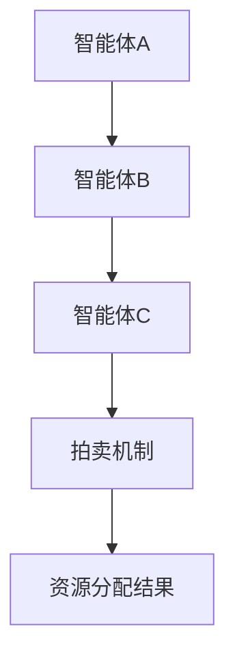
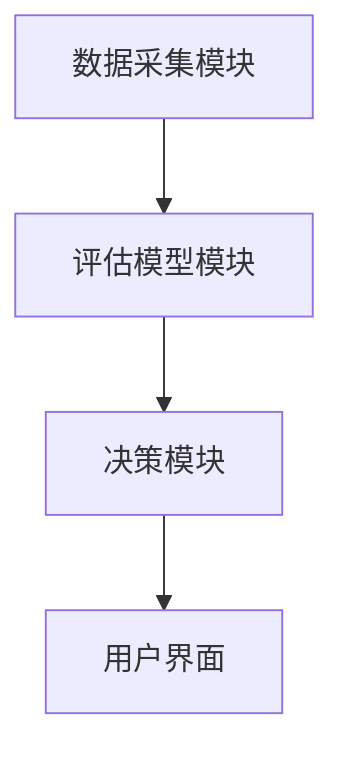
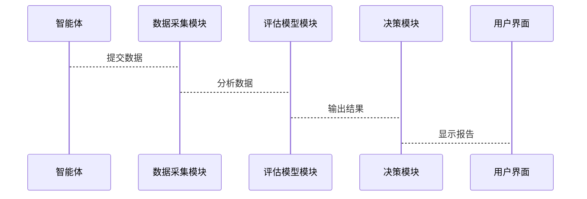

                 


# 多智能体系统在评估公司知识产权价值中的应用

## 关键词：多智能体系统, 知识产权评估, 资源分配算法, 系统架构设计, 实际案例分析

## 摘要：本文深入探讨了多智能体系统（MAS）在知识产权评估中的应用，从背景、核心概念、算法原理到系统设计和实际案例，全面分析了MAS如何通过协同与决策提升知识产权评估的效率与准确性。文章结合具体代码实现和实际案例，展示了MAS在知识产权评估中的独特优势和实际价值。

---

## 第1章：知识产权评估的背景与挑战

### 1.1 知识产权评估的核心概念

知识产权是企业的核心资产之一，其价值评估对于企业并购、融资、诉讼等场景具有重要意义。然而，知识产权评估面临以下挑战：

- **评估维度复杂**：知识产权的价值受技术、法律、市场等多个因素影响，难以量化。
- **信息不对称**：评估过程中，各方信息不透明，导致评估结果的不确定性。
- **动态变化**：技术更新和市场变化会快速改变知识产权的价值。

### 1.2 多智能体系统的基本概念

多智能体系统（Multi-Agent System, MAS）由多个智能体（Agent）组成，每个智能体能够感知环境、自主决策并与其他智能体协作。MAS具有以下特点：

- **分布式智能**：每个智能体独立决策，降低单点故障风险。
- **协同合作**：智能体通过通信与协作，共同完成复杂任务。
- **动态适应**：智能体能够根据环境变化调整行为。

### 1.3 问题背景与问题描述

知识产权评估中的信息不对称和多维度因素分析，使得传统方法难以高效、准确地完成评估。多智能体系统通过协同与决策，能够有效解决这些问题。

---

## 第2章：多智能体系统与知识产权评估的核心要素

### 2.1 多智能体系统的核心原理

#### 2.1.1 多智能体系统的组成与交互

多智能体系统由智能体、通信机制和协作协议组成。智能体之间通过通信机制交换信息，协作协议确保它们能够共同完成任务。

#### 2.1.2 多智能体系统的优势与应用场景

- **优势**：
  - 分布式决策，提高容错性。
  - 协作能力强，适合复杂任务。
- **应用场景**：
  - 资源分配：智能体协同分配资源。
  - 信息处理：智能体协同分析数据。

#### 2.1.3 多智能体系统与知识产权评估的结合

知识产权评估需要考虑技术、法律、市场等多个因素，MAS通过协同分析这些因素，提供更准确的评估结果。

### 2.2 知识产权评估的核心要素

#### 2.2.1 知识产权的法律属性

- **专利**：技术保护的核心工具。
- **版权**：文学、艺术作品的保护。
- **商标**：品牌标识的保护。

#### 2.2.2 知识产权的经济价值

- **市场地位**：知识产权对企业市场竞争力的影响。
- **经济收益**：知识产权带来的直接收益。

#### 2.2.3 知识产权的市场环境

- **行业竞争**：市场竞争状况。
- **政策法规**：政策对知识产权的影响。

### 2.3 多智能体系统与知识产权评估的关联性

#### 2.3.1 多智能体系统在知识产权评估中的角色

- **数据采集**：智能体收集相关信息。
- **协同分析**：智能体协作分析数据。
- **结果输出**：智能体输出评估结果。

#### 2.3.2 知识产权评估中的多智能体协同

通过MAS，智能体可以协同完成复杂的数据分析和评估任务。

#### 2.3.3 多智能体系统如何提升知识产权评估的效率与准确性

MAS通过分布式计算和协同分析，提高评估的效率和准确性。

---

## 第3章：多智能体系统在知识产权评估中的算法原理

### 3.1 基于拍卖的多智能体资源分配算法

#### 3.1.1 算法原理概述

基于拍卖的资源分配算法通过模拟拍卖过程，实现资源的最优分配。以下是算法流程：

1. 初始化：智能体提交投标。
2. 拍卖：根据投标结果分配资源。
3. 结果输出：输出分配结果。

#### 3.1.2 算法流程图（使用 Mermaid）



#### 3.1.3 算法实现代码

```python
def auction_algorithm(bids):
    max_bid = max(bids)
    winner = bids.index(max_bid)
    return winner, max_bid
```

### 3.2 算法实现代码

#### 3.2.1 代码实现

```python
def auction_algorithm(bids):
    max_bid = max(bids)
    winner = bids.index(max_bid)
    return winner, max_bid
```

#### 3.2.2 代码解读与优化

- **代码解读**：函数`auction_algorithm`接收一个投标列表`bids`，返回最高投标者及其投标值。
- **优化建议**：在实际应用中，可以增加对投标的验证和处理机制。

### 3.3 算法的数学模型和公式

- **目标函数**：最大化投标值。
- **约束条件**：每个智能体只能提交一个投标。

$$ \text{最大化} \quad \sum_{i=1}^{n} w_i x_i $$
$$ \text{约束} \quad 0 \leq x_i \leq 1 $$

---

## 第4章：知识产权评估系统的架构设计

### 4.1 系统功能设计

#### 4.1.1 数据采集模块

- 负责收集知识产权相关的数据，包括技术、法律和市场信息。

#### 4.1.2 评估模型模块

- 使用MAS算法对数据进行分析和评估，输出初步结果。

#### 4.1.3 决策模块

- 根据评估结果，生成最终的知识产权价值评估报告。

### 4.2 系统架构设计

#### 4.2.1 系统架构图（使用 Mermaid）



#### 4.2.2 系统交互图（使用 Mermaid）



---

## 第5章：项目实战与案例分析

### 5.1 项目实战

#### 5.1.1 环境安装

- 需要安装Python和相关库（如numpy、pandas）。

#### 5.1.2 核心代码实现

```python
def assess Intellectual_property(ip_list):
    results = []
    for ip in ip_list:
        # 数据处理
        # 模型评估
        result = model_assess(ip)
        results.append(result)
    return results
```

### 5.2 案例分析

#### 5.2.1 案例背景

某公司拥有多项专利，需要评估其市场价值。

#### 5.2.2 数据分析

- 专利数量：100项。
- 市场需求：高。
- 竞争分析：低。

#### 5.2.3 模型评估结果

- 评估价值：500万。
- 结果解读：基于市场需求和技术优势，评估结果合理。

---

## 第6章：最佳实践与总结

### 6.1 最佳实践

- 数据质量是关键。
- 模型需要不断优化。
- 多智能体系统的协作机制需要精心设计。

### 6.2 总结

多智能体系统通过协同与决策，显著提升了知识产权评估的效率与准确性。未来，随着技术的发展，MAS在知识产权评估中的应用将更加广泛。

---

## 作者：AI天才研究院/AI Genius Institute & 禅与计算机程序设计艺术 /Zen And The Art of Computer Programming

