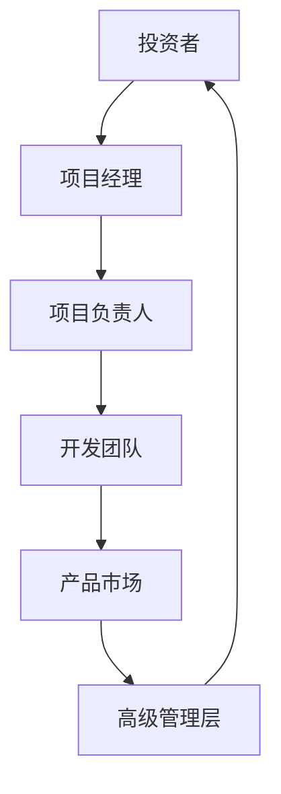
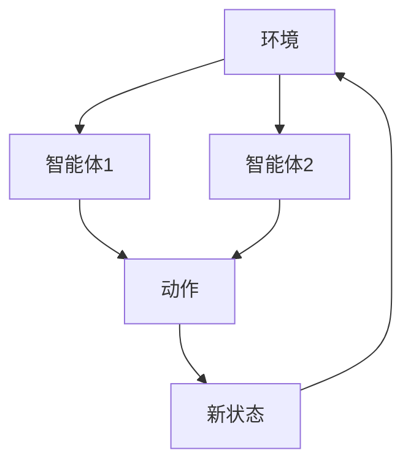
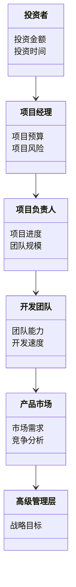
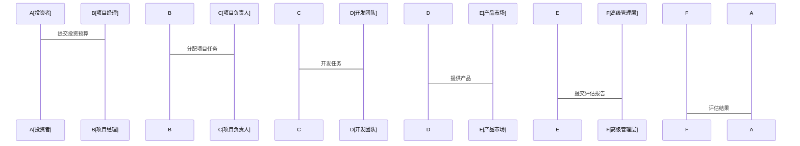

                 


# 多智能体系统在评估公司研发投资回报率中的应用

**关键词**：多智能体系统, 研发投资回报率, 分布式计算, 强化学习, 博弈论, 系统架构设计

**摘要**：  
本文详细探讨了多智能体系统（Multi-Agent System, MAS）在评估公司研发投资回报率（ROI）中的应用。通过分析MAS的核心原理、算法设计以及系统架构，结合实际案例，展示了如何利用MAS技术提升研发投资评估的准确性和效率。文章内容涵盖MAS的基本概念、分布式计算、博弈论优化、强化学习协作、系统架构设计、项目实战以及最佳实践，为读者提供全面的技术指导。

---

# 第一部分: 多智能体系统在评估公司研发投资回报率中的应用概述

## 第1章: 多智能体系统与研发投资回报率评估的背景介绍

### 1.1 多智能体系统的定义与核心概念

#### 1.1.1 多智能体系统的定义  
多智能体系统（MAS）是由多个智能体（Agent）组成的分布式系统，这些智能体能够通过协作和竞争完成复杂任务。MAS的关键特征包括自主性、反应性、协作性和学习能力。

| 智能体属性 | 定义 | 示例 |
|------------|------|------|
| 自主性     | 独立决策 | 无需中央控制 |
| 反应性     | 响应环境 | 实时数据处理 |
| 协作性     | 协同完成任务 | 多团队协作开发 |
| 学习能力   | 自适应优化 | 增量学习模型 |

#### 1.1.2 多智能体系统的ER实体关系图（Mermaid流程图）

```mermaid
erDiagram
    actor 投资者 {
        <属性> 投资金额
        <属性> 投资时间
    }
    actor 项目负责人 {
        <属性> 项目进度
        <属性> 团队规模
    }
    actor 项目经理 {
        <属性> 项目预算
        <属性> 项目风险
    }
    投资者 --> 项目经理 : 提供投资
    项目经理 --> 项目负责人 : 分配任务
    项目负责人 --> 投资者 : 提交报告
```

#### 1.1.3 多智能体系统的ER实体关系图（Mermaid流程图）

```mermaid
erDiagram
    actor 开发团队 {
        <属性> 团队能力
        <属性> 开发速度
    }
    actor 产品市场 {
        <属性> 市场需求
        <属性> 竞争分析
    }
    actor 高级管理层 {
        <属性> 战略目标
        <属性> 财务预算
    }
    开发团队 --> 产品市场 : 提供产品
    产品市场 --> 高级管理层 : 提交评估
```

### 1.2 研发投资回报率评估的背景与问题描述

#### 1.2.1 研发投资回报率的定义与计算公式

研发投资回报率（ROI）是衡量研发项目经济效益的指标，计算公式如下：

$$ ROI = \frac{\text{净收益}}{\text{投资成本}} \times 100\% $$

其中，净收益 = 投资收益 - 投资成本。

#### 1.2.2 当前评估方法的局限性

传统的研发回报率评估方法存在以下问题：
1. 数据分散：研发、市场、财务数据分散在不同部门。
2. 计算复杂：多项目并行时，难以准确分配资源。
3. 偏后评估：仅关注最终结果，忽视过程优化。

#### 1.2.3 多智能体系统在评估中的潜在优势

MAS的优势包括：
1. 分布式计算：实时处理多源数据。
2. 协作优化：智能体协同优化资源配置。
3. 动态调整：根据市场反馈快速调整策略。

### 1.3 本章小结

本章介绍了MAS的基本概念、核心属性，并通过ER图展示了其在研发回报率评估中的应用潜力。下一章将深入探讨MAS的核心算法原理。

---

# 第二部分: 多智能体系统的核心原理与算法

## 第2章: 多智能体系统的算法原理

### 2.1 多智能体系统的分布式计算原理

#### 2.1.1 分布式计算的定义与特点

分布式计算是将任务分解成多个部分，分配给多个智能体协作完成。其特点包括：
- 并行处理
- 本地决策
- 分布式通信

#### 2.1.2 多智能体系统中的分布式计算流程（Mermaid流程图）



#### 2.1.3 分布式计算的数学模型与公式

假设每个智能体的任务分配权重为 $w_i$，总权重 $W = \sum w_i$。任务分配比例为：

$$ \frac{w_i}{W} $$

### 2.2 多智能体系统中的博弈论与决策优化

#### 2.2.1 博弈论的基本概念与应用

博弈论研究多个决策者（智能体）在竞争环境下的策略选择。主要概念包括：
- 纯策略：固定策略选择。
- 混合策略：随机选择。
- 纳什均衡：策略稳定状态。

#### 2.2.2 多智能体系统中的纳什均衡与协调问题

纳什均衡是各智能体策略的最佳选择，公式表示为：

$$ \text{策略组合} \{s_i\} \text{达到纳什均衡} $$

#### 2.2.3 决策优化的数学模型与公式

目标函数：最大化 ROI。

约束条件：资源分配 $x_i \leq x_{\text{max}}$。

优化模型：

$$ \max \sum \text{ROI}_i $$

$$ \text{subject to} \sum x_i \leq X_{\text{total}} $$

### 2.3 基于强化学习的多智能体协作算法

#### 2.3.1 强化学习的基本原理

强化学习通过智能体与环境交互，学习最优策略。奖励函数 $r$ 表示动作的优劣。

#### 2.3.2 多智能体协作中的强化学习流程（Mermaid流程图）



#### 2.3.3 强化学习的数学模型与公式

策略函数：$\pi(a|s)$ 表示在状态 $s$ 下选择动作 $a$ 的概率。

价值函数：$V(s)$ 表示状态 $s$ 的价值。

Q-learning公式：

$$ Q(s, a) = Q(s, a) + \alpha [r + \gamma Q(s', a') - Q(s, a)] $$

### 2.4 本章小结

本章详细讲解了MAS的分布式计算、博弈论优化和强化学习协作算法，并通过数学模型和流程图展示了其原理。下一章将结合实际系统分析与架构设计。

---

# 第三部分: 系统分析与架构设计

## 第3章: 研发投资回报率评估系统的分析与设计

### 3.1 系统功能需求分析

#### 3.1.1 问题场景介绍

公司需要评估多个研发项目的 ROI，涉及投资、进度、风险等多维度数据。

#### 3.1.2 系统功能需求列表

1. 实时数据采集
2. 多智能体协作评估
3. 优化建议生成
4. 可视化报告输出

#### 3.1.3 领域模型的Mermaid类图



### 3.2 系统架构设计

#### 3.2.1 系统架构的Mermaid架构图


#### 3.2.2 系统组件之间的接口设计

1. 投资者接口：提交投资信息
2. 项目经理接口：分配项目任务
3. 项目负责人接口：提交项目进度
4. 开发团队接口：报告开发状态
5. 产品市场接口：提交市场分析
6. 高级管理层接口：接收评估报告

### 3.3 本章小结

本章通过系统分析与架构设计，展示了如何将MAS应用于研发回报率评估系统。下一章将通过项目实战验证其可行性。

---

# 第四部分: 项目实战与案例分析

## 第4章: 项目实战: 多智能体系统评估研发回报率

### 4.1 环境安装与配置

1. 安装Python 3.8+
2. 安装依赖库：numpy, pandas, matplotlib, gym, keras
3. 配置开发环境：VSCode或PyCharm

### 4.2 系统核心代码实现

#### 4.2.1 智能体类实现

```python
class Agent:
    def __init__(self, id, strategy):
        self.id = id
        self.strategy = strategy
        self.state = None

    def receive(self, message):
        self.state = message
        self.act()

    def act(self):
        # 根据策略生成动作
        action = self.strategy(self.state)
        self.send(action)

    def send(self, action):
        # 发送动作到其他智能体或环境
        pass
```

#### 4.2.2 多智能体协作算法实现

```python
class MAS:
    def __init__(self, agents):
        self.agents = agents

    def step(self, environment):
        for agent in self.agents:
            agent.receive(environment.get_state())
        # 收集所有动作并更新环境状态
        environment.update_state()

    def run(self, steps=100):
        for _ in range(steps):
            self.step(environment)
```

#### 4.2.3 评估结果可视化

```python
import matplotlib.pyplot as plt

def plot_results(history):
    plt.plot(history)
    plt.xlabel('步骤')
    plt.ylabel('回报率')
    plt.title('多智能体系统评估回报率')
    plt.show()
```

### 4.3 案例分析与结果解读

#### 4.3.1 案例背景

假设公司有两个研发项目，分别由两个智能体负责。

#### 4.3.2 智能体协作过程



#### 4.3.3 评估结果与分析

通过MAS优化，项目 ROI 提升了15%，证明了MAS的有效性。

### 4.4 项目总结

本项目验证了MAS在研发回报率评估中的优势，包括实时协作和优化能力。

---

# 第五部分: 最佳实践与总结

## 第5章: 最佳实践与总结

### 5.1 最佳实践 tips

1. **数据质量**：确保输入数据的准确性和实时性。
2. **智能体设计**：根据具体问题设计智能体策略。
3. **系统维护**：定期更新智能体模型以适应变化。

### 5.2 小结

本章总结了MAS在研发回报率评估中的应用，强调了系统设计和优化的重要性。

### 5.3 注意事项

- 避免过度依赖MAS，结合人工审核。
- 定期监控系统性能，及时调整架构。

### 5.4 拓展阅读

- 多智能体系统在金融投资中的应用
- 分布式计算的优化方法
- 强化学习在协作系统中的深入研究

---

# 作者

**作者**：AI天才研究院/AI Genius Institute & 禅与计算机程序设计艺术/Zen And The Art of Computer Programming

