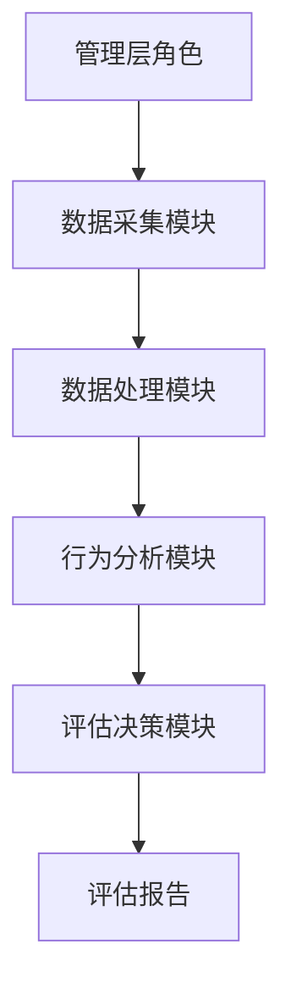
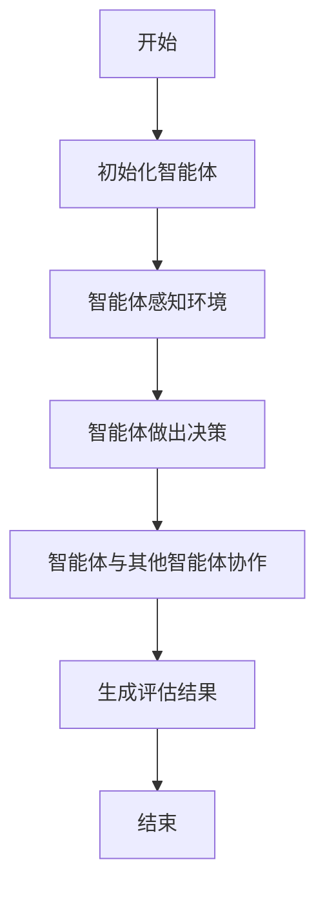
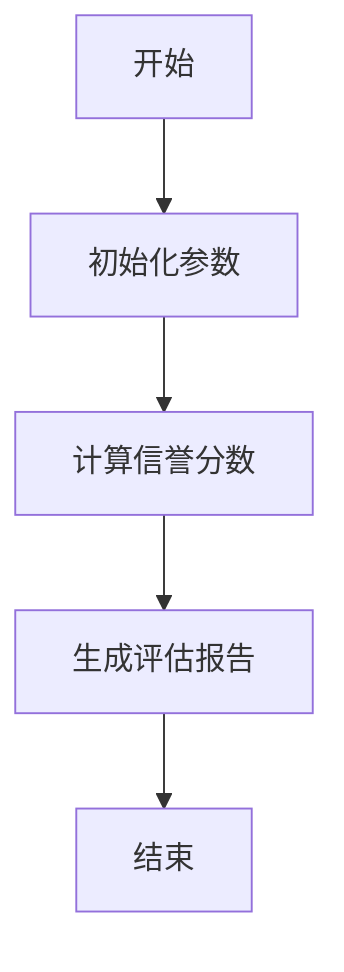
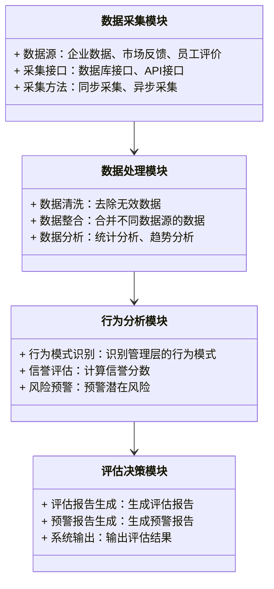

                 


# 多智能体系统在评估公司管理层诚信度中的应用

> **关键词**：多智能体系统、诚信评估、管理层评估、人工智能、系统架构  
> **摘要**：本文探讨了多智能体系统（MAS）在评估公司管理层诚信度中的应用，通过分析背景、核心概念、算法原理和系统架构，结合实际案例，详细阐述了多智能体系统如何提升诚信评估的效率和准确性。

---

## 第1章: 多智能体系统与管理层诚信评估的背景

### 1.1 问题背景

#### 1.1.1 管理层诚信度评估的重要性
企业诚信是企业生存和发展的基石，管理层的诚信度直接关系到企业的长期发展和股东利益。传统的诚信评估方法依赖于人工调查和主观判断，存在效率低、成本高、结果不客观的问题。随着人工智能技术的快速发展，如何利用技术手段提高诚信评估的效率和准确性成为亟待解决的问题。

#### 1.1.2 当前评估方法的局限性
目前，管理层诚信度的评估主要依赖于问卷调查、访谈和历史数据分析，这种方法存在以下问题：
- **主观性**：评估结果受评估者主观判断的影响，缺乏客观依据。
- **效率低下**：需要大量的人工分析，耗时长且成本高。
- **数据孤岛**：数据分散在不同部门，难以有效整合和分析。

#### 1.1.3 多智能体系统的优势
多智能体系统（MAS）是一种由多个智能体组成的分布式系统，每个智能体能够自主决策并与其他智能体协作。MAS在评估管理层诚信度中的优势在于：
- **分布式计算**：能够高效地处理大规模数据，提高评估效率。
- **智能协作**：多个智能体协同工作，能够从多个维度全面分析管理层的行为。
- **动态适应**：能够根据实际情况动态调整评估策略。

### 1.2 问题描述

#### 1.2.1 管理层诚信度的定义
管理层诚信度是指管理层在经营活动中遵守道德规范、履行职责、维护企业利益和股东权益的程度。主要包括以下几个方面：
- 诚实守信：管理层在决策和行为中是否遵守诚信原则。
- 责任感：管理层是否对企业的经营成果负责。
- 透明度：管理层是否愿意公开企业的经营信息。

#### 1.2.2 多智能体系统在评估中的应用场景
在管理层诚信评估中，多智能体系统可以应用于以下几个场景：
- **数据收集与整合**：从多个数据源（如财务数据、市场反馈、员工评价）中收集相关信息。
- **行为分析**：通过分析管理层的历史决策和行为模式，识别潜在的诚信问题。
- **风险预警**：根据评估结果，提前预警可能的风险，帮助企业采取预防措施。

#### 1.2.3 系统边界与外延
系统的边界包括：
- **输入**：企业的历史数据、市场反馈、员工评价等。
- **输出**：管理层诚信度的评估结果。
- **内部组件**：数据处理模块、行为分析模块、评估决策模块。

系统的外延包括：
- **数据来源**：企业内部数据、外部市场数据。
- **评估工具**：多种算法和模型。
- **用户界面**：供管理层和相关人员查看评估结果。

### 1.3 问题解决与系统架构

#### 1.3.1 多智能体系统的组成要素
多智能体系统由以下几部分组成：
- **智能体**：能够感知环境、自主决策并与其他智能体协作的实体。
- **通信机制**：智能体之间交换信息和协调行动的渠道。
- **协作协议**：智能体之间协作的规则和策略。
- **环境接口**：智能体与外部环境交互的接口。

#### 1.3.2 系统核心功能与目标
系统的功能包括：
- **数据采集**：从多个数据源采集相关信息。
- **数据处理**：对数据进行清洗、整合和分析。
- **行为分析**：通过算法分析管理层的行为模式。
- **评估决策**：根据分析结果，生成诚信度评估报告。

系统的目标是实现高效、准确的管理层诚信度评估，为企业管理提供科学依据。

#### 1.3.3 系统设计的原则与约束
系统设计的原则包括：
- **模块化设计**：系统功能模块化，便于维护和扩展。
- **分布式计算**：利用分布式技术提高系统的处理能力。
- **安全性**：确保数据的安全性和隐私性。

系统的约束包括：
- **数据隐私**：在处理数据时，必须遵守相关法律法规。
- **计算资源**：系统的运行需要足够的计算资源支持。

### 1.4 本章小结
本章介绍了多智能体系统在评估公司管理层诚信度中的背景，分析了当前评估方法的局限性，阐述了多智能体系统的优势和应用场景，并提出了系统的设计原则和约束条件。

---

## 第2章: 多智能体系统的核心概念

### 2.1 多智能体系统的定义与特点

#### 2.1.1 多智能体系统的定义
多智能体系统是由多个智能体组成的分布式系统，每个智能体能够自主决策并与其他智能体协作完成任务。

#### 2.1.2 系统的核心特征对比
以下是多智能体系统与传统单智能系统的核心特征对比：

| 特征维度 | 单智能系统 | 多智能系统 |
|----------|------------|------------|
| 决策方式 | 中央决策   | 分布式决策 | 
| 信息处理 | 中央处理   | 分布式处理 |
| 协作能力 | 无         | 有         |
| 故障容错 | 低         | 高         |

#### 2.1.3 系统的组成要素与关系
多智能体系统的组成要素包括：
- **智能体**：能够感知环境、自主决策的实体。
- **通信机制**：智能体之间交换信息和协调行动的渠道。
- **协作协议**：智能体之间协作的规则和策略。
- **环境接口**：智能体与外部环境交互的接口。

### 2.2 多智能体系统与管理层诚信评估的联系

#### 2.2.1 诚信评估的多维度分析
管理层诚信度的评估需要考虑多个维度：
- **行为模式**：管理层的历史决策和行为模式。
- **数据来源**：企业的财务数据、市场反馈、员工评价等。
- **评估指标**：包括诚信度、责任感、透明度等。

#### 2.2.2 多智能体系统在数据处理中的优势
多智能体系统在数据处理中的优势在于：
- **分布式计算**：能够高效地处理大规模数据。
- **智能协作**：多个智能体协同工作，能够从多个维度全面分析管理层的行为。
- **动态适应**：能够根据实际情况动态调整评估策略。

#### 2.2.3 系统在评估中的具体应用
在管理层诚信评估中，多智能体系统可以应用于以下几个方面：
- **数据采集与整合**：从多个数据源采集相关信息。
- **行为分析**：通过分析管理层的历史决策和行为模式，识别潜在的诚信问题。
- **风险预警**：根据评估结果，提前预警可能的风险。

### 2.3 系统架构的ER实体关系图

#### 2.3.1 ER实体关系图
以下是系统架构的ER实体关系图：

```mermaid
erDiagram
    actor 管理层角色
    act
    actor 员工
    act
    actor 股东
    act
    actor 市场反馈
    act
    actor 财务数据
    act
    actor 公司
    act
    顶层角色 --> 管理层角色: 负责评估
    管理层角色 --> 员工: 收集反馈
    管理层角色 --> 股东: 提供数据
    管理层角色 --> 市场反馈: 提供数据
    管理层角色 --> 财务数据: 提供数据
```

#### 2.3.2 数据流与系统流程图
以下是系统数据流与系统流程图：



---

## 第3章: 算法原理

### 3.1 多智能体协作算法

#### 3.1.1 协作算法的步骤
以下是多智能体协作算法的步骤：



#### 3.1.2 算法的数学模型
以下是算法的数学模型：

$$
\text{评估结果} = \sum_{i=1}^{n} w_i \times x_i
$$

其中，\( w_i \) 是第 \( i \) 个智能体的权重，\( x_i \) 是第 \( i \) 个智能体的评估结果。

### 3.2 信誉评估模型

#### 3.2.1 信誉评估的数学公式
以下是信誉评估的数学公式：

$$
\text{信誉分数} = \frac{\sum_{j=1}^{m} s_j}{m}
$$

其中，\( s_j \) 是第 \( j \) 个智能体的评分，\( m \) 是智能体的数量。

#### 3.2.2 模型的实现步骤
以下是模型的实现步骤：



---

## 第4章: 系统分析与架构设计

### 4.1 系统分析

#### 4.1.1 项目背景
本项目旨在利用多智能体系统提升管理层诚信度评估的效率和准确性。

#### 4.1.2 需求分析
系统需要满足以下需求：
- 实现多数据源的数据采集和整合。
- 提供行为分析和信誉评估功能。
- 生成评估报告并提供预警功能。

### 4.2 系统设计

#### 4.2.1 系统功能设计
以下是系统的功能模块：



#### 4.2.2 系统架构设计
以下是系统的架构设计：


#### 4.2.3 系统接口设计
系统接口设计包括：
- 数据采集接口：用于采集数据。
- 数据处理接口：用于处理数据。
- 行为分析接口：用于分析行为。
- 评估决策接口：用于生成评估报告。

---

## 第5章: 项目实战

### 5.1 环境安装

#### 5.1.1 安装Python
安装Python 3.8及以上版本。

#### 5.1.2 安装依赖库
安装以下依赖库：
```
pip install numpy
pip install pandas
pip install scikit-learn
pip install matplotlib
```

### 5.2 系统核心实现

#### 5.2.1 数据采集模块

```python
import pandas as pd

def collect_data():
    # 数据源：企业数据、市场反馈、员工评价
    data = pd.read_csv('管理层数据.csv')
    return data

if __name__ == "__main__":
    collect_data()
```

#### 5.2.2 数据处理模块

```python
import pandas as pd

def process_data(data):
    # 数据清洗
    data.dropna(inplace=True)
    # 数据整合
    data = pd.concat([data1, data2])
    return data

if __name__ == "__main__":
    data = collect_data()
    processed_data = process_data(data)
    print(processed_data)
```

#### 5.2.3 行为分析模块

```python
import pandas as pd
from sklearn.cluster import KMeans

def analyze_behavior(data):
    # 行为模式识别
    model = KMeans(n_clusters=3)
    model.fit(data)
    return model.labels_

if __name__ == "__main__":
    data = process_data(data)
    labels = analyze_behavior(data)
    print(labels)
```

#### 5.2.4 评估决策模块

```python
import pandas as pd
from sklearn.metrics import accuracy_score

def generate_report(labels):
    # 信誉评估
    report = {}
    for i in range(len(labels)):
        report[i] = labels[i]
    return report

if __name__ == "__main__":
    labels = analyze_behavior(data)
    report = generate_report(labels)
    print(report)
```

### 5.3 项目实战案例

#### 5.3.1 案例分析
以下是一个实际案例的分析：

```python
import pandas as pd

# 数据采集
data = collect_data()
print("数据采集完成！")

# 数据处理
processed_data = process_data(data)
print("数据处理完成！")

# 行为分析
labels = analyze_behavior(processed_data)
print("行为分析完成！")

# 评估决策
report = generate_report(labels)
print("评估报告生成完成！")
```

#### 5.3.2 代码解读与分析
- 数据采集模块：从文件中读取数据。
- 数据处理模块：清洗和整合数据。
- 行为分析模块：使用KMeans算法识别行为模式。
- 评估决策模块：生成评估报告。

---

## 第6章: 总结与展望

### 6.1 总结

#### 6.1.1 本章内容回顾
本章详细阐述了多智能体系统在评估公司管理层诚信度中的应用，包括系统的背景、核心概念、算法原理和系统架构。

#### 6.1.2 系统的优势与不足
- **优势**：高效、准确、智能协作。
- **不足**：需要大量数据支持，算法复杂。

### 6.2 未来展望

#### 6.2.1 系统优化方向
未来可以进一步优化系统的以下方面：
- 提高系统的计算效率。
- 增强系统的智能协作能力。
- 提高系统的数据隐私保护。

#### 6.2.2 技术发展趋势
随着人工智能技术的不断发展，多智能体系统在企业管理中的应用将更加广泛，技术也将更加成熟。

---

## 作者：AI天才研究院/AI Genius Institute & 禅与计算机程序设计艺术 /Zen And The Art of Computer Programming

---

以上是《多智能体系统在评估公司管理层诚信度中的应用》的目录大纲和详细内容，希望对您有所帮助！

