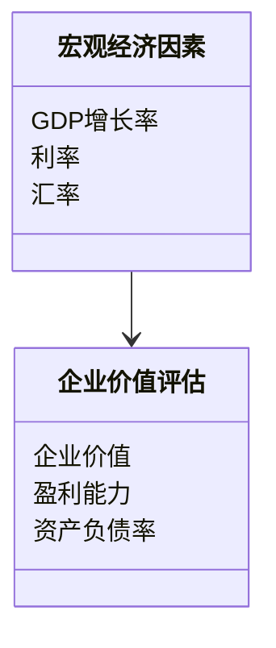
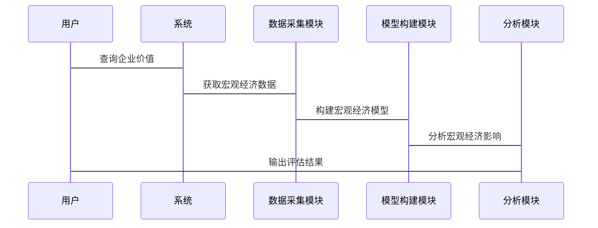

                 


# 多智能体系统在评估宏观经济因素对企业价值影响中的应用

## 关键词：多智能体系统、宏观经济因素、企业价值评估、MAS、经济模型、分布式计算

## 摘要：本文探讨了多智能体系统（MAS）在评估宏观经济因素对企业价值影响中的应用。通过分析宏观经济因素如经济周期、利率和汇率等对企业的多维度影响，结合MAS的分布式计算和协作能力，提出了一种基于多智能体的宏观经济模型，用于企业价值的动态评估。本文详细介绍了MAS的基本原理、宏观经济模型的构建方法、系统架构设计以及实际案例分析，展示了如何通过MAS技术实现宏观经济因素与企业价值的深度关联分析。

---

# 第一部分：多智能体系统与宏观经济因素概述

## 第1章：多智能体系统基础

### 1.1 多智能体系统的基本概念

#### 1.1.1 多智能体系统的定义
多智能体系统（Multi-Agent System，MAS）是由多个智能体（Agent）组成的分布式系统，这些智能体通过协作完成特定任务。每个智能体都有自己的目标、知识和行为规则，能够感知环境并自主决策。

#### 1.1.2 多智能体系统的特征
- **自主性**：智能体能够自主决策。
- **反应性**：智能体能够实时感知环境并做出反应。
- **协作性**：多个智能体通过协作完成复杂任务。
- **分布式性**：智能体分布在不同的空间或计算节点上。

#### 1.1.3 多智能体系统与单智能体系统的区别
| 特性           | 单智能体系统         | 多智能体系统         |
|----------------|--------------------|--------------------|
| 决策中心化     | 单一决策中心       | 分布式决策         |
| 资源共享       | 不共享             | 资源共享           |
| 行为复杂度     | 较低               | 较高               |

### 1.2 宏观经济因素的定义与分类

#### 1.2.1 宏观经济因素的定义
宏观经济因素是指影响整个经济体系的变量，如GDP、利率、通货膨胀率、汇率等。

#### 1.2.2 主要宏观经济因素及其影响
- **经济周期**：经济的波动对企业盈利能力和投资行为有直接影响。
- **利率**：利率的变化会影响企业的融资成本和投资决策。
- **汇率**：汇率波动会影响企业的出口和进口成本。

#### 1.2.3 宏观经济因素对企业价值的影响机制
企业价值受宏观经济环境的影响，主要通过以下途径：
1. **收入效应**：经济繁荣时，企业收入增加，价值上升。
2. **成本效应**：通货膨胀导致企业成本上升，利润下降，价值减少。
3. **风险偏好**：宏观经济不确定性增加，投资者风险偏好降低，企业价值可能下降。

### 1.3 企业价值评估的基本原理

#### 1.3.1 企业价值的定义
企业价值是指企业在持续经营基础上的未来现金流的现值。

#### 1.3.2 企业价值评估的方法
- **DCF模型**：通过预测未来现金流并贴现计算现值。
- **相对估值法**：通过比较同类企业的市盈率、市净率等指标进行估值。

#### 1.3.3 宏观经济因素在企业价值评估中的作用
宏观经济因素通过影响企业的收入、成本和风险，间接影响企业价值。

---

## 第2章：多智能体系统在宏观经济分析中的应用

### 2.1 多智能体系统的应用场景

#### 2.1.1 宏观经济模拟
通过MAS模拟经济系统的运行，分析政策变化对企业价值的影响。

#### 2.1.2 市场行为预测
利用MAS分析市场参与者的互动行为，预测市场趋势。

#### 2.1.3 政策评估与优化
通过MAS模拟不同政策对企业价值的影响，优化政策组合。

### 2.2 多智能体系统的优势

#### 2.2.1 分布式计算能力
MAS能够处理大规模的分布式计算，适合宏观经济模拟的复杂场景。

#### 2.2.2 多维因素的交互分析
MAS能够同时考虑多个宏观经济因素的交互作用，提供更全面的分析。

#### 2.2.3 动态系统的实时模拟
MAS能够实时更新数据，模拟动态经济环境中的企业价值变化。

### 2.3 多智能体系统在企业价值评估中的潜力

#### 2.3.1 提供多维度的经济数据支持
MAS能够整合多种宏观经济数据，为企业价值评估提供全面支持。

#### 2.3.2 实现复杂经济关系的动态模拟
通过MAS，可以模拟宏观经济因素与企业价值之间的复杂动态关系。

#### 2.3.3 为企业决策提供实时反馈
MAS能够实时更新分析结果，为企业提供及时的决策支持。

---

## 第3章：宏观经济因素对企业价值影响的理论框架

### 3.1 宏观经济因素与企业价值的关系

#### 3.1.1 经济周期对企业价值的影响
- **经济繁荣期**：企业收入增加，价值上升。
- **经济衰退期**：企业收入下降，价值减少。

#### 3.1.2 利率对企业价值的影响
- **低利率环境**：降低融资成本，企业价值上升。
- **高利率环境**：增加融资成本，企业价值下降。

#### 3.1.3 汇率对企业价值的影响
- **本币贬值**：出口型企业价值上升。
- **本币升值**：进口型企业价值下降。

### 3.2 宏观经济因素的量化分析

#### 3.2.1 宏观经济指标的选择与权重分配
- **GDP增长率**：权重较高，反映经济整体表现。
- **通货膨胀率**：权重中等，反映价格水平。
- **利率水平**：权重较高，反映融资成本。

#### 3.2.2 数据预处理与标准化
- **数据清洗**：去除异常值和缺失值。
- **数据标准化**：将不同量纲的指标进行标准化处理。

#### 3.2.3 统计分析方法
- **回归分析**：分析宏观经济因素与企业价值的相关性。
- **因子分析**：提取主要宏观经济因素，降低维度。

### 3.3 企业价值评估的多因素模型

#### 3.3.1 单因素模型
- **仅考虑GDP增长率**：简单但不够全面。

#### 3.3.2 多因素模型
- **考虑GDP增长率、利率和汇率**：更全面地反映宏观经济影响。

#### 3.3.3 模型的优缺点分析
| 特性       | 单因素模型             | 多因素模型             |
|------------|-----------------------|-----------------------|
| 优点       | 简单易懂               | 更全面                 |
| 缺点       | 忽略其他重要因素       | 复杂度高               |

---

## 第4章：多智能体系统的核心算法与实现

### 4.1 多智能体系统的通信协议

#### 4.1.1 通信协议的定义
通信协议是智能体之间交换信息的规则和格式。

#### 4.1.2 常见通信协议的选择
- **HTTP**：适用于简单的请求-响应场景。
- **WebSocket**：适用于实时通信场景。

#### 4.1.3 通信协议的实现步骤
1. **定义数据格式**：如JSON或XML。
2. **实现发送方**：将数据格式化为指定格式并发送。
3. **实现接收方**：解析接收到的数据并进行处理。

### 4.2 多智能体系统的协调与协作机制

#### 4.2.1 协调机制的定义
协调机制是指智能体之间如何协同工作以完成共同目标。

#### 4.2.2 常见协调算法
- **基于价格的分配**：通过价格机制分配任务。
- **基于优先级的分配**：根据任务优先级分配资源。

#### 4.2.3 协作机制的实现
1. **任务分配**：根据智能体的能力分配任务。
2. **信息共享**：智能体之间共享必要信息。
3. **协作执行**：智能体协同完成任务。

### 4.3 多智能体系统的优化算法

#### 4.3.1 常见优化算法
- **遗传算法**：适用于组合优化问题。
- **粒子群优化算法**：适用于连续优化问题。

#### 4.3.2 算法的实现步骤
1. **初始化**：设置初始参数。
2. **迭代优化**：不断更新参数，寻找最优解。
3. **终止条件**：达到迭代次数或满足优化目标。

---

## 第5章：系统架构设计与实现

### 5.1 问题场景介绍

#### 5.1.1 项目背景
为了评估宏观经济因素对企业价值的影响，我们开发了一个基于MAS的宏观经济模拟系统。

#### 5.1.2 项目目标
通过MAS模拟宏观经济环境，为企业价值评估提供支持。

### 5.2 系统功能设计

#### 5.2.1 领域模型设计


#### 5.2.2 系统架构设计
```mermaid
container 宏观经济模拟系统 {
    class 智能体管理模块 {
        注册智能体
        分配任务
    }
    class 数据采集模块 {
        采集宏观经济数据
        数据预处理
    }
    class 模型构建模块 {
        构建宏观经济模型
        训练模型
    }
    class 分析模块 {
        分析宏观经济影响
        输出评估结果
    }
}
```

### 5.3 系统接口设计

#### 5.3.1 系统接口
- **数据接口**：与宏观经济数据库对接。
- **用户接口**：提供用户查询和分析功能。

#### 5.3.2 系统交互


---

## 第6章：项目实战与案例分析

### 6.1 环境安装

#### 6.1.1 安装Python
```bash
# 安装Python
sudo apt-get install python3
```

#### 6.1.2 安装依赖库
```bash
# 安装Pandas、NumPy、Scikit-learn
pip install pandas numpy scikit-learn
```

### 6.2 系统核心实现源代码

#### 6.2.1 数据采集模块
```python
import pandas as pd

def collect_macro_data():
    data = {
        'GDP增长率': [3.5, 4.2, 2.8],
        '利率': [2.5, 3.1, 1.8],
        '汇率': [1.2, 1.1, 1.3]
    }
    return pd.DataFrame(data)
```

#### 6.2.2 模型构建模块
```python
from sklearn.linear_model import LinearRegression

def build_macro_model(X, y):
    model = LinearRegression()
    model.fit(X, y)
    return model
```

#### 6.2.3 分析模块
```python
def analyze_macro_impact(model, new_data):
    prediction = model.predict(new_data)
    return prediction
```

### 6.3 实际案例分析

#### 6.3.1 案例背景
某企业在经济繁荣期，GDP增长率为4.2%，利率为3.1%，汇率为1.1。

#### 6.3.2 数据分析
```python
data = collect_macro_data()
print(data)
# 输出：
#    GDP增长率  利率  汇率
# 0        3.5    2.5    1.2
# 1        4.2    3.1    1.1
# 2        2.8    1.8    1.3
```

#### 6.3.3 模型训练
```python
X = data[['GDP增长率', '利率', '汇率']]
y = data['企业价值']
model = build_macro_model(X, y)
```

#### 6.3.4 结果解读
```python
new_data = {
    'GDP增长率': [4.2],
    '利率': [3.1],
    '汇率': [1.1]
}
prediction = analyze_macro_impact(model, new_data)
print("预测企业价值：", prediction)
```

---

## 第7章：总结与展望

### 7.1 总结
本文通过MAS技术，构建了一个宏观经济模拟系统，展示了如何通过MAS评估宏观经济因素对企业价值的影响。通过实际案例分析，验证了MAS在宏观经济分析中的优势。

### 7.2 展望
未来的研究方向包括：
1. **更复杂的宏观经济模型**：引入更多宏观经济因素。
2. **优化MAS算法**：提高系统的计算效率和准确性。
3. **实时数据分析**：实现对企业价值的实时评估。

---

## 作者：AI天才研究院/AI Genius Institute & 禅与计算机程序设计艺术 /Zen And The Art of Computer Programming

