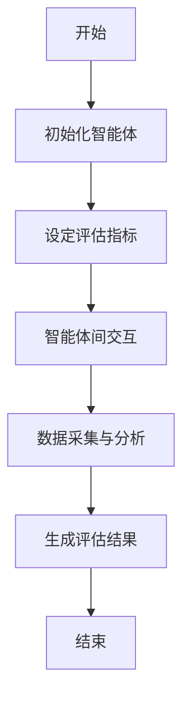

                 


# 多智能体系统在评估管理层质量和公司文化中的应用

> 关键词：多智能体系统、管理层评估、公司文化、协作算法、社会网络分析、自然语言处理

> 摘要：本文深入探讨了多智能体系统（MAS）在评估管理层质量和公司文化中的应用。通过理论分析、算法设计、系统架构和实际案例，展示了MAS如何通过协作、数据分析和智能化评估，为企业管理提供新思路。文章从背景、核心概念、算法原理、系统架构到项目实战，层层展开，为企业管理者和技术开发者提供实践指导。

---

# 第一部分：背景与概念

## 第1章：多智能体系统概述

### 1.1 多智能体系统的基本概念
- 1.1.1 智能体的定义与分类
- 1.1.2 多智能体系统的特征与优势
- 1.1.3 与传统管理方法的对比

### 1.2 管理层质量评估的重要性
- 1.2.1 核心维度与企业绩效
- 1.2.2 现有评估方法的局限性
- 1.2.3 对企业战略的影响

### 1.3 公司文化评估的重要性
- 1.3.1 文化定义与维度
- 1.3.2 对企业战略的影响
- 1.3.3 现有方法的挑战

### 1.4 多智能体系统在管理评估中的应用潜力
- 1.4.1 系统与管理评估的结合点
- 1.4.2 在管理层与文化评估中的优势
- 1.4.3 应用前景与未来趋势

---

## 第2章：多智能体系统的核心概念与联系

### 2.1 多智能体系统的核心原理
- 2.1.1 智能体的自主性与协作性
- 2.1.2 通信与协调机制
- 2.1.3 动态性与适应性

### 2.2 多智能体系统与管理层评估的联系
- 2.2.1 智能体行为模型与决策的关系
- 2.2.2 协作与团队管理的映射
- 2.2.3 反馈机制与绩效评估

### 2.3 多智能体系统与公司文化评估的联系
- 2.3.1 智能体间关系与文化氛围
- 2.3.2 社会网络分析与文化结构
- 2.3.3 系统在文化传播中的应用

### 2.4 核心概念对比与ER实体关系图
- 2.4.1 核心概念属性对比表
- 2.4.2 多智能体系统与管理评估的ER实体关系图

```mermaid
er
actor: 管理层, 智能体, 企业文化
object: 评估指标, 交互行为, 文化特征
relationship: 管理层-评估指标, 智能体-交互行为, 企业文化-文化特征
```

---

## 第3章：多智能体系统的算法原理与数学模型

### 3.1 多智能体协作算法
- 3.1.1 基于MAS的协作算法
- 3.1.2 算法步骤
- 3.1.3 Mermaid流程图



### 3.2 社会网络分析与自然语言处理
- 3.2.1 社会网络分析方法
- 3.2.2 自然语言处理技术
- 3.2.3 代码实现与案例分析

### 3.3 数学模型与公式
- 3.3.1 评估模型构建
- 3.3.2 公式推导
- 3.3.3 示例分析

$$
评估得分 = \sum_{i=1}^{n} w_i \cdot x_i
$$

---

## 第4章：系统分析与架构设计

### 4.1 问题场景与项目介绍
- 4.1.1 管理层与文化评估的需求分析
- 4.1.2 项目目标与范围
- 4.1.3 项目背景与意义

### 4.2 系统功能设计
- 4.2.1 数据采集模块
- 4.2.2 数据分析模块
- 4.2.3 评估报告生成模块

### 4.3 系统架构设计
- 4.3.1 分层架构
- 4.3.2 模块化设计
- 4.3.3 技术选型

### 4.4 系统接口与交互设计
- 4.4.1 API设计
- 4.4.2 用户界面设计
- 4.4.3 交互流程

### 4.5 系统架构图


---

## 第5章：项目实战与实现

### 5.1 环境安装与配置
- 5.1.1 安装Python与相关库
- 5.1.2 安装步骤与依赖管理

### 5.2 系统核心实现
- 5.2.1 数据采集代码
- 5.2.2 数据分析代码
- 5.2.3 评估报告生成代码

### 5.3 代码实现与解读
- 5.3.1 核心代码展示
- 5.3.2 代码功能解析
- 5.3.3 代码优化建议

### 5.4 实际案例分析
- 5.4.1 案例背景与数据准备
- 5.4.2 数据处理与分析
- 5.4.3 结果解读与经验总结

---

## 第6章：总结与展望

### 6.1 最佳实践
- 6.1.1 系统实施的注意事项
- 6.1.2 使用中的常见问题与解决方案
- 6.1.3 提升系统性能的建议

### 6.2 小结
- 6.2.1 本文核心内容回顾
- 6.2.2 对未来研究与实践的展望

### 6.3 注意事项
- 6.3.1 系统实施中的潜在风险
- 6.3.2 数据隐私与安全问题
- 6.3.3 技术更新与系统维护

### 6.4 拓展阅读
- 6.4.1 推荐的书籍与论文
- 6.4.2 相关技术领域的发展动态
- 6.4.3 未来研究方向

---

## 作者：AI天才研究院/AI Genius Institute & 禅与计算机程序设计艺术 /Zen And The Art of Computer Programming

---

通过以上目录，文章将从理论到实践，详细讲解多智能体系统在评估管理层质量和公司文化中的应用，为技术开发者和企业管理者提供深入的指导和启示。

