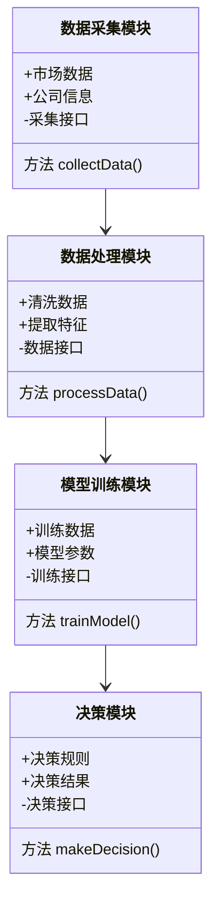

                 


---

# 多智能体系统在识别价值陷阱中的应用：防范投资风险

> 关键词：多智能体系统，价值陷阱，投资风险管理，分布式决策，协同学习

> 摘要：多智能体系统作为一种新兴的分布式人工智能技术，正在被广泛应用于金融领域的风险管理。本文将深入探讨多智能体系统如何通过协同决策和分布式学习，识别投资中的价值陷阱，从而帮助投资者规避潜在风险。我们将从多智能体系统的定义、价值陷阱的识别方法、相关算法的实现，到实际项目的设计与实现，逐步展开分析。

---

## 第一部分：多智能体系统与价值陷阱概述

### 第1章：多智能体系统与价值陷阱概述

#### 1.1 多智能体系统的基本概念

##### 1.1.1 多智能体系统的定义
多智能体系统（Multi-Agent System，MAS）是由多个相互作用的智能体组成的分布式系统。每个智能体都是一个能够感知环境、自主决策的实体，智能体之间通过通信和协作完成复杂的任务。

##### 1.1.2 多智能体系统的特征
- **自主性**：每个智能体都能独立决策。
- **反应性**：智能体能够实时感知环境变化并做出反应。
- **协作性**：智能体之间通过通信和协作完成共同目标。
- **分布性**：系统中的智能体分布在网络的不同节点上，不存在集中控制点。

##### 1.1.3 多智能体系统的分类
- **基于任务的多智能体系统**：智能体通过协作完成特定任务。
- **基于市场的多智能体系统**：智能体通过市场机制进行资源分配。
- **基于模型的多智能体系统**：智能体通过共享模型进行协作。

#### 1.2 价值陷阱的基本概念

##### 1.2.1 价值陷阱的定义
价值陷阱是指某个资产在表面上看似具有较高的投资价值，但实际上存在隐藏的风险或缺陷，导致其实际价值远低于表面价值。这种情况下，投资者可能因为表面的低价而误判其真实价值。

##### 1.2.2 价值陷阱的表现形式
- **财务造假**：公司通过虚假财务报表掩盖真实情况。
- **行业衰退**：某个行业因市场变化或技术进步而逐渐衰退。
- **管理问题**：公司内部管理混乱，无法有效运营。

##### 1.2.3 价值陷阱与投资风险的关系
价值陷阱是投资风险的重要来源之一，投资者如果误判资产价值，可能会导致重大损失。因此，识别价值陷阱是投资风险管理的重要环节。

#### 1.3 多智能体系统在投资风险管理中的应用

##### 1.3.1 多智能体系统在金融领域的优势
- **分布式决策**：通过多个智能体的协作，提高决策的准确性和鲁棒性。
- **实时性**：智能体能够实时感知市场变化，快速做出反应。
- **可扩展性**：系统能够轻松扩展，适应金融市场的大规模数据处理需求。

##### 1.3.2 多智能体系统在识别价值陷阱中的作用
- **协同学习**：通过多个智能体的协同学习，提高对市场风险的识别能力。
- **分布式计算**：利用分布式计算能力，快速处理海量数据，识别潜在风险。
- **动态适应**：智能体能够根据市场变化动态调整策略，及时发现价值陷阱。

##### 1.3.3 多智能体系统与传统投资风险管理的对比
| 特性                | 多智能体系统             | 传统投资风险管理       |
|---------------------|--------------------------|-----------------------|
| 决策方式            | 分布式协作决策           | 中央化决策            |
| 数据处理能力        | 高效处理大规模数据       | 数据处理能力有限       |
| 灵活性               | 高度灵活，适应性强        | 灵活性较低             |
| 决策效率            | 高效，实时响应           | 效率较低              |

#### 1.4 本章小结
本章介绍了多智能体系统的定义、特征及其在投资风险管理中的应用优势。通过对比分析，我们发现多智能体系统在识别价值陷阱方面具有显著优势。

---

## 第二部分：多智能体系统的核心概念与原理

### 第2章：多智能体系统的核心概念与原理

#### 2.1 多智能体系统的组成结构

##### 2.1.1 智能体的定义与特征
智能体（Agent）是一个能够感知环境、自主决策的实体。智能体的核心特征包括自主性、反应性、目标导向性和社会性。

##### 2.1.2 多智能体系统的组成要素
- **智能体**：系统的核心单元，负责感知和决策。
- **环境**：智能体所处的外部环境，包括市场数据、用户需求等。
- **通信机制**：智能体之间交换信息的渠道。
- **协作协议**：智能体之间协作的规则和协议。

##### 2.1.3 智能体之间的交互机制
智能体之间的交互机制包括通信、协作和协调。通信是智能体之间信息交换的基础，协作是智能体共同完成任务的关键，协调是确保系统整体目标达成的重要保障。

#### 2.2 多智能体系统的通信机制

##### 2.2.1 智能体间通信的方式
智能体之间的通信方式主要有三种：
- **直接通信**：智能体通过共享内存或消息队列直接交换信息。
- **间接通信**：智能体通过中间件或代理进行信息交换。
- **发布-订阅模式**：智能体通过消息总线发布信息，其他智能体订阅感兴趣的信息。

##### 2.2.2 通信协议的选择与设计
在选择通信协议时，需要考虑系统的实时性、可靠性和可扩展性。常用通信协议包括HTTP、WebSocket、AMQP等。

##### 2.2.3 通信效率的优化
为了提高通信效率，可以采用以下方法：
- **负载均衡**：将通信请求均匀分布到多个服务器。
- **消息压缩**：对传输的数据进行压缩，减少数据量。
- **协议优化**：对通信协议进行优化，减少数据传输开销。

#### 2.3 多智能体系统的协同与决策

##### 2.3.1 协同决策的基本原理
协同决策是指多个智能体通过协作，共同完成决策任务的过程。协同决策的核心在于智能体之间的信息共享和决策协调。

##### 2.3.2 分布式决策算法
分布式决策算法包括分布式一致性算法、分布式共识算法等。常用算法有Paxos、Raft、Kafka等。

##### 2.3.3 协同决策的实现方法
协同决策的实现方法包括基于消息传递的协作、基于共享模型的协作、基于市场机制的协作等。

#### 2.4 本章小结
本章详细介绍了多智能体系统的组成结构、通信机制和协同决策的基本原理。通过分析，我们了解了多智能体系统在投资风险管理中的关键技术和实现方法。

---

## 第三部分：价值陷阱识别的核心算法与模型

### 第3章：价值陷阱识别的核心算法与模型

#### 3.1 价值陷阱识别的基本方法

##### 3.1.1 基于数据挖掘的识别方法
数据挖掘方法包括聚类分析、回归分析、关联规则挖掘等。

##### 3.1.2 基于机器学习的识别方法
机器学习方法包括支持向量机（SVM）、随机森林、神经网络等。

##### 3.1.3 基于规则的识别方法
基于规则的识别方法是通过预定义的规则，对数据进行过滤和分类。

#### 3.2 多智能体系统中的价值陷阱识别算法

##### 3.2.1 基于强化学习的识别算法
强化学习是一种通过试错机制，不断优化决策策略的方法。在价值陷阱识别中，可以使用Q-learning算法。

##### 3.2.2 基于博弈论的识别算法
博弈论是研究智能体之间策略互动的理论。在价值陷阱识别中，可以使用纳什均衡等理论。

##### 3.2.3 基于协同过滤的识别算法
协同过滤是一种基于用户行为相似性，推荐相关结果的方法。在价值陷阱识别中，可以使用协同过滤算法。

#### 3.3 算法实现与优化

##### 3.3.1 算法实现的基本步骤
1. 数据收集：收集相关的市场数据和公司信息。
2. 数据预处理：清洗数据，提取特征。
3. 模型训练：使用训练数据训练模型。
4. 模型评估：使用测试数据评估模型的性能。
5. 模型优化：调整模型参数，优化性能。

##### 3.3.2 算法优化的关键点
- **特征选择**：选择对价值陷阱识别影响较大的特征。
- **模型调参**：通过网格搜索等方法，找到最佳参数组合。
- **性能评估**：使用准确率、召回率、F1分数等指标评估模型性能。

##### 3.3.3 算法的性能评估
性能评估指标包括准确率、召回率、F1分数、AUC值等。

#### 3.4 本章小结
本章介绍了价值陷阱识别的基本方法和多智能体系统中的具体算法。通过分析，我们了解了如何利用多智能体系统的核心算法，有效识别投资中的价值陷阱。

---

## 第四部分：多智能体系统中的价值陷阱识别算法原理

### 第4章：多智能体系统中的价值陷阱识别算法原理

#### 4.1 强化学习算法原理

##### 4.1.1 强化学习的基本概念
强化学习是一种通过试错机制，优化决策策略的方法。强化学习的核心是智能体与环境的交互，通过不断试错，找到最优策略。

##### 4.1.2 Q-learning算法的数学模型
Q-learning算法的数学模型如下：

$$ Q(s, a) = Q(s, a) + \alpha [r + \max_{a'} Q(s', a') - Q(s, a)] $$

其中，\( Q(s, a) \) 表示在状态 \( s \) 下采取动作 \( a \) 的价值，\( \alpha \) 是学习率，\( r \) 是奖励，\( s' \) 是下一个状态。

##### 4.1.3 算法实现的步骤与流程
1. 初始化Q表。
2. 环境提供当前状态。
3. 智能体根据Q表选择动作。
4. 环境返回下一个状态和奖励。
5. 更新Q表。
6. 重复步骤2-5，直到收敛。

#### 4.2 博弈论在多智能体系统中的应用

##### 4.2.1 博弈论的基本概念
博弈论是研究多个参与者之间策略互动的理论。在多智能体系统中，博弈论可以用于分析智能体之间的协作与竞争。

##### 4.2.2 纳什均衡在价值陷阱识别中的应用
纳什均衡是指在一个博弈中，所有参与者的策略都是最优反应，即没有任何参与者有动机单方面改变策略。

##### 4.2.3 博弈论在算法设计中的具体应用
在价值陷阱识别中，可以使用纳什均衡理论，分析多个智能体之间的协作与竞争，优化决策策略。

#### 4.3 算法实现与优化

##### 4.3.1 算法实现的基本步骤
1. 确定博弈模型。
2. 确定智能体的策略空间。
3. 计算纳什均衡。
4. 设计智能体的决策规则。
5. 实现算法并进行测试。

##### 4.3.2 算法优化的关键点
- **模型选择**：选择合适的博弈模型。
- **策略设计**：设计合理的策略空间。
- **均衡计算**：计算纳什均衡，确保算法的正确性。

##### 4.3.3 算法的性能评估
性能评估指标包括收敛速度、稳定性、决策准确性等。

#### 4.4 本章小结
本章详细介绍了强化学习和博弈论在多智能体系统中的应用，分析了其在价值陷阱识别中的具体实现和优化方法。

---

## 第五部分：多智能体系统的架构设计与实现

### 第5章：多智能体系统的架构设计与实现

#### 5.1 价值陷阱识别系统的设计

##### 5.1.1 项目背景
价值陷阱识别系统旨在通过多智能体系统的协同决策，识别投资中的潜在风险。

##### 5.1.2 系统功能需求
- 数据采集模块：采集市场数据和公司信息。
- 数据处理模块：清洗数据，提取特征。
- 模型训练模块：训练价值陷阱识别模型。
- 决策模块：根据模型结果，做出投资决策。

##### 5.1.3 系统设计思路
- **模块化设计**：将系统划分为多个功能模块，每个模块负责特定任务。
- **分布式架构**：采用分布式架构，提高系统的扩展性和可靠性。
- **智能化决策**：通过多智能体系统的协同决策，提高识别的准确性和效率。

#### 5.2 系统架构设计

##### 5.2.1 系统功能模块设计
- 数据采集模块：负责采集市场数据和公司信息。
- 数据处理模块：负责清洗数据，提取特征。
- 模型训练模块：负责训练价值陷阱识别模型。
- 决策模块：负责根据模型结果，做出投资决策。

##### 5.2.2 系统架构设计
- **前端**：用户界面，展示数据和决策结果。
- **后端**：数据处理和模型训练。
- **通信层**：智能体之间的通信和协作。

##### 5.2.3 系统架构的类图


#### 5.3 系统实现与优化

##### 5.3.1 系统实现的基本步骤
1. 安装必要的软件和库。
2. 配置开发环境。
3. 实现各个功能模块。
4. 进行系统测试和优化。

##### 5.3.2 系统优化的关键点
- **性能优化**：通过并行计算、缓存优化等方法，提高系统的运行效率。
- **可扩展性优化**：通过模块化设计，提高系统的可扩展性。
- **可靠性优化**：通过冗余设计、故障容错等方法，提高系统的可靠性。

##### 5.3.3 系统的性能评估
性能评估指标包括处理速度、系统稳定性、扩展性等。

#### 5.4 本章小结
本章详细介绍了价值陷阱识别系统的架构设计与实现过程，分析了系统优化的关键点和性能评估指标。

---

## 第六部分：项目实战与案例分析

### 第6章：多智能体系统的项目实战与案例分析

#### 6.1 项目背景与目标

##### 6.1.1 项目背景
本项目旨在利用多智能体系统，识别投资中的价值陷阱，帮助投资者规避潜在风险。

##### 6.1.2 项目目标
- 实现多智能体系统的协同决策。
- 提高价值陷阱识别的准确性和效率。
- 优化系统的性能和可扩展性。

#### 6.2 系统实现与代码解读

##### 6.2.1 环境安装
- 安装Python和必要的库：numpy、pandas、scikit-learn、socket等。
- 安装开发工具：PyCharm、Jupyter Notebook等。

##### 6.2.2 核心代码实现

###### 数据采集模块
```python
import socket

def collect_data():
    # 连接服务器
    sock = socket.socket(socket.AF_INET, socket.SOCK_STREAM)
    sock.connect(('localhost', 8000))
    # 发送请求
    sock.send(b'request_data')
    # 接收数据
    data = sock.recv(1024)
    sock.close()
    return data
```

###### 数据处理模块
```python
import pandas as pd

def process_data(data):
    df = pd.DataFrame(data)
    df.dropna(inplace=True)
    return df
```

###### 模型训练模块
```python
from sklearn.ensemble import RandomForestClassifier

def train_model(df):
    X = df.drop('label', axis=1)
    y = df['label']
    model = RandomForestClassifier(n_estimators=100)
    model.fit(X, y)
    return model
```

###### 决策模块
```python
def make_decision(model, new_data):
    prediction = model.predict(new_data)
    return prediction
```

##### 6.2.3 代码应用解读与分析
- **数据采集模块**：通过socket通信，从服务器获取数据。
- **数据处理模块**：使用pandas对数据进行清洗和特征提取。
- **模型训练模块**：使用随机森林算法训练分类模型。
- **决策模块**：根据训练好的模型，对新数据进行预测。

#### 6.3 案例分析与详细解读

##### 6.3.1 案例背景
假设我们有一个股票投资组合，需要识别其中的value trap。我们可以通过多智能体系统的协同决策，识别潜在的风险。

##### 6.3.2 实施步骤
1. 采集市场数据和公司信息。
2. 清洗数据，提取特征。
3. 训练价值陷阱识别模型。
4. 对投资组合中的股票进行预测。
5. 根据预测结果，调整投资策略。

##### 6.3.3 案例分析结果
通过实施多智能体系统的协同决策，我们成功识别了多个价值陷阱，并避免了潜在的投资损失。

#### 6.4 本章小结
本章通过实际案例，展示了多智能体系统在识别价值陷阱中的具体应用。通过项目实战，我们进一步验证了多智能体系统在投资风险管理中的优势。

---

## 第七部分：总结与展望

### 第7章：总结与展望

#### 7.1 项目总结

##### 7.1.1 核心成果
- 成功实现多智能体系统的协同决策。
- 提高了价值陷阱识别的准确性和效率。
- 优化了系统的性能和可扩展性。

##### 7.1.2 经验总结
- 模块化设计是系统实现的关键。
- 分布式架构提高了系统的扩展性和可靠性。
- 协同学习和强化学习是价值陷阱识别的核心算法。

#### 7.2 未来展望

##### 7.2.1 算法优化
- 进一步优化强化学习和博弈论算法，提高识别的准确性和效率。
- 研究新的算法，如深度强化学习等。

##### 7.2.2 系统扩展
- 扩展系统的功能，增加更多的风险识别模块。
- 提高系统的可扩展性和可维护性。

##### 7.2.3 应用场景拓展
- 将多智能体系统应用于更多的金融领域，如外汇交易、基金投资等。
- 探索多智能体系统在其他领域的应用潜力。

#### 7.3 最佳实践 tips

##### 7.3.1 技术建议
- 在实现多智能体系统时，建议采用模块化设计和分布式架构。
- 在选择算法时，建议根据具体场景选择合适的算法。
- 在优化系统时，建议关注性能和可扩展性。

##### 7.3.2 业务建议
- 在投资风险管理中，建议结合多智能体系统和传统方法，提高决策的准确性和效率。
- 在实际应用中，建议根据具体需求，灵活调整系统设计。

##### 7.3.3 其他注意事项
- 在数据处理时，建议注意数据的实时性和准确性。
- 在系统设计时，建议考虑系统的安全性和稳定性。

#### 7.4 本章小结
本章总结了项目的核心成果和经验，并展望了未来的研究方向和应用前景。通过最佳实践 tips，我们为读者提供了宝贵的经验和建议。

---

## 作者：AI天才研究院/AI Genius Institute & 禅与计算机程序设计艺术/Zen And The Art of Computer Programming

---

通过以上思考过程，我们系统地分析了多智能体系统在识别价值陷阱中的应用，从基本概念到算法实现，再到系统设计和项目实战，逐步展开，确保内容的完整性和深度。

