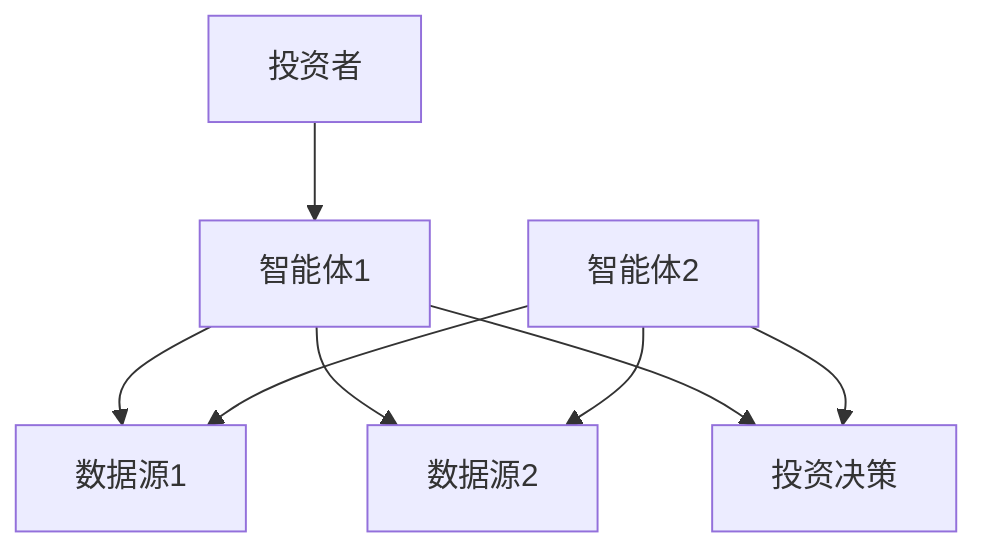
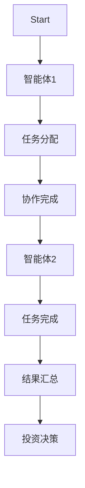
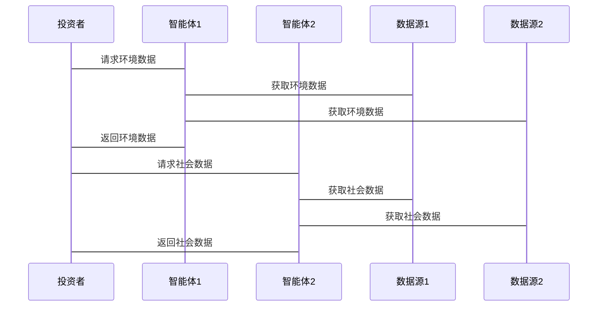

                 


```markdown
# 多智能体系统在识别和评估ESG投资机会中的作用

> 关键词：多智能体系统，ESG投资，环境、社会和治理因素，投资机会识别，投资风险评估

> 摘要：  
本文探讨了多智能体系统（MAS）在识别和评估ESG（环境、社会和治理）投资机会中的作用。通过分析多智能体系统的协作机制和算法原理，本文揭示了如何利用MAS技术提高ESG投资的效率和准确性。文章从背景介绍、核心概念、算法原理、系统架构、项目实战到总结与展望，全面阐述了多智能体系统在ESG投资中的应用，为投资者和研究人员提供了理论依据和实践指导。

---

## 第一部分: 多智能体系统与ESG投资的背景介绍

### 第1章: 多智能体系统与ESG投资的背景介绍

#### 1.1 ESG投资的背景与意义
##### 1.1.1 ESG投资的定义与重要性
ESG投资是指在投资决策中考虑环境、社会和治理三个维度的因素。环境因素包括企业的碳排放、资源利用效率等；社会因素包括企业的社会责任、员工权益等；治理因素包括企业的董事会结构、高管薪酬等。随着全球对可持续发展的关注增加，ESG投资逐渐成为一种重要的投资策略。

##### 1.1.2 ESG投资的核心要素
ESG投资的核心要素包括：
- 环境（Environmental）：关注企业的碳排放、能源消耗、环保合规性等。
- 社会（Social）：关注企业的社会责任、员工权益、供应链管理等。
- 治理（Governance）：关注企业的董事会结构、高管薪酬、关联交易等。

##### 1.1.3 ESG投资的全球发展趋势
近年来，全球ESG投资规模快速增长，越来越多的投资者开始关注企业的可持续发展能力。根据相关数据显示，2021年全球ESG基金管理规模已超过2万亿美元，且仍在快速增长中。然而，ESG投资的复杂性也带来了诸多挑战，如数据获取难度、评估标准不统一等。

#### 1.2 多智能体系统的基本概念
##### 1.2.1 多智能体系统的定义
多智能体系统（Multi-Agent System，MAS）是指由多个智能体组成的系统，每个智能体都能独立决策并相互交互。智能体可以是软件程序、机器人或其他具有感知和决策能力的实体。

##### 1.2.2 多智能体系统的特征
多智能体系统具有以下特征：
- 分布式：智能体分布在网络中，独立决策。
- 协作性：智能体之间可以通过通信和协作完成复杂任务。
- 反应性：智能体能够感知环境并做出实时反应。
- 自主性：智能体具有自主决策的能力。

##### 1.2.3 多智能体系统的应用场景
多智能体系统广泛应用于金融、物流、医疗等领域。在金融领域，MAS可以用于股票交易、风险管理、投资组合优化等场景。

#### 1.3 多智能体系统与ESG投资的结合
##### 1.3.1 ESG投资中的数据处理需求
ESG投资需要处理大量的非结构化数据，如企业的社会责任报告、新闻报道等。这些数据通常分布在不同的来源，需要通过多智能体系统进行分布式处理。

##### 1.3.2 多智能体系统在ESG投资中的优势
多智能体系统可以通过分布式计算和协作机制，提高ESG投资的效率和准确性。例如，多个智能体可以分别负责不同领域的数据收集和分析，最终通过协作得出投资决策。

##### 1.3.3 多智能体系统与ESG投资的边界与外延
多智能体系统在ESG投资中的应用边界包括数据获取、分析和决策。其外延则包括与企业治理、风险管理等其他领域的结合。

---

## 第二部分: 多智能体系统在ESG投资中的核心概念与联系

### 第2章: 多智能体系统在ESG投资中的核心概念与联系

#### 2.1 多智能体系统的原理
##### 2.1.1 多智能体系统的组成要素
多智能体系统由以下要素组成：
- 智能体：具有感知和决策能力的实体。
- 环境：智能体所处的外部环境，包括数据源、市场等。
- 通信机制：智能体之间的通信方式，如消息传递、数据共享等。
- 协作机制：智能体之间的协作规则和策略。

##### 2.1.2 多智能体系统的协作机制
协作机制是多智能体系统的核心，常见的协作机制包括：
- 分层协作：将任务分解为多个层次，由不同智能体负责。
- 基于角色的协作：智能体根据角色分配任务。
- 基于目标的协作：智能体根据共同目标进行协作。

##### 2.1.3 多智能体系统的通信协议
通信协议是智能体之间进行信息交换的规则。常见的通信协议包括：
- HTTP：用于Web服务之间的通信。
- WebSocket：用于实时通信。
- MQTT：用于物联网设备之间的通信。

#### 2.2 多智能体系统与ESG投资的核心要素对比
##### 2.2.1 智能体属性特征对比表格
| 智能体属性 | ESG投资中的对应要素 |
|------------|----------------------|
| 感知能力  | 数据收集与分析能力 |
| 决策能力  | 投资决策能力         |
| 协作能力  | 多团队协作能力       |

##### 2.2.2 ESG投资核心要素的特征分析
ESG投资的核心要素包括环境、社会和治理三个维度。环境因素关注企业的碳排放、能源消耗等；社会因素关注企业的社会责任、员工权益等；治理因素关注企业的董事会结构、高管薪酬等。

##### 2.2.3 多智能体系统与ESG投资的实体关系图（Mermaid流程图）


---

## 第三部分: 多智能体系统在ESG投资中的算法原理

### 第3章: 多智能体系统在ESG投资中的算法原理

#### 3.1 多智能体协作算法
##### 3.1.1 多智能体协作算法的定义
多智能体协作算法是指多个智能体通过协作完成特定任务的算法。常见的协作算法包括分布式任务分配、分布式优化等。

##### 3.1.2 多智能体协作算法的实现步骤（Mermaid流程图）


##### 3.1.3 多智能体协作算法的数学模型（数学公式）
多智能体协作算法的数学模型可以表示为：
$$
\text{投资决策} = f(\text{环境数据}, \text{社会数据}, \text{治理数据})
$$
其中，$f$ 是一个多智能体协作函数，$\text{环境数据}$、$\text{社会数据}$ 和 $\text{治理数据}$ 分别表示环境、社会和治理三个维度的数据。

#### 3.2 基于多智能体系统的ESG投资决策算法
##### 3.2.1 投资机会识别算法
投资机会识别算法的目标是通过多智能体系统识别具有潜力的ESG投资机会。算法步骤如下：
1. 智能体1负责收集环境数据。
2. 智能体2负责收集社会数据。
3. 智能体3负责收集治理数据。
4. 多智能体系统通过协作算法整合数据。
5. 算法输出投资机会。

##### 3.2.2 投资风险评估算法
投资风险评估算法的目标是通过多智能体系统评估投资风险。算法步骤如下：
1. 智能体1负责分析环境风险。
2. 智能体2负责分析社会风险。
3. 智能体3负责分析治理风险。
4. 多智能体系统通过协作算法整合风险评估结果。
5. 算法输出风险评估报告。

##### 3.2.3 多智能体系统在ESG投资中的数学模型
多智能体系统在ESG投资中的数学模型可以表示为：
$$
\text{投资机会} = f_e(\text{环境数据}) + f_s(\text{社会数据}) + f_g(\text{治理数据})
$$
其中，$f_e$、$f_s$ 和 $f_g$ 分别表示环境、社会和治理三个维度的评估函数。

---

## 第四部分: 多智能体系统在ESG投资中的系统分析与架构设计

### 第4章: 多智能体系统在ESG投资中的系统分析与架构设计

#### 4.1 问题场景介绍
在ESG投资中，投资者需要处理大量的非结构化数据，如企业的社会责任报告、新闻报道等。这些数据分布在不同的来源，需要通过多智能体系统进行分布式处理。

#### 4.2 系统功能设计
系统功能设计包括数据收集、数据分析、投资决策等模块。

#### 4.3 系统架构设计（Mermaid架构图）


#### 4.4 系统接口设计
系统接口设计包括智能体之间的通信接口、数据源接口等。

#### 4.5 系统交互设计（Mermaid序列图）


---

## 第五部分: 多智能体系统在ESG投资中的项目实战

### 第5章: 多智能体系统在ESG投资中的项目实战

#### 5.1 环境安装
项目实战需要安装以下环境：
- Python编程语言
- 多智能体系统框架（如Multi-Agent Framework）
- 数据分析工具（如Pandas、NumPy）

#### 5.2 系统核心实现源代码
以下是系统核心实现的Python代码示例：
```python
class Agent:
    def __init__(self, role):
        self.role = role
        self.data = {}

    def collect_data(self, data_source):
        self.data = data_source.get_data()

    def send_data(self, recipient):
        recipient.receive_data(self.data)

class InvestmentDecision:
    def __init__(self):
        self.environment_data = {}
        self.social_data = {}
        self.governance_data = {}

    def receive_data(self, data):
        if 'environment' in data:
            self.environment_data.update(data['environment'])
        elif 'social' in data:
            self.social_data.update(data['social'])
        elif 'governance' in data:
            self.governance_data.update(data['governance'])

    def make_decision(self):
        # 投资决策算法
        pass
```

#### 5.3 代码应用解读与分析
上述代码定义了两个类：`Agent` 和 `InvestmentDecision`。`Agent` 类表示智能体，负责数据收集和发送。`InvestmentDecision` 类表示投资决策模块，负责接收数据并做出决策。

#### 5.4 实际案例分析
以某企业为例，分析其ESG投资机会。假设该企业的环境数据、社会数据和治理数据分别由不同的智能体收集并发送给投资决策模块。

#### 5.5 项目小结
通过项目实战，可以验证多智能体系统在ESG投资中的有效性。智能体之间的协作可以提高数据处理效率，从而提高投资决策的准确性。

---

## 第六部分: 总结与展望

### 第6章: 总结与展望

#### 6.1 总结
本文探讨了多智能体系统在识别和评估ESG投资机会中的作用。通过分析多智能体系统的协作机制和算法原理，揭示了如何利用MAS技术提高ESG投资的效率和准确性。

#### 6.2 展望
未来，随着人工智能技术的不断发展，多智能体系统在ESG投资中的应用将更加广泛。可能的研究方向包括多智能体系统的优化、多智能体系统与区块链技术的结合等。

---

## 附录

### 附录1: 术语表
- 多智能体系统（Multi-Agent System，MAS）
- 环境、社会和治理（ESG）
- 投资机会识别
- 投资风险评估

### 附录2: 工具安装指南
- Python安装指南
- 多智能体系统框架安装指南

### 附录3: 参考文献
- [1] 多智能体系统相关文献
- [2] ESG投资相关文献

---

作者：AI天才研究院/AI Genius Institute & 禅与计算机程序设计艺术 /Zen And The Art of Computer Programming
```

