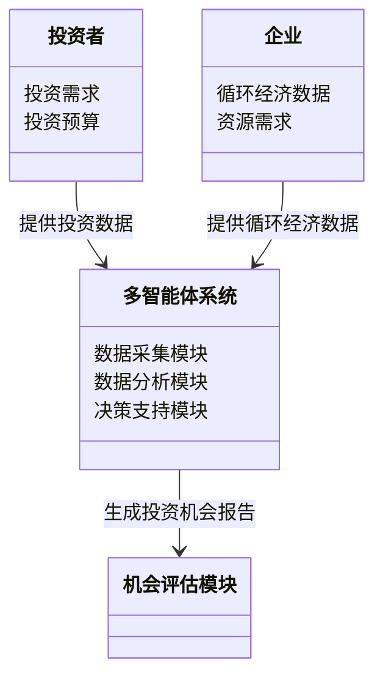
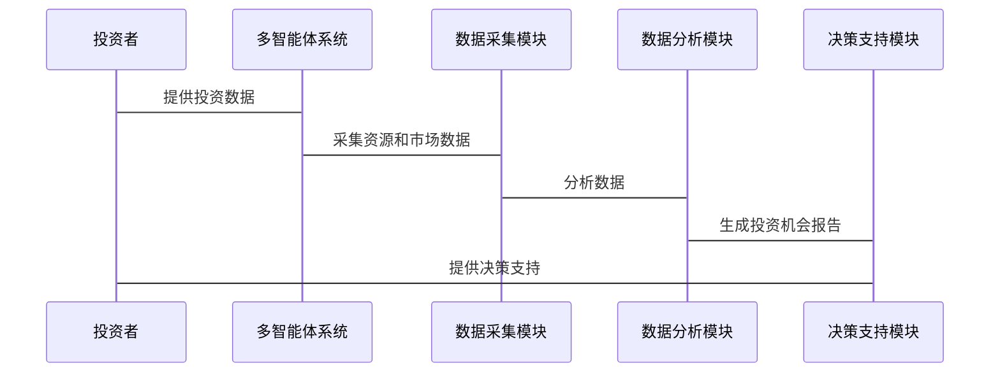

                 


# 多智能体系统在识别和评估循环经济投资机会中的作用

## 关键词：多智能体系统, 循环经济, 投资机会, 人工智能, 数据分析, 系统架构

## 摘要：  
多智能体系统在识别和评估循环经济投资机会中扮演着关键角色。通过分布式协作和数据驱动的方法，多智能体系统能够高效地分析循环经济中的复杂问题，优化资源配置，并为投资者提供精准的投资决策支持。本文将从背景、概念、算法、系统架构、项目实战等方面详细阐述多智能体系统在循环经济投资机会中的作用，为读者提供全面的理论与实践指导。

---

# 第一部分: 多智能体系统与循环经济的背景介绍

## 第1章: 多智能体系统与循环经济的背景介绍

### 1.1 多智能体系统的定义与特点
#### 1.1.1 多智能体系统的定义  
多智能体系统（Multi-Agent System, MAS）是由多个智能体（Agent）组成的分布式系统，这些智能体通过协作和通信共同完成复杂的任务。每个智能体都具有自主性、反应性和社会性。

#### 1.1.2 多智能体系统的核心特点  
- **自主性**：智能体能够独立决策和行动。  
- **反应性**：智能体能够感知环境并做出实时响应。  
- **协作性**：多个智能体通过通信和协作共同完成任务。  
- **分布式性**：智能体分布在不同的物理或虚拟位置，通过网络进行通信。

#### 1.1.3 多智能体系统与传统单智能体系统的区别  
传统单智能体系统依赖中心化控制，而多智能体系统通过去中心化的协作完成任务，具有更强的适应性和灵活性。

---

### 1.2 循环经济的基本概念
#### 1.2.1 循环经济的定义  
循环经济是一种以资源高效利用和循环再生为核心的发展模式，强调减少资源消耗和环境污染，通过闭环系统实现经济的可持续发展。

#### 1.2.2 循环经济的核心原则  
- **减量化**：减少资源的消耗。  
- **再利用**：延长产品的生命周期。  
- **再循环**：资源的回收和再生利用。

#### 1.2.3 循环经济与传统经济的区别  
传统经济基于“取-做-弃”的线性模式，而循环经济则通过“取-做-返”的闭环模式实现资源的高效利用。

---

### 1.3 多智能体系统在循环经济中的作用
#### 1.3.1 多智能体系统在循环经济中的应用场景  
- **资源优化配置**：通过多智能体系统协调资源的分配，减少浪费。  
- **废物管理**：智能体可以实时监控废物的产生和处理，优化废物再利用的流程。  
- **投资决策支持**：通过分析市场数据和资源分布，帮助投资者识别循环经济中的机会。

#### 1.3.2 多智能体系统如何优化循环经济的资源配置  
多智能体系统通过分布式协作，能够快速响应市场变化，优化资源的流动和利用，减少资源浪费。

#### 1.3.3 多智能体系统对循环经济投资机会的影响  
多智能体系统能够实时分析市场数据，发现潜在的投资机会，为投资者提供精准的决策支持。

---

### 1.4 本章小结  
本章介绍了多智能体系统的基本概念和特点，并详细阐述了循环经济的核心原则和应用场景。通过分析多智能体系统在循环经济中的作用，为后续章节的深入探讨奠定了基础。

---

# 第二部分: 多智能体系统的核心概念与联系

## 第2章: 多智能体系统的核心概念与联系

### 2.1 多智能体系统的组成与结构
#### 2.1.1 多智能体系统的组成要素  
- **智能体**：具有自主性和协作能力的个体。  
- **环境**：智能体所处的物理或虚拟环境。  
- **通信机制**：智能体之间的信息交换方式。  
- **任务目标**：智能体需要完成的具体任务。

#### 2.1.2 多智能体系统的层次结构  
- **物理层**：智能体的物理实现。  
- **逻辑层**：智能体的行为逻辑和规则。  
- **通信层**：智能体之间的信息交换。  
- **协作层**：智能体的协作任务和目标。

#### 2.1.3 多智能体系统的通信机制  
- **直接通信**：智能体之间直接交换信息。  
- **间接通信**：通过中间媒介进行信息传递。  
- **发布-订阅模型**：智能体发布信息，其他智能体订阅并接收信息。

---

### 2.2 多智能体系统与循环经济的关联
#### 2.2.1 多智能体系统在循环经济中的角色  
- **数据采集**：智能体可以实时采集资源、市场和环境数据。  
- **数据分析**：智能体通过协作分析数据，识别投资机会。  
- **决策支持**：智能体为投资者提供基于数据的决策支持。

#### 2.2.2 多智能体系统与循环经济的交互关系  
多智能体系统通过数据驱动的方式，与循环经济中的企业、资源和市场进行实时交互，优化资源配置。

#### 2.2.3 多智能体系统对循环经济投资机会的促进作用  
多智能体系统能够快速响应市场变化，发现潜在的投资机会，降低投资风险。

---

### 2.3 多智能体系统的属性特征对比
#### 2.3.1 层次性对比  
多智能体系统具有层次化的结构，而单智能体系统通常是扁平化的。

#### 2.3.2 分布式对比  
多智能体系统通过分布式协作完成任务，而单智能体系统依赖中心化控制。

#### 2.3.3 协作性对比  
多智能体系统的协作性更强，能够通过智能体之间的协作完成复杂任务。

---

### 2.4 ER实体关系图架构  
以下是多智能体系统与循环经济的ER实体关系图：  
```mermaid
er
actor(投资者) --> 多智能体系统: 提供投资数据
actor(企业) --> 多智能体系统: 提供循环经济数据
多智能体系统 --> 机会评估模块: 生成投资机会报告
```

---

# 第三部分: 多智能体系统的算法原理

## 第3章: 多智能体系统的算法原理

### 3.1 多智能体系统的协同算法
#### 3.1.1 分布式计算算法  
分布式计算算法通过将任务分解到多个智能体中，实现并行计算和协作。  
- **任务分解**：将问题分解为多个子任务，分配给不同的智能体。  
- **并行计算**：智能体同时处理子任务，提高计算效率。  
- **结果汇总**：智能体将计算结果汇总，得到最终的解决方案。

#### 3.1.2 协作式搜索算法  
协作式搜索算法通过多个智能体协作，寻找最优解。  
- **信息共享**：智能体之间共享搜索信息，避免重复计算。  
- **路径优化**：智能体通过协作找到最优路径，提高搜索效率。

#### 3.1.3 负载均衡算法  
负载均衡算法通过动态分配任务，确保智能体之间的负载均衡。  
- **负载监控**：实时监控每个智能体的负载情况。  
- **任务迁移**：将负载过高的任务迁移到负载较低的智能体。

---

### 3.2 多智能体系统的通信协议
#### 3.2.1 通信协议的定义  
通信协议是智能体之间信息交换的规则和格式。  
- **消息格式**：定义消息的结构和内容。  
- **通信方式**：规定智能体之间如何发送和接收消息。  
- **安全机制**：确保通信的安全性和可靠性。

#### 3.2.2 通信协议的实现  
通过定义消息的格式和通信的规则，智能体可以高效地进行信息交换。

#### 3.2.3 通信协议的优化  
通过优化通信协议，可以减少通信延迟，提高系统的整体性能。

---

### 3.3 多智能体系统的数学模型
#### 3.3.1 数学模型的构建  
多智能体系统的数学模型通常基于图论和优化理论。  
- **图模型**：将智能体和任务看作图中的节点和边。  
- **优化模型**：通过数学优化方法，找到最优的协作方案。

#### 3.3.2 数学模型的求解  
通过求解数学模型，可以得到智能体协作的最优策略。

#### 3.3.3 数学模型的应用  
数学模型可以用于预测系统的性能，优化智能体的协作策略。

---

### 3.4 算法实现的代码示例  
以下是多智能体系统协同算法的Python代码示例：  
```python
def multi_agent_communication(agent_list):
    for agent in agent_list:
        agent.receive_message()
        agent.process_message()
        agent.send_res
```

---

# 第四部分: 多智能体系统的系统架构设计

## 第4章: 多智能体系统的系统架构设计

### 4.1 系统功能设计
#### 4.1.1 领域模型设计  
以下是领域模型的类图：  


---

### 4.2 系统架构设计
以下是系统的架构图：  


---

### 4.3 系统接口设计
系统接口设计包括智能体之间的通信接口和与外部系统的接口。

#### 4.3.1 智能体之间的通信接口  
- **接收消息**：智能体接收其他智能体发送的消息。  
- **发送消息**：智能体向其他智能体发送消息。  
- **处理消息**：智能体根据接收到的消息进行相应的处理。

#### 4.3.2 与外部系统的接口  
- **数据接口**：与企业、投资者等外部系统进行数据交互。  
- **控制接口**：接收外部系统的控制指令。

---

### 4.4 系统交互设计
以下是系统的交互图：  


---

# 第五部分: 多智能体系统的项目实战

## 第5章: 多智能体系统的项目实战

### 5.1 项目背景与介绍
#### 5.1.1 项目背景  
本项目旨在利用多智能体系统优化循环经济中的投资决策，通过数据驱动的方式识别潜在的投资机会。

#### 5.1.2 项目目标  
- 实现多智能体系统的数据采集和分析功能。  
- 提供基于多智能体系统的投资机会评估模块。  
- 为投资者提供精准的决策支持。

---

### 5.2 项目核心实现
#### 5.2.1 环境安装  
- **Python环境**：安装Python 3.8及以上版本。  
- **依赖库**：安装`numpy`, `pandas`, `scikit-learn`等库。  
- **开发工具**：使用Jupyter Notebook或PyCharm进行开发。

#### 5.2.2 系统核心实现  
以下是多智能体系统的核心代码：  
```python
class Agent:
    def __init__(self, id):
        self.id = id
        self.data = None

    def receive_message(self, message):
        self.data = message

    def process_message(self):
        # 数据处理逻辑
        pass

    def send_response(self):
        # 发送响应
        pass

def multi_agent_communication(agent_list):
    for agent in agent_list:
        agent.receive_message(agent.data)
        agent.process_message()
        agent.send_response()
```

---

### 5.3 项目小结  
通过本项目的实现，展示了多智能体系统在循环经济投资机会识别中的应用，验证了多智能体系统的有效性和优势。

---

# 第六部分: 多智能体系统的最佳实践与小结

## 第6章: 多智能体系统的最佳实践与小结

### 6.1 最佳实践
#### 6.1.1 系统设计  
- 确保系统的可扩展性和灵活性。  
- 合理设计智能体的通信机制。  
- 定期优化系统的算法和架构。

#### 6.1.2 数据管理  
- 确保数据的准确性和实时性。  
- 合理设计数据存储和处理机制。  
- 加强数据安全和隐私保护。

#### 6.1.3 系统维护  
- 定期监控系统的运行状态。  
- 及时修复系统中的漏洞和错误。  
- 持续优化系统的性能。

---

### 6.2 小结  
本文详细阐述了多智能体系统在识别和评估循环经济投资机会中的作用，从背景、概念、算法、系统架构到项目实战，全面探讨了多智能体系统的应用和实现。通过本文的学习，读者可以深入了解多智能体系统在循环经济中的应用价值，并能够在实际项目中灵活运用。

---

### 6.3 注意事项  
- 在实际应用中，需结合具体的业务需求进行系统设计。  
- 确保系统的安全性和稳定性。  
- 加强与行业专家的合作，确保系统的实用性和可操作性。

---

### 6.4 拓展阅读  
- 推荐阅读相关领域的书籍和论文，深入了解多智能体系统和循环经济的理论与实践。  
- 关注最新的技术动态，掌握多智能体系统在其他领域的应用案例。

---

## 作者：AI天才研究院/AI Genius Institute & 禅与计算机程序设计艺术/Zen And The Art of Computer Programming

