                 


```markdown
# 多智能体系统在识别和评估新兴行业投资机会中的作用

## 关键词：多智能体系统，新兴行业，投资机会，风险评估，协作学习，分布式计算

## 摘要：  
随着新兴行业的迅速崛起和投资市场的日益复杂化，传统的投资分析方法已经难以应对快速变化的市场环境。多智能体系统（Multi-Agent Systems, MAS）作为一种新兴的技术手段，凭借其分布式计算、协作学习和自主决策的特点，正在成为识别和评估新兴行业投资机会的重要工具。本文将深入探讨多智能体系统在新兴行业投资机会识别与评估中的作用，结合实际案例，分析其优势与挑战，并提出优化建议。通过对多智能体系统的核心概念、算法原理、系统架构以及实际应用的详细阐述，本文旨在为投资决策提供一种高效、智能的解决方案。

---

# 第1章: 多智能体系统与新兴行业投资机会概述

## 1.1 多智能体系统的定义与特点

### 1.1.1 多智能体系统的定义  
多智能体系统（Multi-Agent Systems, MAS）是由多个相互作用的智能体组成的分布式系统，这些智能体能够通过协作完成复杂任务。智能体（Agent）是指具备感知环境、自主决策和执行任务能力的实体，可以是软件程序、机器人或其他智能设备。

### 1.1.2 多智能体系统的组成与特点  
多智能体系统的核心要素包括：  
1. **智能体**：具备感知、决策、执行能力的主体。  
2. **环境**：智能体所处的外部环境，包括物理环境和信息环境。  
3. **交互**：智能体之间的通信与协作机制。  
4. **任务**：智能体需要完成的具体目标或问题。  

其特点包括：  
- **分布性**：多个智能体独立运行，协同完成任务。  
- **协作性**：智能体之间通过通信和协作提升整体效率。  
- **自主性**：智能体能够自主决策，无需外部干预。  
- **动态性**：系统环境和任务目标可能动态变化。  

### 1.1.3 多智能体系统与传统单智能体系统的区别  
传统单智能体系统依赖中心化的计算和决策，而多智能体系统通过分布式计算和协作学习，能够更好地应对复杂、动态的环境。多智能体系统的优势在于能够利用多个智能体的协同能力，提升整体系统的灵活性和鲁棒性。

---

## 1.2 新兴行业投资机会的定义与特点

### 1.2.1 新兴行业的定义  
新兴行业是指在短时间内迅速崛起，具有高增长潜力的产业，例如人工智能、区块链、新能源等领域。新兴行业的核心特征包括技术创新、市场潜力大、竞争格局尚未稳定等。

### 1.2.2 新兴行业投资机会的核心要素  
1. **市场需求**：行业的增长潜力和市场规模。  
2. **技术壁垒**：行业的技术门槛和创新能力。  
3. **竞争格局**：行业内的竞争状况和潜在进入者的威胁。  
4. **政策支持**：政府对行业的政策支持力度。  

### 1.2.3 新兴行业投资机会的评估维度  
1. **行业生命周期**：行业所处的发展阶段（导入期、成长期、成熟期、衰退期）。  
2. **市场风险**：行业的波动性和不确定性。  
3. **财务表现**：行业的盈利能力和发展潜力。  
4. **技术可行性**：技术的成熟度和应用前景。  

---

## 1.3 多智能体系统在新兴行业投资中的作用

### 1.3.1 多智能体系统在投资决策中的优势  
多智能体系统能够通过分布式计算和协作学习，快速分析大量数据，识别潜在的投资机会。其优势包括：  
- **高效性**：多智能体系统能够并行处理大量数据，提升分析效率。  
- **准确性**：通过多个智能体的协作，能够更全面地评估市场风险和机会。  
- **适应性**：系统能够根据市场变化动态调整投资策略。  

### 1.3.2 多智能体系统如何提升投资机会识别效率  
1. **数据采集与分析**：智能体通过分布式计算，快速收集和分析行业数据。  
2. **模式识别**：通过协作学习，识别新兴行业的潜在趋势和机会。  
3. **决策支持**：基于分析结果，智能体为投资决策提供支持。  

### 1.3.3 多智能体系统在风险评估中的应用  
1. **风险识别**：智能体通过分析市场数据，识别潜在风险因素。  
2. **风险量化**：利用博弈论模型，评估风险对投资决策的影响。  
3. **风险管理**：通过动态调整投资组合，降低整体风险。  

---

## 1.4 本章小结  
本章介绍了多智能体系统的基本概念和特点，并分析了其在新兴行业投资中的作用。通过分布式计算和协作学习，多智能体系统能够高效识别投资机会，优化投资组合，并降低市场风险。这些优势使其成为新兴行业投资决策的重要工具。

---

# 第2章: 多智能体系统的核心概念与原理

## 2.1 多智能体系统的体系结构

### 2.1.1 分布式计算模型  
分布式计算模型是多智能体系统的核心架构，通过将任务分解为多个子任务，分配给不同的智能体完成。其优点在于能够充分利用计算资源，提升系统效率。  

**分布式计算模型的流程图：**  
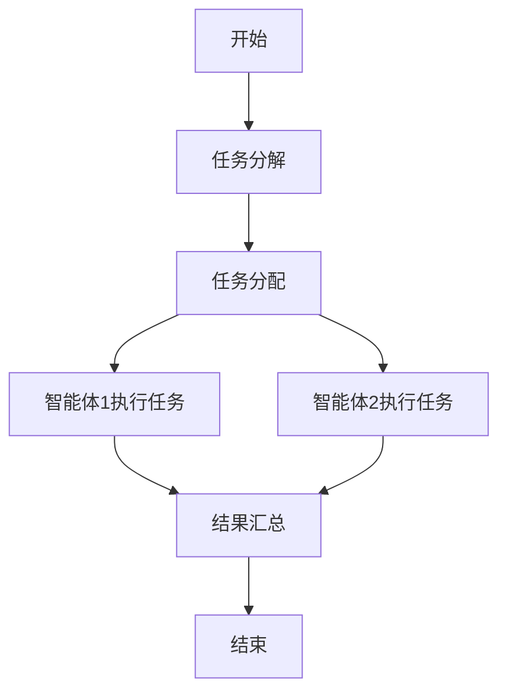

### 2.1.2 协作与通信机制  
协作与通信机制是多智能体系统的重要组成部分，智能体之间通过通信模块交换信息，完成协作任务。  

**协作与通信机制的流程图：**  
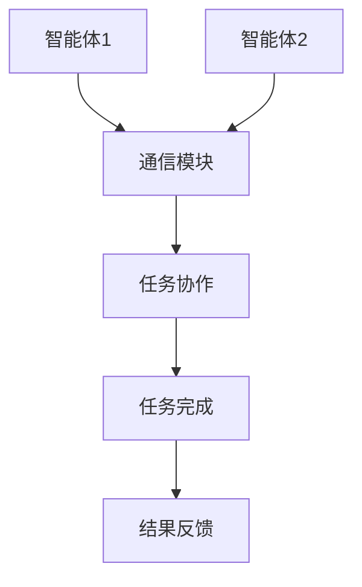

### 2.1.3 任务分配与协调  
任务分配与协调是多智能体系统的关键步骤，通过任务分配算法，将任务合理分配给不同的智能体，并通过协调机制确保任务顺利完成。  

**任务分配与协调的流程图：**  
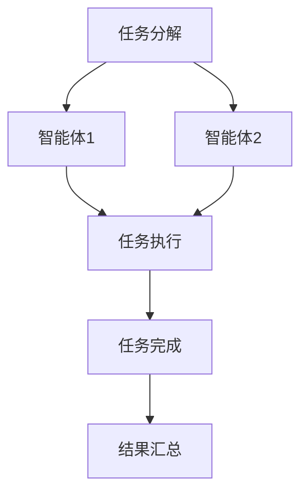

---

## 2.2 多智能体系统的算法原理

### 2.2.1 分布式计算算法  
分布式计算算法通过将任务分解为多个子任务，并行计算，提升计算效率。  

**分布式计算算法的流程图：**  
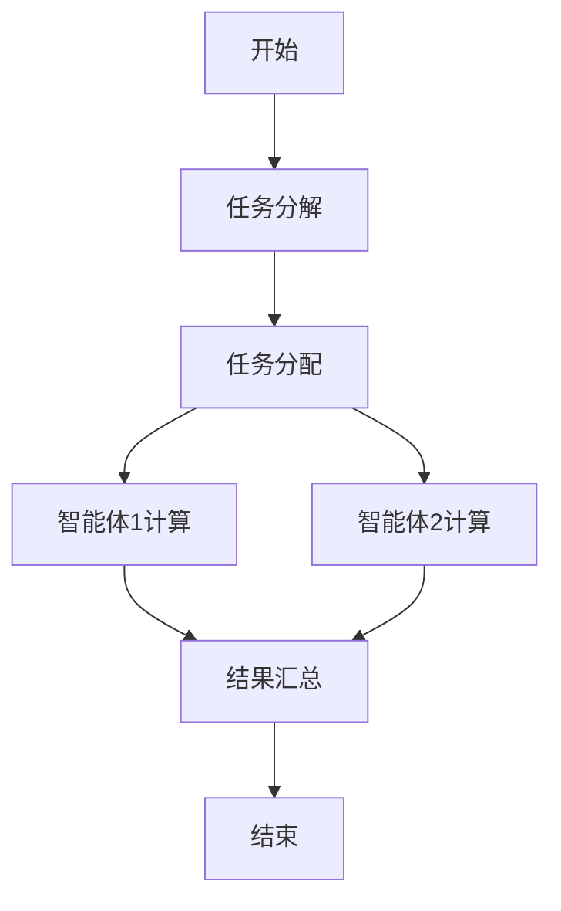

### 2.2.2 协作学习算法  
协作学习算法通过智能体之间的协作，共同优化学习模型。  

**协作学习算法的流程图：**  
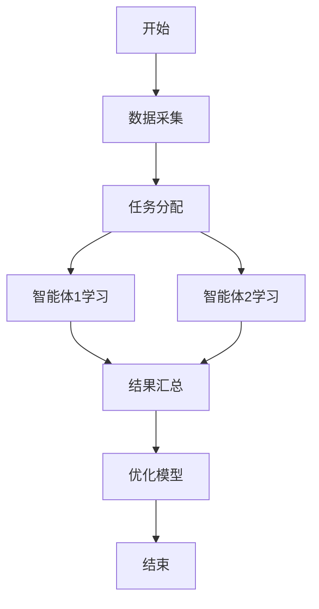

### 2.2.3 多智能体系统中的博弈论模型  
博弈论模型用于分析智能体之间的竞争与合作关系，帮助系统做出最优决策。  

**博弈论模型的流程图：**  
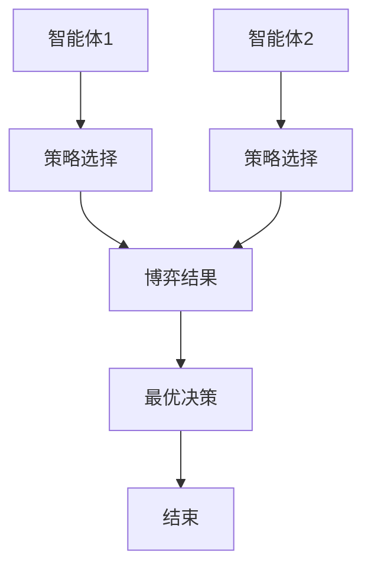

---

## 2.3 多智能体系统的数学模型

### 2.3.1 多智能体系统的基本数学模型  
多智能体系统的整体行为可以通过以下数学模型描述：  
$$ f(t) = \sum_{i=1}^{n} f_i(t) $$  
其中，\( f(t) \) 表示系统整体的行为，\( f_i(t) \) 表示第 \( i \) 个智能体的行为。

### 2.3.2 协作学习的数学公式  
协作学习的目标是最小化全局损失函数：  
$$ \min_{\theta} \sum_{i=1}^{n} L_i(\theta) $$  
其中，\( L_i(\theta) \) 表示第 \( i \) 个智能体的损失函数，\( \theta \) 表示模型参数。

### 2.3.3 分布式计算的数学模型  
分布式计算的任务分配可以通过以下公式实现：  
$$ t_j = \argmin_{j} \sum_{i=1}^{n} t_i $$  
其中，\( t_j \) 表示分配给第 \( j \) 个智能体的任务，\( t_i \) 表示第 \( i \) 个任务的处理时间。

---

## 2.4 本章小结  
本章详细介绍了多智能体系统的体系结构和算法原理，包括分布式计算模型、协作与通信机制、任务分配与协调，以及相关的数学模型。这些内容为后续章节的应用提供了理论基础。

---

# 第3章: 多智能体系统在新兴行业投资中的应用场景

## 3.1 新兴行业识别与分析

### 3.1.1 数据采集与分析  
通过多智能体系统，智能体可以从多个数据源采集行业数据，并进行初步分析。  

**数据采集与分析的流程图：**  
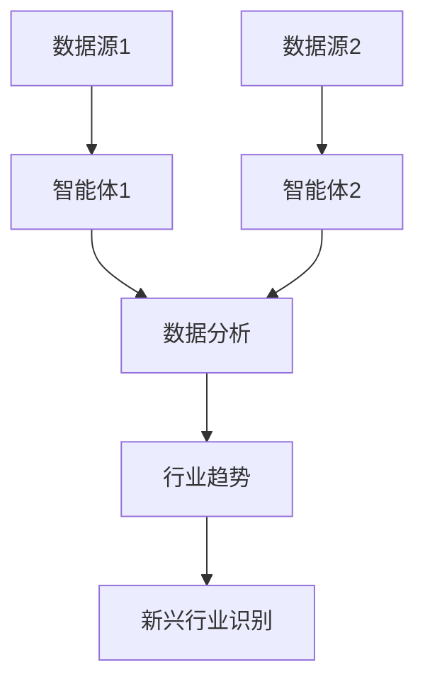

### 3.1.2 行业趋势预测  
利用协作学习算法，智能体可以预测行业的发展趋势，并识别潜在的投资机会。  

**行业趋势预测的流程图：**  
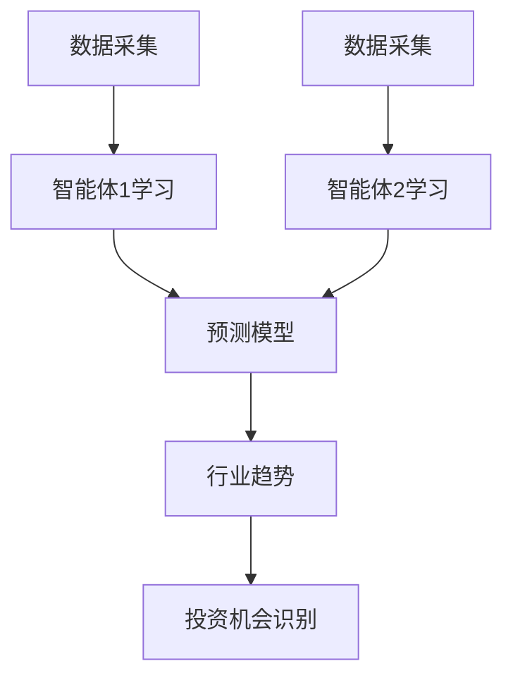

### 3.1.3 投资机会识别  
通过分析行业趋势和市场数据，智能体可以识别出具有高增长潜力的新兴行业。  

**投资机会识别的流程图：**  
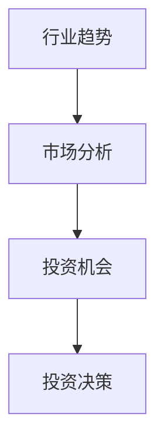

---

## 3.2 投资风险评估与管理

### 3.2.1 风险识别与量化  
通过博弈论模型，智能体可以识别潜在风险，并量化其对投资决策的影响。  

**风险识别与量化的流程图：**  
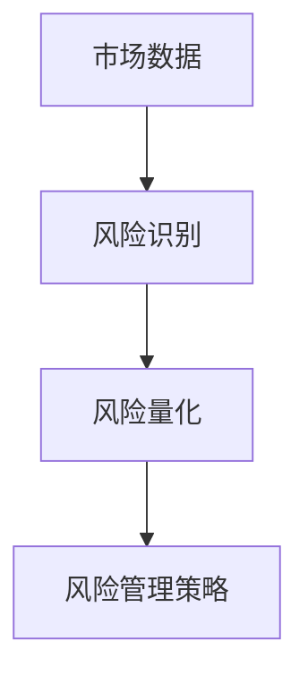

### 3.2.2 风险评估模型  
多智能体系统的风险评估模型可以通过以下公式实现：  
$$ R = \sum_{i=1}^{n} r_i $$  
其中，\( R \) 表示整体风险，\( r_i \) 表示第 \( i \) 个风险因素的权重。

### 3.2.3 风险管理策略  
通过动态调整投资组合，智能体可以有效降低投资风险。  

**风险管理策略的流程图：**  
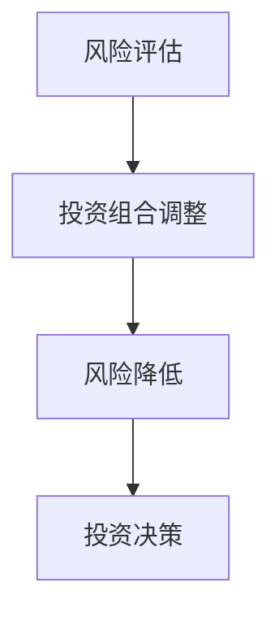

---

## 3.3 投资组合优化

### 3.3.1 投资组合构建  
通过协作学习算法，智能体可以构建最优的投资组合，最大化投资回报。  

**投资组合构建的流程图：**  
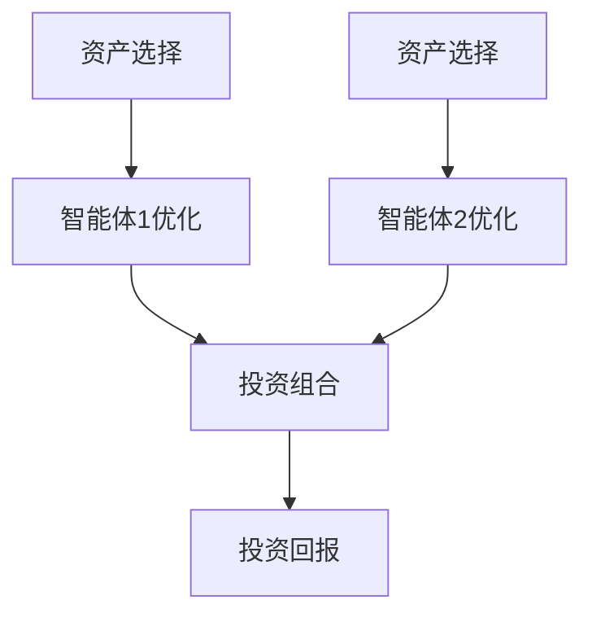

### 3.3.2 投资组合优化  
多智能体系统的投资组合优化可以通过以下公式实现：  
$$ \max_{w} \sum_{i=1}^{n} w_i r_i - \lambda \sum_{i=1}^{n} w_i^2 $$  
其中，\( w \) 表示投资权重，\( r_i \) 表示第 \( i \) 个资产的回报率，\( \lambda \) 表示风险惩罚系数。

### 3.3.3 优化结果的评估与调整  
通过持续监控市场变化，智能体可以动态调整投资组合，确保其最优性。  

**优化结果的评估与调整的流程图：**  
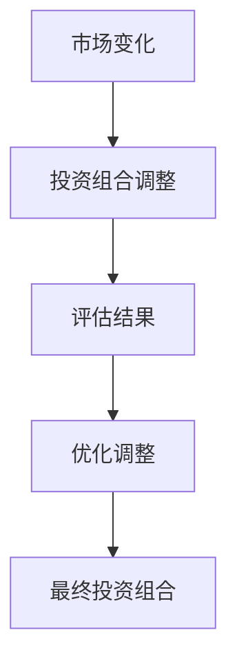

---

## 3.4 本章小结  
本章详细探讨了多智能体系统在新兴行业投资中的应用场景，包括新兴行业识别与分析、投资风险评估与管理、投资组合优化等。通过多智能体系统的协作与分布式计算，能够有效提升投资决策的效率和准确性。

---

# 第4章: 多智能体系统的算法实现与优化

## 4.1 分布式计算算法

### 4.1.1 分布式计算的基本原理  
分布式计算通过将任务分解为多个子任务，并行处理，提升计算效率。  

**分布式计算算法的流程图：**  


### 4.1.2 分布式计算的实现步骤  
1. **任务分解**：将整体任务分解为多个子任务。  
2. **任务分配**：将子任务分配给不同的智能体。  
3. **任务执行**：智能体并行执行分配的任务。  
4. **结果汇总**：汇总各智能体的结果，形成最终结果。  

### 4.1.3 分布式计算的优化方法  
- **负载均衡**：合理分配任务，避免资源浪费。  
- **通信优化**：减少智能体之间的通信开销。  
- **容错机制**：提高系统的鲁棒性。  

---

## 4.2 协作学习算法

### 4.2.1 协作学习的基本原理  
协作学习通过智能体之间的协作，共同优化学习模型。  

**协作学习算法的流程图：**  


### 4.2.2 协作学习的实现步骤  
1. **数据采集**：从多个数据源采集数据。  
2. **任务分配**：将数据分配给不同的智能体。  
3. **学习执行**：智能体分别进行学习任务。  
4. **结果汇总**：汇总各智能体的学习结果，优化整体模型。  

### 4.2.3 协作学习的优化方法  
- **通信效率**：减少智能体之间的通信次数。  
- **模型同步**：确保各智能体模型的一致性。  
- **分布式优化**：通过分布式计算优化学习过程。  

---

## 4.3 多智能体系统中的博弈论模型

### 4.3.1 博弈论的基本原理  
博弈论通过分析智能体之间的策略选择，帮助系统做出最优决策。  

**博弈论模型的流程图：**  


### 4.3.2 博弈论在多智能体系统中的应用  
1. **竞争分析**：分析智能体之间的竞争关系。  
2. **合作机制**：制定智能体之间的合作策略。  
3. **决策优化**：通过博弈论模型优化投资决策。  

### 4.3.3 博弈论模型的优化与调整  
- **策略调整**：根据市场变化动态调整智能体的策略。  
- **收益最大化**：通过博弈论模型实现投资收益最大化。  

---

## 4.4 本章小结  
本章详细介绍了多智能体系统的算法实现与优化，包括分布式计算算法、协作学习算法和博弈论模型的应用。通过优化算法，可以进一步提升多智能体系统的效率和准确性。

---

# 第5章: 多智能体系统的系统架构设计

## 5.1 系统架构概述

### 5.1.1 系统架构的组成  
多智能体系统的架构包括：  
1. **智能体层**：负责数据采集、分析和决策。  
2. **通信层**：负责智能体之间的通信与协作。  
3. **数据层**：负责数据的存储与管理。  
4. **用户层**：负责用户交互与结果展示。  

### 5.1.2 系统架构的设计原则  
1. **模块化设计**：各模块独立开发，便于维护和扩展。  
2. **可扩展性**：系统架构应具备良好的扩展性。  
3. **可维护性**：系统架构应便于维护和升级。  

### 5.1.3 系统架构的实现步骤  
1. **需求分析**：明确系统功能需求。  
2. **模块划分**：将系统划分为多个功能模块。  
3. **接口设计**：设计模块之间的接口。  
4. **系统集成**：将各模块集成到整体系统中。  

---

## 5.2 系统功能设计

### 5.2.1 数据采集与处理  
系统通过智能体采集行业数据，并进行初步处理。  

**数据采集与处理的流程图：**  
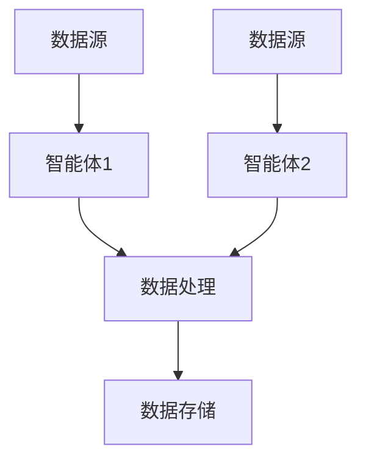

### 5.2.2 投资机会识别与评估  
通过协作学习算法，系统能够识别投资机会并评估其可行性。  

**投资机会识别与评估的流程图：**  
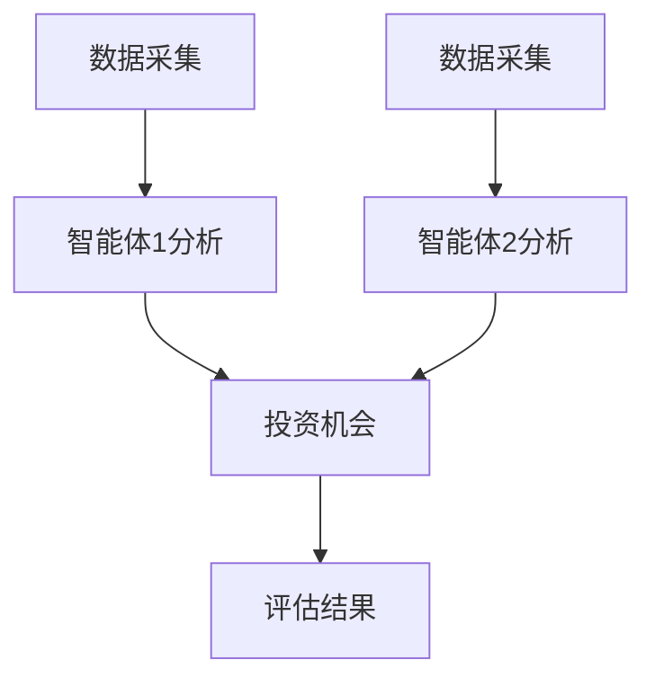

### 5.2.3 投资组合优化与管理  
通过博弈论模型，系统能够优化投资组合，并动态调整投资策略。  

**投资组合优化与管理的流程图：**  


---

## 5.3 系统接口设计

### 5.3.1 系统内部接口设计  
系统内部接口包括智能体之间的通信接口和数据存储接口。  

**系统内部接口的流程图：**  
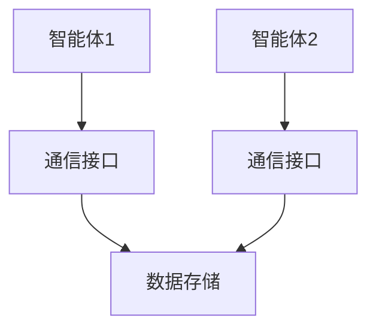

### 5.3.2 系统外部接口设计  
系统外部接口包括用户交互接口和第三方数据接口。  

**系统外部接口的流程图：**  
```mermaid
graph TD
    A[用户输入] --> B[用户交互接口]
    C[第三方数据源] --> D[数据接口]
    B --> E[系统处理]
    D --> E
```

---

## 5.4 本章小结  
本章详细介绍了多智能体系统的系统架构设计，包括架构组成、功能设计和接口设计。通过合理的架构设计，可以确保系统的高效性和可维护性。

---

# 小结与展望

## 5.1 小结  
本文详细探讨了多智能体系统在新兴行业投资机会识别与评估中的作用，分析了其核心概念、算法原理和系统架构。通过多智能体系统的协作与分布式计算，能够有效提升投资决策的效率和准确性。

## 5.2 展望  
未来，随着人工智能技术的不断发展，多智能体系统在投资领域中的应用将更加广泛。通过进一步优化算法和系统架构，多智能体系统将能够更好地应对复杂、动态的市场环境，为投资决策提供更加智能化、个性化的解决方案。

---

# 参考文献  
（此处列出相关文献和参考资料）

---

# 作者：AI天才研究院/AI Genius Institute & 禅与计算机程序设计艺术 /Zen And The Art of Computer Programming
```

