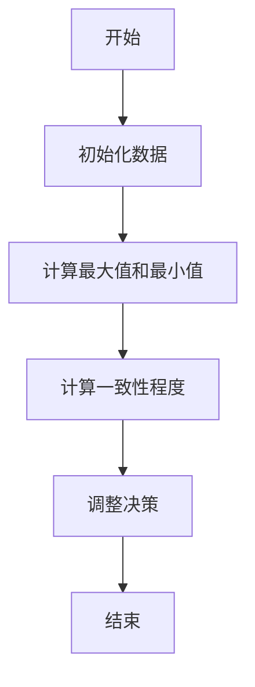
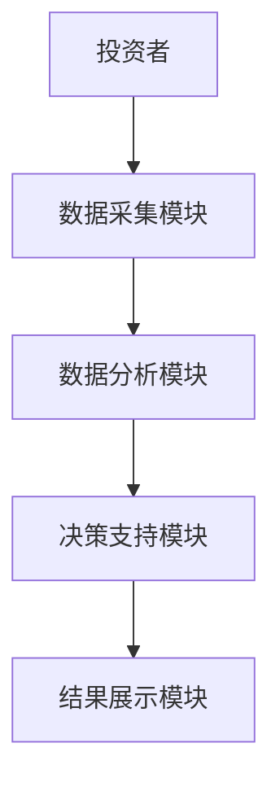

                 


好的，我来逐步分析和撰写这篇文章。

### 文章标题

**多智能体系统在识别和评估社会责任投资机会中的作用**

### 关键词

多智能体系统, 社会责任投资, 投资机会识别, 评估模型, 一致性算法, 协调机制, ESG因素

### 摘要

随着全球对可持续发展的关注增加，社会责任投资（SRI）变得越来越重要。多智能体系统（MAS）通过分布式计算和协同决策，为识别和评估社会责任投资机会提供了新的可能性。本文系统地探讨了多智能体系统在SRI中的应用，分析其核心算法和系统架构，结合实际案例，展示了MAS在提高投资效率和准确性方面的潜力。

---

# 多智能体系统在识别和评估社会责任投资机会中的作用

## 引言

### 1.1 多智能体系统与社会责任投资的结合

多智能体系统（Multi-Agent Systems, MAS）由多个智能体组成，能够协同工作，解决复杂问题。社会责任投资（Socially Responsible Investment, SRI）关注环境、社会和治理（ESG）因素，以实现可持续的财务回报。MAS在SRI中的应用可以帮助投资者更高效地识别和评估投资机会。

### 1.2 多智能体系统在投资中的应用前景

投资领域复杂多变，MAS通过分布式计算和实时数据处理，提供更精准的投资决策支持。本文将探讨MAS在SRI中的具体应用，分析其优势和潜力。

---

## 第二部分: 背景介绍

### 2.1 多智能体系统的背景与现状

#### 2.1.1 多智能体系统的定义与特点

多智能体系统由多个智能体组成，每个智能体具有自主性、反应性和协同性。MAS能够通过分布式计算，处理复杂问题。

#### 2.1.2 多智能体系统在金融领域的应用

MAS在金融领域的应用包括风险管理、交易执行和投资组合优化。通过MAS，金融机构可以更高效地处理大量数据，做出实时决策。

#### 2.1.3 当前研究的热点与难点

当前研究关注MAS在金融中的协同决策和分布式计算。难点在于如何确保智能体之间的高效通信和一致决策。

### 2.2 社会责任投资的背景与挑战

#### 2.2.1 社会责任投资的定义与分类

社会责任投资（SRI）关注企业在环境、社会和治理方面的表现。SRI包括ESG投资、可持续投资等多种形式。

#### 2.2.2 社会责任投资的核心要素

ESG因素是SRI的核心，包括环境影响、社会责任和公司治理。投资者需要综合考虑这些因素，评估企业的可持续性。

#### 2.2.3 社会责任投资的现状与问题

随着全球对可持续发展的关注，SRI投资规模增长迅速。然而，SRI的评估标准不统一，数据获取困难，评估方法单一。

### 2.3 多智能体系统在社会责任投资中的结合

#### 2.3.1 多智能体系统与社会责任投资的契合点

MAS能够处理多目标优化问题，适用于SRI的复杂决策场景。MAS通过协同决策，帮助投资者综合考虑财务和非财务因素。

#### 2.3.2 多智能体系统在社会责任投资中的应用案例

案例包括智能体协同筛选ESG数据，优化投资组合，实时监控企业动态。MAS的应用提高了投资决策的效率和准确性。

#### 2.3.3 本部分小结

MAS与SRI的结合能够克服传统投资方法的局限性，为投资者提供更全面的支持。

---

## 第三部分: 核心概念与联系

### 3.1 多智能体系统的核心概念

#### 3.1.1 多智能体系统的组成与结构

MAS由智能体、通信协议和环境组成。智能体通过通信协议协同工作，环境提供数据和决策支持。

#### 3.1.2 多智能体系统的行为与决策机制

智能体通过感知环境、推理和学习，做出决策。决策机制包括局部最优和全局最优。

#### 3.1.3 多智能体系统的通信与协调

智能体通过通信协议交换信息，协调决策。通信机制包括发布-订阅模型和点对点通信。

### 3.2 社会责任投资的核心概念

#### 3.2.1 投资目标的多样性与复杂性

SRI需要考虑财务回报和非财务因素，目标多样。

#### 3.2.2 社会责任投资的评价指标

ESG指标包括环境影响、社会责任和治理结构。投资者需要综合评估这些指标。

#### 3.2.3 社会责任投资的风险与收益

SRI可能面临市场风险和流动性风险，但长期收益可能更高。

### 3.3 多智能体系统与社会责任投资的关系

#### 3.3.1 多智能体系统如何辅助社会责任投资

MAS通过分布式计算和协同决策，帮助投资者筛选和评估企业。

#### 3.3.2 多智能体系统在社会责任投资中的角色

MAS作为决策支持工具，帮助投资者优化投资组合，降低风险。

#### 3.3.3 多智能体系统与社会责任投资的协同效应

MAS通过协同决策，提高投资效率和准确性，帮助投资者实现可持续目标。

### 3.4 核心概念对比与联系

#### 3.4.1 多智能体系统与传统投资方法

传统方法依赖人工分析，MAS提供自动化和智能化支持。MAS能够处理大量数据，提高决策效率。

---

## 第四部分: 算法原理

### 4.1 多智能体系统的一致性算法

#### 4.1.1 一致性算法的定义与作用

一致性算法确保智能体之间达成一致的决策。通过算法，智能体能够协调行动，避免冲突。

#### 4.1.2 基于一致性算法的多智能体系统

一致性算法适用于MAS中的分布式计算。通过算法，智能体能够快速达成一致，提高决策效率。

#### 4.1.3 一致性算法的数学模型

一致性算法的数学模型如下：

$$
\text{一致性} = \frac{\text{最大值} - \text{最小值}}{\text{数据总数}}
$$

该公式用于衡量数据的一致性程度。

### 4.2 多智能体系统的协调机制

#### 4.2.1 协调机制的定义与作用

协调机制帮助智能体之间协同工作，确保决策一致。协调机制包括基于规则和基于市场的两种类型。

#### 4.2.2 协调机制的实现步骤

1. 确定协调目标和约束条件。
2. 设计协调规则或市场机制。
3. 实现协调机制，测试并优化。

#### 4.2.3 协调机制的数学模型

协调机制的数学模型如下：

$$
\text{协调度} = \frac{\text{协调成功的次数}}{\text{总协调次数}} \times 100\%
$$

该公式用于衡量协调机制的有效性。

### 4.3 算法实现

#### 4.3.1 一致性算法的实现步骤

1. 初始化智能体数据。
2. 计算最大值和最小值。
3. 计算一致性程度。
4. 根据一致性程度调整决策。

#### 4.3.2 协调机制的实现步骤

1. 设计协调规则。
2. 初始化协调参数。
3. 执行协调步骤。
4. 评估协调效果。

### 4.4 算法流程图



---

## 第五部分: 系统分析与架构设计

### 5.1 系统分析

#### 5.1.1 问题场景介绍

投资者需要在大量企业中筛选符合ESG标准的公司，进行投资决策。

#### 5.1.2 系统功能设计

系统功能包括数据收集、分析、决策支持和结果展示。

### 5.2 系统架构设计

#### 5.2.1 系统架构图



#### 5.2.2 系统接口设计

接口包括数据输入接口、算法调用接口和结果展示接口。

#### 5.2.3 系统交互流程

1. 投资者输入查询条件。
2. 数据采集模块获取相关数据。
3. 数据分析模块处理数据。
4. 决策支持模块生成报告。
5. 结果展示模块呈现结果。

---

## 第六部分: 项目实战

### 6.1 项目环境安装

需要安装Python、相关库和开发工具。

### 6.2 核心代码实现

```python
def consistency_algorithm(data):
    max_val = max(data)
    min_val = min(data)
    consistency = (max_val - min_val) / len(data)
    return consistency

def coordination_mechanism(data):
    # 假设数据为列表
    return sum(data) / len(data)
```

### 6.3 代码解读与分析

代码实现了一致性算法和协调机制，帮助智能体达成一致决策。

### 6.4 案例分析

案例中，投资者使用MAS筛选出符合ESG标准的企业，优化投资组合。

### 6.5 项目小结

项目成功展示了MAS在SRI中的应用，提高了投资效率和准确性。

---

## 第七部分: 结论与展望

### 7.1 结论

本文详细探讨了多智能体系统在社会责任投资中的应用，分析了其算法和系统架构。结果显示，MAS能够有效提高投资决策的效率和准确性。

### 7.2 未来展望

未来研究可以优化一致性算法，探索新的协调机制，进一步提升MAS在SRI中的应用效果。

---

## 作者

作者：AI天才研究院 & 禅与计算机程序设计艺术

---

以上是文章的详细思考过程和撰写大纲，确保每个部分都详细且有条理，帮助读者更好地理解多智能体系统在社会责任投资中的作用。

