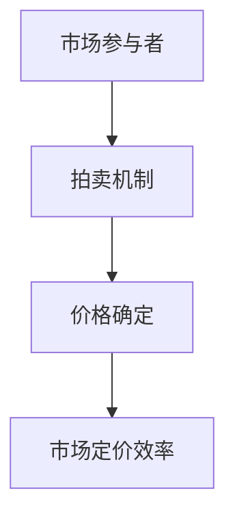
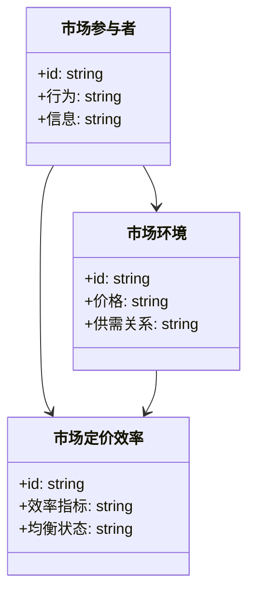
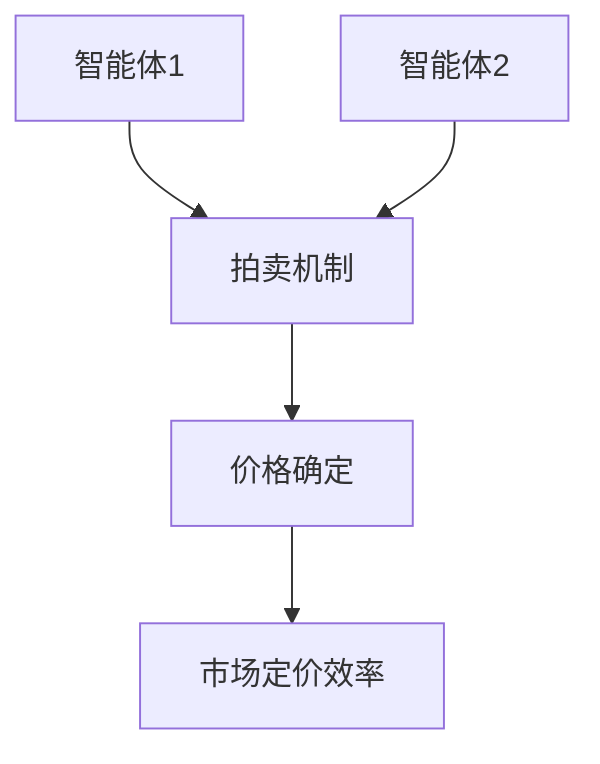

                 


```markdown
# {{《多智能体系统在识别市场定价效率中的应用》}}

> 关键词：多智能体系统，市场定价效率，定价算法，博弈论，拍卖机制，智能体交互

> 摘要：本文探讨了多智能体系统在识别市场定价效率中的应用，通过分析多智能体系统的结构与市场定价效率的关系，提出了一种基于多智能体系统的定价模型。该模型通过智能体之间的协同与竞争，优化市场定价效率，提升市场资源分配的合理性。本文结合实际案例，详细分析了多智能体系统在定价中的应用流程，并展望了未来的研究方向。

---

# 第一部分: 多智能体系统与市场定价效率基础

## 第1章: 多智能体系统概述

### 1.1 多智能体系统的基本概念
#### 1.1.1 多智能体系统的定义
多智能体系统（Multi-Agent Systems, MAS）是由多个智能体（Agent）组成的分布式系统，这些智能体能够自主决策、协同工作，并通过交互完成复杂的任务。每个智能体都有自己的目标、知识和行为规则，能够感知环境并采取行动。

#### 1.1.2 多智能体系统的特征
| 特征 | 描述 |
|------|------|
| 分布式 | 智能体独立存在，通过通信协作完成任务 |
| 自主性 | 智能体能够自主决策，无需外部干预 |
| 社会性 | 智能体之间通过交互形成社会关系，实现协同 |
| 反应性 | 智能体能够感知环境变化并做出实时反应 |

#### 1.1.3 多智能体系统与单智能体系统的区别
单智能体系统依赖中央控制单元，而多智能体系统通过去中心化的方式实现任务目标。多智能体系统的复杂性更高，但能够更好地适应动态环境和复杂任务。

### 1.2 市场定价效率的基本概念
#### 1.2.1 市场定价效率的定义
市场定价效率是指市场中价格形成的速度、准确性和公平性。高效的定价机制能够快速反映市场供需变化，确保资源的合理分配。

#### 1.2.2 市场定价效率的衡量指标
| 指标 | 描述 |
|------|------|
| 价格收敛性 | 价格是否能够快速收敛到均衡值 |
| 市场透明度 | 信息是否对称，交易是否透明 |
| 成交效率 | 买卖双方能否快速达成交易 |

#### 1.2.3 市场定价效率与市场结构的关系
市场结构（如完全竞争、垄断等）直接影响定价效率。多智能体系统通过模拟市场参与者的交互，优化市场结构，提升定价效率。

## 第2章: 多智能体系统在市场定价中的应用背景

### 2.1 市场定价中的问题与挑战
#### 2.1.1 传统定价方法的局限性
传统定价方法依赖中心化机构（如交易所），存在信息滞后、效率低下等问题，难以适应快速变化的市场环境。

#### 2.1.2 市场动态变化对定价的影响
市场价格受供需变化、信息不对称、参与者行为等多种因素影响，传统的定价模型难以实时捕捉这些变化。

#### 2.1.3 多智能体系统在定价中的潜在优势
多智能体系统能够模拟市场参与者的实时行为，通过分布式计算快速调整价格，实现动态定价。

### 2.2 多智能体系统与市场定价效率的结合
#### 2.2.1 多智能体系统在定价中的应用场景
| 场景 | 描述 |
|------|------|
| 实时定价 | 智能体实时感知市场信息，动态调整价格 |
| 竞价机制 | 智能体通过拍卖机制确定最优价格 |
| 资源分配 | 智能体协同优化资源分配，提升定价效率 |

#### 2.2.2 多智能体系统如何提升定价效率
通过模拟市场参与者的交互行为，多智能体系统能够快速响应市场变化，实现价格的动态优化。

#### 2.2.3 多智能体系统在市场定价中的边界与外延
多智能体系统适用于复杂市场环境下的定价问题，但需考虑计算资源限制和信息传递延迟等问题。

### 2.3 实体关系图
```mermaid
erDiagram
    actor 市场参与者 {
        +id: string
        +行为: string
        +信息: string
    }
    actor 市场环境 {
        +id: string
        +价格: string
        +供需关系: string
    }
    market 市场定价效率 {
        +id: string
        +效率指标: string
        +均衡状态: string
    }
    市场参与者 --> 市场定价效率
    市场环境 --> 市场定价效率
    市场参与者 --> 市场环境
```

---

# 第三部分: 多智能体系统的核心概念与原理

## 第3章: 多智能体系统的核心概念与联系

### 3.1 多智能体系统的核心概念
#### 3.1.1 智能体的定义与属性
智能体是一种能够感知环境、自主决策并采取行动的实体。其核心属性包括目标、知识、推理能力等。

#### 3.1.2 智能体之间的交互与协作
智能体通过通信协议进行信息交换，协同完成任务。交互方式包括直接通信和间接通信。

#### 3.1.3 多智能体系统的整体架构
多智能体系统由智能体、通信机制、环境接口和任务目标组成，通过协同实现整体功能。

### 3.2 市场定价效率的核心要素
#### 3.2.1 市场参与者的定价行为
市场参与者包括买方、卖方和中介机构，其行为直接影响市场价格。

#### 3.2.2 市场信息的传递与处理
信息的不对称性和传递效率是影响定价效率的关键因素。

#### 3.2.3 市场均衡的形成机制
市场均衡是定价效率的核心指标，通过智能体的交互达到供需平衡。

### 3.3 多智能体系统与市场定价效率的实体关系图
```mermaid
erDiagram
    actor 市场参与者 {
        +id: string
        +行为: string
        +信息: string
    }
    actor 市场环境 {
        +id: string
        +价格: string
        +供需关系: string
    }
    market 市场定价效率 {
        +id: string
        +效率指标: string
        +均衡状态: string
    }
    市场参与者 --> 市场定价效率
    市场环境 --> 市场定价效率
    市场参与者 --> 市场环境
```

---

### 3.4 多智能体系统与市场定价效率的协同机制
#### 3.4.1 智能体的定价策略
智能体通过博弈论模型制定定价策略，确保自身利益最大化。

#### 3.4.2 价格调整机制
价格调整机制是多智能体系统的核心算法，通过智能体的交互实现价格的动态优化。

---

# 第四部分: 基于多智能体系统的定价算法原理

## 第4章: 多智能体系统与定价算法的结合

### 4.1 基于多智能体系统的定价算法
#### 4.1.1 拍卖算法
拍卖算法是一种典型的定价机制，通过买方和卖方的竞价确定最终价格。

#### 4.1.2 博弈论模型
博弈论模型用于分析智能体之间的策略选择，确保定价的公平性和效率。

### 4.2 拍卖算法的实现


### 4.3 拍卖算法的数学模型
$$
\text{拍卖价格} = \max\{b_i\}, \quad \text{其中} \, b_i \, \text{是参与者} i \, \text{的出价}
$$

### 4.4 博弈论模型的分析
#### 4.4.1 纳什均衡
纳什均衡是博弈论中的核心概念，用于分析智能体在定价中的策略选择。

$$
\text{纳什均衡} \, \text{定义为} \, \text{所有参与者的策略在给定其他参与者策略的情况下最优}
$$

#### 4.4.2 博弈树分析
```mermaid
tree
    root 拍卖开始
        participant 买方1
            bid 100元
        participant 卖方1
            ask 90元
        decision 价格确定为100元
```

---

## 第5章: 系统分析与架构设计

### 5.1 系统功能设计
#### 5.1.1 领域模型


### 5.2 系统架构设计


---

## 第6章: 项目实战与案例分析

### 6.1 项目实战
#### 6.1.1 环境安装
```bash
pip install multi-agent-systems
pip install numpy
pip install matplotlib
```

#### 6.1.2 核心代码实现
```python
class Agent:
    def __init__(self, id):
        self.id = id
        self.budget = 100

    def bid(self, item):
        return min(self.budget, item.value)

class Auctioneer:
    def __init__(self):
        self.participants = []
        self.items = []

    def register(self, agent):
        self.participants.append(agent)

    def run_auction(self):
        max_bid = 0
        winner = None
        for agent in self.participants:
            bid = agent.bid(self.items[0])
            if bid > max_bid:
                max_bid = bid
                winner = agent
        return winner, max_bid

# 示例场景
auctioneer = Auctioneer()
agent1 = Agent(1)
agent2 = Agent(2)
auctioneer.register(agent1)
auctioneer.register(agent2)
item = Item(value=50)
winner, price = auctioneer.run_auction()
print(f"胜出者：{winner.id}, 价格：{price}")
```

### 6.2 案例分析
#### 6.2.1 案例背景
假设我们有一个包含两个物品的市场，分别由两个智能体参与竞拍。

#### 6.2.2 案例分析


#### 6.2.3 案例结果
最终价格由最高出价决定，胜出者获得物品，市场定价效率得以提升。

---

## 第7章: 总结与展望

### 7.1 总结
本文通过分析多智能体系统的核心概念与市场定价效率的关系，提出了基于多智能体系统的定价模型。通过拍卖算法和博弈论模型，优化了市场定价效率，实现了动态定价。

### 7.2 未来研究方向
1. 研究多智能体系统在复杂市场环境下的定价问题。
2. 探讨分布式计算技术对市场定价效率的提升。
3. 结合区块链技术，实现更高效的市场定价机制。

---

# 作者：AI天才研究院/AI Genius Institute & 禅与计算机程序设计艺术 /Zen And The Art of Computer Programming
```

