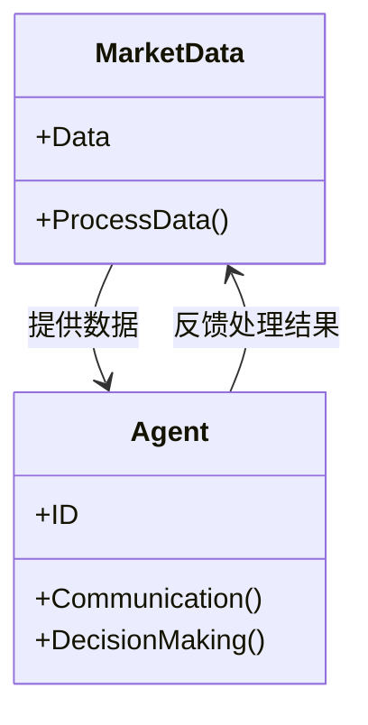
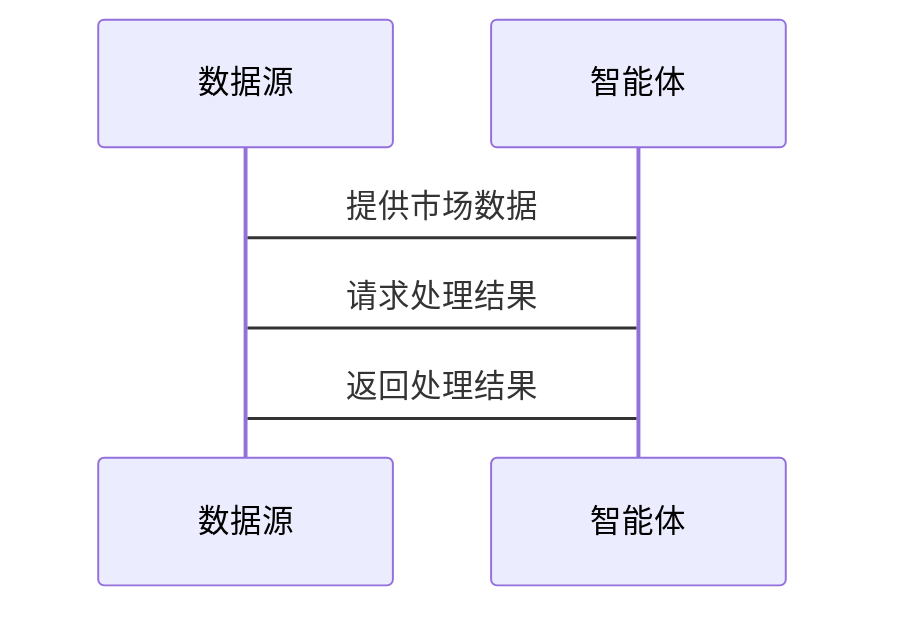

                 


# 多智能体系统在识别市场结构性变化中的应用

> 关键词：多智能体系统、市场结构性变化、分布式计算、协调机制、领域模型、系统架构设计、数学模型

> 摘要：多智能体系统（MAS）是一种由多个智能体组成的分布式系统，能够协同工作以实现共同目标。在识别市场结构性变化中，MAS能够通过分布式计算和协调机制，实时分析和预测市场动态。本文将详细介绍MAS的核心概念、算法原理、系统架构设计以及实际应用案例，帮助读者理解如何利用MAS来应对复杂的市场变化。

---

# 第1章: 多智能体系统与市场结构性变化概述

## 1.1 多智能体系统（MAS）的定义与特点

### 1.1.1 多智能体系统的定义
多智能体系统（Multi-Agent System, MAS）是由多个智能体（Agent）组成的分布式系统，这些智能体能够自主决策、协作和通信，以完成复杂的任务。智能体可以是软件程序、机器人或其他实体，具备感知环境、推理和行动的能力。

### 1.1.2 多智能体系统的特征
1. **自主性**：智能体能够自主决策，无需外部干预。
2. **反应性**：智能体能够实时感知环境变化并做出响应。
3. **协作性**：多个智能体通过通信和协调完成共同目标。
4. **分布性**：智能体独立运行，任务分解为子任务。

### 1.1.3 多智能体系统与单智能体系统的主要区别
| 特性           | 单智能体系统              | 多智能体系统              |
|----------------|--------------------------|---------------------------|
| 结构           | 单一中心化                | 分布式                   |
| 智能体数量     | 1个                      | 多个                      |
| 任务分解       | 集中处理                 | 分解为多个子任务          |
| 通信           | 无需通信                 | 需要通信与协作           |

---

## 1.2 市场结构性变化的定义与分类

### 1.2.1 市场结构性变化的定义
市场结构性变化是指市场中的关键要素（如价格、供需、竞争格局）发生显著变化，导致市场模式或行为方式的转变。这种变化可能由政策调整、技术进步、经济波动等因素引发。

### 1.2.2 市场结构性变化的分类
1. **价格波动**：价格的剧烈波动可能导致市场结构变化。
2. **供需失衡**：供需关系的变化影响市场结构。
3. **竞争格局变化**：新竞争者的加入或退出影响市场结构。

### 1.2.3 市场结构性变化对经济活动的影响
市场结构性变化可能带来机会或风险，企业需要及时识别并调整策略。

---

## 1.3 多智能体系统在识别市场结构性变化中的应用价值

### 1.3.1 多智能体系统的优势
1. **分布式计算能力**：MAS能够处理大规模数据和复杂任务。
2. **实时协作**：智能体之间能够快速通信和协作，适应市场变化。
3. **灵活性**：MAS能够根据市场变化动态调整策略。

### 1.3.2 多智能体系统在市场分析中的独特作用
通过MAS，企业可以实时监控市场动态，预测潜在变化，并制定相应策略。

### 1.3.3 应用场景与实际案例
- **股票市场分析**：多个智能体实时分析市场数据，预测股票价格波动。
- **供应链优化**：智能体协调供应链各环节，优化资源配置。

---

## 1.4 本章小结

本章介绍了多智能体系统的基本概念、特点以及其在市场结构性变化识别中的应用价值。通过MAS，企业能够更高效地应对市场变化，提升竞争力。

---

# 第2章: 多智能体系统的核心概念与联系

## 2.1 多智能体系统的组成与结构

### 2.1.1 智能体的定义与分类
智能体是一种能够感知环境、推理并采取行动的实体。根据智能水平，智能体可以分为反应式和认知式。

### 2.1.2 智能体之间的关系与交互
智能体之间通过通信和协作完成任务。常见的交互方式包括发布-订阅模型和请求-响应模型。

### 2.1.3 多智能体系统的层次结构
MAS的层次结构包括智能体层、协调层和环境层。

---

## 2.2 多智能体系统与市场结构性变化的关联

### 2.2.1 市场结构性变化的动态特征
市场变化具有复杂性和不确定性，需要MAS的实时分析能力。

### 2.2.2 多智能体系统在市场变化中的角色
MAS能够实时监控市场数据，识别潜在变化，并制定应对策略。

### 2.2.3 多智能体系统与市场数据的关系
MAS通过处理大量市场数据，提取有用信息，帮助识别结构性变化。

---

## 2.3 多智能体系统的数学模型与属性特征

### 2.3.1 多智能体系统的数学模型
MAS的数学模型通常包括智能体的行为模型和交互模型。

### 2.3.2 智能体行为的特征对比
| 特性   | 反应式智能体       | 认知式智能体       |
|--------|-------------------|-------------------|
| 行为方式 | 基于当前感知       | 基于长期规划       |
| 复杂性 | 较低               | 较高              |

### 2.3.3 多智能体系统与市场变化的ER实体关系图

```mermaid
erDiagram
    customer[客户]
    market[市场]
    agent[智能体]
    transaction[交易]
    customer --> transaction : 参与
    market --> transaction : 影响
    agent --> transaction : 监控
```

---

## 2.4 本章小结

本章详细讲解了多智能体系统的组成、结构及其与市场结构性变化的关联，为后续章节的分析奠定了基础。

---

# 第3章: 多智能体系统在识别市场结构性变化中的算法原理

## 3.1 多智能体系统中的分布式计算与协调机制

### 3.1.1 分布式计算的基本原理
分布式计算将任务分解为多个子任务，由多个智能体分别执行。

### 3.1.2 多智能体系统的协调机制
协调机制包括同步、异步和混合三种方式。

### 3.1.3 分布式算法在市场分析中的应用
分布式算法能够提高计算效率，适用于大数据场景。

---

## 3.2 多智能体系统的通信与协作算法

### 3.2.1 通信协议
智能体之间通过特定协议进行通信，如HTTP或WebSocket。

### 3.2.2 协作算法
协作算法包括分布式一致性算法和任务分配算法。

---

## 3.3 多智能体系统的学习与自适应算法

### 3.3.1 分布式机器学习
智能体通过分布式数据进行训练，提升预测能力。

### 3.3.2 自适应算法
自适应算法能够根据环境变化调整参数，提高预测精度。

---

## 3.4 本章小结

本章详细讲解了多智能体系统中的分布式计算、通信协作和学习自适应算法，为实际应用提供了理论基础。

---

# 第4章: 多智能体系统识别市场结构性变化的系统分析与架构设计

## 4.1 问题场景介绍

### 4.1.1 市场数据获取
通过API获取实时市场数据，如股票价格、交易量等。

### 4.1.2 数据分析与处理
对市场数据进行清洗、特征提取和建模。

### 4.1.3 结构变化识别
通过算法识别数据中的结构性变化，如趋势变化、周期性变化等。

---

## 4.2 系统功能设计

### 4.2.1 领域模型
领域模型用于描述系统的功能模块和交互关系。



---

## 4.3 系统架构设计

### 4.3.1 微服务架构
系统采用微服务架构，各智能体独立运行，通过API通信。

### 4.3.2 智能体协作框架
框架提供智能体之间的通信和协作机制，如Kafka消息队列。

---

## 4.4 系统接口设计

### 4.4.1 API接口
系统提供RESTful API，供智能体调用市场数据和处理结果。

### 4.4.2 通信接口
智能体之间通过WebSocket进行实时通信。

---

## 4.5 系统交互设计

### 4.5.1 交互流程
1. 智能体获取市场数据。
2. 数据处理模块分析数据。
3. 识别结构变化并反馈给智能体。

### 4.5.2 序列图



---

## 4.6 本章小结

本章详细分析了多智能体系统识别市场结构性变化的系统架构设计和交互流程。

---

# 第5章: 多智能体系统识别市场结构性变化的项目实战

## 5.1 环境安装与配置

### 5.1.1 开发环境
- 操作系统：Linux/Windows/MacOS
- 开发工具：PyCharm/VSCode
- 依赖库：Python（Django/Flask）、Kafka、Redis

### 5.1.2 安装步骤
```bash
pip install django flask kafka-python redis
```

---

## 5.2 系统核心实现

### 5.2.1 市场数据获取
通过API获取股票价格数据，如使用Yahoo Finance API。

### 5.2.2 数据处理与分析
对数据进行清洗、特征提取和建模。

### 5.2.3 结构变化识别
基于机器学习算法（如随机森林、神经网络）识别市场变化。

---

## 5.3 代码实现与解读

### 5.3.1 市场数据分析模块

```python
import pandas as pd
import numpy as np

def load_data():
    data = pd.read_csv('market_data.csv')
    return data

def preprocess_data(data):
    # 数据清洗和特征提取
    processed_data = data.dropna().astype(float)
    return processed_data

if __name__ == '__main__':
    data = load_data()
    processed_data = preprocess_data(data)
    print(processed_data.head())
```

### 5.3.2 智能体通信模块

```python
from kafka import KafkaProducer, KafkaConsumer

def send_message(producer, message):
    producer.send('market_topic', message)
    producer.flush()

def receive_message(consumer):
    for message in consumer:
        print(message.value)
```

---

## 5.4 项目实战分析与总结

### 5.4.1 实验结果
通过实验验证算法的有效性，分析识别准确率。

### 5.4.2 实际案例分析
以股票市场为例，展示MAS如何识别结构性变化。

### 5.4.3 项目总结
总结项目实现过程中的经验和教训，提出改进建议。

---

## 5.5 本章小结

本章通过具体案例展示了多智能体系统在识别市场结构性变化中的实际应用，帮助读者理解理论知识。

---

# 第6章: 总结与展望

## 6.1 总结

本文详细介绍了多智能体系统在识别市场结构性变化中的应用，涵盖了MAS的基本概念、算法原理、系统架构设计以及实际项目案例。

## 6.2 未来展望

未来，随着人工智能和大数据技术的发展，MAS将在市场分析中发挥更大的作用，如实时预测、智能决策等。

---

# 作者：AI天才研究院/AI Genius Institute & 禅与计算机程序设计艺术 /Zen And The Art of Computer Programming

---

以上是《多智能体系统在识别市场结构性变化中的应用》的技术博客文章的详细目录大纲和内容概要。接下来，您可以根据这个大纲开始撰写具体的章节内容。

