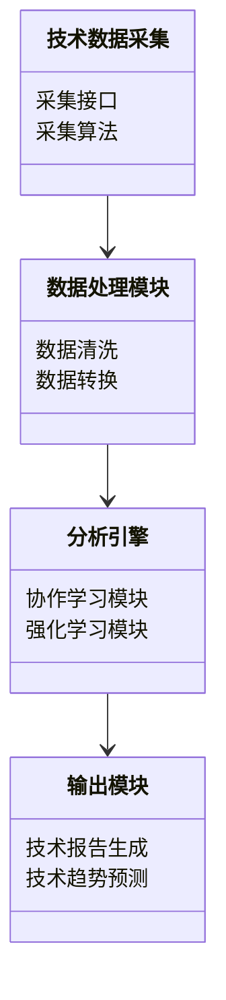
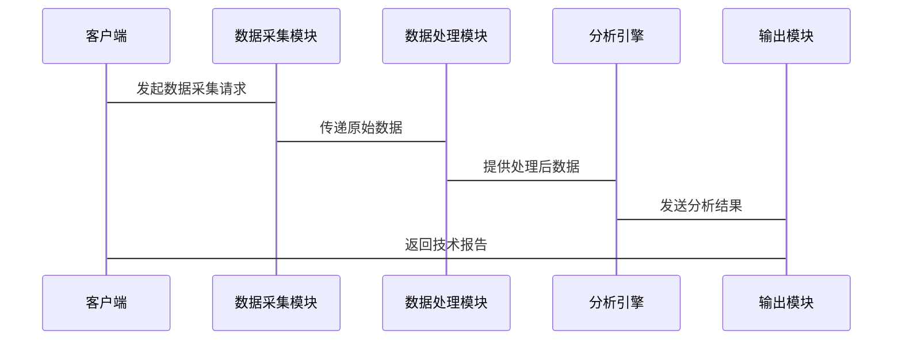

                 


# 多智能体系统在识别行业颠覆性技术中的应用

> 关键词：多智能体系统，颠覆性技术，协同学习，分布式计算，技术识别

> 摘要：本文探讨了多智能体系统（MAS）在识别行业颠覆性技术中的应用。通过分析MAS的核心原理、协作学习算法、系统架构设计以及实际案例，展示了如何利用MAS的优势来高效识别和预测颠覆性技术，为技术管理和创新提供了新思路。

---

## 第一部分: 多智能体系统与颠覆性技术识别基础

### 第1章: 多智能体系统概述

#### 1.1 多智能体系统的基本概念

##### 1.1.1 多智能体系统的定义
多智能体系统（Multi-Agent System, MAS）由多个相互作用的智能体组成，这些智能体通过协作完成复杂任务。智能体能够感知环境、自主决策并执行动作。

##### 1.1.2 多智能体系统的特征
- **分布性**：智能体独立运行，通过通信协作完成任务。
- **协作性**：智能体之间共享信息，共同解决问题。
- **反应性**：能够实时感知环境变化并做出响应。

##### 1.1.3 多智能体系统与单智能体系统的区别
单智能体系统依赖中心化决策，而多智能体系统通过去中心化协作完成任务。MAS适用于复杂环境下的分布式问题求解。

#### 1.2 多智能体系统的结构与通信机制

##### 1.2.1 多智能体系统的组成结构
- **智能体**：独立决策的主体。
- **环境**：智能体感知和交互的空间。
- **通信机制**：智能体之间交换信息的方式，如消息传递。

#### 1.2.2 智能体之间的通信协议
通信协议定义了智能体之间信息交换的格式和规则，确保协作顺利进行。常见的通信方式包括发布-订阅模型和点对点通信。

#### 1.2.3 分布式计算与协同工作
分布式计算允许智能体在不同节点上独立运行，通过通信机制协同完成任务，提高了系统的容错性和扩展性。

#### 1.3 多智能体系统的协作机制

##### 1.3.1 协作任务分配
任务分配算法（如基于角色分配）确保每个智能体负责特定任务，提高效率。

##### 1.3.2 协作决策过程
通过协商机制（如拍卖算法）分配任务，确保决策的最优性。

##### 1.3.3 协作学习与知识共享
知识共享机制（如分布式知识库）促进智能体之间的协作学习，提升整体智能性。

---

### 第2章: 颠覆性技术的基本概念

#### 2.1 颠覆性技术的定义与特征

##### 2.1.1 颠覆性技术的定义
颠覆性技术是新兴技术，能够在性能或商业模式上超越现有技术，引发市场格局变化。

##### 2.1.2 颠覆性技术的核心特征
- **创新性**：与现有技术相比有显著优势。
- **破坏性**：可能取代现有技术或商业模式。
- **不确定性**：难以准确预测其影响。

##### 2.1.3 颠覆性技术与渐进式创新的区别
渐进式创新是在现有技术基础上逐步改进，而颠覆性技术则是根本性变革。

#### 2.2 颠覆性技术的识别方法

##### 2.2.1 基于技术生命周期的识别方法
通过分析技术生命周期的不同阶段，识别可能引发颠覆的技术。

##### 2.2.2 基于市场变化的识别方法
观察市场需求变化，预测可能的技术突破点。

##### 2.2.3 基于专家意见的识别方法
集合专家意见，评估技术的潜在影响。

---

### 第3章: 多智能体系统在颠覆性技术识别中的应用背景

#### 3.1 颠覆性技术识别的挑战

##### 3.1.1 数据量大与复杂性高
技术数据分散，分析复杂，需要高效的方法。

##### 3.1.2 技术更新速度快
技术迭代快，需要实时监控和快速响应。

##### 3.1.3 市场反馈的不确定性
市场对新技术的接受程度难以预测，增加了识别难度。

#### 3.2 多智能体系统的优势

##### 3.2.1 并行计算能力
MAS能够并行处理大量数据，提高分析效率。

##### 3.2.2 协作学习能力
通过协作学习，MAS能够更快识别潜在的技术趋势。

##### 3.2.3 高效的信息处理能力
智能体之间高效共享信息，提升整体判断能力。

#### 3.3 应用场景与案例分析

##### 3.3.1 高 tech 行业的颠覆性技术识别
例如，在人工智能领域，MAS可以识别潜在的新算法或技术突破。

##### 3.3.2 传统行业的颠覆性技术识别
如在制造业，MAS可以帮助识别自动化技术的颠覆性影响。

##### 3.3.3 典型案例分析
通过具体案例，说明MAS在识别颠覆性技术中的实际应用。

---

## 第二部分: 多智能体系统的核心原理与算法

### 第4章: 多智能体系统的协同学习算法

#### 4.1 协同学习的基本原理

##### 4.1.1 分布式学习机制
智能体在分布式网络中独立学习，通过通信共享知识。

##### 4.1.2 联合优化算法
通过联合优化算法，确保所有智能体的学习目标一致。

##### 4.1.3 跨智能体的知识共享
知识共享机制促进智能体之间的协作学习，提高整体性能。

#### 4.2 基于多智能体的强化学习算法

##### 4.2.1 强化学习的基本概念
强化学习通过奖励机制，使智能体学习最优策略。

##### 4.2.2 多智能体强化学习的挑战
智能体之间的协调和竞争是主要挑战，需要设计高效的通信机制。

##### 4.2.3 基于价值函数的分布式学习
通过分布式价值函数，MAS可以实现联合优化。

#### 4.3 协作学习的数学模型

##### 4.3.1 分布式优化模型
优化模型描述了MAS中智能体的协作过程。

##### 4.3.2 联合目标函数
联合目标函数表示所有智能体共同优化的目标。

##### 4.3.3 跨智能体通信模型
通信模型描述了智能体之间信息交换的方式。

---

## 第5章: 多智能体系统的协作决策算法

#### 5.1 协作决策的基本原理

##### 5.1.1 任务分配算法
任务分配算法确保每个智能体承担适当的职责。

##### 5.1.2 协作决策框架
框架定义了决策过程中的角色和责任。

##### 5.1.3 联合决策模型
模型描述了智能体如何共同制定决策。

#### 5.2 基于多智能体的分布式计算

##### 5.2.1 分布式计算的核心思想
通过分布式计算，MAS能够高效处理大规模数据。

##### 5.2.2 分布式决策算法
算法确保智能体在分布式环境下做出最优决策。

##### 5.2.3 分布式计算的实现方式
实现方式包括分布式数据库和计算节点。

---

## 第三部分: 系统分析与架构设计

### 第6章: 问题场景介绍

#### 6.1 问题背景
识别行业颠覆性技术需要实时监控和分析大量数据，MAS的优势在于其分布式计算和协作能力。

#### 6.2 项目介绍
本项目旨在利用MAS技术，构建一个实时识别颠覆性技术的系统。

### 第7章: 系统功能设计

#### 7.1 领域模型
领域模型使用mermaid类图展示系统的组成部分，包括数据采集、处理、分析和输出模块。



#### 7.2 系统架构设计


#### 7.3 系统接口设计
系统接口包括数据采集接口、分析引擎接口和结果输出接口，定义了各个模块之间的交互方式。

#### 7.4 系统交互设计



---

## 第四部分: 项目实战

### 第8章: 环境配置

#### 8.1 环境需求
- 操作系统：Linux/Windows
- 开发工具：Python、Jupyter Notebook
- 依赖库：numpy、pandas、scikit-learn、pytorch

#### 8.2 安装依赖
```bash
pip install numpy pandas scikit-learn pytorch
```

### 第9章: 核心代码实现

#### 9.1 数据采集模块

```python
import requests

def fetch_technology_data(api_key):
    response = requests.get(f'https://api.technologystore.com/data?api_key={api_key}')
    return response.json()
```

#### 9.2 数据处理模块

```python
import pandas as pd

def process_data(data):
    df = pd.DataFrame(data)
    df.dropna(inplace=True)
    return df
```

#### 9.3 分析引擎模块

```python
import numpy as np

def collaborative_learning(data, agents):
    for agent in agents:
        agent.learn(data)
    return max(agent.performance for agent in agents)

def reinforcement_learning(data, agents):
    for agent in agents:
        agent.update_policy(data)
    return max(agent.reward for agent in agents)
```

#### 9.4 输出模块

```python
def generate_report(results):
    report = f"颠覆性技术识别报告：{results}"
    return report
```

### 第10章: 案例分析

#### 10.1 金融科技领域的应用

##### 10.1.1 环境配置
```bash
pip install finlab pandas_datareader
```

##### 10.1.2 核心代码实现

```python
import pandas_datareader as pdr

def fetch_fin_data(tickers):
    data = pdr.get_dataYahoo(tickers)
    return data
```

##### 10.1.3 分析与结果解读
通过MAS分析金融科技领域的技术数据，识别潜在的颠覆性技术，如区块链和人工智能在金融领域的应用。

---

## 第五部分: 总结与展望

### 第11章: 总结

#### 11.1 核心结论
多智能体系统在识别颠覆性技术中具有显著优势，能够高效处理复杂数据，提供准确的技术趋势预测。

#### 11.2 最佳实践 tips
- 确保智能体之间的高效通信。
- 定期更新模型和算法，适应技术变化。

### 第12章: 展望

#### 12.1 未来研究方向
- 提高MAS的实时性和准确性。
- 探索MAS与其他技术（如区块链）的结合应用。

---

## 附录

### 附录A: 术语解释

- 多智能体系统（MAS）：由多个智能体组成的协作系统。
- 颠覆性技术：能够显著改变现有技术或商业模式的技术创新。

### 附录B: 参考文献

- [1] 禅与计算机程序设计艺术
- [2] 多智能体系统的协同学习

---

## 作者

作者：AI天才研究院/AI Genius Institute & 禅与计算机程序设计艺术 /Zen And The Art of Computer Programming

