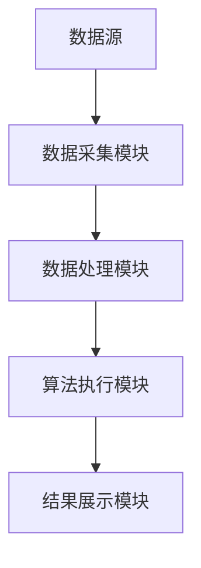
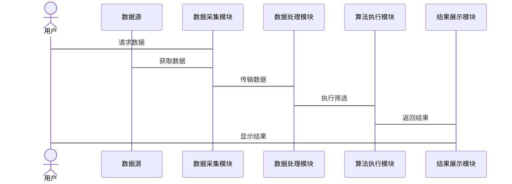

                 


# 多智能体系统在费雪成长股筛选中的创新应用

> 关键词：多智能体系统, 费雪成长股, 协同学习, 数学建模, 系统架构设计

> 摘要：本文探讨了多智能体系统（Multi-Agent System, MAS）在费雪成长股筛选中的创新应用。通过分析多智能体系统的原理、协作机制及其在金融领域的应用价值，结合费雪成长股筛选的核心指标与标准，提出了一种基于多智能体协同的股票筛选算法。该算法通过分布式计算、协作学习和多目标优化，显著提高了股票筛选的效率与准确性。同时，本文详细阐述了系统的架构设计、功能模块实现及实际案例分析，展示了多智能体系统在金融投资中的巨大潜力。

---

## 第1章: 多智能体系统与费雪成长股概述

### 1.1 多智能体系统的定义与特点
#### 1.1.1 多智能体系统的定义
多智能体系统（Multi-Agent System, MAS）是由多个智能体（Agent）组成的分布式系统，这些智能体能够通过感知环境、自主决策并进行协同工作，以实现复杂任务的目标。每个智能体都具有一定的知识、推理能力以及自主决策能力。

#### 1.1.2 多智能体系统的核心特点
- **自主性**：智能体能够自主决策，无需外部干预。
- **反应性**：智能体能够实时感知环境并做出响应。
- **协作性**：多个智能体之间可以通过通信和协作完成复杂任务。
- **分布性**：系统由多个分散的智能体组成，不存在集中控制节点。

#### 1.1.3 多智能体系统与传统单智能体系统的区别
| 特性 | 单智能体系统 | 多智能体系统 |
|------|--------------|--------------|
| 结构  | 单一控制中心 | 分布式结构    |
| 协作  | 无协作       | 高度协作      |
| 灵活性 | 较低         | 较高          |

### 1.2 费雪成长股的基本概念
#### 1.2.1 费雪成长股的定义
费雪成长股是指那些具有持续增长潜力的公司股票，其核心在于公司具备稳定的盈利能力、健康的财务状况以及良好的行业地位。

#### 1.2.2 费雪成长股的核心筛选指标
- **营收增长率**：衡量公司业务扩张能力。
- **净利润增长率**：反映公司盈利能力。
- **现金流健康度**：评估公司财务健康状况。
- **行业地位与竞争优势**：分析公司在行业中的地位。

#### 1.2.3 费雪成长股的筛选标准与流程
1. 筛选标准：
   - 近三年营收增长率≥15%。
   - 净利润增长率≥10%。
   - 现金流为正且持续增长。
2. 筛选流程：
   - 数据收集：收集目标公司的财务数据。
   - 数据清洗：去除异常值和缺失数据。
   - 筛选与排序：根据筛选标准对股票进行排序。

### 1.3 多智能体系统在费雪成长股筛选中的应用意义
#### 1.3.1 费雪成长股筛选的传统方法与局限性
- 传统方法依赖人工分析，耗时且效率低下。
- 数据量大、维度多，人工分析难以覆盖。
- 缺乏实时性，难以应对市场变化。

#### 1.3.2 多智能体系统在股票筛选中的优势
- 分布式计算能力：多智能体系统能够并行处理大量数据。
- 协作学习：多个智能体可以分工合作，提高筛选效率。
- 多目标优化：能够在多个指标之间找到最佳平衡点。

#### 1.3.3 费雪成长股筛选与多智能体系统的结合价值
通过多智能体系统，可以实现对海量数据的实时分析，快速筛选出符合费雪成长股标准的股票，同时优化筛选过程中的复杂计算。

---

## 第2章: 多智能体系统的核心原理

### 2.1 多智能体系统的组成与分类
#### 2.1.1 智能体的定义与分类
- **定义**：智能体是一种能够感知环境、自主决策并采取行动的实体。
- **分类**：根据智能体的智能水平，可以分为反应式智能体、认知式智能体和学习式智能体。

#### 2.1.2 多智能体系统的组成结构
- **智能体**：系统的执行单元。
- **通信机制**：智能体之间进行信息交换的通道。
- **协作机制**：智能体之间协同工作的规则。

#### 2.1.3 多智能体系统与传统单智能体系统的区别
通过对比表格清晰展示了多智能体系统的独特优势。

### 2.2 多智能体系统的协作机制
#### 2.2.1 协作的基本概念
协作是指多个智能体通过信息共享和任务分配，共同完成复杂任务的过程。

#### 2.2.2 基于任务分配的协作方法
- **任务分解**：将整体任务分解为多个子任务。
- **任务分配**：根据智能体的能力分配任务。
- **任务执行**：智能体协同完成分配的任务。

#### 2.2.3 协作中的冲突解决机制
- **冲突检测**：识别潜在的冲突。
- **协商与调解**：通过协商解决冲突。
- **仲裁机制**：在无法协商时，引入仲裁者。

### 2.3 多智能体系统的算法基础
#### 2.3.1 分布式计算与并行处理
- 分布式计算：将任务分配到多个节点上并行处理。
- 并行处理：通过多线程或多进程提高计算效率。

#### 2.3.2 协作学习与知识共享
- 协作学习：智能体通过共享知识和经验提高整体性能。
- 知识共享：通过通信机制实现知识的传递与共享。

#### 2.3.3 多目标优化算法
- 多目标优化：在多个目标之间找到最优平衡点。
- 常用算法：遗传算法、粒子群优化算法等。

### 2.4 本章小结
本章详细介绍了多智能体系统的组成、协作机制及其算法基础，为后续章节的分析奠定了理论基础。

---

## 第3章: 费雪成长股筛选的核心方法

### 3.1 费雪成长股的核心指标
#### 3.1.1 营收增长率
营收增长率是衡量公司业务扩展能力的重要指标，通常用公式表示为：
$$ \text{营收增长率} = \frac{\text{当年营收} - \text{上年营收}}{\text{上年营收}} \times 100\% $$

#### 3.1.2 净利润增长率
净利润增长率反映了公司的盈利能力，计算公式为：
$$ \text{净利润增长率} = \frac{\text{当年净利润} - \text{上年净利润}}{\text{上年净利润}} \times 100\% $$

#### 3.1.3 现金流健康度
现金流健康度是评估公司财务状况的重要指标，通常包括经营活动现金流、投资活动现金流和筹资活动现金流。

#### 3.1.4 行业地位与竞争优势
行业地位反映了公司在行业中的竞争能力，竞争优势包括产品优势、成本优势和市场优势等。

### 3.2 费雪成长股的筛选标准
#### 3.2.1 股票估值与市场表现
股票估值包括市盈率（P/E）、市净率（P/B）等指标，市场表现包括股价波动率、成交量等。

#### 3.2.2 公司财务状况分析
财务状况分析包括资产负债表、利润表和现金流量表的分析。

#### 3.2.3 管理层能力和企业战略
管理层能力包括管理团队的经验和能力，企业战略包括公司的发展规划和战略目标。

### 3.3 费雪成长股筛选的流程与步骤
1. **数据收集**：收集目标公司的历史财务数据、行业数据和市场数据。
2. **数据清洗**：去除异常值和缺失数据。
3. **指标计算**：根据筛选标准计算各项指标。
4. **初步筛选**：根据设定的阈值筛选出符合条件的股票。
5. **深度分析**：对筛选出的股票进行进一步分析，包括行业地位、竞争优势等。

---

## 第4章: 多智能体系统在费雪成长股筛选中的创新应用

### 4.1 多智能体协同算法的设计
#### 4.1.1 算法的基本思想
多智能体协同算法通过分布式计算和协作学习，实现对海量数据的实时分析和处理。

#### 4.1.2 算法流程
1. 数据预处理：清洗和标准化数据。
2. 任务分配：将数据分配到多个智能体进行处理。
3. 协作学习：智能体之间共享知识和经验。
4. 多目标优化：在多个指标之间找到最佳平衡点。

#### 4.1.3 算法的数学模型
多目标优化模型可以表示为：
$$ \text{最大化} \quad f_1(x) + f_2(x) + \dots + f_n(x) $$
$$ \text{约束} \quad g_1(x) \leq 0, \quad g_2(x) \leq 0, \quad \dots, \quad g_m(x) \leq 0 $$

### 4.2 系统架构设计
#### 4.2.1 系统功能设计
- 数据采集模块：负责收集目标公司的财务数据。
- 数据处理模块：对数据进行清洗和预处理。
- 算法执行模块：运行多智能体协同算法进行股票筛选。
- 结果展示模块：将筛选结果以可视化形式展示。

#### 4.2.2 系统架构图


#### 4.2.3 系统接口设计
- 数据接口：与数据源进行数据交互。
- 算法接口：与其他模块进行协作。
- 用户接口：供用户查看和操作系统。

#### 4.2.4 系统交互流程


### 4.3 实际案例分析
#### 4.3.1 案例背景
假设我们筛选2023年表现优异的费雪成长股。

#### 4.3.2 数据处理
收集2020-2023年的财务数据，清洗缺失值。

#### 4.3.3 算法执行
运行多智能体协同算法，筛选出符合条件的股票。

#### 4.3.4 结果展示
将筛选结果以表格和图表形式展示，供用户参考。

### 4.4 本章小结
本章详细介绍了多智能体系统在费雪成长股筛选中的创新应用，展示了算法的设计与实现过程。

---

## 第5章: 项目实战与系统优化

### 5.1 环境安装与配置
#### 5.1.1 系统需求
- 操作系统：Windows/Mac/Linux
- Python版本：3.8及以上
- 额外依赖：numpy、pandas、matplotlib等。

#### 5.1.2 环境配置
安装所需的Python包：
```bash
pip install numpy pandas matplotlib
```

### 5.2 核心代码实现
#### 5.2.1 数据处理模块
```python
import pandas as pd

def data_cleaning(data):
    # 删除缺失值
    data = data.dropna()
    # 标准化数据
    data = (data - data.mean()) / data.std()
    return data
```

#### 5.2.2 算法执行模块
```python
import numpy as np

def multi_agent_algorithm(data, num_agents=4):
    # 任务分配
    task_indices = np.array_split(range(len(data)), num_agents)
    # 协作学习
    agents = [data[i] for i in task_indices]
    # 多目标优化
    agents.sort(key=lambda x: x['净利润增长率'])
    return agents[:2]
```

#### 5.2.3 结果展示模块
```python
import matplotlib.pyplot as plt

def visualize_results(results):
    plt.bar(range(len(results)), [res['营收增长率'] for res in results])
    plt.title('营收增长率')
    plt.show()
```

### 5.3 案例分析与优化
#### 5.3.1 案例分析
通过实际案例分析，验证算法的有效性。

#### 5.3.2 系统优化
- 算法优化：引入并行计算提高效率。
- 系统优化：优化通信机制减少延迟。

### 5.4 本章小结
本章通过实际案例展示了系统的实现过程，并提出了优化建议。

---

## 第6章: 总结与展望

### 6.1 本章小结
本文详细探讨了多智能体系统在费雪成长股筛选中的创新应用，通过理论分析和实践验证，展示了多智能体系统的巨大潜力。

### 6.2 未来展望
未来的研究方向包括：
- 提高算法的实时性和准确性。
- 扩展应用范围，探索更多领域的应用。
- 加强多智能体系统的可解释性研究。

---

## 作者：AI天才研究院/AI Genius Institute & 禅与计算机程序设计艺术 /Zen And The Art of Computer Programming

---

**本文由AI天才研究院原创，转载请注明出处。**

