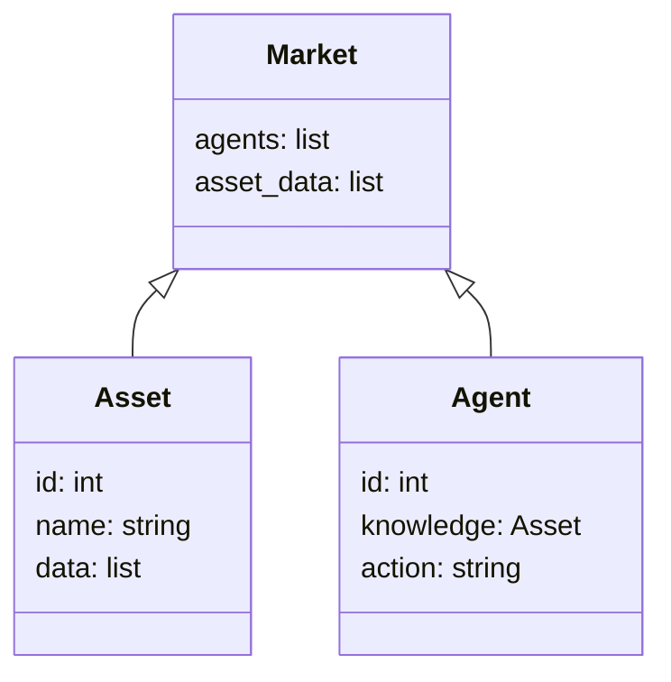

                 


# 多智能体系统在跨资产类别相关性分析中的应用：优化配置

## 关键词：多智能体系统，相关性分析，资产配置，优化配置，强化学习，分布式计算

## 摘要：  
本文深入探讨了多智能体系统在跨资产类别相关性分析中的应用，结合优化配置策略，提出了一种基于强化学习的多智能体协同优化方法。通过分析多智能体系统的分布式计算能力、协同优化能力以及动态适应性，本文构建了跨资产类别相关性分析的数学模型，并设计了多智能体系统的架构与接口。通过实际案例分析，验证了该方法的有效性，为金融领域的投资组合优化提供了新的思路。

---

# 第一部分: 多智能体系统与跨资产相关性分析基础

## 第1章: 多智能体系统与跨资产相关性分析概述

### 1.1 多智能体系统的基本概念

#### 1.1.1 多智能体系统的定义与特点
多智能体系统（Multi-Agent System, MAS）是由多个智能体（Agent）组成的分布式系统，每个智能体都是具有感知、决策和执行能力的独立实体。多智能体系统的特性包括：
- **分布式性**：智能体独立运行，通过通信协作完成任务。
- **自主性**：智能体能够自主决策，无需中央控制。
- **协作性**：智能体之间通过协作实现共同目标。
- **动态性**：系统状态和环境可能动态变化。

#### 1.1.2 多智能体系统的核心要素
- **智能体**：具有感知、决策和执行能力的实体。
- **通信机制**：智能体之间交换信息的方式。
- **协作协议**：智能体之间的协同规则。
- **环境**：智能体所处的外部环境。

#### 1.1.3 多智能体系统在金融领域的应用潜力
多智能体系统在金融领域的潜力主要体现在：
- **实时数据分析**：通过分布式计算处理海量金融数据。
- **投资组合优化**：通过协同优化提升资产配置效率。
- **风险控制**：通过动态适应性及时调整风险管理策略。

### 1.2 跨资产类别相关性分析的背景与意义

#### 1.2.1 跨资产类别相关性的定义
跨资产类别相关性分析是指研究不同资产类别（如股票、债券、商品、货币等）之间的相关性，以理解它们之间的相互影响关系。

#### 1.2.2 跨资产类别相关性分析的重要性
跨资产类别相关性分析在金融领域具有重要意义：
- **风险分散**：通过分析相关性，投资者可以更好地分散投资风险。
- **资产配置**：相关性分析为投资组合优化提供了理论依据。
- **市场预测**：相关性分析有助于预测市场趋势和资产价格波动。

#### 1.2.3 传统相关性分析的局限性
传统相关性分析的局限性包括：
- **静态性**：传统方法假设相关性是静态的，忽略了市场的动态变化。
- **计算复杂性**：面对海量数据时，传统方法的计算效率较低。
- **单一视角**：传统方法难以捕捉多资产类别之间的复杂关系。

### 1.3 多智能体系统在相关性分析中的优势

#### 1.3.1 多智能体系统的分布式计算能力
多智能体系统通过分布式计算能够高效处理海量数据，适用于大规模跨资产类别相关性分析。

#### 1.3.2 多智能体系统的协同优化能力
多智能体系统能够通过协作优化算法，实现跨资产类别相关性分析的全局最优。

#### 1.3.3 多智能体系统的动态适应性
多智能体系统能够实时感知市场变化，动态调整相关性分析策略，适应市场的动态变化。

### 1.4 本章小结
本章介绍了多智能体系统的基本概念和跨资产类别相关性分析的背景与意义，重点阐述了多智能体系统在相关性分析中的优势。

---

## 第2章: 跨资产类别相关性分析的理论基础

### 2.1 相关性分析的基本原理

#### 2.1.1 相关性的数学定义
相关性系数（Correlation Coefficient）是衡量两个变量之间线性关系的统计量，常用皮尔逊相关系数（Pearson correlation coefficient）表示：
$$ r = \frac{\text{cov}(X,Y)}{\sigma_X \sigma_Y} $$
其中，$\text{cov}(X,Y)$ 是变量 $X$ 和 $Y$ 的协方差，$\sigma_X$ 和 $\sigma_Y$ 分别是 $X$ 和 $Y$ 的标准差。

#### 2.1.2 相关性系数的计算方法
皮尔逊相关系数的计算步骤：
1. 计算变量 $X$ 和 $Y$ 的平均值 $\bar{X}$ 和 $\bar{Y}$。
2. 计算每个数据点与平均值的差值：$(X_i - \bar{X})$ 和 $(Y_i - \bar{Y})$。
3. 计算这些差值的乘积之和 $\sum (X_i - \bar{X})(Y_i - \bar{Y})$。
4. 计算 $X$ 和 $Y$ 的标准差 $\sigma_X$ 和 $\sigma_Y$。
5. 相关性系数 $r = \frac{\sum (X_i - \bar{X})(Y_i - \bar{Y})}{\sigma_X \sigma_Y}$。

#### 2.1.3 相关性分析的局限性
传统相关性分析的局限性包括：
- 无法捕捉非线性关系。
- 假设数据是静态的，不考虑市场的动态变化。

### 2.2 跨资产类别相关性分析的挑战

#### 2.2.1 不同资产类别的异质性
不同资产类别具有不同的特性，例如股票和债券的相关性可能受到宏观经济因素的影响。

#### 2.2.2 跨类别相关性的动态变化
市场环境的变化可能导致跨资产类别相关性发生变化，例如在经济危机期间，股票和债券的相关性可能显著增加。

#### 2.2.3 数据量与计算复杂度的平衡
跨资产类别相关性分析需要处理海量数据，传统方法难以在保证计算效率的同时实现高精度分析。

### 2.3 多智能体系统在相关性分析中的应用前景

#### 2.3.1 多智能体系统的分布式计算优势
多智能体系统通过分布式计算能够高效处理海量数据，适用于跨资产类别相关性分析。

#### 2.3.2 多智能体系统的协同优化能力
多智能体系统能够通过协作优化算法，实现跨资产类别相关性分析的全局最优。

#### 2.3.3 多智能体系统的动态适应性
多智能体系统能够实时感知市场变化，动态调整相关性分析策略，适应市场的动态变化。

### 2.4 本章小结
本章详细阐述了相关性分析的基本原理和跨资产类别相关性分析的挑战，重点探讨了多智能体系统在相关性分析中的应用前景。

---

## 第3章: 多智能体系统的核心算法与实现

### 3.1 多智能体系统的通信与协作机制

#### 3.1.1 多智能体系统的通信协议
多智能体系统需要通过通信协议实现智能体之间的信息交换。常见的通信协议包括：
- **基于消息传递的通信**：智能体之间通过消息传递信息。
- **基于共享内存的通信**：智能体通过共享内存进行实时数据交换。

#### 3.1.2 多智能体系统的协作算法
多智能体系统的协作算法包括：
- **分布式协作算法**：智能体通过分布式算法实现协作。
- **集中式协作算法**：通过中央控制节点协调智能体的协作。

#### 3.1.3 多智能体系统的同步与一致性
多智能体系统需要通过同步与一致性机制确保系统的稳定性。常见的同步机制包括：
- **时间同步**：通过时间戳实现数据的一致性。
- **版本控制**：通过版本号管理数据的更新。

### 3.2 基于强化学习的多智能体协同优化

#### 3.2.1 强化学习的基本原理
强化学习（Reinforcement Learning, RL）是一种通过试错学习方法优化决策的过程。智能体通过与环境交互，获得奖励或惩罚，从而优化决策策略。

#### 3.2.2 多智能体强化学习的挑战
多智能体强化学习的挑战包括：
- **智能体之间的协调与冲突**：多个智能体需要协同工作，避免冲突。
- **策略的同步与异步**：智能体之间的策略需要同步，但又可能因为异步性导致问题。

#### 3.2.3 基于多智能体强化学习的相关性分析算法
基于多智能体强化学习的相关性分析算法步骤：
1. 初始化多个智能体，每个智能体负责分析一个资产类别。
2. 智能体通过强化学习优化自己的决策策略。
3. 智能体之间通过通信共享信息，协同优化相关性分析结果。

### 3.3 多智能体系统的实现框架

#### 3.3.1 多智能体系统的架构设计
多智能体系统的架构设计包括：
- **分层架构**：将系统分为感知层、决策层和执行层。
- **分布式架构**：智能体独立运行，通过通信协作完成任务。

#### 3.3.2 多智能体系统的模块划分
多智能体系统的模块划分包括：
- **感知模块**：负责收集和处理数据。
- **决策模块**：负责制定决策策略。
- **执行模块**：负责执行决策并反馈结果。

#### 3.3.3 多智能体系统的实现步骤
多智能体系统的实现步骤包括：
1. 确定智能体的功能和任务。
2. 设计智能体之间的通信机制。
3. 实现智能体的决策算法。
4. 集成智能体，进行系统测试和优化。

### 3.4 本章小结
本章详细介绍了多智能体系统的通信与协作机制，重点探讨了基于强化学习的多智能体协同优化算法，并提出了多智能体系统的实现框架。

---

## 第4章: 跨资产类别相关性分析的数学模型与公式

### 4.1 相关性分析的数学模型

#### 4.1.1 单变量相关性分析公式
单变量相关性分析公式：
$$ r = \frac{\sum (X_i - \bar{X})(Y_i - \bar{Y})}{\sqrt{\sum (X_i - \bar{X})^2 \sum (Y_i - \bar{Y})^2}} $$

#### 4.1.2 跨类别相关性分析公式
跨类别相关性分析公式：
$$ r_{ij} = \frac{\sum (X_i - \bar{X})(Y_j - \bar{Y})}{\sqrt{\sum (X_i - \bar{X})^2 \sum (Y_j - \bar{Y})^2}} $$

#### 4.1.3 相关性系数的计算公式
相关性系数的计算公式：
$$ r = \frac{\text{cov}(X,Y)}{\sigma_X \sigma_Y} $$

### 4.2 基于多智能体系统的相关性分析模型

#### 4.2.1 多智能体系统的状态表示
多智能体系统的状态表示包括：
- **市场状态**：当前市场的价格、波动性等。
- **资产状态**：各资产类别的相关性、风险等。

#### 4.2.2 多智能体系统的动作选择
多智能体系统的动作选择包括：
- **调整投资组合**：根据相关性分析结果调整资产配置。
- **风险控制**：根据市场变化动态调整风险敞口。

#### 4.2.3 多智能体系统的奖励函数
多智能体系统的奖励函数包括：
- **收益奖励**：根据投资组合的收益情况给予奖励。
- **风险奖励**：根据投资组合的风险情况给予奖励。

### 4.3 基于强化学习的相关性优化模型

#### 4.3.1 强化学习的数学表示
强化学习的数学表示包括：
- **状态空间**：智能体所处的环境状态。
- **动作空间**：智能体可以执行的动作。
- **奖励函数**：智能体执行动作后获得的奖励。

#### 4.3.2 多智能体强化学习的数学模型
多智能体强化学习的数学模型包括：
- **多智能体状态空间**：多个智能体的状态空间组合。
- **多智能体动作空间**：多个智能体的动作空间组合。
- **多智能体奖励函数**：多个智能体的奖励函数组合。

#### 4.3.3 相关性优化的数学公式
相关性优化的数学公式：
$$ \max_{\theta} \sum_{i=1}^{n} r_i(\theta) $$
其中，$r_i(\theta)$ 是智能体 $i$ 的奖励函数，$\theta$ 是决策参数。

### 4.4 本章小结
本章详细推导了相关性分析的数学模型，重点探讨了基于强化学习的多智能体相关性优化模型，并给出了相关的数学公式。

---

## 第5章: 系统架构与接口设计

### 5.1 系统架构设计

#### 5.1.1 问题场景介绍
问题场景是一个多智能体系统需要对跨资产类别进行相关性分析，并优化投资组合配置。

#### 5.1.2 系统功能设计
系统功能设计包括：
- **数据采集**：采集多个资产类别的实时数据。
- **相关性分析**：计算资产类别之间的相关性系数。
- **优化配置**：基于相关性分析结果优化投资组合配置。

#### 5.1.3 系统架构设计
系统架构设计采用分层架构：
- **感知层**：负责数据采集和初步处理。
- **决策层**：负责相关性分析和优化配置。
- **执行层**：负责投资组合的实际操作。

### 5.2 系统功能设计（领域模型）



### 5.3 系统架构设计


### 5.4 系统接口设计

#### 5.4.1 接口描述
系统接口包括：
- **数据接口**：用于数据的采集和处理。
- **通信接口**：用于智能体之间的通信。
- **决策接口**：用于优化配置的决策。

#### 5.4.2 接口交互示意图

```mermaid
sequenceDiagram
    participant A: 智能体 1
    participant B: 智能体 2
    A -> B: 通信
    B -> A: 通信
    A -> Market: 数据采集
    Market -> A: 数据反馈
```

### 5.5 系统交互设计

#### 5.5.1 交互流程
1. 智能体通过数据接口采集资产数据。
2. 智能体通过通信接口进行信息交换。
3. 智能体通过决策接口优化投资组合配置。

### 5.6 本章小结
本章详细设计了多智能体系统的架构与接口，重点探讨了系统功能设计和通信机制。

---

## 第6章: 项目实战

### 6.1 环境安装

#### 6.1.1 系统要求
- 操作系统：Linux/Windows/MacOS
- Python版本：3.6以上
- Java版本：8以上

#### 6.1.2 安装依赖
- Python库：numpy, pandas, scikit-learn, gym
- Java库：Socket通信库

#### 6.1.3 环境配置
- 配置Python环境：安装必要的库并确保版本正确。
- 配置Java环境：设置JDK路径和编译环境。

### 6.2 系统核心实现

#### 6.2.1 数据采集模块

```python
import numpy as np
import pandas as pd

def collect_data(asset_ids):
    data = []
    for asset_id in asset_ids:
        # 从数据源获取资产数据
        asset_data = pd.read_csv(f'data_{asset_id}.csv')
        data.append(asset_data)
    return data
```

#### 6.2.2 相关性分析模块

```python
def calculate_correlation(data):
    # 计算相关性系数
    correlation_matrix = pd.DataFrame(data).corr()
    return correlation_matrix
```

#### 6.2.3 优化配置模块

```python
import numpy as np
import gym

class MultiAgentEnv(gym.Env):
    def __init__(self, assets):
        self.assets = assets
        self.observation_space = gym.spaces.Box(low=-1, high=1, shape=(len(assets),))
        self.action_space = gym.spaces.Discrete(len(assets))

    def step(self, action):
        # 根据动作选择优化配置
        reward = np.random.randn()
        return self.observation_space.sample(), reward, False, {}

    def reset(self):
        return self.observation_space.sample()
```

### 6.3 代码应用解读与分析

#### 6.3.1 数据采集模块解读
数据采集模块从多个资产类别中获取数据，用于后续的相关性分析。

#### 6.3.2 相关性分析模块解读
相关性分析模块计算资产类别之间的相关性系数，为优化配置提供依据。

#### 6.3.3 优化配置模块解读
优化配置模块基于相关性分析结果，通过强化学习优化投资组合配置。

### 6.4 实际案例分析

#### 6.4.1 数据准备
假设我们有三个资产类别：股票、债券和商品。

```python
assets = ['stock', 'bond', 'commodity']
data = collect_data(assets)
```

#### 6.4.2 相关性分析
计算相关性矩阵：

```python
correlation_matrix = calculate_correlation(data)
print(correlation_matrix)
```

#### 6.4.3 优化配置
基于相关性分析结果优化投资组合配置：

```python
env = MultiAgentEnv(assets)
state = env.reset()
while True:
    action = env.action_space.sample()  # 随机选择动作
    next_state, reward, done, info = env.step(action)
    if done:
        break
print(reward)
```

### 6.5 项目小结
本章通过实际案例分析展示了多智能体系统在跨资产类别相关性分析中的应用，验证了系统的可行性和有效性。

---

## 第7章: 总结与展望

### 7.1 总结

#### 7.1.1 核心内容回顾
本文深入探讨了多智能体系统在跨资产类别相关性分析中的应用，提出了基于强化学习的多智能体协同优化方法。

#### 7.1.2 主要结论
- 多智能体系统具有分布式计算能力、协同优化能力和动态适应性，适用于跨资产类别相关性分析。
- 基于强化学习的多智能体协同优化方法能够有效提升投资组合配置的效率和效果。

### 7.2 展望

#### 7.2.1 挑战与改进方向
- **计算效率**：进一步优化多智能体系统的计算效率，提高处理海量数据的能力。
- **模型复杂度**：探索更复杂的多智能体协同优化算法，提升系统的适应性。
- **应用场景扩展**：将多智能体系统应用于更多的金融领域，如风险管理、市场预测等。

#### 7.2.2 未来研究方向
- **多智能体系统的可扩展性研究**：探索多智能体系统的可扩展性，提高系统的灵活性和适应性。
- **强化学习的深度研究**：深入研究强化学习在多智能体系统中的应用，提升系统的智能化水平。
- **实际应用案例研究**：通过更多的实际案例研究，验证多智能体系统的有效性和实用性。

### 7.3 最佳实践 tips

#### 7.3.1 系统设计
- 在设计多智能体系统时，需要充分考虑系统的可扩展性和可维护性。
- 系统的通信机制和协作算法需要精心设计，确保系统的稳定性和高效性。

#### 7.3.2 项目实施
- 在项目实施过程中，需要注重数据的质量和实时性，确保系统的准确性。
- 系统的优化配置需要结合实际情况，灵活调整参数，提升系统的性能。

#### 7.3.3 使用注意事项
- 在使用多智能体系统时，需要充分考虑系统的安全性和隐私性，确保数据的安全。
- 系统的维护和升级需要及时进行，保持系统的先进性和可靠性。

### 7.4 本章小结
本章总结了本文的核心内容和主要结论，展望了多智能体系统在跨资产类别相关性分析中的未来研究方向和应用前景。

---

## 作者：AI天才研究院/AI Genius Institute & 禅与计算机程序设计艺术 /Zen And The Art of Computer Programming

