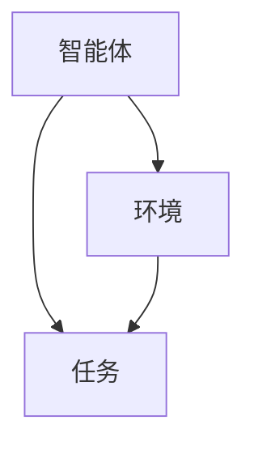
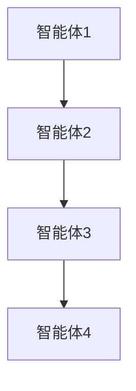
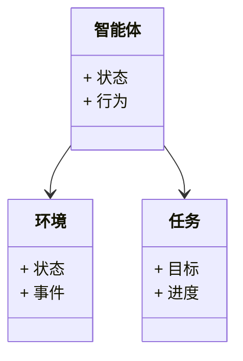
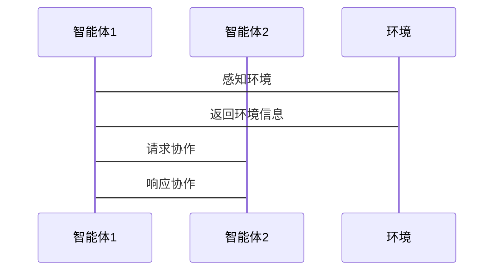

                 


# 多智能体系统在长期价值创造分析中的应用

> 关键词：多智能体系统（MAS）、长期价值创造分析、协作机制、系统架构、博弈论模型

> 摘要：本文深入探讨了多智能体系统在长期价值创造分析中的应用，从基本概念到算法原理，再到系统架构设计和项目实战，详细分析了多智能体系统如何通过协作机制实现长期价值创造，并提供了丰富的案例和代码示例。

---

## 第1章: 多智能体系统概述

### 1.1 多智能体系统的基本概念

#### 1.1.1 智能体的定义与特点
智能体（Agent）是指能够感知环境、自主决策并采取行动以实现目标的实体。智能体可以是软件程序、机器人或其他具备智能行为的系统。智能体的特点包括：
- **自主性**：智能体能够自主决策，无需外部干预。
- **反应性**：能够感知环境并实时响应。
- **协作性**：能够与其他智能体或系统进行协作。

#### 1.1.2 多智能体系统的定义与特点
多智能体系统（Multi-Agent System, MAS）是由多个智能体组成的系统，这些智能体通过协作完成复杂任务。MAS的特点包括：
- **分布性**：智能体分布在网络中，各自独立运行。
- **协作性**：智能体之间通过通信和协作完成共同目标。
- **动态性**：系统环境和智能体状态可能动态变化。

#### 1.1.3 多智能体系统与单智能体系统的区别
| 属性 | 单智能体系统 | 多智能体系统 |
|------|--------------|--------------|
| 结构 | 单一智能体 | 多个智能体协作 |
| 决策 | 中央决策 | 分布式决策 |
| 复杂性 | 较低 | 较高 |

### 1.2 长期价值创造分析的基本概念

#### 1.2.1 价值创造的定义与分类
价值创造是指通过优化资源配置、提升效率等方式为组织或个人创造更大的价值。价值创造可以分为短期价值和长期价值，长期价值创造关注的是系统的可持续发展和长期效益。

#### 1.2.2 长期价值创造的特征与挑战
- **特征**：
  - 战略性：长期价值创造需要制定长期战略。
  - 可持续性：需要考虑资源的长期利用和环境影响。
- **挑战**：
  - 动态性：市场环境和客户需求不断变化。
  - 协作性：需要多部门或多个系统协作。

#### 1.2.3 多智能体系统在价值创造中的作用
多智能体系统通过分布式协作和智能决策，能够帮助组织优化资源配置、提升效率，从而实现长期价值创造。

### 1.3 多智能体系统与长期价值创造的关联

#### 1.3.1 多智能体系统在价值创造中的优势
- **分布式决策**：MAS能够通过多个智能体协同决策，提高系统的灵活性和适应性。
- **协作效率**：通过智能体之间的协作，能够快速响应变化，提升整体效率。

#### 1.3.2 长期价值创造对多智能体系统的需求
- **动态适应性**：系统需要能够适应环境的变化。
- **协作能力**：智能体之间需要高效协作，共同完成目标。

#### 1.3.3 多智能体系统在不同领域的应用案例
- **金融领域**：智能体可以用于实时交易决策和风险控制。
- **制造业**：智能体可以用于生产过程的优化和供应链管理。

---

## 第2章: 多智能体系统的核心概念与联系

### 2.1 多智能体系统的组成与结构

#### 2.1.1 智能体的组成要素
智能体的组成要素包括：
- **感知**：通过传感器或数据输入感知环境。
- **决策**：基于感知信息做出决策。
- **行动**：根据决策采取行动。

#### 2.1.2 多智能体系统的层次结构
多智能体系统的层次结构可以分为：
- **物理层**：智能体与物理环境的交互。
- **逻辑层**：智能体的逻辑推理和决策。
- **协作层**：智能体之间的协作与通信。

#### 2.1.3 实体关系图（ER图）展示


### 2.2 多智能体系统与长期价值创造的关联模型

#### 2.2.1 概念属性特征对比表
| 概念 | 属性 | 特征 |
|------|------|------|
| 智能体 | 自主性 | 独立决策 |
| 长期价值 | 可持续性 | 长期效益 |

#### 2.2.2 多智能体系统的协作机制
- **通信机制**：智能体之间通过通信协议交换信息。
- **协作机制**：通过分布式算法实现协作。

#### 2.2.3 价值创造的动态过程
价值创造的动态过程包括：
1. **感知环境**：智能体感知环境信息。
2. **决策制定**：基于感知信息制定决策。
3. **协作执行**：多个智能体协作执行任务。
4. **反馈优化**：根据执行结果优化决策。

### 2.3 算法原理与流程图

#### 2.3.1 多智能体协作算法的原理
多智能体协作算法的核心是通过分布式计算实现智能体之间的协作。常见的算法包括：
- **分布式计算**：智能体独立计算，通过通信共享结果。
- **博弈论模型**：通过博弈论模型模拟智能体之间的互动。

#### 2.3.2 用mermaid绘制算法流程图


---

## 第3章: 多智能体系统在长期价值创造中的算法原理

### 3.1 多智能体协作算法

#### 3.1.1 分布式计算与协作机制
分布式计算通过将任务分配给多个智能体，每个智能体独立计算，最终汇总结果。协作机制通过通信协议实现智能体之间的协作。

#### 3.1.2 博弈论模型在多智能体系统中的应用
博弈论模型通过模拟智能体之间的互动，帮助智能体做出最优决策。例如，纳什均衡是博弈论中的一个重要概念。

#### 3.1.3 用mermaid绘制算法流程图


### 3.2 数学模型与公式

#### 3.2.1 纳什均衡的数学表达
纳什均衡的数学表达式为：
$$ (a_1, a_2, \ldots, a_n) \text{ 是纳什均衡} \iff \forall i, u_i(a_i, a_{-i}) \geq u_i(a'_i, a_{-i}) $$

其中，\( u_i \) 表示第 \( i \) 个智能体的效用函数，\( a_i \) 表示第 \( i \) 个智能体的策略。

#### 3.2.2 协作收益的计算公式
协作收益的计算公式为：
$$ \text{总收益} = \sum_{i=1}^n r_i $$
其中，\( r_i \) 表示第 \( i \) 个智能体的收益。

---

## 第4章: 系统分析与架构设计方案

### 4.1 问题场景介绍

#### 4.1.1 长期价值创造的分析需求
在长期价值创造分析中，需要考虑多智能体系统的协作效率和动态适应性。

#### 4.1.2 多智能体系统在分析中的应用
多智能体系统可以用于实时数据分析、优化资源配置等。

### 4.2 系统功能设计

#### 4.2.1 领域模型类图设计


### 4.3 系统架构设计

#### 4.3.1 系统架构图设计


#### 4.3.2 系统交互流程图


---

## 第5章: 项目实战

### 5.1 环境安装

#### 5.1.1 安装Python和相关库
```bash
pip install numpy
pip install matplotlib
```

### 5.2 系统核心实现源代码

#### 5.2.1 协作算法实现
```python
def nash_equilibrium(players, strategies):
    # 计算纳什均衡
    pass

def协作收益计算
    return sum(r_i)
```

---

## 第6章: 最佳实践与小结

### 6.1 总结
多智能体系统在长期价值创造分析中的应用具有重要意义，通过协作机制和分布式计算，能够实现系统的高效优化和动态适应。

### 6.2 注意事项
- 系统设计时需要考虑智能体之间的通信和协作。
- 动态环境下需要实时调整策略。

### 6.3 拓展阅读
推荐阅读《多智能体系统的理论与应用》和《博弈论与经济行为》。

---

作者：AI天才研究院/AI Genius Institute & 禅与计算机程序设计艺术 /Zen And The Art of Computer Programming

