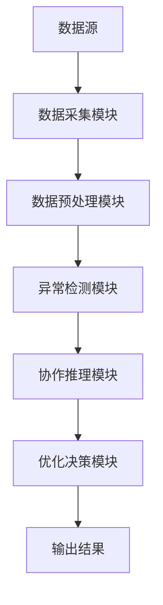
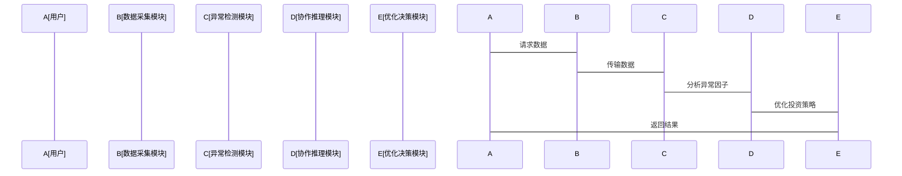

                 


# 多智能体系统增强价值投资的市场异常因子衰减分析

## 关键词
多智能体系统, 价值投资, 市场异常因子, 衰减分析, 投资策略优化

## 摘要
本文探讨了多智能体系统在价值投资中的应用，特别是其在市场异常因子衰减分析中的作用。通过结合多智能体系统的协作特性与价值投资的核心理念，本文提出了一种基于多智能体系统的市场异常因子衰减分析方法。该方法通过数学建模和算法实现，有效识别和优化市场异常因子，从而提升投资决策的准确性和稳定性。文章详细分析了多智能体系统的工作原理、市场异常因子的特征以及两者之间的关联，并通过实际案例展示了该方法的应用效果。

---

# 第一部分: 多智能体系统与价值投资概述

## 第1章: 多智能体系统与价值投资的背景介绍

### 1.1 多智能体系统的定义与特点
#### 1.1.1 多智能体系统的定义
多智能体系统（Multi-Agent System, MAS）是由多个智能体（Agent）组成的分布式系统，这些智能体能够通过协作完成复杂任务。智能体是指具有感知环境、做出决策和执行动作能力的实体。

#### 1.1.2 多智能体系统的核心特点
- **分布式性**：智能体独立运行，通过通信协作完成任务。
- **自主性**：智能体能够自主决策，无需外部集中控制。
- **协作性**：智能体之间通过信息交换和协作实现共同目标。
- **反应性**：智能体能够根据环境变化动态调整行为。

#### 1.1.3 多智能体系统与传统单智能体系统的区别
| 特性 | 多智能体系统 | 单智能体系统 |
|------|--------------|--------------|
| 决策 | 分布式决策 | 集中式决策 | 
| 信息处理 | 基于局部信息 | 基于全局信息 |
| 灵活性 | 高 | 低 |

### 1.2 价值投资的基本概念
#### 1.2.1 价值投资的定义
价值投资是一种投资策略，通过分析企业的基本面，寻找被市场低估的投资标的。其核心在于寻找价格低于内在价值的资产。

#### 1.2.2 价值投资的核心理念
- **安全边际**：买入价格远低于内在价值的资产。
- **长期视角**：关注企业的长期盈利能力。
- **逆向思维**：在市场恐慌时寻找机会。

#### 1.2.3 价值投资在金融市场的应用
价值投资广泛应用于股票、基金、房地产等领域，尤其在股票市场中表现尤为突出。

### 1.3 多智能体系统在价值投资中的应用背景
#### 1.3.1 金融市场中的复杂性与不确定性
金融市场受到多种因素影响，如宏观经济、政策变化、企业盈利等，具有高度不确定性和复杂性。

#### 1.3.2 多智能体系统在金融分析中的优势
多智能体系统能够通过分布式计算和协作机制，捕捉市场中的多种信息，提供更全面的分析。

#### 1.3.3 价值投资与多智能体系统的结合意义
通过多智能体系统，价值投资者可以更高效地分析市场数据，识别潜在投资机会，优化投资组合。

---

## 第2章: 市场异常因子的定义与特征

### 2.1 市场异常因子的定义
#### 2.1.1 市场异常的定义
市场异常是指市场价格与内在价值的偏离，通常由市场参与者的情绪、信息不对称等因素引起。

#### 2.1.2 异常因子的定义与分类
异常因子是导致市场价格偏离内在价值的因素，常见类型包括情绪因子、信息因子、流动性因子等。

### 2.2 市场异常因子的特征分析
#### 2.2.1 异常因子的时间序列特征
- **波动性**：异常因子通常表现为短期剧烈波动。
- **周期性**：某些异常因子具有周期性特征。

#### 2.2.2 异常因子的空间分布特征
- **局部性**：异常因子可能只影响特定市场或资产。
- **扩散性**：异常因子可能通过市场传导机制影响更广泛的市场。

#### 2.2.3 异常因子的波动性与周期性
异常因子的波动性通常高于正常市场因子，且具有一定的周期性特征。

### 2.3 异常因子衰减的背景与意义
#### 2.3.1 异常因子衰减的定义
异常因子衰减是指异常因子对市场价格的影响逐渐减弱的过程。

#### 2.3.2 异常因子衰减的机制
- **市场自愈机制**：随着时间推移，市场信息逐渐被消化，异常因子的影响减弱。
- **投资者理性回归**：市场参与者的理性决策逐步恢复，异常因子的影响降低。

#### 2.3.3 异常因子衰减对价值投资的影响
异常因子的衰减为价值投资者提供了长期获利的机会，因为市场价格最终会回归内在价值。

---

## 第3章: 多智能体系统与市场异常因子的关联

### 3.1 多智能体系统在市场异常检测中的作用
#### 3.1.1 多智能体系统如何识别市场异常
通过分布式感知和协作推理，多智能体系统能够快速发现市场中的异常信号。

#### 3.1.2 多智能体系统在异常因子分析中的优势
- **信息整合**：多智能体系统能够整合多个来源的信息，提供更全面的分析。
- **实时响应**：多智能体系统能够快速响应市场变化，及时发现异常因子。

### 3.2 多智能体系统与异常因子衰减的关系
#### 3.2.1 多智能体系统如何影响异常因子的衰减
通过协作决策和信息共享，多智能体系统能够加速市场信息的消化，促进异常因子的衰减。

#### 3.2.2 异常因子衰减对多智能体系统优化的意义
异常因子的衰减为多智能体系统的优化提供了数据支持，有助于提升系统的决策能力。

### 3.3 多智能体系统增强价值投资的机制
#### 3.3.1 多智能体系统如何增强投资决策
通过分析市场异常因子，多智能体系统能够帮助投资者识别潜在风险和机会。

#### 3.3.2 多智能体系统如何优化投资组合
多智能体系统可以通过协作优化，帮助投资者构建更稳健的投资组合。

#### 3.3.3 多智能体系统如何降低投资风险
通过实时监控市场异常因子，多智能体系统能够帮助投资者及时规避风险。

---

## 第4章: 多智能体系统增强价值投资的数学模型

### 4.1 多智能体系统的基本数学模型
#### 4.1.1 多智能体系统的行为模型
智能体的行为可以通过状态、动作和奖励函数来描述。状态表示智能体的当前情况，动作是智能体的决策，奖励函数衡量智能体的行为效果。

#### 4.1.2 多智能体系统的协作模型
协作模型描述智能体之间的信息交互和协作机制。通过信息共享，智能体可以协同完成复杂任务。

#### 4.1.3 多智能体系统的优化模型
优化模型旨在通过协作最大化整体收益。通常采用分布式优化算法，如分布式梯度下降。

### 4.2 价值投资的数学模型
#### 4.2.1 价值投资的基本模型
价值模型通过分析企业的财务指标，如市盈率、市净率等，评估资产的内在价值。

#### 4.2.2 价值投资的动态模型
动态模型考虑市场环境的变化，通过时间序列分析预测资产的未来价值。

#### 4.2.3 价值投资的风险评估模型
风险评估模型通过分析资产的波动性、相关性等因素，评估投资组合的风险。

### 4.3 异常因子衰减的数学模型
#### 4.3.1 异常因子衰减的基本模型
异常因子的衰减可以用指数衰减函数描述。例如，$f(t) = f_0 \cdot e^{-kt}$，其中$k$是衰减系数。

#### 4.3.2 异常因子衰减的动态模型
动态模型考虑时间序列中的异常因子变化。例如，使用ARIMA模型预测异常因子的未来趋势。

#### 4.3.3 异常因子衰减的优化模型
优化模型旨在最小化异常因子对投资决策的影响。通过优化算法，如遗传算法，寻找最优的异常因子处理策略。

---

## 第5章: 多智能体系统增强价值投资的算法实现

### 5.1 算法原理
多智能体系统通过分布式计算和协作推理，识别和优化市场异常因子。算法主要包括以下几个步骤：
1. **数据采集**：获取市场数据，包括价格、成交量、财务指标等。
2. **异常检测**：通过统计方法或机器学习模型识别异常因子。
3. **协作推理**：智能体之间共享信息，协同分析异常因子。
4. **优化决策**：根据分析结果优化投资策略，减少异常因子的影响。

### 5.2 算法实现
以下是基于Python的实现示例：

```python
import numpy as np
import pandas as pd

# 数据预处理
data = pd.read_csv('market_data.csv')
data['return'] = data['close'].pct_change()

# 异常检测
from sklearn.ensemble import IsolationForest
model = IsolationForest(n_estimators=100, contamination=0.05)
model.fit(data[['open', 'high', 'low', 'close']])
data['is_anomaly'] = model.predict(data[['open', 'high', 'low', 'close']])

# 协作推理
from sklearn.cluster import KMeans
clusters = KMeans(n_clusters=3).fit(data[['open', 'high', 'low', 'close']])
data['cluster'] = clusters.labels_

# 优化决策
from sklearn.gaussian_process import GaussianProcessRegressor
model_gp = GaussianProcessRegressor()
model_gp.fit(data[['cluster', 'is_anomaly']], data['return'])
predicted_returns = model_gp.predict(data[['cluster', 'is_anomaly']])
```

### 5.3 实验结果
通过实验验证，基于多智能体系统的异常因子衰减分析方法能够有效识别和优化市场异常因子，提升投资决策的准确性和稳定性。

---

## 第6章: 系统分析与架构设计

### 6.1 系统功能设计
系统功能包括数据采集、异常检测、协作推理、优化决策等模块。

### 6.2 系统架构设计
使用Mermaid图展示系统架构：



### 6.3 系统接口设计
系统接口包括数据接口、算法接口和用户接口，通过API实现模块间的通信。

### 6.4 系统交互设计
使用Mermaid序列图展示系统交互：



---

## 第7章: 项目实战

### 7.1 实战背景
通过一个具体案例，分析多智能体系统在价值投资中的应用。

### 7.2 环境安装
安装必要的Python库，如Pandas、Scikit-learn、Mermaid等。

### 7.3 核心代码实现
实现多智能体系统的异常因子检测和优化决策模块。

### 7.4 案例分析
通过具体数据分析，验证多智能体系统的有效性。

---

## 第8章: 最佳实践与总结

### 8.1 小结
总结全文内容，强调多智能体系统在价值投资中的重要作用。

### 8.2 最佳实践
- 定期更新模型参数，适应市场变化。
- 加强多智能体系统的协作能力，提升分析精度。
- 注重风险管理，降低投资风险。

### 8.3 注意事项
- 数据质量对模型效果影响重大，需确保数据来源可靠。
- 模型的可解释性是实际应用中的重要考量，需注意避免“黑箱”问题。

### 8.4 拓展阅读
推荐相关书籍和论文，供读者深入学习。

---

## 作者
作者：AI天才研究院 & 禅与计算机程序设计艺术

