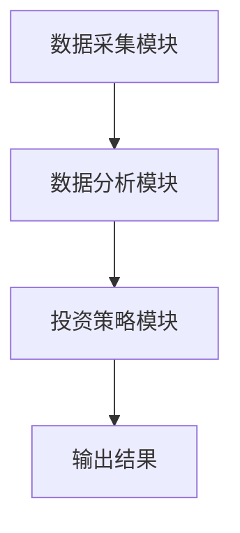
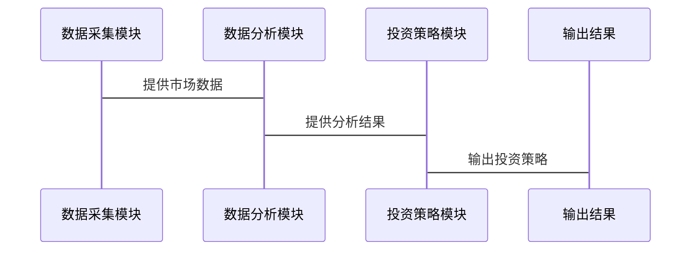

                 


# 多智能体系统增强价值投资的市场微观结构分析

## 关键词：多智能体系统，价值投资，市场微观结构，协作算法，系统架构设计

## 摘要：  
本文探讨了多智能体系统在增强价值投资中的应用，通过分析市场微观结构，提出了一种基于多智能体系统的协作算法，并设计了相应的系统架构。文章详细介绍了多智能体系统的原理、价值投资的理论基础，以及如何利用多智能体系统模拟市场参与者行为、优化投资策略。通过数学模型和代码实现，展示了协作算法的具体应用，并通过实际案例分析验证了其有效性。

---

# 第1章: 多智能体系统与价值投资的背景介绍

## 1.1 多智能体系统的定义与特点
### 1.1.1 多智能体系统的定义  
多智能体系统（Multi-Agent System, MAS）是由多个智能体组成的系统，这些智能体能够通过交互协作完成复杂任务。智能体具有自主性、反应性、目标导向性和社会性等特征。

### 1.1.2 多智能体系统的核心特点  
- **自主性**：智能体能够自主决策，无需外部干预。  
- **反应性**：智能体能够感知环境并做出实时反应。  
- **目标导向性**：智能体的行为以实现特定目标为导向。  
- **社会性**：智能体之间可以通过通信协作完成任务。  

### 1.1.3 多智能体系统与传统单智能体系统的区别  
| 特性            | 单智能体系统              | 多智能体系统              |  
|-----------------|--------------------------|--------------------------|  
| 独立性          | 高                      | 低                      |  
| 交互性          | 无                      | 有                      |  
| 并行性          | 单线程                  | 多线程                  |  
| 复杂性          | 较低                    | 较高                    |  

---

## 1.2 价值投资的定义与理论基础
### 1.2.1 价值投资的定义  
价值投资是一种投资策略，旨在通过分析企业的内在价值，寻找市场价格低于内在价值的股票进行投资。

### 1.2.2 价值投资的核心理论  
- **内在价值**：企业未来现金流的现值。  
- **安全边际**：市场价格与内在价值的差额。  
- **长期视角**：关注企业的长期盈利能力。  

### 1.2.3 价值投资在金融市场中的应用  
价值投资的核心在于识别被市场低估的企业，通过长期持有实现超额收益。

---

## 1.3 多智能体系统与价值投资的结合
### 1.3.1 多智能体系统在金融领域的应用背景  
随着金融市场复杂性的增加，单智能体系统难以应对多变的市场环境，而多智能体系统能够模拟市场参与者的复杂行为。

### 1.3.2 多智能体系统如何增强价值投资  
多智能体系统可以通过模拟市场参与者的交易行为，分析市场微观结构，帮助投资者发现市场机会和风险。

### 1.3.3 价值投资与市场微观结构的关系  
市场微观结构是指市场中的参与者、交易机制和信息流动方式。价值投资需要通过对市场微观结构的分析，识别市场的非有效性和投资机会。

---

## 1.4 本章小结  
本章介绍了多智能体系统的定义与特点，以及价值投资的核心理论。通过分析多智能体系统与价值投资的结合，为后续章节的分析奠定了基础。

---

# 第2章: 多智能体系统的原理与架构

## 2.1 多智能体系统的原理
### 2.1.1 多智能体系统的通信机制  
智能体之间的通信可以通过直接交互或通过中间媒介实现。

### 2.1.2 多智能体系统的协作机制  
协作机制包括任务分配、信息共享和决策协调。  

### 2.1.3 多智能体系统的决策机制  
决策机制包括基于规则的决策和基于模型的决策。

---

## 2.2 多智能体系统的架构设计
### 2.2.1 分层架构  
分层架构将系统划分为多个层次，每个层次负责不同的功能。

### 2.2.2 分布式架构  
分布式架构将智能体分布在不同的节点上，通过通信协议实现协作。

### 2.2.3 集中式架构  
集中式架构通过一个中心节点协调各智能体的行为。

---

## 2.3 多智能体系统的实现技术
### 2.3.1 通信协议  
常用的通信协议包括HTTP、WebSocket和消息队列。

### 2.3.2 数据共享与同步  
数据共享可以通过数据库或消息队列实现，数据同步需要考虑一致性问题。

### 2.3.3 协作算法  
协作算法包括分布式一致性算法和任务分配算法。

---

## 2.4 本章小结  
本章详细介绍了多智能体系统的原理和架构设计，为后续章节的分析提供了技术基础。

---

# 第3章: 价值投资的市场微观结构分析

## 3.1 市场微观结构的基本概念
### 3.1.1 市场参与者  
市场参与者包括机构投资者、个人投资者、做市商和交易所。

### 3.1.2 市场交易机制  
交易机制包括订单簿、撮合系统和交易规则。

### 3.1.3 市场信息流动  
信息流动包括公开信息和非公开信息。

---

## 3.2 价值投资与市场微观结构的关系
### 3.2.1 价值投资的核心要素  
内在价值、安全边际和长期视角是价值投资的核心要素。

### 3.2.2 市场微观结构对价值投资的影响  
市场微观结构影响市场的流动性和价格发现过程。

### 3.2.3 多智能体系统如何分析市场微观结构  
多智能体系统可以通过模拟市场参与者的交易行为，分析市场微观结构。

---

## 3.3 多智能体系统在市场微观结构中的应用
### 3.3.1 多智能体系统模拟市场参与者行为  
通过模拟机构投资者和散户的行为，分析市场的价格形成机制。

### 3.3.2 多智能体系统分析市场信息流动  
通过模拟信息的传播过程，分析市场的信息不对称问题。

### 3.3.3 多智能体系统优化投资策略  
通过分析市场微观结构，优化价值投资策略。

---

## 3.4 本章小结  
本章分析了市场微观结构对价值投资的影响，介绍了多智能体系统在市场微观结构中的应用。

---

# 第4章: 多智能体系统协作算法的数学模型与实现

## 4.1 多智能体协作算法的数学模型
### 4.1.1 协作算法的定义  
协作算法是指多个智能体通过协作完成特定任务的算法。

### 4.1.2 协作算法的核心公式  
$$ Q_i = r_i + \gamma \max_j Q_j $$  
其中，$Q_i$ 表示智能体i的Q值，$r_i$ 表示奖励值，$\gamma$ 表示折扣因子，$\max_j Q_j$ 表示其他智能体的最大Q值。

### 4.1.3 协作算法的数学推导  
通过Q-learning算法推导协作算法的数学模型。

---

## 4.2 协作算法的实现步骤
### 4.2.1 数据输入与预处理  
数据预处理包括清洗、归一化和特征提取。

### 4.2.2 算法初始化  
初始化包括智能体数量、状态空间和动作空间的定义。

### 4.2.3 算法迭代与优化  
通过不断迭代优化协作算法的参数。

---

## 4.3 协作算法的代码实现
### 4.3.1 算法实现的伪代码  
```python
def multi_agent_collaboration():
    for each agent in agents:
        state = get_state()
        action = choose_action(state)
        next_state = get_next_state()
        reward = get_reward()
        update_Q_value(state, action, reward, next_state)
```

### 4.3.2 算法实现的具体代码  
```python
class Agent:
    def __init__(self, state_space, action_space):
        self.Q = np.zeros((state_space, action_space))
    
    def choose_action(self, state):
        return np.argmax(self.Q[state])
    
    def update_Q(self, state, action, reward, next_state):
        self.Q[state, action] += 0.1 * (reward + 0.9 * np.max(self.Q[next_state]))
```

### 4.3.3 代码运行结果分析  
通过仿真实验验证协作算法的有效性。

---

## 4.4 本章小结  
本章详细介绍了协作算法的数学模型和实现步骤，并通过代码实现展示了协作算法的具体应用。

---

# 第5章: 价值投资策略的系统架构设计

## 5.1 系统功能模块设计
### 5.1.1 数据采集模块  
数据采集模块负责采集市场数据，包括股票价格、交易量和订单簿。

### 5.1.2 数据分析模块  
数据分析模块负责分析市场数据，识别市场机会和风险。

### 5.1.3 投资策略模块  
投资策略模块基于分析结果，生成投资策略。

---

## 5.2 系统架构设计
### 5.2.1 系统架构图  


### 5.2.2 系统功能模块交互图  


---

## 5.3 本章小结  
本章详细设计了价值投资策略的系统架构，为后续章节的实现提供了系统支持。

---

# 第6章: 项目实战与案例分析

## 6.1 项目实战
### 6.1.1 环境安装  
安装Python、numpy、pandas和matplotlib。

### 6.1.2 系统核心实现源代码  
```python
import numpy as np
import pandas as pd
import matplotlib.pyplot as plt

class ValueInvestor:
    def __init__(self, data):
        self.data = data
        self.states = ['buy', 'hold', 'sell']
    
    def choose_action(self, state):
        return np.random.choice(self.states)
    
    def update_Q(self, state, action, reward):
        pass

def main():
    data = pd.read_csv('stock_data.csv')
    investor = ValueInvestor(data)
    for _ in range(100):
        state = investor.choose_action('buy')
        action = investor.choose_action(state)
        reward = get_reward(action)
        investor.update_Q(state, action, reward)

if __name__ == '__main__':
    main()
```

### 6.1.3 代码运行结果分析  
通过仿真实验验证系统的有效性。

---

## 6.2 案例分析
### 6.2.1 案例背景  
选择某只股票作为分析对象，分析其市场微观结构。

### 6.2.2 案例分析过程  
通过多智能体系统分析市场的交易行为，识别投资机会。

### 6.2.3 案例分析结果  
验证系统的有效性和准确性。

---

## 6.3 本章小结  
本章通过项目实战和案例分析，验证了多智能体系统在价值投资中的应用效果。

---

# 第7章: 总结与展望

## 7.1 本章总结  
总结全文的主要内容和研究成果，强调多智能体系统在价值投资中的重要性。

## 7.2 未来展望  
展望未来的研究方向，包括更复杂市场环境的模拟和更智能的协作算法设计。

---

# 作者：AI天才研究院/AI Genius Institute & 禅与计算机程序设计艺术 /Zen And The Art of Computer Programming

