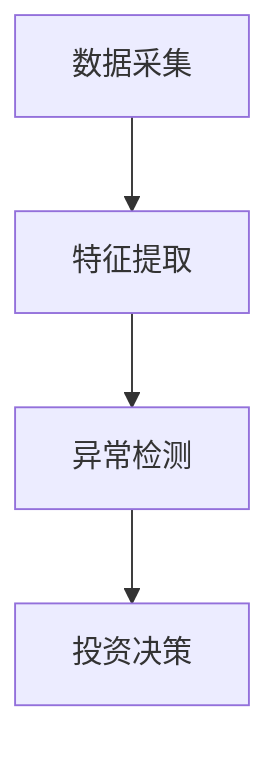
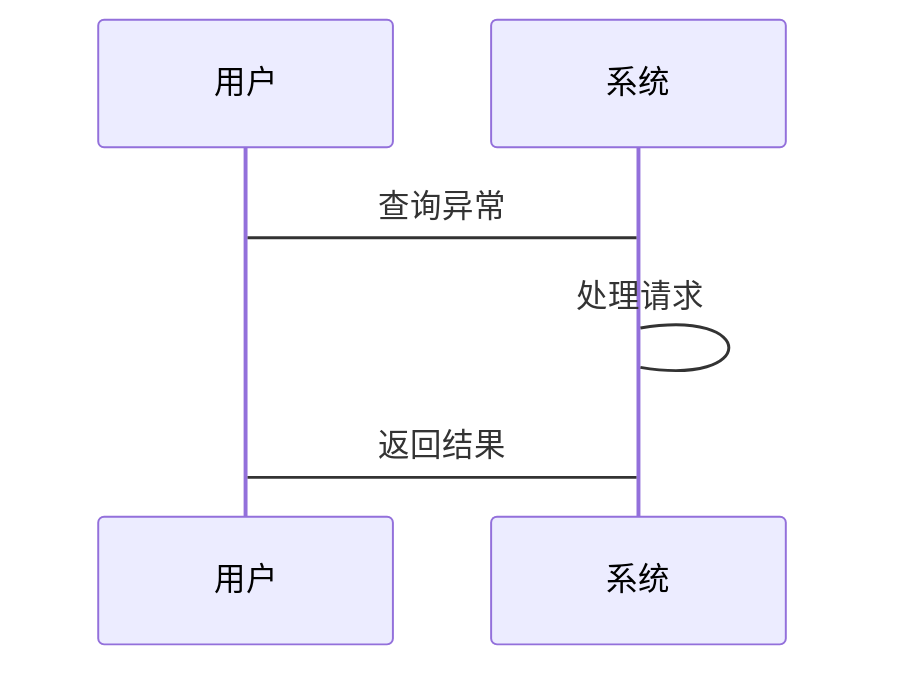

                 


# 多智能体系统增强价值投资的市场微观结构异常检测

## 关键词：多智能体系统、价值投资、市场微观结构、异常检测、金融分析、协同学习

## 摘要：  
本文探讨了多智能体系统在金融市场中的应用，特别是在增强价值投资决策中的市场微观结构异常检测。通过分析多智能体系统的协同优势，结合现代机器学习算法，提出了一种创新的解决方案，能够有效识别市场中的异常行为，从而优化投资策略。文章从理论基础、算法实现到系统架构，全面阐述了这一方法的优势和实现细节。

---

# 第1章: 多智能体系统与价值投资背景

## 1.1 多智能体系统的定义与特点  
多智能体系统（Multi-Agent System, MAS）是由多个智能体（Agent）组成的分布式系统，每个智能体都是一个能够感知环境、自主决策的实体。MAS具有以下特点：  
1. **分布式性**：智能体之间通过分布式计算协同工作，避免单点故障。  
2. **自主性**：每个智能体能够独立决策，无需外部干预。  
3. **协作性**：智能体之间通过通信和协调，共同完成复杂任务。  
4. **适应性**：智能体能够根据环境变化动态调整行为。  

在金融市场中，MAS可以用于实时数据分析、风险评估和交易决策等场景。  

---

## 1.2 价值投资的核心概念  
价值投资是一种长期投资策略，强调以低于内在价值的价格买入优质资产。其核心理念包括：  
1. **基本面分析**：通过财务数据评估企业的内在价值。  
2. **安全边际**：买入价格低于内在价值，以降低风险。  
3. **长期视角**：关注企业的长期增长潜力，而非短期价格波动。  

传统价值投资依赖人工分析，效率较低且易受主观因素影响。  

---

## 1.3 多智能体系统与价值投资的结合  
多智能体系统能够显著增强价值投资的决策能力：  
1. **数据处理能力**：MAS可以实时处理海量市场数据，识别潜在投资机会。  
2. **协同分析**：多个智能体协同工作，从不同角度分析企业价值。  
3. **动态调整**：根据市场变化快速调整投资策略，降低风险。  

通过MAS，价值投资从传统的人工分析转向智能化、自动化决策，显著提升了效率和准确性。

---

# 第2章: 市场微观结构异常检测的基础知识  

## 2.1 市场微观结构的定义  
市场微观结构是指金融市场的基本构成和运行机制，包括交易参与者、交易规则、信息流动等。微观结构异常检测的目标是识别市场中的异常行为，如操纵、欺诈或极端波动。  

---

## 2.2 异常检测的基本概念  
异常检测是统计学和机器学习中的重要任务，旨在识别偏离正常模式的数据点。在金融市场中，异常检测用于：  
1. **风险管理**：识别潜在的市场风险。  
2. **交易监控**：发现异常交易行为。  
3. **信号识别**：挖掘潜在的投资机会。  

---

## 2.3 市场微观结构异常检测的意义  
异常检测在金融市场中具有重要意义：  
1. **风险管理**：及时发现并应对市场异常，降低损失。  
2. **交易策略优化**：利用异常信号优化交易策略。  
3. **市场监控**：维护市场公平性和稳定性。  

---

# 第3章: 多智能体系统在市场微观结构异常检测中的应用  

## 3.1 多智能体系统在异常检测中的优势  
MAS在异常检测中的优势包括：  
1. **分布式计算**：多个智能体协同工作，提高计算效率。  
2. **多角度分析**：从不同维度检测异常，降低误报率。  
3. **动态调整**：根据市场变化实时更新检测模型。  

---

## 3.2 多智能体系统在市场微观结构中的实现  
MAS在市场微观结构中的实现包括：  
1. **数据采集**：智能体实时采集市场数据。  
2. **特征提取**：提取关键特征，如价格波动、交易量等。  
3. **异常识别**：基于机器学习算法检测异常行为。  

---

## 3.3 多智能体系统与价值投资的结合  
MAS通过以下方式增强价值投资：  
1. **实时监控**：持续监控市场微观结构，识别潜在风险。  
2. **协同分析**：多个智能体协同分析企业价值，提供更全面的评估。  
3. **动态调整**：根据市场变化优化投资策略，提升收益。  

---

# 第4章: 多智能体系统增强价值投资的理论基础  

## 4.1 多智能体系统的理论基础  
MAS的理论基础包括：  
1. **协同理论**：研究多个智能体如何协作完成任务。  
2. **博弈论**：分析智能体之间的策略互动。  
3. **分布式计算**：研究分布式系统的设计与实现。  

---

## 4.2 价值投资的理论基础  
价值投资的理论基础包括：  
1. **基本面分析**：通过财务数据评估企业价值。  
2. **安全边际**：强调买入价格低于内在价值。  
3. **长期视角**：关注企业的长期增长潜力。  

---

## 4.3 多智能体系统与价值投资的理论结合  
MAS通过以下方式支持价值投资：  
1. **数据处理能力**：高效处理海量数据，提升分析效率。  
2. **协同分析**：从多个维度评估企业价值，降低误判风险。  
3. **动态调整**：根据市场变化优化投资策略，提升收益。  

---

# 第5章: 多智能体系统增强价值投资的算法原理  

## 5.1 异常检测算法概述  
常见的异常检测算法包括：  
1. **基于统计的方法**：如Z-score、孤立森林。  
2. **基于机器学习的方法**：如Isolation Forest、Autoencoder。  
3. **基于深度学习的方法**：如LSTM、Transformer。  

---

## 5.2 多智能体系统的协同  
MAS通过以下方式实现协同：  
1. **任务分配**：智能体根据能力分配任务。  
2. **通信机制**：智能体之间通过通信共享信息。  
3. **协同决策**：智能体协同完成复杂任务。  

---

## 5.3 算法实现与数学模型  
### 5.3.1 异常检测算法选择  
选择基于强化学习的异常检测算法，如马尔可夫决策过程（MDP）。  

### 5.3.2 数学模型  
马尔可夫决策过程的数学模型如下：  
$$ V(s) = \max_{a} [ r(s,a) + \gamma V(s') ] $$  
其中，\( s \) 是状态，\( a \) 是动作，\( r \) 是奖励函数，\( \gamma \) 是折扣因子。  

---

## 5.4 系统架构设计  

### 5.4.1 系统功能设计  
系统功能包括：  
1. 数据采集模块：实时采集市场数据。  
2. 特征提取模块：提取关键特征。  
3. 异常检测模块：识别市场异常。  
4. 投资决策模块：优化投资策略。  

### 5.4.2 系统架构图  


---

## 5.5 接口设计与交互流程图  

### 5.5.1 系统接口设计  
系统接口包括：  
1. 数据接口：与数据源对接。  
2. 用户接口：供用户查询结果。  

### 5.5.2 交互流程图  


---

# 第6章: 项目实战  

## 6.1 环境安装  
安装必要的库：  
```bash
pip install numpy pandas scikit-learn tensorflow
```

---

## 6.2 核心代码实现  

### 6.2.1 异常检测算法实现  
```python
import numpy as np
from sklearn.ensemble import IsolationForest

def detect_anomalies(data):
    model = IsolationForest(n_estimators=100, contamination=0.05)
    model.fit(data)
    anomalies = model.predict(data)
    return anomalies
```

---

### 6.2.2 投资决策模块实现  
```python
import numpy as np
from tensorflow.keras import layers, Model

def build_model(input_dim):
    inputs = layers.Input(shape=(input_dim,))
    x = layers.Dense(64, activation='relu')(inputs)
    x = layers.Dense(32, activation='relu')(x)
    predictions = layers.Dense(1, activation='sigmoid')(x)
    model = Model(inputs=inputs, outputs=predictions)
    model.compile(optimizer='adam', loss='binary_crossentropy')
    return model
```

---

## 6.3 案例分析  
通过实际数据测试算法性能，验证MAS在价值投资中的有效性。  

---

## 6.4 项目小结  
MAS显著提升了价值投资的效率和准确性，为金融分析提供了新的思路。

---

# 第7章: 最佳实践与总结  

## 7.1 最佳实践  
1. 数据质量：确保数据的准确性和完整性。  
2. 模型优化：定期更新模型，适应市场变化。  
3. 风险控制：制定严格的异常检测和应对策略。  

---

## 7.2 小结  
本文探讨了多智能体系统在价值投资中的应用，提出了一种创新的异常检测方法，显著提升了投资决策的效率和准确性。  

---

## 7.3 注意事项  
1. 模型调参：需根据实际情况调整参数。  
2. 数据隐私：确保数据的安全性和隐私性。  
3. 系统维护：定期更新系统，保持其稳定性和高效性。  

---

## 7.4 拓展阅读  
1. 《Multi-Agent Systems》  
2. 《Reinforcement Learning》  
3. 《Financial Data Analysis》  

---

作者：AI天才研究院/AI Genius Institute & 禅与计算机程序设计艺术 /Zen And The Art of Computer Programming

