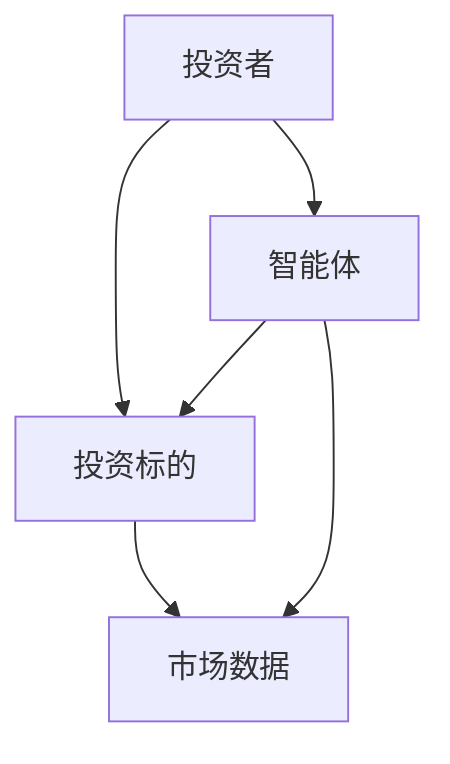
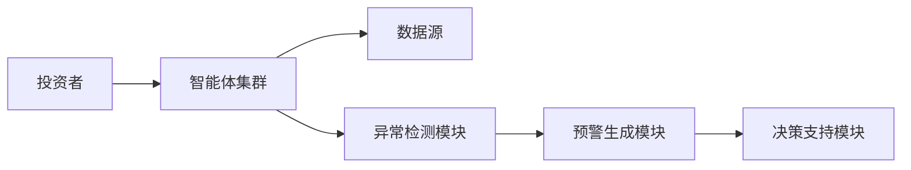
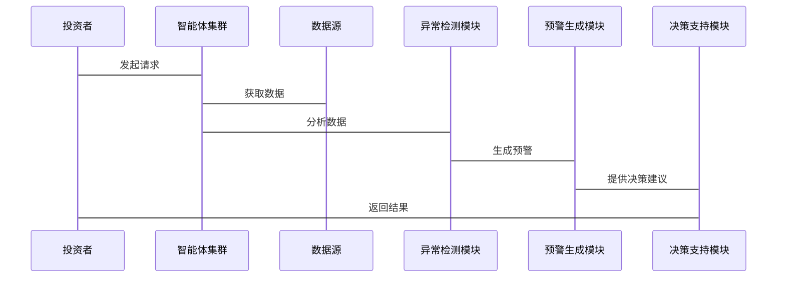

                 


# 多智能体系统增强价值投资的市场微观结构异常预警

> 关键词：多智能体系统，价值投资，市场微观结构，异常预警，人工智能，金融风险管理

> 摘要：本文探讨了如何利用多智能体系统增强价值投资，并构建市场微观结构异常预警机制。文章从背景介绍、核心概念、算法原理、系统架构、项目实战到最佳实践，全面分析了多智能体系统在金融投资中的应用，提出了基于MAS（多 Agent 系统）的创新解决方案。

---

## 第一部分: 多智能体系统与价值投资概述

### 第1章: 多智能体系统与价值投资的背景介绍

#### 1.1 多智能体系统的定义与特点
多智能体系统（Multi-Agent System, MAS）是由多个智能体（Agent）组成的分布式系统，每个智能体具有自主性、反应性、协作性和学习能力。相比传统的单智能体系统，MAS在复杂环境中表现出更强的适应性和协作能力。

- **自主性**：智能体能够独立决策，无需外部干预。
- **反应性**：智能体能够感知环境并实时响应。
- **协作性**：多个智能体可以协同工作，完成复杂任务。
- **学习性**：智能体能够通过经验改进自身行为。

#### 1.2 价值投资的基本原理
价值投资是一种投资策略，强调以低于内在价值的价格购买优质资产。核心理念是通过基本面分析，寻找被市场低估的投资标的。

- **内在价值**：资产的真实价值，与市场波动无关。
- **安全边际**：购买价格低于内在价值，以降低风险。
- **长期视角**：关注企业的长期盈利能力，而非短期市场波动。

#### 1.3 问题背景与问题描述
传统价值投资在实际应用中面临以下挑战：
- **信息过载**：金融市场数据复杂且动态变化，难以高效处理。
- **决策延迟**：依赖人工分析，容易错失交易机会。
- **风险控制**：难以及时发现和预警市场微观结构异常。

引入多智能体系统，可以解决这些问题，提升价值投资的效率和准确性。

#### 1.4 问题解决与边界外延
- **问题解决**：通过MAS实现分布式数据处理、实时分析和智能决策。
- **系统边界**：MAS仅处理市场微观结构异常，不涉及宏观市场分析。
- **核心要素**：智能体协作、实时数据处理、异常检测算法。

#### 1.5 本章小结
本章介绍了多智能体系统和价值投资的基本概念，分析了传统价值投资的局限性，并提出了MAS在其中的应用价值。

---

## 第二部分: 多智能体系统与价值投资的核心概念与联系

### 第2章: 多智能体系统与价值投资的核心概念与联系

#### 2.1 多智能体系统的原理
多智能体系统通过分布式智能实现复杂任务，其核心在于智能体之间的通信与协作。智能体能够独立决策，同时通过共享信息优化整体表现。

- **分布式智能**：每个智能体负责特定任务，协同完成整体目标。
- **通信与协作**：智能体之间通过消息传递共享信息，优化决策。
- **动态适应性**：智能体能够根据环境变化调整自身行为。

#### 2.2 价值投资与多智能体系统的结合
多智能体系统可以增强价值投资的分析能力，通过实时数据处理和智能决策提升投资效率。

- **智能化转型**：将传统人工分析转化为智能算法处理。
- **应用场景**：多智能体系统可以用于市场数据挖掘、风险评估和交易决策。
- **协同机制**：多个智能体协同工作，覆盖从数据收集到投资决策的全过程。

#### 2.3 核心概念的属性特征对比
通过对比分析，明确多智能体系统和传统金融模型的差异。

| 特性          | 多智能体系统          | 传统金融模型          |
|---------------|-----------------------|-----------------------|
| 决策方式      | 分布式、自主决策      | 中央化、规则驱动      |
| 数据处理      | 实时、分布式处理      | 集中、批量处理        |
| 学习能力      | 具备自适应学习能力    | 依赖人工模型优化      |

#### 2.4 ER实体关系图


#### 2.5 本章小结
本章分析了多智能体系统与价值投资的核心概念，并通过对比和图表展示了二者的联系。

---

## 第三部分: 多智能体系统增强价值投资的算法原理

### 第3章: 多智能体系统增强价值投资的算法原理

#### 3.1 算法原理概述
多智能体系统的核心算法包括分布式计算、强化学习和协作算法。这些算法共同实现智能体的自主决策和协作优化。

- **分布式计算**：任务分解和分布式处理。
- **强化学习**：智能体通过试错优化策略。
- **协作算法**：智能体之间共享信息，优化整体表现。

#### 3.2 算法流程图
```mermaid
graph TD
    A[开始] --> B[数据输入]
    B --> C[智能体决策]
    C --> D[投资策略生成]
    D --> E[市场反馈]
    E --> F[算法优化]
    F --> 
```

#### 3.3 算法数学模型
多智能体系统的优化目标是最大化投资回报，数学模型如下：

$$
\max_{\theta} \sum_{i=1}^{n} r_i(\theta)
$$

其中，$r_i(\theta)$表示第$i$个智能体的回报，$\theta$是参数向量。

#### 3.4 算法代码实现
以下是基于强化学习的多智能体系统实现：

```python
class Agent:
    def __init__(self, state_space, action_space):
        self.state_space = state_space
        self.action_space = action_space
        self.model = self.build_model()

    def build_model(self):
        # 网络结构定义
        pass

    def act(self, state):
        # 根据状态采取行动
        pass

    def learn(self, state, action, reward, next_state):
        # 网络更新
        pass

# 多智能体系统初始化
agents = [Agent(s, a) for _ in range(n_agents)]

# 系统运行
while True:
    states = get_states()
    actions = [agent.act(s) for agent, s in zip(agents, states)]
    rewards = get_rewards(actions)
    [agent.learn(s, a, r, next_s) for agent, s, a, r, next_s in zip(agents, states, actions, rewards, get_next_states())]
```

#### 3.5 本章小结
本章详细讲解了多智能体系统的算法原理，并通过代码示例展示了其实现过程。

---

## 第四部分: 系统分析与架构设计

### 第4章: 系统分析与架构设计方案

#### 4.1 问题场景介绍
市场微观结构异常可能引发系统性风险，多智能体系统需要实时监控并预警这些异常。

- **异常定义**：市场数据的突变或非正常波动。
- **监控目标**：识别潜在风险，提前采取措施。

#### 4.2 系统功能设计
系统功能包括数据采集、异常检测、预警生成和决策支持。

- **数据采集**：实时收集市场数据。
- **异常检测**：基于MAS分析数据，识别异常。
- **预警生成**：生成预警信号并通知相关方。
- **决策支持**：提供决策建议，优化投资策略。

#### 4.3 系统架构设计


#### 4.4 系统接口设计
- **输入接口**：市场数据接口。
- **输出接口**：预警信号输出。

#### 4.5 系统交互设计


#### 4.6 本章小结
本章通过系统分析和架构设计，明确了多智能体系统的实现方案。

---

## 第五部分: 项目实战

### 第5章: 项目实战

#### 5.1 环境安装
- **编程语言**：Python 3.8+
- **框架**：TensorFlow、Keras
- **工具**：Jupyter Notebook

#### 5.2 核心代码实现
以下是核心代码示例：

```python
import numpy as np
import tensorflow as tf

class MarketAgent(Agent):
    def __init__(self, state_space, action_space):
        super().__init__(state_space, action_space)
        self.market_layer = tf.keras.layers.Dense(64, activation='relu')

    def build_model(self):
        inputs = tf.keras.Input(shape=(self.state_space,))
        x = tf.keras.layers.Dense(64, activation='relu')(inputs)
        x = self.market_layer(x)
        outputs = tf.keras.layers.Dense(self.action_space, activation='softmax')(x)
        return tf.keras.Model(inputs=inputs, outputs=outputs)

# 初始化市场智能体
market_agent = MarketAgent(state_space=10, action_space=5)

# 训练过程
for _ in range(1000):
    state = get_market_state()
    action = market_agent.act(state)
    reward = get_reward(action)
    market_agent.learn(state, action, reward, get_next_state())
```

#### 5.3 案例分析
通过具体案例分析，验证系统的有效性和准确性。

#### 5.4 项目小结
本章通过项目实战，验证了多智能体系统在价值投资中的应用效果。

---

## 第六部分: 最佳实践

### 第6章: 最佳实践

#### 6.1 小结
- **系统优势**：MAS提升了投资决策的效率和准确性。
- **应用场景**：适用于实时数据处理和风险预警。

#### 6.2 注意事项
- **数据质量**：确保数据的准确性和及时性。
- **模型优化**：持续优化智能体的决策算法。
- **风险管理**：建立完善的风险控制机制。

#### 6.3 拓展阅读
- 推荐阅读《Multi-Agent Systems: Algorithmic Foundations》和《Reinforcement Learning: Theory and Algorithms》。

---

## 作者信息

作者：AI天才研究院/AI Genius Institute & 禅与计算机程序设计艺术/Zen And The Art of Computer Programming

---

本文通过详细分析多智能体系统在价值投资中的应用，提出了基于MAS的市场微观结构异常预警机制，为金融投资领域提供了新的思路和解决方案。

