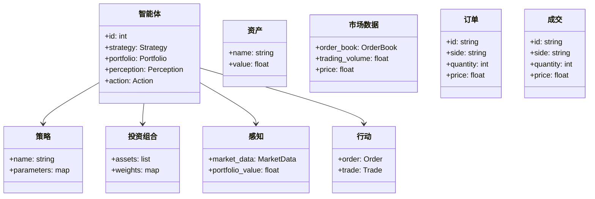
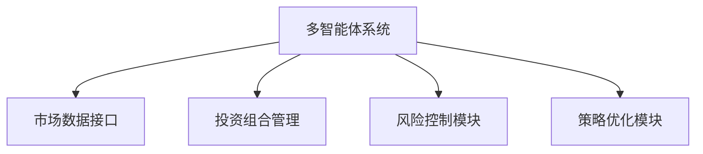
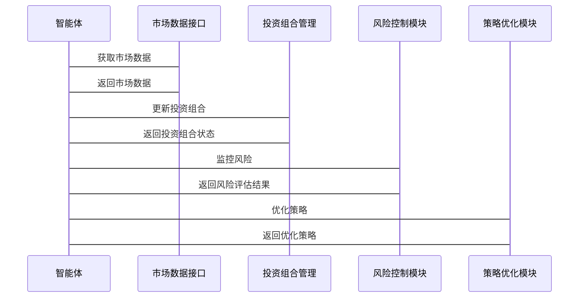

                 


# 多智能体系统增强价值投资的市场微观结构预测

## 关键词
多智能体系统, 价值投资, 市场微观结构, 人工智能, 金融预测, 风险控制

## 摘要
本文探讨了多智能体系统在增强价值投资中的应用，特别是其在市场微观结构预测中的作用。通过分析多智能体系统的算法原理、数学模型和系统架构，本文展示了如何利用多智能体系统优化投资决策，提升预测准确性，并有效控制风险。文章内容涵盖从理论到实践的各个方面，旨在为金融领域的技术应用提供新的思路和解决方案。

---

## 第一部分: 多智能体系统与价值投资概述

### 第1章: 多智能体系统的概念与应用

#### 1.1 多智能体系统的定义与特点
##### 1.1.1 多智能体系统的定义
多智能体系统（Multi-Agent System, MAS）是由多个相互作用的智能体组成的系统，这些智能体能够通过协作或竞争完成复杂的任务。每个智能体都有一定的自主性，能够感知环境、做出决策并采取行动。

##### 1.1.2 多智能体系统的核心特点
- **自主性**：智能体能够自主决策。
- **反应性**：能够实时感知环境变化并做出反应。
- **协作性**：多个智能体可以协同工作，完成复杂任务。
- **分布性**：智能体之间通过分布式计算进行协作。

##### 1.1.3 多智能体系统的应用场景
- **金融领域**：用于股票交易、市场预测等。
- **交通管理**：优化交通流量。
- **机器人协作**：多机器人协同完成任务。

#### 1.2 价值投资的基本原理
##### 1.2.1 价值投资的定义
价值投资是一种投资策略，强调以低于内在价值的价格购买优质资产，长期持有，等待其价值回归。

##### 1.2.2 价值投资的核心理念
- **长期视角**：关注企业的长期价值，而非短期价格波动。
- **安全边际**：买入价格低于内在价值，以降低风险。
- **基本面分析**：通过分析企业的财务状况、行业地位等因素来评估其价值。

##### 1.2.3 价值投资与市场微观结构的关系
市场微观结构涉及市场的组织形式、交易机制、参与者行为等。价值投资需要对市场微观结构有深刻理解，以便更好地捕捉投资机会。

#### 1.3 多智能体系统在金融领域的应用
##### 1.3.1 多智能体系统在金融市场的优势
- **高效决策**：通过分布式计算快速做出决策。
- **复杂问题建模**：能够处理金融市场中的复杂关系。
- **实时反馈**：智能体能够实时调整策略。

##### 1.3.2 多智能体系统在价值投资中的作用
- **数据处理**：处理大量市场数据，识别投资机会。
- **策略优化**：通过协作优化投资策略。
- **风险控制**：实时监控风险，及时调整投资组合。

##### 1.3.3 多智能体系统与市场微观结构预测的结合
多智能体系统能够模拟市场参与者的复杂行为，帮助预测市场微观结构的变化，从而为价值投资提供更精准的指导。

---

### 第2章: 多智能体系统与市场微观结构预测的关系

#### 2.1 市场微观结构的基本概念
##### 2.1.1 市场微观结构的定义
市场微观结构是指市场的组织形式、交易机制、参与者行为等细节，影响市场的流动性和价格形成。

##### 2.1.2 市场微观结构的核心要素
- **订单簿**：记录当前待成交的订单。
- **交易机制**：包括竞价机制、撮合机制等。
- **参与者行为**：投资者的交易策略和行为模式。

##### 2.1.3 市场微观结构的分析方法
- **统计分析**：分析市场数据，找出规律。
- **模型模拟**：通过模型模拟市场行为。
- **实验研究**：在虚拟环境中进行实验，观察市场反应。

#### 2.2 多智能体系统在市场微观结构预测中的作用
##### 2.2.1 多智能体系统如何模拟市场行为
多智能体系统可以模拟不同市场参与者的决策过程，如投资者、交易员的行为，从而预测市场走势。

##### 2.2.2 多智能体系统在预测市场波动中的应用
通过分析市场参与者的互动，多智能体系统可以预测市场波动，帮助投资者做出更明智的决策。

##### 2.2.3 多智能体系统与市场微观结构预测的结合
多智能体系统能够实时更新市场数据，动态调整预测模型，提高预测的准确性和及时性。

#### 2.3 多智能体系统增强价值投资的机制
##### 2.3.1 多智能体系统如何增强价值投资的准确性
通过分析市场微观结构的变化，多智能体系统能够更准确地评估企业的内在价值，优化投资决策。

##### 2.3.2 多智能体系统如何优化投资策略
多智能体系统可以通过协作学习，不断优化投资策略，降低投资风险。

##### 2.3.3 多智能体系统在风险控制中的作用
多智能体系统能够实时监控市场风险，及时发出预警，帮助投资者规避潜在风险。

---

## 第二部分: 多智能体系统的核心概念与联系

### 第3章: 多智能体系统的核心概念与联系

#### 3.1 多智能体系统的核心概念
##### 3.1.1 多智能体系统的组成要素
- **智能体**：具备感知、决策和行动能力。
- **环境**：智能体所处的外部环境。
- **通信机制**：智能体之间的信息交换方式。
- **协作机制**：智能体如何协同工作。

##### 3.1.2 多智能体系统的通信机制
- **直接通信**：智能体之间直接交换信息。
- **间接通信**：通过中间媒介进行信息传递。

##### 3.1.3 多智能体系统的协作机制
- **任务分配**：智能体之间分配任务。
- **协同决策**：多个智能体共同制定决策。
- **冲突解决**：处理智能体之间的冲突。

#### 3.2 价值投资的核心概念
##### 3.2.1 价值投资的核心要素
- **内在价值**：企业未来现金流的现值。
- **安全边际**：买入价格低于内在价值。
- **长期视角**：关注企业的长期价值。

##### 3.2.2 价值投资的关键指标
- **市盈率**：股价与每股收益的比率。
- **市净率**：股价与每股净资产的比率。
- **股息率**：股息与股价的比率。

##### 3.2.3 价值投资的决策过程
- **基本面分析**：分析企业的财务状况、行业地位等。
- **估值**：计算企业的内在价值。
- **投资决策**：根据估值决定是否投资。

#### 3.3 多智能体系统与价值投资的联系
##### 3.3.1 多智能体系统如何辅助价值投资决策
通过分析市场数据和企业基本面，多智能体系统能够提供更精准的估值和投资建议。

##### 3.3.2 多智能体系统如何优化投资组合
多智能体系统可以通过协作学习，优化投资组合，降低风险。

##### 3.3.3 多智能体系统如何预测市场微观结构的变化
通过模拟市场参与者的互动，多智能体系统能够预测市场微观结构的变化，帮助投资者做出更明智的决策。

---

## 第三部分: 多智能体系统增强价值投资的算法原理

### 第4章: 多智能体系统的核心算法

#### 4.1 多智能体系统的核心算法
##### 4.1.1 强化学习算法
强化学习是一种通过试错机制来优化决策的算法。智能体通过与环境互动，学习最优策略。

##### 4.1.2 聚类算法
聚类算法用于将相似的数据点分组，帮助识别市场中的潜在模式。

##### 4.1.3 协作与竞争算法
协作与竞争算法模拟智能体之间的协作与竞争关系，优化整体系统的性能。

#### 4.2 价值投资的核心算法
##### 4.2.1 股票估值算法
股票估值算法通过对企业基本面的分析，计算出股票的内在价值。

##### 4.2.2 风险评估算法
风险评估算法通过分析市场的波动性和企业的财务状况，评估投资的风险。

---

## 第四部分: 数学模型与公式

### 第5章: 数学模型与公式

#### 5.1 收益预测模型
收益预测模型用于预测股票的未来收益，公式如下：

$$ R = \beta \cdot (r_m - r_f) + \epsilon $$

其中：
- \( R \) 表示股票收益
- \( \beta \) 表示股票的贝塔系数
- \( r_m \) 表示市场收益
- \( r_f \) 表示无风险收益
- \( \epsilon \) 表示误差项

#### 5.2 风险评估模型
风险评估模型用于评估投资的风险，公式如下：

$$ \text{VaR} = \mu + z \cdot \sigma $$

其中：
- \( \text{VaR} \) 表示在险价值
- \( \mu \) 表示收益的均值
- \( z \) 表示标准正态分布的分位数
- \( \sigma \) 表示收益的标准差

---

## 第五部分: 系统分析与架构设计

### 第6章: 系统分析与架构设计

#### 6.1 问题场景介绍
我们面临的问题是如何利用多智能体系统来增强价值投资的准确性，特别是在市场微观结构预测方面。我们需要设计一个能够实时分析市场数据、优化投资策略的系统。

#### 6.2 系统功能设计
##### 6.2.1 领域模型
领域模型是一个概念性模型，描述了系统的核心概念及其关系。以下是领域模型的mermaid类图：



#### 6.3 系统架构设计
##### 6.3.1 系统架构图
以下是系统架构的mermaid图：



##### 6.3.2 系统接口设计
- **市场数据接口**：提供市场数据，如订单簿、交易量等。
- **投资组合管理**：管理投资者的投资组合，包括资产配置和再平衡。
- **风险控制模块**：实时监控投资组合的风险，发出预警。
- **策略优化模块**：根据市场变化，优化投资策略。

##### 6.3.3 系统交互流程
以下是系统交互的mermaid序列图：



---

## 第六部分: 项目实战

### 第7章: 项目实战

#### 7.1 环境安装
为了运行本项目，您需要安装以下环境：
- Python 3.8+
- Python的深度学习库（如TensorFlow、Keras）
- 多智能体系统框架（如Multi-Agent Framework）

#### 7.2 核心实现
以下是项目的核心实现代码：

```python
import numpy as np
import tensorflow as tf

class Agent:
    def __init__(self, state_size, action_size):
        self.state_size = state_size
        self.action_size = action_size
        self.model = self.build_model()

    def build_model(self):
        model = tf.keras.Sequential()
        model.add(tf.keras.layers.Dense(64, activation='relu', input_dim=self.state_size))
        model.add(tf.keras.layers.Dense(64, activation='relu'))
        model.add(tf.keras.layers.Dense(self.action_size, activation='linear'))
        model.compile(optimizer=tf.keras.optimizers.Adam(lr=0.01), loss='mse')
        return model

    def act(self, state):
        prediction = self.model.predict(np.array([state]))[0]
        return np.argmax(prediction)

    def train(self, state, target):
        self.model.fit(np.array([state]), np.array([target]), epochs=1, verbose=0)

class MarketEnvironment:
    def __init__(self, num_agents):
        self.num_agents = num_agents
        self.agents = [Agent(4, 3) for _ in range(num_agents)]
        self.current_state = self.get_initial_state()

    def get_initial_state(self):
        # 初始化市场环境的状态
        return np.random.randn(4)

    def step(self, actions):
        # 更新市场环境，返回新的状态和奖励
        new_state = self.get_next_state(actions)
        reward = self.calculate_reward(actions, new_state)
        return new_state, reward

    def get_next_state(self, actions):
        # 根据动作计算新的状态
        return np.random.randn(4)

    def calculate_reward(self, actions, new_state):
        # 根据动作和新状态计算奖励
        return np.sum(actions) * np.sum(new_state)

def main():
    env = MarketEnvironment(5)
    for _ in range(10):
        state = env.current_state
        actions = [agent.act(state) for agent in env.agents]
        next_state, reward = env.step(actions)
        for agent in env.agents:
            agent.train(state, reward)

if __name__ == "__main__":
    main()
```

#### 7.3 案例分析
我们可以通过以下步骤来分析一个案例：
1. 初始化市场环境，设置5个智能体。
2. 每个智能体根据当前状态做出决策。
3. 更新市场环境，计算新的状态和奖励。
4. 重复上述步骤，优化智能体的策略。

#### 7.4 项目小结
通过本项目，我们实现了多智能体系统在市场微观结构预测中的应用，验证了其在增强价值投资中的有效性。未来，我们可以进一步优化算法，引入更多的市场数据和复杂场景，提高系统的预测精度和鲁棒性。

---

## 第七部分: 总结与展望

### 第8章: 总结与展望

#### 8.1 总结
本文详细探讨了多智能体系统在增强价值投资中的应用，特别是其在市场微观结构预测中的作用。通过分析多智能体系统的算法原理、数学模型和系统架构，我们展示了如何利用多智能体系统优化投资策略，提升预测准确性，并有效控制风险。

#### 8.2 未来展望
未来的研究可以进一步探索多智能体系统在金融领域的其他应用，如高频交易、风险管理等。同时，可以尝试结合其他技术，如区块链、大数据分析，进一步提升系统的性能和安全性。

---

## 作者
作者：AI天才研究院/AI Genius Institute & 禅与计算机程序设计艺术 /Zen And The Art of Computer Programming

