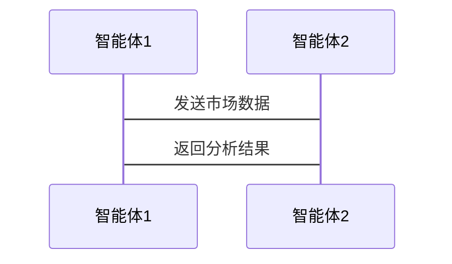
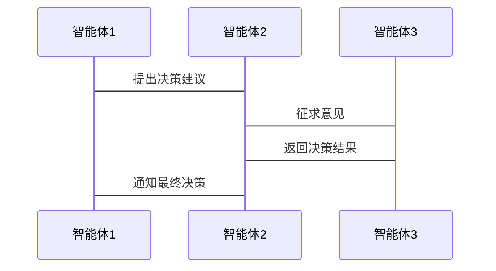
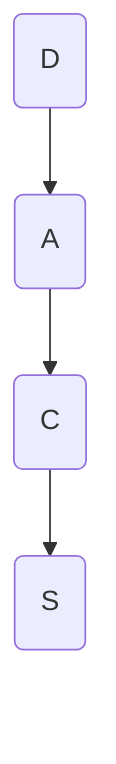
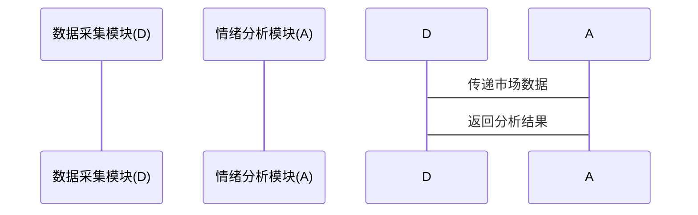
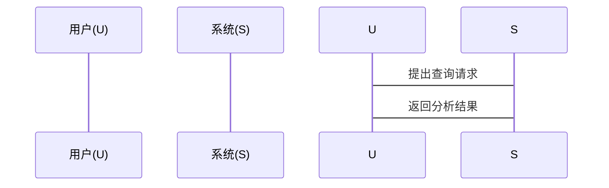

                 


# 多智能体系统增强价值投资的市场情绪拐点识别

> 关键词：多智能体系统，价值投资，市场情绪拐点，协同决策，人工智能

> 摘要：本文探讨了多智能体系统在价值投资中的应用，特别是其在市场情绪拐点识别中的增强作用。通过分析多智能体系统的算法原理和系统架构，结合实际项目案例，展示了如何利用多智能体系统来提升投资决策的准确性和效率。

---

## 第一章: 多智能体系统与市场情绪拐点识别概述

### 1.1 问题背景与定义
#### 1.1.1 多智能体系统的定义与特点
多智能体系统（Multi-Agent System, MAS）是由多个智能体组成的分布式系统，这些智能体能够通过交互和协同完成复杂任务。与单智能体系统相比，MAS具有更高的灵活性和适应性。

#### 1.1.2 市场情绪拐点识别的定义
市场情绪拐点是指市场情绪从上涨趋势转向下跌趋势，或反之的临界点。准确识别拐点对投资决策至关重要，因为它可以帮助投资者提前做出反应。

#### 1.1.3 多智能体系统在价值投资中的应用前景
价值投资依赖于对市场情绪的准确判断，而多智能体系统能够通过协同决策和信息共享，提高情绪分析的准确性。

### 1.2 问题描述与解决
#### 1.2.1 传统价值投资的局限性
传统价值投资依赖于分析师的主观判断，存在信息处理不全面和决策滞后的问题。

#### 1.2.2 市场情绪对投资决策的影响
市场情绪直接影响投资者的决策，但情绪的波动性使其难以捕捉和预测。

#### 1.2.3 多智能体系统如何增强价值投资
多智能体系统通过分布式计算和协同决策，能够更全面地分析市场数据，识别潜在的情绪拐点。

### 1.3 研究目标与框架
#### 1.3.1 研究目标的设定
本研究旨在探索多智能体系统在市场情绪拐点识别中的应用，并评估其对价值投资的增强效果。

#### 1.3.2 研究框架的设计
研究框架包括数据采集、情绪分析、协同决策和结果评估四个主要阶段。

#### 1.3.3 研究的意义与价值
通过本研究，可以为投资者提供更精准的市场情绪分析工具，提高投资决策的科学性和效率。

---

## 第二章: 多智能体系统的核心概念与联系

### 2.1 多智能体系统的定义与属性
#### 2.1.1 多智能体系统的定义
多智能体系统是由多个智能体组成的分布式系统，这些智能体能够通过交互和协同完成复杂任务。

#### 2.1.2 多智能体系统的属性特征对比表格
| 属性 | 定义 |
|------|------|
| 分布式 | 系统由多个智能体组成，每个智能体独立运行 |
| 协同性 | 智能体之间通过通信和协作完成任务 |
| 反应性 | 系统能够实时响应环境变化 |

#### 2.1.3 多智能体系统的ER实体关系图
```mermaid
er
actor(投资者) -->
market_data(市场数据) -->
mood_analysis(情绪分析)
```

### 2.2 市场情绪拐点识别的定义与属性
#### 2.2.1 市场情绪拐点的定义
市场情绪拐点是指市场情绪从上涨趋势转向下跌趋势，或反之的临界点。

#### 2.2.2 市场情绪拐点的属性特征对比表格
| 属性 | 定义 |
|------|------|
| 时间性 | 指定某一时间段内的情绪变化 |
| 情绪强度 | 衡量情绪波动的程度 |
| 可预测性 | 通过分析历史数据预测未来的情绪变化 |

#### 2.2.3 市场情绪拐点与投资决策的关系
市场情绪拐点是投资决策的关键参考点，准确识别拐点可以提高投资收益。

### 2.3 多智能体系统与价值投资的关系
#### 2.3.1 多智能体系统在价值投资中的作用
多智能体系统通过协同分析市场数据，帮助投资者更准确地识别市场情绪拐点。

#### 2.3.2 价值投资与市场情绪拐点的关系
价值投资依赖于对市场情绪的准确判断，市场情绪拐点是价值投资的重要决策依据。

#### 2.3.3 多智能体系统如何增强市场情绪拐点识别
通过分布式计算和协同决策，多智能体系统能够更全面地分析市场数据，提高情绪拐点识别的准确性和效率。

---

## 第三章: 多智能体系统增强价值投资的算法原理

### 3.1 多智能体系统的行为建模
#### 3.1.1 多智能体系统的行为建模方法
行为建模是通过定义智能体的行为规则和策略，使其能够根据环境变化做出反应。

#### 3.1.2 多智能体系统的行为建模流程
1. 确定智能体的目标和约束。
2. 定义智能体的行为规则。
3. 实现智能体的交互和协作。

#### 3.1.3 多智能体系统的行为建模案例
假设我们有一个由三个智能体组成的系统，每个智能体负责分析不同的市场数据，协同完成情绪拐点识别。

### 3.2 多智能体系统的通信机制
#### 3.2.1 多智能体系统通信机制的定义
通信机制是指智能体之间通过消息传递进行信息共享的方式。

#### 3.2.2 多智能体系统通信机制的实现方式
1. 使用消息队列进行异步通信。
2. 通过共享内存进行同步通信。

#### 3.2.3 多智能体系统通信机制的实现案例


### 3.3 多智能体系统的协同决策
#### 3.3.1 多智能体系统协同决策的定义
协同决策是指多个智能体通过协作完成决策任务。

#### 3.3.2 多智能体系统协同决策的实现方式
1. 基于协商的决策方法。
2. 基于拍卖的决策方法。

#### 3.3.3 多智能体系统协同决策的实现案例


### 3.4 多智能体系统的算法原理
#### 3.4.1 多智能体系统的算法原理
多智能体系统的算法原理包括状态表示、动作选择和奖励函数。

#### 3.4.2 多智能体系统的数学模型
$$ Q(s, a) = r + \gamma \max_a Q(s', a') $$
其中，$s$是当前状态，$a$是动作，$r$是奖励，$\gamma$是折扣因子。

---

## 第四章: 多智能体系统增强价值投资的系统架构设计

### 4.1 系统架构设计概述
#### 4.1.1 系统架构设计的定义
系统架构设计是指对系统的整体结构和组成部分进行规划和设计。

#### 4.1.2 多智能体系统的架构类型
1. 分层架构。
2. 对等架构。

#### 4.1.3 系统架构设计的优缺点对比
| 架构类型 | 优点 | 缺点 |
|------|------|------|
| 分层架构 | 结构清晰 | 灵活性较低 |
| 对等架构 | 灵活性高 | 结构复杂 |

### 4.2 多智能体系统的功能设计
#### 4.2.1 系统功能模块划分
1. 数据采集模块。
2. 情绪分析模块。
3. 协同决策模块。
4. 决策支持模块。

#### 4.2.2 系统功能模块的实现
1. 数据采集模块负责收集市场数据。
2. 情绪分析模块对数据进行处理和分析。
3. 协同决策模块基于分析结果做出决策。
4. 决策支持模块提供决策支持和反馈。

#### 4.2.3 系统功能模块的交互流程


### 4.3 多智能体系统的架构设计
#### 4.3.1 多智能体系统的架构类型
1. 分层架构。
2. 对等架构。

#### 4.3.2 系统架构的实现
1. 分层架构：智能体分为感知层、决策层和执行层。
2. 对等架构：智能体之间对等交互，无明确层次划分。

#### 4.3.3 系统架构的优缺点对比
| 架构类型 | 优点 | 缺点 |
|------|------|------|
| 分层架构 | 结构清晰 | 灵活性较低 |
| 对等架构 | 灵活性高 | 结构复杂 |

### 4.4 系统接口设计
#### 4.4.1 系统接口的定义
系统接口是指系统与其他组件之间的交互界面。

#### 4.4.2 系统接口的实现
1. 数据接口：定义数据格式和传输协议。
2. 通信接口：定义智能体之间的通信方式。

#### 4.4.3 系统接口的实现案例


### 4.5 系统交互设计
#### 4.5.1 系统交互的定义
系统交互是指系统与用户或其他系统之间的互动。

#### 4.5.2 系统交互的实现
1. 用户与系统的交互。
2. 系统与外部系统的交互。

#### 4.5.3 系统交互的实现案例


---

## 第五章: 多智能体系统增强价值投资的项目实战

### 5.1 项目背景介绍
#### 5.1.1 项目背景
本项目旨在利用多智能体系统提高市场情绪拐点识别的准确性，从而增强价值投资的效果。

#### 5.1.2 项目目标
1. 实现多智能体系统的市场情绪分析功能。
2. 验证系统在价值投资中的应用效果。

#### 5.1.3 项目实施步骤
1. 数据采集与预处理。
2. 情绪分析模型的构建。
3. 协同决策算法的实现。
4. 系统测试与优化。

### 5.2 项目核心实现
#### 5.2.1 多智能体系统的环境配置
1. 安装必要的开发工具和库。
2. 配置分布式计算环境。

#### 5.2.2 多智能体系统的数据处理
1. 数据清洗与预处理。
2. 数据特征提取。

#### 5.2.3 多智能体系统的模型实现
1. 情绪分析模型的训练。
2. 协同决策算法的实现。

#### 5.2.4 多智能体系统的测试与优化
1. 系统功能测试。
2. 性能优化。

### 5.3 项目实战小结
#### 5.3.1 项目成果总结
通过本项目，我们成功实现了多智能体系统的市场情绪分析功能，并验证了其在价值投资中的应用效果。

#### 5.3.2 项目经验总结
在项目实施过程中，我们积累了丰富的经验，特别是在多智能体系统的协同决策和通信机制方面。

#### 5.3.3 项目改进建议
未来可以进一步优化系统性能，扩大系统的应用范围。

---

## 第六章: 多智能体系统增强价值投资的最佳实践

### 6.1 项目成果总结
#### 6.1.1 项目成果的总结
通过本项目，我们成功实现了多智能体系统的市场情绪分析功能，并验证了其在价值投资中的应用效果。

#### 6.1.2 项目经验的总结
在项目实施过程中，我们积累了丰富的经验，特别是在多智能体系统的协同决策和通信机制方面。

#### 6.1.3 项目改进建议
未来可以进一步优化系统性能，扩大系统的应用范围。

### 6.2 投资决策中的注意事项
#### 6.2.1 市场情绪分析的局限性
市场情绪分析只能提供参考，不能完全依赖情绪分析结果做出决策。

#### 6.2.2 多智能体系统的适用场景
多智能体系统适用于复杂、动态的市场环境。

#### 6.2.3 投资决策的综合考虑
投资决策需要综合考虑多种因素，如市场趋势、公司基本面等。

### 6.3 系统优化与未来研究方向
#### 6.3.1 系统优化建议
1. 提高系统的实时性。
2. 优化系统的可扩展性。

#### 6.3.2 未来研究方向
1. 研究更高效的协同决策算法。
2. 探索多智能体系统在其他金融领域的应用。

---

## 作者：AI天才研究院/AI Genius Institute & 禅与计算机程序设计艺术 /Zen And The Art of Computer Programming

---

通过本文的详细分析，我们展示了多智能体系统在市场情绪拐点识别中的应用，及其对价值投资的增强作用。希望本文能够为投资者和研究人员提供有益的参考和启示。

