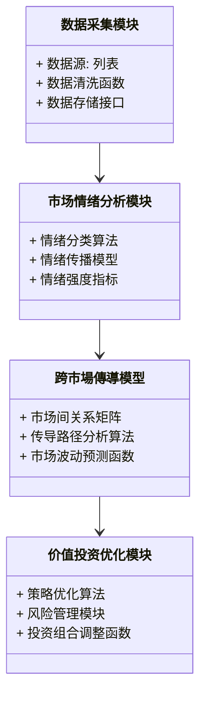
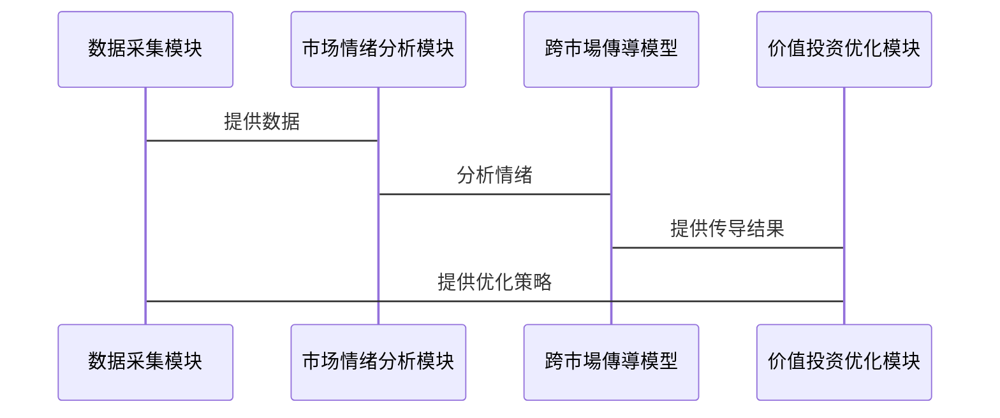
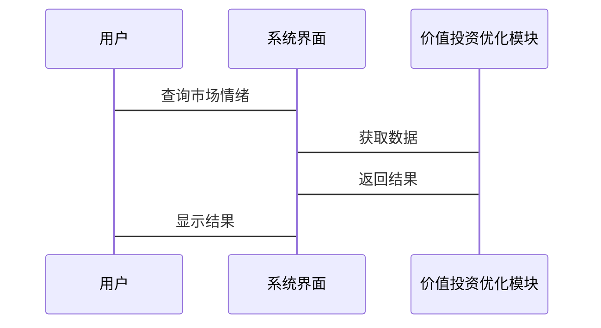

                 


# 第六章: 系统分析与架构设计

## 6.1 问题场景介绍

### 6.1.1 价值投资中的挑战

在传统的价值投资中，投资者主要依赖于市场数据、财务报表和市场分析来做出投资决策。然而，随着市场的复杂化和全球化的发展，单一市场的影响逐渐减弱，跨市场的联动效应日益显著。传统的分析方法往往忽略了市场情绪的复杂性以及跨市场传导的动态性，导致投资决策的滞后性和片面性。

### 6.1.2 多智能体系统的优势

多智能体系统通过模拟多个智能体的行为，能够实时捕捉市场情绪的变化，并通过算法分析其在不同市场之间的传导机制。这种系统能够帮助投资者更好地理解市场波动的根源，并提前做出应对策略。此外，多智能体系统可以通过分布式计算和协同学习，提高分析的准确性和效率。

## 6.2 系统功能设计

### 6.2.1 系统功能模块

#### 数据采集模块

- **功能描述**: 从多个金融市场数据源获取实时数据，包括股票价格、成交量、市场指数等。
- **数据来源**: 包括传统金融市场如纽约证券交易所、纳斯达克等，也包括新兴市场如加密货币交易所。
- **数据预处理**: 对采集到的数据进行清洗、标准化和格式化处理，确保数据的可用性和一致性。

#### 市场情绪分析模块

- **功能描述**: 利用自然语言处理和情感分析技术，分析新闻、社交媒体和投资者评论中的情绪倾向。
- **情绪分类**: 将市场情绪分为积极、消极和中性三类，并量化其强度。
- **情绪传播模型**: 建立情绪传播的数学模型，分析情绪在不同市场之间的传播路径和速度。

#### 跨市場傳導模型

- **功能描述**: 构建跨市场的传导模型，分析一个市场的波动如何影响其他市场。
- **模型参数**: 包括市场间的关系强度、市场容量、信息传播速度等。
- **传导路径分析**: 通过网络分析技术，识别市场间的主要传导路径。

#### 价值投资优化模块

- **功能描述**: 根据市场情绪和跨市场传导的结果，优化价值投资策略。
- **策略调整**: 根据市场情绪的变化，动态调整投资组合和交易策略。
- **风险管理**: 利用多智能体系统预测市场波动，制定有效的风险管理措施。

### 6.2.2 系统功能模块的Mermaid类图



## 6.3 系统架构设计

### 6.3.1 系统架构概述

系统采用分层架构，主要包括数据层、业务逻辑层和用户界面层。数据层负责数据的采集、存储和管理；业务逻辑层负责市场情绪分析、跨市场传导模型的构建和价值投资策略的优化；用户界面层提供友好的交互界面，供用户查询和分析结果。

### 6.3.2 系统架构的Mermaid架构图


## 6.4 系统接口设计

### 6.4.1 系统接口概述

系统接口主要分为数据接口和算法接口。数据接口负责与外部数据源的交互，算法接口负责各个功能模块之间的协同工作。

### 6.4.2 系统接口的Mermaid序列图



## 6.5 系统交互设计

### 6.5.1 系统交互概述

系统交互主要集中在用户与系统界面之间的互动，用户可以通过界面查询市场情绪、跨市场传导结果和优化后的投资策略。

### 6.5.2 系统交互的Mermaid序列图



## 6.6 系统实现

### 6.6.1 系统实现概述

系统实现主要分为数据采集、市场情绪分析、跨市场传导模型构建和价值投资优化四个部分。每部分都需要编写相应的代码，并进行测试和优化。

### 6.6.2 核心代码实现

#### 数据采集模块

```python
import pandas as pd
from datetime import datetime

def fetch_data(source):
    # 数据获取逻辑
    pass

def preprocess_data(data):
    # 数据预处理逻辑
    pass

# 示例代码
data = fetch_data('NYSE')
data = preprocess_data(data)
print(data.head())
```

#### 市场情绪分析模块

```python
from textblob import TextBlob

def analyze_sentiment(text):
    blob = TextBlob(text)
    return blob.sentiment.polarity

# 示例代码
text = "The market is expected to rise today."
sentiment = analyze_sentiment(text)
print(f"Sentiment Polarity: {sentiment}")
```

#### 跨市場傳導模型

```python
import numpy as np

def transmission_model(source, target, correlation_matrix):
    # 传导模型逻辑
    pass

# 示例代码
correlation_matrix = np.array([[1, 0.8], [0.8, 1]])
transmission_result = transmission_model('NYSE', 'NASDAQ', correlation_matrix)
print(transmission_result)
```

#### 价值投资优化模块

```python
def optimize_portfolio(sentiment, transmission_result):
    # 优化逻辑
    pass

# 示例代码
sentiment = 0.7
transmission_result = 0.9
portfolio = optimize_portfolio(sentiment, transmission_result)
print(portfolio)
```

## 6.7 小结

本章详细分析了系统的功能模块、架构设计、接口设计和交互设计，并通过代码示例展示了系统的实现过程。通过多智能体系统的应用，可以更准确地分析市场情绪和跨市场传导，从而优化价值投资策略，提高投资收益。

---

# 作者：AI天才研究院 & 禅与计算机程序设计艺术

