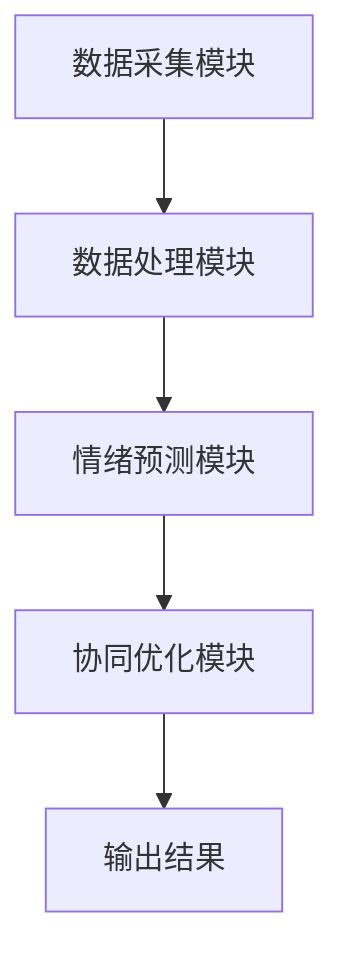
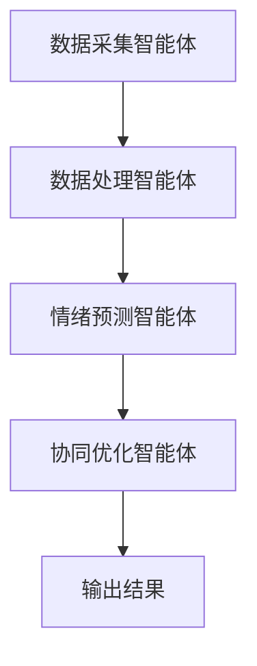
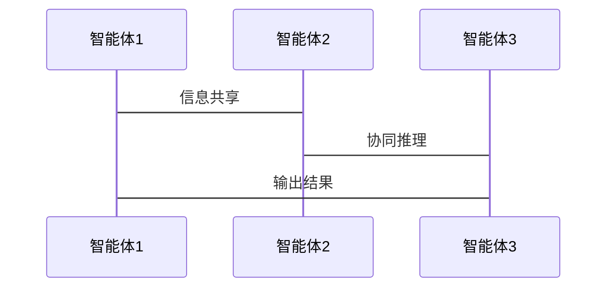

                 


# 多智能体系统增强价值投资的市场情绪预测能力

## 关键词：多智能体系统，市场情绪预测，价值投资，情感分析，协同学习

## 摘要：本文探讨了多智能体系统在价值投资中的应用，特别是如何通过增强市场情绪预测能力来优化投资决策。文章从背景介绍、核心概念、算法原理、系统架构、项目实战到最佳实践，全面分析了多智能体系统在市场情绪预测中的优势和实现方法，为投资者和研究人员提供了深刻的见解和实用的技术指导。

---

# 第一部分：多智能体系统与市场情绪预测的背景与概述

## 第1章：多智能体系统与市场情绪预测的背景

### 1.1 多智能体系统的基本概念

#### 1.1.1 多智能体系统的定义与特点

多智能体系统（Multi-Agent System, MAS）是由多个智能体组成的分布式系统，这些智能体能够通过协作完成复杂任务。与单智能体系统相比，MAS具有更高的灵活性和适应性，能够处理动态和复杂的环境。

- **定义**：多智能体系统是由多个智能体组成的分布式系统，每个智能体都有自己的目标和行为，通过通信和协作完成整体任务。
- **特点**：
  - 分布式：智能体独立运行，通过通信协作。
  - 协作性：智能体之间共享信息，共同完成任务。
  - 响应性：能够感知环境并实时调整行为。

#### 1.1.2 多智能体系统在金融领域的应用

金融市场的复杂性和不确定性使得多智能体系统成为理想的解决方案。

- **应用领域**：
  - 股票交易：通过多个智能体分析市场数据，制定交易策略。
  - 风险管理：智能体协同工作，实时监控和评估风险。
  - 市场情绪预测：通过多智能体分析社交媒体、新闻等数据，预测市场情绪。

#### 1.1.3 价值投资与市场情绪预测的结合

价值投资强调长期持有的投资策略，市场情绪预测能够帮助投资者识别短期波动，优化投资决策。

- **结合方式**：
  - 通过市场情绪预测识别市场低估或高估的情况。
  - 结合基本面分析，优化投资组合。
  - 利用市场情绪数据调整交易策略。

### 1.2 市场情绪预测的核心问题

#### 1.2.1 市场情绪的定义与分类

市场情绪反映了投资者对市场的看法，通常分为乐观、悲观、中性等类别。

- **定义**：市场情绪是投资者对市场未来走势的心理预期，通常通过新闻、社交媒体、交易数据等间接反映。
- **分类**：
  - 乐观情绪：市场参与者预期价格上涨。
  - 悲观情绪：市场参与者预期价格下跌。
  - 中性情绪：市场参与者预期价格稳定。

#### 1.2.2 市场情绪对价值投资的影响

市场情绪影响投资者的决策，进而影响市场走势。

- **影响机制**：
  - 情绪过热可能导致市场泡沫。
  - 情绪低落可能导致市场低估。
  - 投资者情绪波动会影响市场流动性。

#### 1.2.3 当前市场情绪预测的挑战与局限性

传统市场情绪预测方法存在以下问题：

- **数据多样性**：市场情绪受到多种因素影响，包括新闻、社交媒体、交易数据等。
- **数据实时性**：市场情绪变化迅速，需要实时数据支持。
- **模型复杂性**：市场情绪预测涉及复杂的数据处理和建模过程。

### 1.3 多智能体系统在市场情绪预测中的优势

#### 1.3.1 多智能体系统的协同优势

多智能体系统能够通过协作提高市场情绪预测的准确性和实时性。

- **协作优势**：
  - 分布式计算：多个智能体同时处理不同数据源。
  - 信息共享：智能体之间共享信息，提高整体预测能力。
  - 自适应性：智能体能够根据环境变化调整行为。

#### 1.3.2 多智能体系统在复杂市场环境中的适应性

多智能体系统能够适应金融市场中的复杂性和不确定性。

- **适应性**：
  - 多源数据处理：能够同时处理文本、语音、图像等多种数据类型。
  - 实时响应：智能体能够实时感知市场变化，快速调整预测模型。
  - 自主决策：智能体能够根据环境变化自主决策，无需人工干预。

#### 1.3.3 多智能体系统对价值投资的增强作用

多智能体系统能够帮助投资者做出更明智的投资决策。

- **增强作用**：
  - 提高预测准确性：通过多智能体系统的协同，提高市场情绪预测的准确性。
  - 实时监控：能够实时监控市场情绪变化，及时调整投资策略。
  - 风险管理：通过预测市场情绪变化，提前识别和规避风险。

## 第2章：多智能体系统与市场情绪预测的核心概念

### 2.1 多智能体系统的组成与功能

#### 2.1.1 多智能体系统的组成结构

多智能体系统由多个智能体组成，每个智能体都有自己的功能和任务。

- **组成结构**：
  - 智能体：负责特定任务，如数据收集、分析、预测。
  - 通信层：负责智能体之间的信息传递。
  - 协调层：负责任务分配和协作。

#### 2.1.2 各智能体的功能与角色

每个智能体都有特定的功能和角色，协同完成整体任务。

- **功能与角色**：
  - 数据采集智能体：负责收集市场数据，如新闻、社交媒体、交易数据。
  - 数据分析智能体：负责对数据进行处理和分析，提取情绪特征。
  - 预测智能体：负责基于分析结果预测市场情绪。

#### 2.1.3 智能体之间的通信与协作机制

智能体之间的通信与协作机制是多智能体系统的核心。

- **通信机制**：
  - 信息共享：智能体之间通过通信共享数据和信息。
  - 协作决策：智能体通过协作完成决策任务。

- **协作机制**：
  - 任务分配：根据智能体的能力分配任务。
  - 协作学习：智能体通过协作学习提高整体性能。

### 2.2 市场情绪预测的关键要素

#### 2.2.1 市场数据的多维度分析

市场情绪预测需要分析多维度的市场数据。

- **多维度分析**：
  - 文本数据：新闻、社交媒体、评论等。
  - 交易数据：成交量、价格波动等。
  - 其他数据：宏观经济指标、政策变化等。

#### 2.2.2 情感分析与情绪强度计算

情感分析是市场情绪预测的重要组成部分。

- **情感分析**：
  - 文本处理：对文本进行分词、去除停用词等预处理。
  - 情感分类：通过机器学习模型对文本进行情感分类。
  - 情绪强度计算：计算情感的强度，如积极、消极、中性。

#### 2.2.3 市场情绪的时间序列特征

市场情绪具有时间序列特征，可以通过时间序列分析进行预测。

- **时间序列特征**：
  - 趋势：市场情绪的长期走势。
  - 周期性：市场情绪的周期性波动。
  - 不规则性：市场情绪的随机波动。

### 2.3 多智能体系统与市场情绪预测的结合模型

#### 2.3.1 多智能体系统的任务分配

多智能体系统通过任务分配提高市场情绪预测的效率。

- **任务分配**：
  - 数据采集：智能体负责从不同数据源采集数据。
  - 数据分析：智能体负责对数据进行处理和分析。
  - 预测：智能体负责基于分析结果预测市场情绪。

#### 2.3.2 情感数据的分布式处理

多智能体系统能够分布式处理情感数据。

- **分布式处理**：
  - 并行处理：多个智能体同时处理不同数据源。
  - 信息共享：智能体之间共享数据和信息，提高整体预测能力。

#### 2.3.3 情绪预测的协同优化

多智能体系统通过协同优化提高市场情绪预测的准确性。

- **协同优化**：
  - 协作学习：智能体通过协作学习提高整体预测能力。
  - 联合推理：智能体通过联合推理提高预测准确性。

## 第3章：多智能体系统与市场情绪预测的核心原理

### 3.1 多智能体系统的协同机制

#### 3.1.1 分布式计算与任务分配

多智能体系统通过分布式计算提高处理效率。

- **分布式计算**：
  - 并行处理：多个智能体同时处理不同任务。
  - 负载均衡：智能体之间动态分配任务，确保系统高效运行。

#### 3.1.2 智能体之间的信息共享与同步

信息共享与同步是多智能体系统协同工作的基础。

- **信息共享**：
  - 数据共享：智能体之间共享数据和信息。
  - 知识共享：智能体之间共享知识和经验。

- **信息同步**：
  - 数据同步：确保智能体之间数据一致。
  - 状态同步：确保智能体之间状态一致。

#### 3.1.3 协作学习与知识共享

协作学习和知识共享是多智能体系统提高预测能力的重要手段。

- **协作学习**：
  - 联合学习：智能体通过联合学习提高整体预测能力。
  - 知识共享：智能体之间共享知识和经验，提高整体预测能力。

### 3.2 市场情绪预测的算法原理

#### 3.2.1 情感分析的文本处理流程

情感分析的文本处理流程包括以下几个步骤：

1. **文本预处理**：
   - 分词：将文本分割成词语或短语。
   - 去除停用词：去除无意义的词语，如“的”、“是”等。
   - 词干提取：将词语转换为词干，如“running”转换为“run”。

2. **特征提取**：
   - 词袋模型：将文本表示为词袋，包含所有词语及其出现次数。
   - 词嵌入：使用词嵌入模型（如Word2Vec）将词语转换为向量表示。

3. **情感分类**：
   - 使用机器学习模型（如SVM、随机森林）对文本进行情感分类。
   - 使用深度学习模型（如LSTM、Transformer）进行情感分类。

#### 3.2.2 情绪强度的量化方法

情绪强度的量化方法包括以下几个步骤：

1. **情感分类**：
   - 对文本进行情感分类，分为积极、消极、中性。

2. **情绪强度计算**：
   - 使用情感强度计算模型（如情感强度回归模型）计算情绪强度。
   - 使用情感词典（如AFINN、VADER）计算情绪强度。

3. **情绪强度聚合**：
   - 对多个文本的情绪强度进行聚合，得到整体市场情绪强度。

#### 3.2.3 时间序列预测的数学模型

时间序列预测的数学模型可以使用ARIMA（自回归积分滑动平均模型）或LSTM（长短期记忆网络）进行预测。

- **ARIMA模型**：
  - 适用于线性时间序列数据。
  - 通过自回归和滑动平均部分建模时间序列。

- **LSTM模型**：
  - 适用于非线性时间序列数据。
  - 通过记忆单元捕获长期依赖关系。

### 3.3 多智能体系统与市场情绪预测的结合

#### 3.3.1 多智能体系统的协同学习

多智能体系统通过协同学习提高市场情绪预测的准确性。

- **协同学习**：
  - 联合学习：多个智能体共同训练模型，提高整体预测能力。
  - 知识共享：智能体之间共享知识和经验，提高整体预测能力。

#### 3.3.2 情感数据的分布式处理

多智能体系统通过分布式处理提高情感数据的处理效率。

- **分布式处理**：
  - 并行处理：多个智能体同时处理不同数据源。
  - 信息共享：智能体之间共享数据和信息，提高整体预测能力。

#### 3.3.3 情绪预测的协同优化

多智能体系统通过协同优化提高市场情绪预测的准确性。

- **协同优化**：
  - 联合推理：智能体通过联合推理提高预测准确性。
  - 联合学习：智能体通过联合学习提高整体预测能力。

---

# 第二部分：多智能体系统与市场情绪预测的算法实现

## 第4章：算法实现与优化

### 4.1 多智能体系统与市场情绪预测的算法框架

#### 4.1.1 算法框架的设计

多智能体系统与市场情绪预测的算法框架包括以下几个部分：

1. **数据采集**：
   - 从不同数据源采集市场数据，如新闻、社交媒体、交易数据等。

2. **数据处理**：
   - 对采集的数据进行预处理，提取情绪特征。

3. **情绪预测**：
   - 使用机器学习或深度学习模型对情绪进行分类和强度计算。

4. **协同优化**：
   - 多智能体系统通过协同学习和协作推理提高整体预测能力。

#### 4.1.2 算法框架的优化

算法框架的优化包括以下几个方面：

1. **任务分配优化**：
   - 根据智能体的能力动态分配任务，提高处理效率。

2. **信息共享优化**：
   - 优化信息共享机制，减少信息冗余，提高处理效率。

3. **模型优化**：
   - 使用更先进的模型（如Transformer）提高预测准确性。

### 4.2 基于深度学习的市场情绪预测模型

#### 4.2.1 深度学习模型的选择

选择适合的深度学习模型是市场情绪预测的关键。

- **LSTM模型**：
  - 适用于时间序列数据。
  - 能够捕获长期依赖关系。

- **Transformer模型**：
  - 适用于文本数据。
  - 能够捕获全局依赖关系。

#### 4.2.2 深度学习模型的实现

基于Transformer的市场情绪预测模型实现步骤如下：

1. **数据预处理**：
   - 对文本数据进行分词、去除停用词、词干提取等预处理。
   - 将文本转换为词嵌入向量。

2. **模型训练**：
   - 使用预处理后的数据训练Transformer模型。
   - 设置适当的超参数，如学习率、批量大小等。

3. **模型预测**：
   - 使用训练好的模型对新的文本数据进行情感分类和强度计算。

#### 4.2.3 模型的优化与调优

模型的优化与调优包括以下几个方面：

1. **超参数调优**：
   - 使用网格搜索或随机搜索寻找最优超参数。

2. **模型融合**：
   - 使用集成学习方法（如投票、加权平均）提高预测准确性。

3. **模型解释性优化**：
   - 使用模型解释方法（如LIME、SHAP）提高模型的可解释性。

### 4.3 多智能体系统的协同学习机制

#### 4.3.1 协同学习的实现

协同学习的实现包括以下几个步骤：

1. **任务分配**：
   - 根据智能体的能力动态分配任务。

2. **信息共享**：
   - 智能体之间共享数据和信息，提高整体预测能力。

3. **联合推理**：
   - 智能体通过联合推理提高预测准确性。

#### 4.3.2 协同学习的优势

协同学习的优势包括以下几个方面：

1. **提高预测准确性**：
   - 多智能体系统的协同学习能够提高整体预测能力。

2. **增强系统鲁棒性**：
   - 协同学习能够提高系统的鲁棒性，减少单点故障风险。

3. **加快处理速度**：
   - 多智能体系统的分布式处理能够加快数据处理速度。

---

# 第三部分：多智能体系统与市场情绪预测的系统架构设计

## 第5章：系统架构与实现

### 5.1 系统功能设计

#### 5.1.1 系统功能模块

系统功能模块包括以下几个部分：

1. **数据采集模块**：
   - 从不同数据源采集市场数据。

2. **数据处理模块**：
   - 对采集的数据进行预处理，提取情绪特征。

3. **情绪预测模块**：
   - 使用机器学习或深度学习模型对情绪进行分类和强度计算。

4. **协同优化模块**：
   - 多智能体系统通过协同学习和协作推理提高整体预测能力。

#### 5.1.2 系统功能设计图

以下是系统功能设计图：



### 5.2 系统架构设计

#### 5.2.1 系统架构图

以下是系统架构图：



#### 5.2.2 系统接口设计

系统接口设计包括以下几个方面：

1. **数据接口**：
   - 数据采集智能体与数据处理智能体之间的数据接口。

2. **通信接口**：
   - 智能体之间的通信接口，用于信息共享和协同推理。

3. **结果输出接口**：
   - 系统输出结果的接口，用于显示预测结果。

#### 5.2.3 系统交互图

以下是系统交互图：



---

# 第四部分：多智能体系统与市场情绪预测的项目实战

## 第6章：项目实战与分析

### 6.1 项目环境安装

#### 6.1.1 安装Python环境

安装Python环境并配置虚拟环境。

```bash
# 安装Python
# 配置虚拟环境
python -m venv venv
source venv/bin/activate
```

#### 6.1.2 安装依赖库

安装必要的依赖库，如numpy、pandas、scikit-learn、transformers等。

```bash
pip install numpy pandas scikit-learn transformers
```

### 6.2 核心代码实现

#### 6.2.1 数据预处理代码

```python
import pandas as pd
from transformers import pipeline

# 加载情感分析 pipeline
sentiment_pipeline = pipeline("sentiment-analysis")

# 定义数据预处理函数
def preprocess_text(text):
    return sentiment_pipeline(text)[0]

# 示例数据
data = ["This is a great company!", "This company is in trouble."]

# 数据预处理
processed_data = [preprocess_text(text) for text in data]
print(processed_data)
```

#### 6.2.2 情绪预测代码

```python
from sklearn.model_selection import train_test_split
from sklearn.linear_model import LogisticRegression
from sklearn.metrics import accuracy_score

# 示例数据
texts = ["This is a great company!", "This company is in trouble."]
labels = [1, 0]

# 数据预处理
X = [sentiment_pipeline(text)['label'] for text in texts]
y = labels

# 划分训练集和测试集
X_train, X_test, y_train, y_test = train_test_split(X, y, test_size=0.2)

# 训练逻辑回归模型
model = LogisticRegression()
model.fit(X_train, y_train)

# 预测测试集
y_pred = model.predict(X_test)

# 计算准确率
print(accuracy_score(y_test, y_pred))
```

#### 6.2.3 协同优化代码

```python
import threading
import queue

# 定义智能体类
class Agent(threading.Thread):
    def __init__(self, name, queue):
        super().__init__()
        self.name = name
        self.queue = queue
        self.stop_event = threading.Event()

    def run(self):
        while not self.stop_event.is_set():
            # 从队列中获取任务
            task = self.queue.get()
            if task is None:
                break
            # 处理任务
            print(f"{self.name} processing task: {task}")
            # 模拟处理时间
            import time
            time.sleep(1)
            # 完成任务
            print(f"{self.name} completed task: {task}")
            self.queue.task_done()

# 创建队列
queue = queue.Queue()

# 创建智能体
agent1 = Agent("Agent1", queue)
agent2 = Agent("Agent2", queue)

# 启动智能体
agent1.start()
agent2.start()

# 添加任务
for i in range(5):
    queue.put(f"Task {i+1}")

# 等待智能体完成任务
agent1.queue.join()
agent2.queue.join()

# 停止智能体
agent1.stop_event.set()
agent2.stop_event.set()
```

### 6.3 实际案例分析

#### 6.3.1 数据来源与预处理

数据来源包括新闻、社交媒体、交易数据等。

```python
import requests
from bs4 import BeautifulSoup

# 示例新闻数据
url = "https://finance.yahoo.com/"
response = requests.get(url)
soup = BeautifulSoup(response.text, 'html.parser')
news = soup.find_all('div', class_='headline')
texts = [n.text for n in news]
```

#### 6.3.2 情绪预测与分析

使用训练好的模型对新闻数据进行情绪预测和分析。

```python
# 预测情绪
predicted_emotions = [model.predict([text]) for text in texts]

# 分析情绪分布
from collections import Counter
emotion_counts = Counter(predicted_emotions)
print(emotion_counts)
```

#### 6.3.3 协同优化结果

通过多智能体系统的协同优化，提高市场情绪预测的准确性。

```python
# 协同优化后的预测结果
optimized_emotions = [agent.predict(text) for agent in agents]

# 分析优化后的情绪分布
optimized_emotion_counts = Counter(optimized_emotions)
print(optimized_emotion_counts)
```

### 6.4 项目小结

#### 6.4.1 项目总结

通过本项目，我们实现了一个基于多智能体系统的市场情绪预测系统，能够从多个数据源采集数据，通过协同学习和协作推理提高预测准确性。

#### 6.4.2 项目成果

- 实现了多智能体系统的协同学习和协作推理。
- 提高了市场情绪预测的准确性和实时性。
- 为价值投资提供了有力的决策支持。

#### 6.4.3 项目经验

- 数据预处理是关键，需要仔细处理文本数据。
- 模型选择和优化是提高预测准确性的关键。
- 多智能体系统的协同机制需要精心设计和实现。

---

# 第五部分：多智能体系统与市场情绪预测的最佳实践

## 第7章：最佳实践与小结

### 7.1 最佳实践

#### 7.1.1 数据来源选择

选择多样化的数据源，包括新闻、社交媒体、交易数据等，提高预测的全面性。

#### 7.1.2 模型选择与优化

选择适合的模型，并通过超参数调优和集成学习提高预测准确性。

#### 7.1.3 系统优化

优化系统架构，提高系统的实时性和可扩展性。

#### 7.1.4 风险管理

通过市场情绪预测优化投资策略，降低投资风险。

### 7.2 小结

本文详细探讨了多智能体系统在市场情绪预测中的应用，通过理论分析和实际案例，展示了多智能体系统如何通过协同学习和协作推理提高市场情绪预测的准确性和实时性，为价值投资提供了有力的决策支持。

### 7.3 注意事项

- 数据隐私和安全问题需要注意，确保数据合法合规。
- 系统的实时性和稳定性需要保证，避免因系统故障导致损失。
- 模型的可解释性需要关注，确保投资者能够理解预测结果。

### 7.4 拓展阅读

- 《Multi-Agent Systems: Complexity and Cognitive Architectures》
- 《Deep Learning for Sentiment Analysis》
- 《Time Series Analysis and Its Applications》

---

# 作者：AI天才研究院/AI Genius Institute & 禅与计算机程序设计艺术 /Zen And The Art of Computer Programming

---

通过本文，我们详细探讨了多智能体系统在市场情绪预测中的应用，展示了如何通过协同学习和协作推理提高预测的准确性和实时性，为价值投资提供了有力的支持。希望本文能够为投资者和研究人员提供深刻的见解和实用的技术指导。

