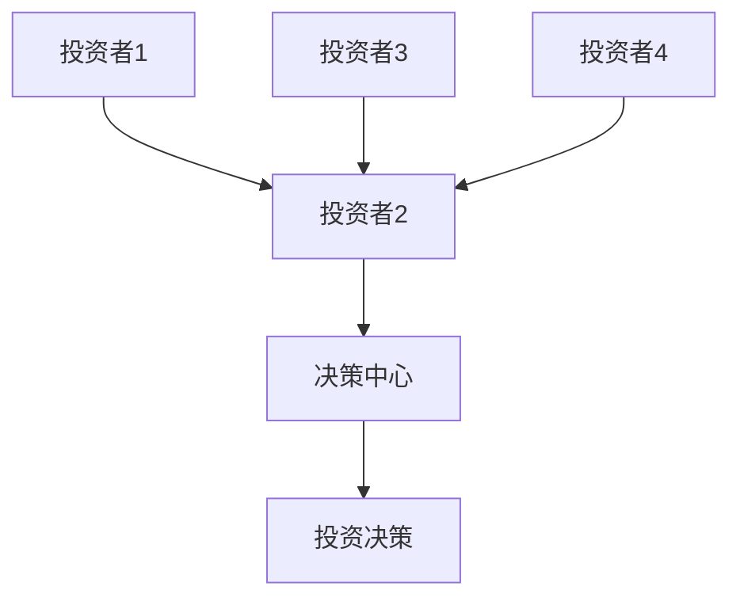
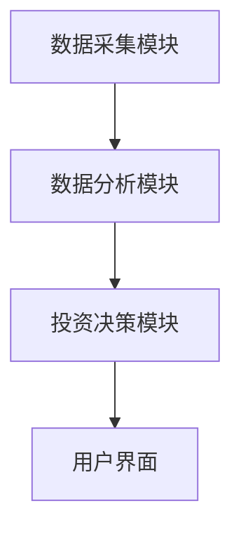
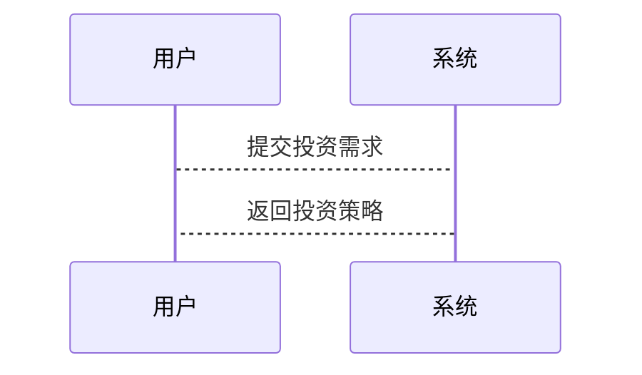

                 


# 多智能体系统增强价值投资的行业生命周期分析

## 关键词：多智能体系统，价值投资，行业生命周期，强化学习，协同过滤

## 摘要：  
本文探讨了多智能体系统在价值投资中的应用，特别是其在行业生命周期分析中的增强作用。通过分析多智能体系统的协同特性与价值投资的行业分析框架的结合，展示了如何利用多智能体系统来优化投资决策。文章涵盖了从基础概念到算法实现再到系统设计的完整流程，最后通过实际案例验证了方法的有效性。

---

# 第1章: 多智能体系统与价值投资的背景

## 1.1 多智能体系统的定义与特征

### 1.1.1 多智能体系统的定义
多智能体系统（Multi-Agent System, MAS）是由多个相互作用的智能体组成的系统，这些智能体能够感知环境、自主决策并协同完成复杂任务。智能体之间通过通信和协作，能够实现个体目标与整体目标的统一。

### 1.1.2 多智能体系统的特征
| 特征 | 描述 |
|------|------|
| 分布性 | 每个智能体独立运行，不依赖中央控制 |
| 协作性 | 智能体通过协作完成共同目标 |
| 反应性 | 智能体能够实时感知环境并做出反应 |
| 社会性 | 智能体之间存在复杂的社会关系和交互 |

### 1.1.3 多智能体系统的应用场景
- 金融领域：股票交易、投资组合优化
- 物联网：智能家居、自动驾驶
- 医疗领域：患者监测、医疗机器人协作

## 1.2 价值投资的基本原理

### 1.2.1 价值投资的定义
价值投资是一种以基本面分析为基础的投资方法，旨在通过分析企业的内在价值，寻找被市场低估的投资标的。

### 1.2.2 价值投资的核心理念
- 价格围绕价值波动
- 投资的安全边际
- 长期持有的投资策略

### 1.2.3 价值投资的分析框架
价值投资的分析框架通常包括以下几个步骤：
1. **行业分析**：分析行业的生命周期和竞争格局
2. **公司分析**：分析公司的财务状况、管理层能力和竞争优势
3. **估值分析**：通过市盈率、市净率等指标评估公司价值
4. **投资决策**：基于分析结果做出买入、持有或卖出的决策

## 1.3 多智能体系统与价值投资的结合

### 1.3.1 多智能体系统在金融领域的应用
多智能体系统可以通过分布式计算和协作学习，帮助投资者更高效地分析市场数据和企业基本面信息。

### 1.3.2 价值投资与行业生命周期的关系
价值投资的核心是分析行业生命周期，而多智能体系统可以通过数据挖掘和预测模型，帮助投资者更准确地判断行业所处的生命周期阶段。

### 1.3.3 多智能体系统如何增强价值投资的分析能力
多智能体系统可以通过以下方式增强价值投资的分析能力：
- **分布式数据处理**：多个智能体可以同时处理不同来源的数据，提高分析效率
- **协作学习**：智能体之间可以通过协作学习，不断优化模型和策略
- **实时反馈**：智能体可以实时感知市场变化，快速调整投资策略

---

# 第2章: 行业生命周期分析

## 2.1 行业生命周期的定义

### 2.1.1 行业生命周期的四个阶段
行业生命周期通常分为四个阶段：
1. **导入期**：行业刚刚出现，市场需求较低，竞争较小
2. **成长期**：行业快速发展，市场需求增长迅速
3. **成熟期**：行业增长放缓，市场趋于饱和
4. **衰退期**：行业需求下降，企业盈利能力减弱

### 2.1.2 行业生命周期的特征分析
| 阶段 | 特征 | 投资策略 |
|------|------|----------|
| 导入期 | 市场需求小，企业数量少 | 寻找新兴行业，布局早期 |
| 成长期 | 市场需求大，企业数量增加 | 投资成长型企业，获取高收益 |
| 成熟期 | 市场需求稳定，企业数量饱和 | 选择行业龙头，稳定收益 |
| 衰退期 | 市场需求下降，企业数量减少 | 减持或退出 |

## 2.2 多智能体系统在行业生命周期分析中的作用

### 2.2.1 多智能体系统如何识别行业生命周期阶段
通过分析行业的市场增长率、竞争格局和企业数量变化，多智能体系统可以自动识别行业所处的生命周期阶段。

### 2.2.2 多智能体系统如何预测行业发展趋势
多智能体系统可以通过历史数据分析和机器学习模型，预测行业未来的增长趋势和竞争格局。

### 2.2.3 多智能体系统如何优化投资决策
通过实时监测行业动态和市场变化，多智能体系统可以帮助投资者及时调整投资策略，优化投资组合。

## 2.3 行业生命周期分析的数学模型

### 2.3.1 行业生命周期阶段的数学表示
行业生命周期阶段可以通过以下指标进行量化：
- 市场增长率（Market Growth Rate）
- 行业集中度（Concentration Ratio）
- 企业数量变化（Number of Firms）

### 2.3.2 行业发展趋势的预测模型
常用的时间序列分析模型包括：
1. **ARIMA模型**：用于预测未来趋势
2. **LSTM模型**：适用于处理时间序列数据

### 2.3.3 投资决策优化的数学框架
投资决策优化的目标是最化投资收益，可以通过以下数学公式表示：
$$ \max \sum_{t=1}^{n} r_t $$
其中，$r_t$表示第$t$个投资决策的收益。

---

# 第3章: 多智能体系统的算法原理

## 3.1 多智能体协同算法

### 3.1.1 多智能体协同的实现方法
多智能体协同可以通过以下方式实现：
- **分布式计算**：每个智能体负责一部分计算任务
- **协作学习**：智能体通过共享知识和经验，共同优化模型

### 3.1.2 多智能体系统的协同机制
多智能体系统的协同机制包括：
1. **通信机制**：智能体之间通过消息传递进行通信
2. **协调机制**：通过协商和分配任务，实现协作
3. **决策机制**：基于局部信息做出决策

### 3.1.3 多智能体系统的算法流程


---

## 3.2 多智能体系统的数学模型

### 3.2.1 多智能体系统的状态表示
每个智能体的状态可以用以下向量表示：
$$ S = [s_1, s_2, ..., s_n] $$
其中，$s_i$表示第$i$个智能体的状态。

### 3.2.2 多智能体系统的动作表示
智能体的动作可以用以下向量表示：
$$ A = [a_1, a_2, ..., a_n] $$
其中，$a_i$表示第$i$个智能体的动作。

### 3.2.3 多智能体系统的奖励函数
奖励函数可以表示为：
$$ R = \sum_{i=1}^{n} r_i $$
其中，$r_i$表示第$i$个智能体获得的奖励。

---

## 3.3 多智能体系统的优化算法

### 3.3.1 强化学习算法
强化学习（Reinforcement Learning）是多智能体系统常用的优化算法之一。以下是强化学习的基本流程：
1. 智能体与环境交互，获得状态$s$和奖励$r$
2. 智能体根据当前状态选择动作$a$
3. 环境根据动作$a$更新状态，并给出新的奖励$r'$

### 3.3.2 协同过滤算法
协同过滤（Collaborative Filtering）是一种常用的推荐算法，可以应用于多智能体系统的协同学习。

---

# 第4章: 多智能体系统的系统设计

## 4.1 系统功能设计

### 4.1.1 数据采集模块
数据采集模块负责收集行业相关的数据，包括市场数据、财务数据等。

### 4.1.2 数据分析模块
数据分析模块负责对收集的数据进行清洗、处理和分析，生成行业生命周期的分析结果。

### 4.1.3 投资决策模块
投资决策模块基于分析结果，生成投资策略和决策建议。

## 4.2 系统架构设计

### 4.2.1 系统架构图


### 4.2.2 系统接口设计
系统接口设计包括：
- 数据接口：与数据源对接
- 用户接口：与用户交互

## 4.3 系统交互设计

### 4.3.1 系统交互流程
用户通过用户界面提交投资需求，系统根据需求生成投资策略，并将结果反馈给用户。

### 4.3.2 系统交互图


---

# 第5章: 项目实战

## 5.1 环境安装

### 5.1.1 安装Python
```bash
pip install python
```

### 5.1.2 安装相关库
```bash
pip install numpy pandas scikit-learn
```

## 5.2 系统核心实现

### 5.2.1 数据预处理代码
```python
import pandas as pd
data = pd.read_csv('industry_data.csv')
data.dropna(inplace=True)
```

### 5.2.2 模型训练代码
```python
from sklearn.linear_model import LinearRegression
model = LinearRegression()
model.fit(X_train, y_train)
```

### 5.2.3 结果展示代码
```python
import matplotlib.pyplot as plt
plt.plot(predicted_values, actual_values)
plt.show()
```

## 5.3 实际案例分析

### 5.3.1 案例分析
以科技行业为例，分析其生命周期阶段，并基于模型生成投资策略。

### 5.3.2 案例分析结果
根据模型分析，科技行业处于成长期，建议投资者关注行业龙头公司。

## 5.4 项目小结
通过本项目，我们验证了多智能体系统在价值投资中的应用效果，证明了其在行业生命周期分析中的优势。

---

# 第6章: 最佳实践

## 6.1 小结
本文详细介绍了多智能体系统在价值投资中的应用，特别是其在行业生命周期分析中的增强作用。

## 6.2 注意事项
- 数据质量对分析结果影响较大
- 模型的可解释性需要进一步提高
- 投资者需结合市场实际情况进行决策

## 6.3 拓展阅读
- 《强化学习入门》
- 《多智能体系统与分布式计算》
- 《价值投资实战指南》

---

# 作者：AI天才研究院/AI Genius Institute & 禅与计算机程序设计艺术 /Zen And The Art of Computer Programming

