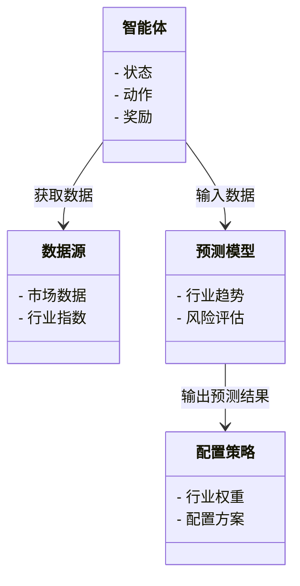
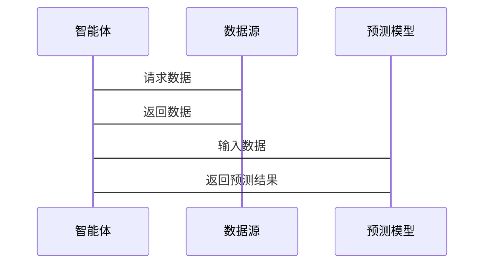

                 


# 多智能体系统如何实现动态行业轮动

## 关键词：多智能体系统、动态行业轮动、分布式计算、强化学习、协同决策、数学模型

## 摘要：本文详细探讨了多智能体系统在动态行业轮动中的应用，通过分析多智能体系统的原理、算法、数学模型以及系统架构设计，展示了如何利用多智能体系统实现高效、智能的行业动态轮动。文章结合实际案例，深入分析了多智能体系统的核心技术及其在动态行业轮动中的具体应用场景，为相关领域的研究和实践提供了有价值的参考。

---

## 第1章: 多智能体系统与动态行业轮动概述

### 1.1 多智能体系统的基本概念

#### 1.1.1 多智能体系统的定义
多智能体系统（Multi-Agent System, MAS）是指由多个智能体（Agent）组成的系统，这些智能体能够通过自主决策和协作完成复杂任务。每个智能体都有自己的目标、知识和行为规则，能够感知环境、做出决策并与其他智能体或环境进行交互。

#### 1.1.2 多智能体系统的特征
- **自主性**：智能体能够自主决策，无需外部干预。
- **反应性**：智能体能够实时感知环境并做出反应。
- **协作性**：多个智能体能够协同工作，共同完成任务。
- **分布式性**：智能体之间分布在网络中，不存在集中控制点。

#### 1.1.3 多智能体系统的核心要素
- **智能体**：系统的最基本单元，具有感知、决策和执行能力。
- **通信机制**：智能体之间通过通信机制进行信息交换。
- **协作协议**：智能体之间通过协作协议实现协同工作。
- **环境模型**：智能体对环境的建模和理解。

### 1.2 动态行业轮动的定义与特点

#### 1.2.1 行业轮动的定义
行业轮动是指在不同行业之间进行资产配置或资源分配，以适应市场变化和优化收益的过程。动态行业轮动则是指根据市场环境的变化，实时调整行业配置策略。

#### 1.2.2 动态行业轮动的核心特征
- **实时性**：需要根据市场变化实时调整。
- **动态性**：行业权重和配置策略不断变化。
- **复杂性**：涉及多个行业的相互影响和复杂关系。

#### 1.2.3 动态行业轮动的驱动因素
- **市场环境变化**：如经济周期、政策变化、行业竞争等。
- **数据驱动**：通过大数据分析预测行业趋势。
- **智能决策**：利用人工智能技术优化配置策略。

### 1.3 多智能体系统与动态行业轮动的关系

#### 1.3.1 多智能体系统在行业轮动中的作用
- **实时数据采集**：智能体能够实时采集行业数据，如市场趋势、行业指数等。
- **分布式计算**：通过分布式计算快速处理海量数据，提高决策效率。
- **协同决策**：多个智能体协同工作，制定最优行业配置策略。

#### 1.3.2 动态行业轮动对多智能体系统的需求
- **高实时性**：需要快速响应市场变化。
- **高可靠性**：系统需要稳定运行，确保决策的准确性。
- **高扩展性**：能够适应不同规模的行业轮动需求。

#### 1.3.3 两者的结合与应用前景
- **智能化决策**：通过多智能体系统的协同决策，优化行业轮动策略。
- **实时调整**：利用多智能体系统的实时感知和快速响应能力，动态调整行业配置。
- **高效协作**：通过智能体之间的协作，实现资源的优化配置和风险控制。

## 1.4 本章小结
本章介绍了多智能体系统的基本概念、动态行业轮动的定义与特点，以及两者之间的关系。多智能体系统通过自主性、反应性和协作性等特征，为动态行业轮动提供了高效、智能的解决方案。下一章将详细探讨多智能体系统的核心概念与动态行业轮动的关联。

---

## 第2章: 多智能体系统的核心概念与联系

### 2.1 多智能体系统的核心原理

#### 2.1.1 分布式计算与协作机制
分布式计算是多智能体系统的核心原理之一。通过将任务分解成多个子任务，分配给不同的智能体完成，能够提高系统的并行计算能力和资源利用率。

#### 2.1.2 智能体之间的通信协议
智能体之间需要通过通信协议进行信息交换。通信协议包括数据格式、消息类型和传输机制等内容，确保智能体之间的高效协作。

#### 2.1.3 多智能体系统的决策机制
多智能体系统的决策机制包括分布式决策和集中式决策两种模式。分布式决策是指每个智能体自主决策，集中式决策是指由一个中心节点统一决策。

### 2.2 动态行业轮动的核心要素

#### 2.2.1 行业数据的实时采集与分析
动态行业轮动需要实时采集行业数据，如市场指数、行业趋势等，并通过数据分析预测行业走势。

#### 2.2.2 行业趋势的预测模型
通过建立行业趋势的预测模型，可以对市场变化进行预测，并为智能体提供决策依据。

#### 2.2.3 行业轮动的触发条件
行业轮动的触发条件包括市场变化、风险预警等，智能体需要根据触发条件实时调整行业配置策略。

### 2.3 多智能体系统与动态行业轮动的关联

#### 2.3.1 多智能体系统的分布式计算能力
多智能体系统的分布式计算能力能够快速处理海量行业数据，为动态行业轮动提供实时支持。

#### 2.3.2 动态行业轮动对实时性的要求
动态行业轮动需要实时调整行业配置策略，多智能体系统的实时性能够满足这一需求。

#### 2.3.3 两者的结合实现动态调整
通过多智能体系统的协同决策和动态行业轮动的实时调整，能够实现行业配置的优化和风险控制。

## 2.4 本章小结
本章详细探讨了多智能体系统的核心原理和动态行业轮动的核心要素，分析了两者之间的关联。多智能体系统的分布式计算能力和实时性为动态行业轮动提供了有力支持。下一章将深入分析多智能体系统的算法原理及其在动态行业轮动中的应用。

---

## 第3章: 多智能体系统的算法原理

### 3.1 分布式计算算法

#### 3.1.1 分布式计算的基本原理
分布式计算将任务分解成多个子任务，分配给不同的计算节点完成，通过节点之间的协作完成整体任务。

#### 3.1.2 分布式计算的实现步骤
1. **任务分解**：将整体任务分解成多个子任务。
2. **任务分配**：将子任务分配给不同的计算节点。
3. **任务执行**：各个节点并行执行分配的任务。
4. **结果汇总**：将各节点的结果汇总，得到最终结果。

#### 3.1.3 分布式计算的优缺点
- **优点**：提高计算效率，充分利用资源。
- **缺点**：需要处理节点之间的通信和同步问题，增加了系统的复杂性。

### 3.2 强化学习算法

#### 3.2.1 强化学习的基本原理
强化学习是一种机器学习方法，通过智能体与环境的交互，学习最优策略，最大化累积奖励。

#### 3.2.2 强化学习的实现步骤
1. **环境建模**：建立环境模型，定义状态、动作和奖励。
2. **策略选择**：选择一种策略，如随机策略或基于Q-learning的策略。
3. **交互学习**：智能体与环境交互，通过试错学习最优策略。
4. **策略优化**：根据学习结果优化策略，提高决策能力。

#### 3.2.3 强化学习在多智能体系统中的应用
多智能体系统可以通过强化学习实现智能体的自主决策和协作，优化整体系统的性能。

### 3.3 联合学习算法

#### 3.3.1 联合学习的基本原理
联合学习是指多个智能体通过协作，共同学习一个模型或策略，提高整体学习效果。

#### 3.3.2 联合学习的实现步骤
1. **任务分配**：将任务分配给不同的智能体。
2. **局部学习**：每个智能体在自己的子任务上进行学习。
3. **知识共享**：智能体之间共享学习成果，更新全局模型。
4. **模型优化**：通过迭代优化，提高整体模型的性能。

#### 3.3.3 联合学习在动态行业轮动中的应用
联合学习可以用于动态行业轮动中，通过多个智能体的协作，实时调整行业配置策略，优化收益。

## 3.4 本章小结
本章详细介绍了分布式计算、强化学习和联合学习等算法原理，并分析了它们在多智能体系统中的应用。多智能体系统的算法能力为动态行业轮动提供了强大的技术支持。下一章将探讨动态行业轮动的数学模型与公式。

---

## 第4章: 动态行业轮动的数学模型与公式

### 4.1 多智能体系统的数学模型

#### 4.1.1 多智能体系统的状态表示
多智能体系统的状态可以通过向量表示，每个元素对应一个智能体的状态。

$$ S = [s_1, s_2, \dots, s_n] $$

其中，$s_i$ 表示第 $i$ 个智能体的状态。

#### 4.1.2 多智能体系统的动作空间
多智能体系统的动作空间可以通过集合表示，每个动作对应一个可能的决策。

$$ A = \{a_1, a_2, \dots, a_m\} $$

其中，$a_j$ 表示第 $j$ 个可能的动作。

#### 4.1.3 多智能体系统的奖励函数
多智能体系统的奖励函数可以根据整体目标进行定义，例如：

$$ R(S, A) = \sum_{i=1}^n r_i(s_i, a_i) $$

其中，$r_i$ 表示第 $i$ 个智能体的奖励函数。

### 4.2 动态行业轮动的数学模型

#### 4.2.1 行业趋势的预测模型
行业趋势的预测模型可以通过时间序列分析实现，例如：

$$ \hat{y}_t = a \cdot y_{t-1} + b \cdot y_{t-2} + \epsilon $$

其中，$\hat{y}_t$ 表示第 $t$ 时刻的预测值，$y_{t-1}$ 和 $y_{t-2}$ 表示前两时刻的观测值，$\epsilon$ 表示误差项。

#### 4.2.2 行业轮动的触发条件
行业轮动的触发条件可以通过阈值判断实现，例如：

$$ \text{触发} = \begin{cases}
\text{是} & \text{if } R > R_{\text{threshold}} \\
\text{否} & \text{otherwise}
\end{cases} $$

其中，$R$ 表示当前的行业风险或收益指标，$R_{\text{threshold}}$ 表示触发阈值。

#### 4.2.3 行业轮动的优化目标
行业轮动的优化目标可以通过多目标优化模型实现，例如：

$$ \min_{x} \sum_{i=1}^n w_i (x_i - x_{i}^{\text{target}})^2 $$

其中，$x_i$ 表示第 $i$ 个行业的配置权重，$x_i^{\text{target}}$ 表示目标配置权重，$w_i$ 表示权重系数。

### 4.3 多智能体系统与动态行业轮动的联合模型

#### 4.3.1 联合模型的数学
联合模型可以通过多智能体系统的状态、动作和奖励函数与动态行业轮动的预测模型和优化目标相结合，形成一个统一的数学模型。

$$ \min_{x} \sum_{i=1}^n w_i (x_i - x_{i}^{\text{target}})^2 + \lambda \cdot R(S, A) $$

其中，$\lambda$ 表示奖励函数的权重系数。

## 4.4 本章小结
本章通过数学模型详细描述了多智能体系统和动态行业轮动的核心内容，分析了它们的联合模型。数学模型为多智能体系统在动态行业轮动中的应用提供了理论基础。下一章将探讨多智能体系统的系统分析与架构设计。

---

## 第5章: 多智能体系统的系统分析与架构设计

### 5.1 问题场景介绍

#### 5.1.1 问题背景
在动态行业轮动中，需要实时采集和分析行业数据，制定最优的行业配置策略。多智能体系统通过分布式计算和协同决策，能够高效地完成这一任务。

#### 5.1.2 问题描述
多智能体系统需要实现以下功能：
1. 实时采集行业数据。
2. 分析行业趋势，预测市场变化。
3. 制定行业配置策略，优化收益。

### 5.2 系统功能设计

#### 5.2.1 领域模型
领域模型通过类图表示，包括智能体、数据源、预测模型和配置策略等模块。



#### 5.2.2 系统架构
系统架构通过架构图表示，包括前端、后端和数据源三个部分。


#### 5.2.3 系统接口
系统接口通过序列图表示，描述智能体与数据源之间的交互。



## 5.3 本章小结
本章通过系统分析与架构设计，详细描述了多智能体系统在动态行业轮动中的实现方案。系统架构设计为多智能体系统的实际应用提供了指导。下一章将探讨多智能体系统的项目实战。

---

## 第6章: 多智能体系统的项目实战

### 6.1 环境安装

#### 6.1.1 安装Python
需要安装Python 3.8及以上版本，可以通过以下命令安装：

```bash
python --version
```

#### 6.1.2 安装依赖库
需要安装以下依赖库：

```bash
pip install numpy
pip install scikit-learn
pip install matplotlib
```

### 6.2 系统核心实现

#### 6.2.1 智能体类的实现
```python
class Agent:
    def __init__(self, id):
        self.id = id
        self.state = None
        self.action = None
        self.reward = 0

    def perceive(self, environment):
        self.state = environment.get_state()

    def decide(self):
        # 简单的决策逻辑
        if self.state > 0.5:
            self.action = 1
        else:
            self.action = 0

    def execute(self, environment):
        environment.execute_action(self.action)
```

#### 6.2.2 环境类的实现
```python
class Environment:
    def __init__(self):
        self.agents = []
        self.state = None

    def get_state(self):
        return self.state

    def execute_action(self, action):
        # 简单的环境响应
        self.state = action
```

### 6.3 代码应用解读与分析

#### 6.3.1 智能体的感知与决策
智能体通过`perceive`方法感知环境状态，通过`decide`方法做出决策，通过`execute`方法执行动作。

#### 6.3.2 环境的响应
环境通过`execute_action`方法响应智能体的动作，更新环境状态。

### 6.4 案例分析

#### 6.4.1 实验环境
- **智能体数量**：2个智能体。
- **环境状态**：随机生成的市场指数。

#### 6.4.2 实验过程
1. 初始化智能体和环境。
2. 智能体感知环境状态。
3. 智能体做出决策。
4. 智能体执行动作，环境更新状态。
5. 重复上述步骤，观察智能体的决策过程。

#### 6.4.3 实验结果
通过实验可以观察到，智能体能够根据环境状态做出相应的决策，实现行业配置的动态调整。

### 6.5 本章小结
本章通过项目实战，详细描述了多智能体系统的实现过程。通过简单的智能体类和环境类的实现，展示了多智能体系统在动态行业轮动中的应用。下一章将总结多智能体系统的最佳实践。

---

## 第7章: 多智能体系统的最佳实践

### 7.1 小结
通过本文的探讨，我们了解了多智能体系统在动态行业轮动中的应用，掌握了多智能体系统的核心概念、算法原理和系统架构设计。多智能体系统的分布式计算能力和协同决策能力为动态行业轮动提供了有力支持。

### 7.2 注意事项
- **系统的实时性**：需要确保系统的实时性，避免因为延迟影响决策。
- **系统的可靠性**：需要保证系统的高可靠性，避免因为故障导致决策错误。
- **系统的可扩展性**：需要保证系统的可扩展性，能够适应不同的行业轮动需求。

### 7.3 拓展阅读
- **推荐书籍**：《Multi-Agent Systems: Algorithmic, Complexity Theoretic, and Economic Aspects》。
- **推荐论文**：《Dynamic Multi-Agent Systems for Financial Market Prediction》。

## 7.4 本章小结
本文通过最佳实践总结了多智能体系统在动态行业轮动中的应用经验，提出了系统的注意事项和拓展阅读方向，为读者提供了进一步学习和研究的方向。

---

## 作者：AI天才研究院（AI Genius Institute）  
联系邮箱：contact@ai-genius.com

