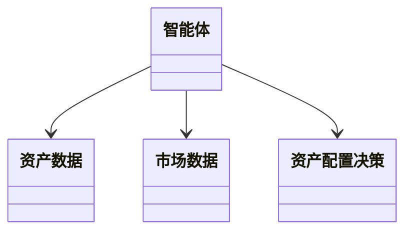
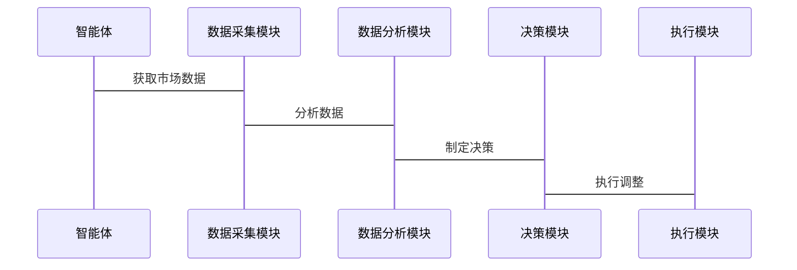

                 


# 多智能体系统如何实现动态资产配置

> 关键词：多智能体系统，动态资产配置，分布式计算，协作算法，金融应用

> 摘要：本文详细探讨了多智能体系统在动态资产配置中的应用，从基本概念到算法实现，再到系统设计和项目实战，全面解析了如何利用多智能体系统实现高效的动态资产配置。

---

## 第1章：多智能体系统概述

### 1.1 多智能体系统的定义与特点
#### 1.1.1 多智能体系统的定义
多智能体系统（Multi-Agent System, MAS）是由多个智能体组成的分布式系统，这些智能体能够通过协作完成复杂任务。每个智能体都有一定的自主性，能够感知环境并做出决策。

#### 1.1.2 多智能体系统的核心特点
- **分布式性**：多个智能体协同工作，没有集中控制。
- **自主性**：每个智能体能够自主决策。
- **协作性**：智能体之间通过通信和协作完成任务。
- **反应性**：能够实时感知环境并做出反应。

#### 1.1.3 多智能体系统与传统单智能体系统的区别
| 特性 | 多智能体系统 | 单智能体系统 |
|------|--------------|--------------|
| 结构 | 分布式       | 集中式       |
| 决策 | 去中心化     | 中心化       |
| 可扩展性 | 高          | 低          |

### 1.2 动态资产配置的背景与意义
#### 1.2.1 动态资产配置的定义
动态资产配置是指根据市场变化和投资者目标，实时调整资产组合的过程，以优化收益和风险。

#### 1.2.2 动态资产配置的重要性
- 市场波动性大，需要实时调整。
- 投资者目标变化，需动态优化。
- 提高资产配置的效率和准确性。

#### 1.2.3 多智能体系统在动态资产配置中的优势
- 分布式计算能力强，适合处理复杂数据。
- 多智能体协作，提高决策效率。
- 能够实时适应市场变化。

---

## 第2章：动态资产配置的核心挑战

### 2.1 市场波动性对资产配置的影响
- 资产价格波动快，需要实时调整。
- 多智能体系统能够快速响应市场变化。

### 2.2 资产配置中的动态调整需求
- 需要实时分析市场数据。
- 需要快速做出决策。

### 2.3 多智能体系统如何应对这些挑战
- **分布式计算**：多个智能体协同处理数据。
- **实时协作**：智能体之间快速通信，共同决策。
- **动态调整**：根据市场变化，智能体实时调整资产配置。

---

## 第3章：多智能体系统实现动态资产配置的原理

### 3.1 多智能体协作机制
#### 3.1.1 分布式决策与协作
智能体之间通过通信协议共享信息，共同做出决策。

#### 3.1.2 智能体之间的通信与协调
- 使用消息传递机制。
- 协调决策过程，确保一致性。

### 3.2 动态资产配置的实现步骤
#### 3.2.1 数据收集与分析
智能体实时收集市场数据，进行分析。

#### 3.2.2 智能体协同决策
多个智能体协同，制定资产调整方案。

#### 3.2.3 资产调整与优化
根据决策结果，调整资产配置，优化收益和风险。

---

## 第4章：多智能体系统动态资产配置的算法原理

### 4.1 多智能体协作算法
#### 4.1.1 分布式决策算法
智能体通过分布式计算，共同制定决策。

#### 4.1.2 协作优化算法
通过优化算法，提升协作效率。

### 4.2 动态资产配置算法
#### 4.2.1 动态权重计算算法
根据市场变化，动态调整资产权重。

#### 4.2.2 风险收益优化算法
优化资产配置，使风险最低，收益最高。

---

## 第5章：系统分析与架构设计

### 5.1 系统架构设计
#### 5.1.1 领域模型类图


#### 5.1.2 系统架构图


### 5.2 接口设计与交互流程
#### 5.2.1 接口设计
- 数据采集接口
- 分析接口
- 决策接口
- 执行接口

#### 5.2.2 交互流程


---

## 第6章：项目实战

### 6.1 环境安装与配置
- 安装Python、框架库（如Django、Flask）。
- 安装多智能体框架（如MABS）。

### 6.2 核心代码实现
#### 6.2.1 数据采集模块
```python
class DataCollector:
    def collect_data(self):
        # 实现数据采集逻辑
        pass
```

#### 6.2.2 分析与决策模块
```python
class DecisionAgent:
    def make_decision(self, data):
        # 实现决策逻辑
        pass
```

#### 6.2.3 执行模块
```python
class Executor:
    def execute_decision(self, decision):
        # 实现执行逻辑
        pass
```

### 6.3 系统功能实现
- 实时数据采集。
- 分析与决策。
- 资产调整与优化。

### 6.4 案例分析
- 案例背景：假设市场波动剧烈。
- 数据分析结果：某资产需调整权重。
- 决策过程：智能体协同制定调整方案。
- 执行结果：资产配置优化，收益提升。

---

## 第7章：总结与展望

### 7.1 总结
多智能体系统在动态资产配置中的应用显著提高了效率和准确性。通过分布式计算和协作决策，能够实时适应市场变化。

### 7.2 最佳实践 Tips
- 确保智能体之间的通信高效。
- 定期优化协作算法，提升性能。
- 加强数据安全，防止信息泄露。

### 7.3 展望
未来，多智能体系统在金融领域的应用将更加广泛，动态资产配置将更加智能化和自动化。

---

## 作者：AI天才研究院

---

通过以上思考，我可以开始撰写详细的文章内容，涵盖每个部分的详细讲解和代码示例，确保内容全面且易于理解。

