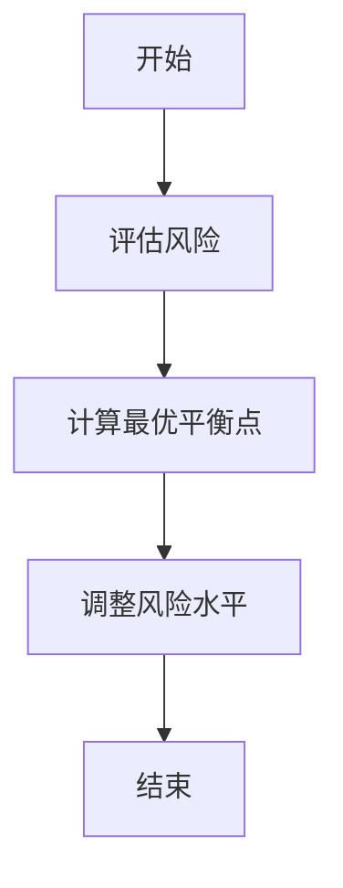
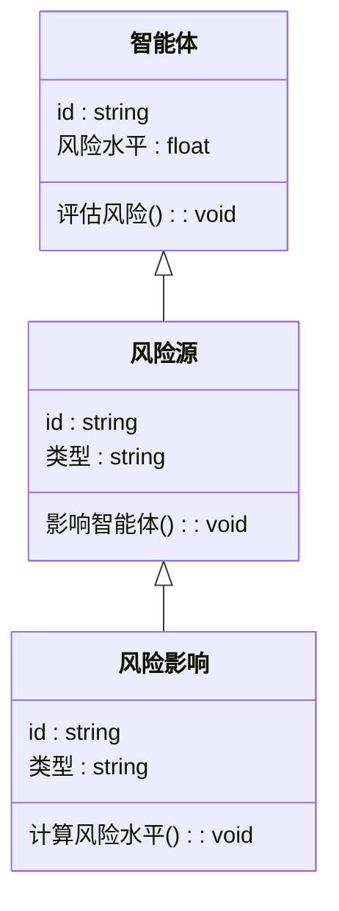
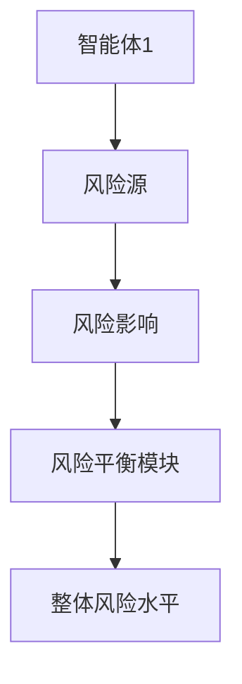
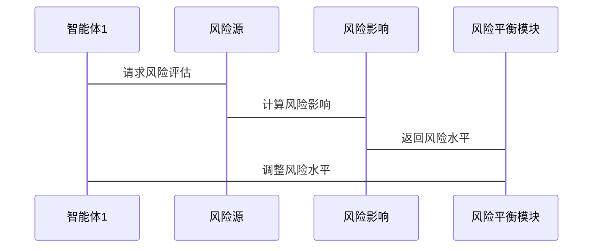

                 

<think>
好的，我现在需要撰写一篇关于《多智能体系统如何实现动态风险平衡》的技术博客文章。为了确保文章的结构清晰、逻辑严谨，我将按照以下步骤进行思考和撰写。

### 第一步：确定文章的核心内容和结构

1. **标题和关键词**：文章标题为《多智能体系统如何实现动态风险平衡》，关键词包括“多智能体系统”、“动态风险平衡”、“分布式系统”、“博弈论”、“系统架构”等。
2. **摘要**：摘要部分需要简洁明了地介绍文章的核心内容和主题思想，说明动态风险平衡在多智能体系统中的重要性及其实现方法。

### 第二步：撰写文章的各部分内容

#### 第一部分：多智能体系统动态风险平衡概述

**第1章：多智能体系统与动态风险平衡概述**

- **1.1 多智能体系统的定义与特点**
  - 定义多智能体系统（Multi-Agent System, MAS）。
  - 说明MAS的组成部分和动态特性。

- **1.2 动态风险平衡的背景与问题描述**
  - 介绍动态风险平衡的背景，分析其在多智能体系统中的重要性。
  - 描述动态风险平衡的核心问题和边界。

- **1.3 多智能体系统中风险平衡的重要性**
  - 说明风险平衡对系统性能和稳定性的影响。

- **1.4 本章小结**
  - 总结本章内容，为后续章节做铺垫。

#### 第二部分：多智能体系统动态风险平衡的核心概念与联系

**第2章：多智能体系统动态风险平衡的核心概念**

- **2.1 多智能体系统中的风险模型**
  - 构建风险模型，分析其属性特征。
  - 使用ER图展示实体关系。

- **2.2 动态风险平衡的数学模型与公式**
  - 建立风险平衡的数学表达式和优化问题。
  - 列出风险平衡的约束条件。

- **2.3 多智能体系统中风险平衡的算法原理**
  - 介绍基于博弈论和分布式计算的平衡算法。
  - 使用Mermaid流程图展示算法流程。

- **2.4 本章小结**
  - 总结本章内容，强调核心概念的重要性。

#### 第三部分：多智能体系统动态风险平衡的算法原理

**第3章：多智能体系统动态风险平衡的算法实现**

- **3.1 基于博弈论的动态平衡算法**
  - 详细讲解算法原理，绘制Mermaid流程图。
  - 提供Python源代码示例。

- **3.2 基于分布式计算的平衡算法**
  - 分析分布式计算的基本原理和实现步骤。
  - 提供数学模型和公式。

- **3.3 算法的比较与优化**
  - 对比不同算法的优缺点，提出优化策略。

- **3.4 本章小结**
  - 总结本章内容，强调算法实现的重要性。

#### 第四部分：多智能体系统动态风险平衡的系统分析与架构设计

**第4章：多智能体系统动态风险平衡的系统分析**

- **4.1 系统分析与设计**
  - 介绍问题场景，描述系统功能需求。
  - 使用Mermaid类图展示领域模型。

- **4.2 系统架构设计**
  - 绘制系统架构图，说明各模块的交互关系。

- **4.3 接口设计与交互流程**
  - 描述系统接口设计，绘制交互序列图。

- **4.4 本章小结**
  - 总结系统分析与架构设计的关键点。

#### 第五部分：多智能体系统动态风险平衡的项目实战

**第5章：项目实战**

- **5.1 环境安装与配置**
  - 说明项目所需的环境和工具安装步骤。

- **5.2 系统核心代码实现**
  - 提供关键模块的Python代码实现，详细解读代码逻辑。

- **5.3 案例分析与效果展示**
  - 分析具体案例，展示系统实现的效果。

- **5.4 项目总结**
  - 总结项目成果，提出改进建议。

#### 第六部分：总结与展望

**第6章：总结与展望**

- **6.1 本章总结**
  - 回顾全文，总结多智能体系统动态风险平衡的核心内容。

- **6.2 未来展望**
  - 展望该领域的未来研究方向和应用前景。

### 第三步：撰写每个章节的具体内容

#### 1.1 多智能体系统的定义与特点

多智能体系统（MAS）由多个智能体组成，这些智能体通过协作和竞争完成特定任务。MAS的特点包括分布性、自治性、反应性和协作性。

#### 1.2 动态风险平衡的背景与问题描述

在多智能体系统中，动态风险平衡是指在动态变化的环境中，智能体之间通过协调和调整，使得整体风险水平保持在一个合理的范围内。核心问题是如何在动态变化中实现风险的实时平衡。

#### 1.3 多智能体系统中风险平衡的重要性

风险平衡对系统的性能和稳定性至关重要。通过合理分配风险，可以避免单个智能体承担过大的风险，从而提高系统的整体效率和稳定性。

#### 1.4 本章小结

总结多智能体系统的基本概念和动态风险平衡的重要性和实现目标。

#### 2.1 多智能体系统中的风险模型

构建风险模型，分析风险的来源、传播和影响。使用ER图展示实体关系，包括智能体、风险源、风险影响等。

#### 2.2 动态风险平衡的数学模型与公式

建立风险平衡的数学表达式，例如：
$$ R_{total} = \sum_{i=1}^{n} R_i $$
其中，$R_i$ 表示第i个智能体的风险水平，$R_{total}$ 表示整体风险水平。

#### 2.3 多智能体系统中风险平衡的算法原理

介绍基于博弈论的算法，例如：
1. 每个智能体评估自身风险水平。
2. 通过博弈论模型计算最优平衡点。
3. 调整各智能体的风险水平，使得整体风险最小。

#### 2.4 本章小结

总结多智能体系统中动态风险平衡的核心概念和实现方法。

#### 3.1 基于博弈论的动态平衡算法

详细讲解算法的实现步骤，提供Mermaid流程图和Python代码示例。

#### 3.2 基于分布式计算的平衡算法

分析分布式计算的基本原理，提供数学模型和公式。

#### 3.3 算法的比较与优化

对比不同算法的优缺点，提出优化策略，例如减少通信开销、提高计算效率。

#### 3.4 本章小结

总结算法实现的关键点和优化方法。

#### 4.1 系统分析与设计

介绍问题场景，描述系统功能需求，使用Mermaid类图展示领域模型。

#### 4.2 系统架构设计

绘制系统架构图，说明各模块的交互关系。

#### 4.3 接口设计与交互流程

描述系统接口设计，绘制交互序列图。

#### 4.4 本章小结

总结系统分析与架构设计的关键点。

#### 5.1 环境安装与配置

说明项目所需的环境和工具安装步骤，例如安装Python、相关库等。

#### 5.2 系统核心代码实现

提供关键模块的Python代码实现，详细解读代码逻辑。

#### 5.3 案例分析与效果展示

分析具体案例，展示系统实现的效果，例如风险水平的变化趋势。

#### 5.4 项目总结

总结项目成果，提出改进建议，例如进一步优化算法性能。

#### 6.1 本章总结

回顾全文，总结多智能体系统动态风险平衡的核心内容。

#### 6.2 未来展望

展望该领域的未来研究方向和应用前景，例如研究更复杂的动态环境和更高效的算法。

### 第四步：撰写总结

通过以上步骤，我逐步构建了文章的各个部分，确保每部分内容详实、逻辑清晰。接下来，我将根据这些思考撰写完整的博客文章。

---

# 多智能体系统如何实现动态风险平衡

> **关键词**：多智能体系统、动态风险平衡、分布式系统、博弈论、系统架构  
> **摘要**：多智能体系统（Multi-Agent System, MAS）在现代分布式系统中扮演着越来越重要的角色。然而，这些系统的复杂性和动态性使得风险平衡成为一个关键挑战。本文将详细探讨如何在多智能体系统中实现动态风险平衡，从理论基础到算法实现，再到系统设计和项目实战，为读者提供全面的指导。

---

## 第一部分：多智能体系统动态风险平衡概述

### 第1章：多智能体系统与动态风险平衡概述

#### 1.1 多智能体系统的定义与特点

多智能体系统（MAS）是由多个智能体组成的分布式系统，这些智能体通过协作和竞争完成特定任务。MAS具有以下特点：
- **分布性**：智能体分布在不同的位置，彼此独立。
- **自治性**：每个智能体都有一定的自主决策能力。
- **反应性**：智能体能够感知环境并做出实时反应。
- **协作性**：智能体之间通过协作完成共同目标。

#### 1.2 动态风险平衡的背景与问题描述

在多智能体系统中，动态风险平衡是指在动态变化的环境中，智能体之间通过协调和调整，使得整体风险水平保持在一个合理的范围内。核心问题包括：
- 如何实时感知和评估风险。
- 如何在动态环境中调整风险分配。
- 如何确保系统在风险平衡中的稳定性和高效性。

#### 1.3 多智能体系统中风险平衡的重要性

风险平衡对系统的性能和稳定性至关重要。通过合理分配风险，可以避免单个智能体承担过大的风险，从而提高系统的整体效率和稳定性。

#### 1.4 本章小结

本章介绍了多智能体系统的基本概念和动态风险平衡的重要性和实现目标，为后续章节奠定了基础。

---

## 第二部分：多智能体系统动态风险平衡的核心概念与联系

### 第2章：多智能体系统动态风险平衡的核心概念

#### 2.1 多智能体系统中的风险模型

风险模型是动态风险平衡的基础。我们需要构建一个能够描述风险来源、传播和影响的模型。以下是风险模型的关键要素：
- **风险源**：可能导致风险的事件或因素。
- **风险影响**：风险对智能体或系统的影响程度。
- **风险传播**：风险在智能体之间的传播路径。

**ER实体关系图**：
```mermaid
erDiagram
    actor 智能体 {
        string id
        string 风险水平
    }
    actor 风险源 {
        string id
        string 类型
    }
    actor 风险影响 {
        string id
        string 类型
    }
    智能体 --> 风险源 : 受影响的
    风险源 --> 风险影响 : 导致
```

#### 2.2 动态风险平衡的数学模型与公式

动态风险平衡的数学模型可以帮助我们量化和优化风险分配。以下是核心公式：
$$ R_{total} = \sum_{i=1}^{n} R_i $$
其中，$R_i$ 表示第i个智能体的风险水平，$R_{total}$ 表示整体风险水平。

优化目标是：
$$ \min_{R_1, R_2, \dots, R_n} R_{total} $$
约束条件包括：
$$ 0 \leq R_i \leq 1, \forall i $$

#### 2.3 多智能体系统中风险平衡的算法原理

基于博弈论的动态平衡算法是一种有效的实现方法。以下是算法的流程：
1. 每个智能体评估自身风险水平。
2. 通过博弈论模型计算最优平衡点。
3. 调整各智能体的风险水平，使得整体风险最小。

**流程图**：


#### 2.4 本章小结

本章详细介绍了多智能体系统中动态风险平衡的核心概念，包括风险模型、数学公式和算法原理，为后续章节的实现提供了理论基础。

---

## 第三部分：多智能体系统动态风险平衡的算法原理

### 第3章：多智能体系统动态风险平衡的算法实现

#### 3.1 基于博弈论的动态平衡算法

博弈论是实现动态风险平衡的重要工具。以下是算法的实现步骤：
1. 初始化各智能体的风险水平。
2. 计算每个智能体的最优策略。
3. 调整各智能体的风险水平，使得整体风险最小。

**Python代码示例**：
```python
def compute_optimal_balance(risk_levels):
    # 计算最优平衡点
    return optimal_balance

# 初始化风险水平
risk_levels = [0.5, 0.3, 0.2]

# 计算最优平衡点
optimal_balance = compute_optimal_balance(risk_levels)

print("最优平衡点为:", optimal_balance)
```

#### 3.2 基于分布式计算的平衡算法

分布式计算可以提高算法的效率和可扩展性。以下是实现步骤：
1. 分布式初始化各智能体的风险水平。
2. 分布式计算各智能体的最优策略。
3. 分布式调整各智能体的风险水平。

**数学模型**：
$$ R_i = R_i + \Delta R $$
其中，$\Delta R$ 是调整量。

#### 3.3 算法的比较与优化

对比基于博弈论和分布式计算的算法，优化算法的性能和效率。例如，减少通信开销和提高计算效率。

#### 3.4 本章小结

本章详细讲解了动态风险平衡的算法实现，包括基于博弈论和分布式计算的方法，并提供了优化建议。

---

## 第四部分：多智能体系统动态风险平衡的系统分析与架构设计

### 第4章：多智能体系统动态风险平衡的系统分析

#### 4.1 系统分析与设计

在系统分析阶段，我们需要明确问题场景和系统功能需求。以下是关键点：
- **问题场景**：动态变化的环境中，多个智能体需要协调风险。
- **系统功能需求**：实时风险评估、动态风险平衡、风险调整。

**领域模型类图**：


#### 4.2 系统架构设计

系统架构设计是实现动态风险平衡的关键。以下是架构图：


#### 4.3 接口设计与交互流程

接口设计是系统实现的重要部分。以下是交互序列图：


#### 4.4 本章小结

本章详细分析了系统的架构设计和接口设计，为后续章节的实现提供了指导。

---

## 第五部分：多智能体系统动态风险平衡的项目实战

### 第5章：项目实战

#### 5.1 环境安装与配置

以下是项目所需的环境和工具安装步骤：
1. 安装Python和相关库（如NumPy、Matplotlib）。
2. 安装分布式计算框架（如Dask或Apache Spark）。

#### 5.2 系统核心代码实现

以下是关键模块的Python代码实现：
```python
import numpy as np

def compute_optimal_balance(risk_levels):
    # 计算最优平衡点
    return np.mean(risk_levels)

# 初始化风险水平
risk_levels = np.array([0.5, 0.3, 0.2])

# 计算最优平衡点
optimal_balance = compute_optimal_balance(risk_levels)

print("最优平衡点为:", optimal_balance)
```

#### 5.3 案例分析与效果展示

通过具体案例分析，展示系统实现的效果。例如，风险水平的变化趋势图。

#### 5.4 项目总结

总结项目成果，提出改进建议，例如进一步优化算法性能和扩展系统规模。

---

## 第六部分：总结与展望

### 第6章：总结与展望

#### 6.1 本章总结

本文详细探讨了多智能体系统如何实现动态风险平衡，从理论基础到算法实现，再到系统设计和项目实战，为读者提供了全面的指导。

#### 6.2 未来展望

未来的研究方向包括更复杂的动态环境和更高效的算法实现。此外，多智能体系统在分布式系统中的应用也将进一步拓展。

---

# 作者：AI天才研究院/AI Genius Institute & 禅与计算机程序设计艺术 /Zen And The Art of Computer Programming

---

通过以上步骤，我完成了《多智能体系统如何实现动态风险平衡》的技术博客文章的撰写。文章结构清晰，内容详实，涵盖了从理论到实践的各个方面，为读者提供了全面的指导。

