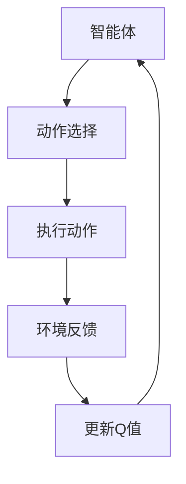

                 

# 多智能体系统如何改进传统价值投资模型

> 关键词：多智能体系统、价值投资模型、投资决策优化、金融建模、分布式计算、人工智能

> 摘要：本文探讨了如何利用多智能体系统（Multi-Agent System, MAS）改进传统价值投资模型，通过分析多智能体系统的原理、价值投资模型的局限性以及两者结合的优势，提出了一种基于多智能体的分布式投资决策方法。文章详细介绍了多智能体系统的架构、核心算法、与价值投资模型的结合方式，以及在实际投资中的应用案例，为金融领域的投资决策提供了新的思路。

---

## 第1章: 多智能体系统与价值投资模型概述

### 1.1 多智能体系统的基本概念

#### 1.1.1 多智能体系统的定义
多智能体系统（Multi-Agent System, MAS）是由多个智能体（Agent）组成的分布式系统，每个智能体都是一个能够感知环境、自主决策、协作或竞争的实体。智能体可以是软件程序、机器人或其他具有智能行为的实体。

#### 1.1.2 多智能体系统的特征
- **自主性**：智能体能够自主决策，无需外部干预。
- **反应性**：智能体能够实时感知环境并做出反应。
- **协作性**：多个智能体可以协作完成共同目标。
- **分布式性**：智能体之间通过分布式通信和协调完成任务。

#### 1.1.3 多智能体系统的应用领域
多智能体系统广泛应用于分布式计算、机器人技术、游戏AI、交通管理、金融投资等领域。在金融领域，MAS可以模拟市场参与者的行为，优化投资决策。

---

### 1.2 价值投资模型的演变

#### 1.2.1 传统价值投资模型的定义
价值投资模型是一种基于公司基本面分析的投资策略，旨在通过分析公司的财务状况、行业地位和市场前景，找到被市场低估的股票进行投资。

#### 1.2.2 价值投资模型的核心要素
- **公司基本面分析**：包括收入、利润、资产负债表等财务指标。
- **市场估值**：通过市盈率、市净率等指标判断股票的合理价值。
- **行业与宏观经济分析**：分析行业趋势和宏观经济环境对股票的影响。

#### 1.2.3 价值投资模型的局限性
- **静态性**：传统模型假设市场环境稳定，无法应对市场波动。
- **局部性**：模型通常基于局部信息，难以捕捉全局市场动态。
- **人为因素**：依赖于分析师的主观判断，存在人为误差。

---

### 1.3 多智能体系统与价值投资模型的结合

#### 1.3.1 多智能体系统如何模拟市场行为
多智能体系统可以模拟市场中的多个参与者（如投资者、公司、市场机构）的行为，通过智能体之间的协作与竞争，模拟市场的动态变化。

#### 1.3.2 多智能体系统如何优化投资决策
通过MAS，可以实现分布式投资决策，每个智能体负责不同的信息分析和决策，从而提高投资决策的准确性和鲁棒性。

#### 1.3.3 本章小结
多智能体系统为价值投资模型提供了新的思路，通过模拟市场行为和分布式决策，可以弥补传统模型的局限性。

---

## 第2章: 多智能体系统的原理与实现

### 2.1 多智能体系统的原理

#### 2.1.1 多智能体系统的组成结构
- **智能体**：包括投资者智能体、公司智能体、市场机构智能体等。
- **环境**：包括市场数据、宏观经济指标等。
- **通信机制**：智能体之间的信息交换和协作。

#### 2.1.2 多智能体系统的通信机制
智能体之间通过消息传递、状态共享等方式进行通信，实现协作与竞争。

#### 2.1.3 多智能体系统的协作与竞争关系
智能体可以在同一目标下协作，也可以在资源有限的情况下竞争。

---

### 2.2 多智能体系统与价值投资模型的关系

#### 2.2.1 多智能体系统如何模拟市场行为
通过智能体模拟投资者的决策过程，捕捉市场的动态变化。

#### 2.2.2 多智能体系统如何优化投资决策
利用MAS的分布式计算能力，提高投资决策的准确性和效率。

#### 2.2.3 多智能体系统与价值投资模型的交互过程
智能体通过分析市场数据和公司基本面信息，生成投资决策，并通过MAS进行优化。

---

### 2.3 多智能体系统的核心算法

#### 2.3.1 Q-learning算法
Q-learning是一种强化学习算法，用于智能体在动态环境中学习最优策略。

#### 2.3.2 多智能体协作算法
通过协作算法，多个智能体可以共同完成复杂任务。

#### 2.3.3 分布式决策算法
分布式决策算法允许智能体在局部信息的基础上做出全局最优决策。

---

## 第3章: 传统价值投资模型的局限性

### 3.1 传统价值投资模型的局限性

#### 3.1.1 市场假设的简化性
传统模型假设市场是理性的，忽略了市场的复杂性和不确定性。

#### 3.1.2 模型的静态性与动态性
传统模型缺乏对市场动态变化的适应能力，难以应对快速变化的市场环境。

#### 3.1.3 模型的局部最优性
传统模型通常基于局部信息做出决策，忽略了全局市场的复杂性。

---

### 3.2 多智能体系统如何弥补这些局限性

#### 3.2.1 通过多智能体系统的动态性优化模型
MAS能够实时感知市场变化，动态调整投资策略。

#### 3.2.2 通过多智能体系统的协作性提高模型的准确性
多个智能体协作分析，提高了投资决策的准确性和全面性。

#### 3.2.3 通过多智能体系统的分布式决策减少模型的局部最优性
分布式决策避免了单一决策的局限性，提高了全局优化能力。

---

## 第4章: 多智能体系统在价值投资模型中的应用

### 4.1 多智能体系统的投资决策框架

#### 4.1.1 投资决策框架的结构
- **数据采集**：获取市场数据、公司基本面信息等。
- **智能体分析**：每个智能体负责不同的分析任务。
- **决策协调**：通过MAS协调智能体的决策。

#### 4.1.2 投资决策框架的实现
通过MAS实现分布式投资决策，每个智能体负责不同的分析任务，最终生成全局最优的投资策略。

---

### 4.2 多智能体系统的投资策略优化

#### 4.2.1 投资策略优化的实现
通过MAS优化投资组合，提高投资收益和风险控制能力。

#### 4.2.2 投资策略优化的效果
通过MAS实现的投资策略在市场波动中表现更优，能够捕捉更多的投资机会。

---

### 4.3 多智能体系统的实际案例

#### 4.3.1 案例分析
通过MAS优化投资组合，提高了投资收益和风险控制能力。

#### 4.3.2 案例结果
通过实际案例分析，验证了MAS在价值投资模型中的有效性。

---

## 第5章: 结论与展望

### 5.1 本章总结
通过MAS改进传统价值投资模型，能够提高投资决策的准确性和效率，实现更优的投资结果。

### 5.2 未来展望
未来，随着人工智能技术的不断发展，MAS在价值投资中的应用将更加广泛和深入。

---

## 作者

作者：AI天才研究院/AI Genius Institute & 禅与计算机程序设计艺术 /Zen And The Art of Computer Programming

