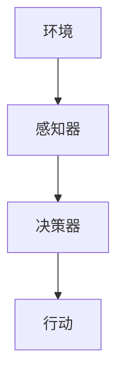
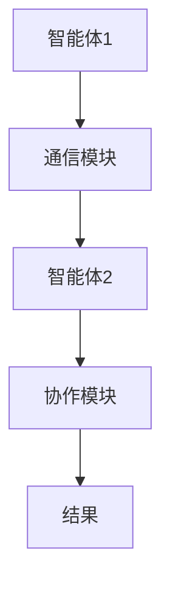
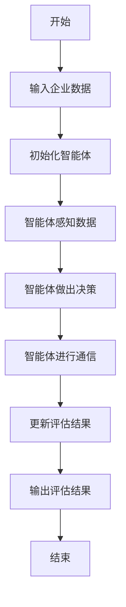
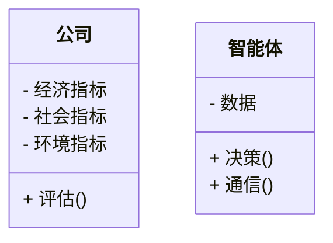
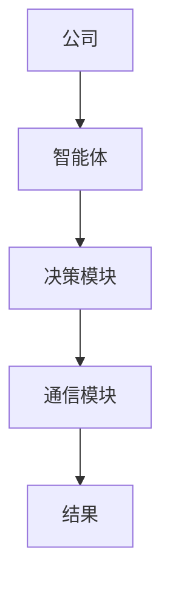

                 


# 多智能体系统如何评估公司的可持续发展能力

> 关键词：多智能体系统, 可持续发展, 企业评估, 系统架构, 算法原理

> 摘要：本文通过多智能体系统（Multi-Agent Systems, MAS）的原理与应用，详细探讨了如何利用MAS评估公司的可持续发展能力。文章从MAS的基本概念出发，分析了其在可持续发展评估中的优势，并结合实际案例，详细讲解了MAS在企业评估中的具体应用。通过本篇文章，读者将能够理解如何构建一个多智能体系统模型，以及如何利用该模型来评估和优化公司的可持续发展能力。

---

## 第1章: 多智能体系统概述

### 1.1 多智能体系统的定义与特点

多智能体系统（Multi-Agent Systems, MAS）是由多个智能体（Agent）组成的分布式系统，这些智能体能够通过自主决策和协作完成特定任务。与传统的单智能体系统相比，MAS具有以下特点：

- **自主性**：每个智能体都能独立决策和行动。
- **反应性**：智能体能够感知环境并实时响应。
- **协作性**：智能体之间可以通过通信和协作完成复杂任务。
- **分布性**：系统中的智能体是分布式的，不存在单一的控制中心。

### 1.2 多智能体系统的分类与应用场景

#### 1.2.1 分布式智能体系统

分布式智能体系统是一种去中心化的MAS，智能体之间通过通信协议进行交互。这种系统适用于需要高度自治和去中心化管理的应用场景，例如：

- 分布式计算
- 智能交通管理
- 分布式机器人协作

#### 1.2.2 集中式智能体系统

集中式智能体系统有一个中央控制节点，负责协调和管理所有智能体的行动。这种系统适用于需要集中控制和统一协调的应用场景，例如：

- 智能电网管理
- 集中监控系统
- 大规模生产流程管理

#### 1.2.3 混合式智能体系统

混合式智能体系统结合了分布式和集中式的特点，既有一个或多个中央控制节点，又允许部分智能体在局部范围内进行自主决策。这种系统适用于复杂的应用场景，例如：

- 智能城市
- 跨组织协同
- 复杂项目管理

### 1.3 可持续发展能力评估的基本概念

#### 1.3.1 可持续发展的定义

可持续发展是指在满足当代需求的同时，不损害后代满足其需求的能力。在企业层面，可持续发展能力通常包括经济、社会和环境三个方面。

#### 1.3.2 公司可持续发展能力的内涵

公司的可持续发展能力体现在以下几个方面：

1. 经济效益：公司能够持续盈利并为股东创造价值。
2. 社会效益：公司积极履行社会责任，关注员工福利和环境保护。
3. 环境效益：公司通过减少资源消耗和环境污染，实现绿色生产。

#### 1.3.3 多智能体系统在可持续发展评估中的优势

多智能体系统在可持续发展评估中的优势主要体现在以下几个方面：

1. **分布式计算能力**：MAS能够处理大规模数据，并通过分布式计算提高评估效率。
2. **协作能力**：智能体之间的协作能够模拟企业内部和外部的协同效应，提供更准确的评估结果。
3. **动态适应性**：MAS能够实时感知环境变化，并动态调整评估策略。

---

## 第2章: 多智能体系统的核心概念与联系

### 2.1 多智能体系统的实体关系分析

#### 2.1.1 实体关系图

在多智能体系统中，实体关系图（ER图）可以帮助我们更好地理解系统中各实体之间的关系。以下是企业可持续发展评估中的一个简单的ER图示例：

```mermaid
erdiagram
actor 公司
actor 评估指标
actor 智能体
company 公司 -[拥有]-> agent 智能体
company 公司 -[评估]-> indicator 评估指标
agent 智能体 -[处理]-> indicator 评估指标
```

### 2.2 多智能体系统的原理与机制

#### 2.2.1 智能体的感知与决策机制

智能体的感知与决策机制是MAS的核心。智能体通过感知环境中的信息，利用决策算法做出最优决策。以下是一个简单的感知与决策流程图：



#### 2.2.2 智能体之间的通信与协作

智能体之间的通信与协作是实现复杂任务的关键。通过通信协议，智能体可以共享信息并协同工作。以下是一个通信流程图：



### 2.3 多智能体系统的核心要素对比

以下是一个核心要素对比表格：

| 对比维度 | 分布式MAS | 集中式MAS | 混合式MAS |
|----------|-----------|-----------|-----------|
| 控制方式 | 去中心化 | 集中控制 | 混合控制 |
| 响应速度 | 较慢 | 较快 | 适中 |
| 适用场景 | 复杂分布式任务 | 需要集中控制的任务 | 综合性任务 |

---

## 第3章: 多智能体系统评估模型的数学基础

### 3.1 多智能体系统评估模型的数学框架

评估模型的数学框架通常包括以下几个部分：

1. **输入变量**：包括企业经济指标、社会指标和环境指标。
2. **输出变量**：包括企业的可持续发展评分。
3. **数学模型**：将输入变量映射到输出变量的函数。

以下是一个简单的数学模型示例：

$$ \text{评分} = f(\text{经济指标}, \text{社会指标}, \text{环境指标}) $$

### 3.2 智能体之间的通信模型

通信模型的数学公式可以表示为：

$$ C = \sum_{i=1}^{n} c_i $$

其中，$C$ 是通信成本，$c_i$ 是每个智能体的通信成本。

### 3.3 智能体的决策模型

决策模型的数学公式可以表示为：

$$ D = \argmax_{j=1}^{m} d_j $$

其中，$D$ 是决策结果，$d_j$ 是每个决策的收益值。

---

## 第4章: 多智能体系统评估模型的算法原理

### 4.1 多智能体系统评估模型的算法流程

以下是算法的流程图：



### 4.2 算法的数学模型与公式

以下是算法的数学模型：

$$ \text{评估结果} = \sum_{i=1}^{n} w_i \cdot x_i $$

其中，$w_i$ 是权重，$x_i$ 是各个指标的值。

### 4.3 算法的实现与优化

以下是Python实现的代码示例：

```python
class Agent:
    def __init__(self, data):
        self.data = data

    def decide(self):
        # 简单决策逻辑
        if self.data['经济指标'] > 0.8:
            return '高分'
        elif self.data['社会指标'] > 0.7:
            return '中分'
        else:
            return '低分'

agents = [Agent(data1), Agent(data2)]
for agent in agents:
    print(agent.decide())
```

---

## 第5章: 系统分析与架构设计方案

### 5.1 系统功能设计

以下是系统功能的类图：



### 5.2 系统架构设计

以下是系统架构的流程图：



---

## 第6章: 项目实战

### 6.1 环境安装

以下是项目所需的环境和工具：

1. Python 3.8+
2. Mermaid工具
3. 基础的编程知识

### 6.2 系统核心实现源代码

以下是核心实现的代码示例：

```python
def evaluate_sustainability(company_data):
    # 经济指标权重
    economic_weight = 0.4
    # 社会指标权重
    social_weight = 0.3
    # 环境指标权重
    environmental_weight = 0.3

    economic_score = company_data['经济指标']
    social_score = company_data['社会指标']
    environmental_score = company_data['环境指标']

    total_score = economic_weight * economic_score + \
                   social_weight * social_score + \
                   environmental_weight * environmental_score

    return total_score

# 示例数据
company_data = {
    '经济指标': 0.8,
    '社会指标': 0.7,
    '环境指标': 0.6
}

print(evaluate_sustainability(company_data))
```

### 6.3 实际案例分析

以下是实际案例的分析流程：

1. 收集企业数据。
2. 初始化智能体。
3. 智能体感知数据并做出决策。
4. 智能体进行通信并更新评估结果。
5. 输出最终评估结果。

---

## 第7章: 总结与展望

### 7.1 总结

通过本文的介绍，我们详细探讨了多智能体系统在公司可持续发展能力评估中的应用。从MAS的基本概念到具体的算法实现，我们展示了如何利用多智能体系统来优化企业的可持续发展评估过程。

### 7.2 未来展望

未来，随着人工智能和大数据技术的不断发展，多智能体系统在可持续发展评估中的应用将更加广泛。我们可以期待更多创新的算法和应用场景的出现。

---

## 作者

作者：AI天才研究院/AI Genius Institute & 禅与计算机程序设计艺术 /Zen And The Art of Computer Programming

