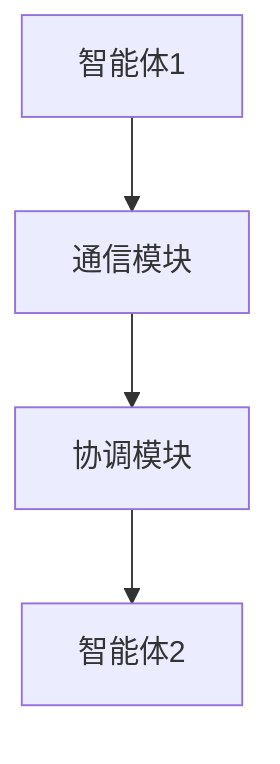

                 


# 多智能体系统如何评估公司的品牌价值动态变化

> 关键词：多智能体系统、品牌价值、动态评估、协同智能、算法模型

> 摘要：本文探讨了如何利用多智能体系统动态评估公司品牌价值，详细介绍了多智能体系统的原理、品牌价值评估的方法，以及如何通过协同智能和算法模型实现品牌价值的实时动态评估。文章从理论到实践，结合具体案例，展示了多智能体系统在品牌价值评估中的应用和优势。

---

## 第1章 多智能体系统与品牌价值评估概述

### 1.1 多智能体系统的基本概念

#### 1.1.1 多智能体系统的定义

多智能体系统（Multi-Agent System，MAS）是由多个智能体（Agent）组成的分布式系统，这些智能体能够自主决策、协作完成任务，并通过交互实现复杂问题的解决。智能体是指具有感知环境、做出决策、执行动作能力的实体，可以是软件程序、机器人或其他智能设备。

#### 1.1.2 多智能体系统的分类与特点

多智能体系统可以根据智能体的智能水平、协作方式、环境类型等进行分类。常见的分类包括：

- **反应式智能体**：基于当前感知做出反应，不依赖历史信息。
- **认知式智能体**：具有复杂推理和规划能力，能够处理不确定性和模糊性。
- **协作式智能体**：多个智能体通过协作完成共同目标。
- **分布式智能体**：智能体分布在不同的地理位置，通过通信网络协作。

多智能体系统的特点包括：

- **分布性**：智能体独立运行，不依赖中央控制。
- **协作性**：智能体通过协作完成复杂任务。
- **动态性**：系统能够适应环境变化。
- **自主性**：智能体能够自主决策和行动。

#### 1.1.3 多智能体系统在品牌价值评估中的应用前景

品牌价值是企业核心竞争力的重要体现，传统的品牌价值评估方法通常基于财务数据、市场表现和消费者调研。然而，这些方法往往难以捕捉品牌在市场中的动态变化，尤其是面对复杂市场环境时。多智能体系统通过分布式协作和实时数据处理，能够实时感知市场变化，评估品牌价值的动态变化，为企业提供更加精准和及时的品牌价值评估。

---

### 1.2 品牌价值评估的定义与重要性

#### 1.2.1 品牌价值的定义

品牌价值是指品牌在市场中所代表的经济价值，通常通过品牌知名度、品牌忠诚度、品牌认知度等指标来衡量。品牌价值不仅包括品牌的市场表现，还包括品牌在消费者心中的认知和信任。

#### 1.2.2 品牌价值评估的必要性

品牌价值是企业决策的重要依据，尤其是在并购、融资、市场推广等活动中。准确评估品牌价值可以帮助企业制定合理的战略规划，优化资源配置，提升品牌竞争力。

#### 1.2.3 品牌价值动态变化的特征

品牌价值并非一成不变，它会受到市场环境、消费者行为、竞争对手策略等多种因素的影响。例如，社交媒体上的负面舆情可能会迅速降低品牌价值，而一次成功的营销活动可能会显著提升品牌价值。因此，品牌价值评估需要具备动态性，能够实时捕捉和分析市场变化。

---

### 1.3 本章小结

本章介绍了多智能体系统的基本概念、分类与特点，并探讨了多智能体系统在品牌价值评估中的应用前景。品牌价值的动态变化要求评估方法具备实时性和准确性，而多智能体系统通过分布式协作和自主决策，能够满足这一需求。

---

## 第2章 多智能体系统的原理与核心概念

### 2.1 多智能体系统的原理

#### 2.1.1 智能体的定义与特征

智能体是指具有感知、决策、行动能力的实体。智能体的特征包括：

- **自主性**：智能体能够自主决策和行动。
- **反应性**：智能体能够感知环境并做出反应。
- **协作性**：智能体能够与其他智能体协作完成任务。
- **学习能力**：智能体能够通过经验改进自身性能。

#### 2.1.2 多智能体系统中的协作机制

协作机制是多智能体系统的核心，主要包括：

- **通信机制**：智能体之间通过通信交换信息。
- **协商机制**：智能体通过协商分配任务和资源。
- **协调机制**：智能体通过协调确保系统整体目标的实现。

#### 2.1.3 多智能体系统的通信与协调

通信与协调是多智能体系统中智能体协作的关键。通信机制包括消息传递、数据共享等，协调机制包括任务分配、冲突解决等。通过有效的通信与协调，智能体能够实现协作，完成复杂任务。

#### 图2-1：多智能体系统通信与协调示意图



---

### 2.2 多智能体系统的核心概念

#### 2.2.1 协同行为的定义

协同行为是指多个智能体通过协作完成共同目标的行为。协同行为的核心在于智能体之间的协作与配合。

#### 2.2.2 协同智能的实现方法

协同智能的实现方法包括：

- **基于规则的协同**：通过预定义规则实现智能体协作。
- **基于计划的协同**：通过规划和调度实现智能体协作。
- **基于学习的协同**：通过机器学习算法实现智能体协作。

#### 2.2.3 多智能体系统的动态性与适应性

多智能体系统具有动态性和适应性，能够根据环境变化调整自身行为。动态性体现在任务、环境和智能体能力的变化上，适应性体现在智能体能够快速响应变化并调整策略。

---

### 2.3 本章小结

本章详细介绍了多智能体系统的原理与核心概念，包括智能体的定义与特征、协作机制、通信与协调，以及协同行为的实现方法。多智能体系统的动态性和适应性使其能够应对复杂的市场环境，为品牌价值的动态评估提供了技术基础。

---

## 第3章 品牌价值评估的理论与方法

### 3.1 品牌价值评估的传统方法

#### 3.1.1 基于财务指标的评估方法

基于财务指标的评估方法主要通过企业的财务数据（如销售收入、净利润等）来评估品牌价值。这种方法适用于传统制造业，但难以捕捉品牌在市场中的动态变化。

#### 3.1.2 基于市场表现的评估方法

基于市场表现的评估方法通过分析品牌在市场中的表现（如市场份额、品牌忠诚度等）来评估品牌价值。这种方法能够反映品牌在市场中的实际表现，但难以实时动态评估。

#### 3.1.3 基于消费者认知的评估方法

基于消费者认知的评估方法通过消费者调研（如问卷调查、焦点小组等）来评估品牌价值。这种方法能够反映消费者对品牌的认知和态度，但数据收集和处理成本较高。

---

### 3.2 基于多智能体系统的品牌价值评估方法

#### 3.2.1 多智能体系统在品牌价值评估中的优势

多智能体系统通过分布式协作和实时数据处理，能够实时感知市场变化，动态评估品牌价值。与传统方法相比，多智能体系统具有以下优势：

- **实时性**：能够实时捕捉市场变化。
- **准确性**：通过多智能体协作提高评估的准确性。
- **动态性**：能够动态调整评估模型。

#### 3.2.2 多智能体系统驱动的品牌价值动态评估模型

多智能体系统驱动的品牌价值动态评估模型通过多个智能体协作，从不同维度（如市场表现、消费者认知、竞争对手策略等）评估品牌价值。模型的核心在于智能体之间的协作和数据共享。

#### 图3-1：多智能体系统驱动的品牌价值动态评估模型

```mermaid
graph TD
A[市场表现智能体] --> B[品牌价值评估模型]
C[消费者认知智能体] --> B
D[竞争对手策略智能体] --> B
E[结果输出] <-- B
```

---

### 3.3 本章小结

本章介绍了品牌价值评估的传统方法和基于多智能体系统的评估方法。传统方法难以捕捉品牌价值的动态变化，而多智能体系统通过分布式协作和实时数据处理，能够实现品牌价值的动态评估，为企业的品牌管理提供了新的思路。

---

## 第4章 多智能体系统驱动的品牌价值动态评估模型

### 4.1 多智能体系统驱动的动态评估模型概述

#### 4.1.1 模型的基本框架

多智能体系统驱动的动态评估模型包括多个智能体，每个智能体负责不同的评估任务。模型的基本框架如下：

1. **数据采集智能体**：负责采集市场数据、消费者数据等。
2. **数据处理智能体**：负责对数据进行清洗、转换和分析。
3. **评估智能体**：负责基于数据生成品牌价值评估结果。
4. **结果输出智能体**：负责将评估结果输出给用户或系统。

#### 4.1.2 模型的核心算法

模型的核心算法包括：

- **协同价值函数**：用于衡量智能体之间的协作价值。
- **动态评估算法**：用于动态调整评估模型。

#### 4.1.3 模型的输入与输出

模型的输入包括市场数据、消费者数据、竞争对手数据等，输出包括品牌价值评估结果、品牌风险预警等。

---

### 4.2 多智能体系统中的协同价值函数

#### 4.2.1 协同价值函数的定义

协同价值函数是衡量智能体之间协作价值的函数，用于评估多个智能体协作的效果。

#### 4.2.2 协同价值函数的计算方法

协同价值函数可以通过以下公式计算：

$$ CV = \sum_{i=1}^{n} \sum_{j=1}^{m} v_{ij} $$

其中，$v_{ij}$ 表示智能体 $i$ 和智能体 $j$ 之间的协作价值。

#### 4.2.3 协同价值函数的优化策略

为了提高协同价值函数的计算效率，可以采用以下优化策略：

- **并行计算**：利用多核处理器或分布式计算提高计算速度。
- **局部优化**：对局部区域的协作价值进行优化，减少全局优化的计算量。
- **动态调整**：根据环境变化动态调整协作价值函数。

---

### 4.3 基于多智能体系统的动态评估模型实现

#### 4.3.1 模型的构建

动态评估模型的构建需要考虑以下几个方面：

- **智能体设计**：设计智能体的结构和功能。
- **通信协议**：定义智能体之间的通信协议。
- **协作机制**：制定智能体之间的协作规则。
- **评估算法**：选择或设计评估算法。

#### 4.3.2 模型的实现

模型的实现可以通过以下步骤进行：

1. **数据采集**：通过智能体采集市场数据、消费者数据等。
2. **数据处理**：对数据进行清洗、转换和分析。
3. **评估计算**：基于数据生成品牌价值评估结果。
4. **结果输出**：将评估结果输出给用户或系统。

#### 图4-1：动态评估模型的实现流程

```mermaid
graph TD
A[数据采集智能体] --> B[数据处理智能体]
C[评估智能体] --> B
D[结果输出智能体] <-- B
```

---

### 4.4 本章小结

本章详细介绍了多智能体系统驱动的品牌价值动态评估模型，包括模型的基本框架、核心算法、输入与输出，以及协同价值函数的计算方法和优化策略。通过动态评估模型，企业可以实时捕捉市场变化，动态调整品牌策略，提升品牌价值。

---

## 第5章 多智能体系统驱动的品牌价值动态评估的系统设计与实现

### 5.1 系统设计与架构

#### 5.1.1 系统架构设计

多智能体系统驱动的品牌价值动态评估系统的架构设计包括以下几个部分：

1. **数据采集模块**：负责采集市场数据、消费者数据等。
2. **数据处理模块**：负责对数据进行清洗、转换和分析。
3. **评估计算模块**：负责基于数据生成品牌价值评估结果。
4. **结果输出模块**：负责将评估结果输出给用户或系统。

#### 5.1.2 系统功能设计

系统功能设计包括：

- **数据采集功能**：采集市场数据、消费者数据等。
- **数据处理功能**：对数据进行清洗、转换和分析。
- **评估计算功能**：基于数据生成品牌价值评估结果。
- **结果输出功能**：将评估结果输出给用户或系统。

#### 图5-1：系统架构设计

```mermaid
graph TD
A[数据采集模块] --> B[数据处理模块]
C[评估计算模块] --> B
D[结果输出模块] <-- B
```

---

### 5.2 系统实现与代码示例

#### 5.2.1 环境配置

系统实现需要以下环境配置：

- **编程语言**：Python
- **开发框架**：Flask或Django
- **数据库**：MySQL或MongoDB
- **机器学习库**：Scikit-learn或TensorFlow

#### 5.2.2 核心代码实现

以下是动态评估模型的核心代码示例：

```python
class Agent:
    def __init__(self, id):
        self.id = id
        self.data = {}

    def collect_data(self):
        # 数据采集逻辑
        pass

    def process_data(self):
        # 数据处理逻辑
        pass

    def evaluate_brand_value(self):
        # 品牌价值评估逻辑
        pass

# 数据采集智能体
class DataCollector(Agent):
    def collect_data(self):
        # 从数据库中采集数据
        pass

# 数据处理智能体
class DataProcessor(Agent):
    def process_data(self):
        # 数据清洗和转换
        pass

# 评估智能体
class Evaluator(Agent):
    def evaluate_brand_value(self):
        # 基于数据生成品牌价值评估结果
        pass
```

---

### 5.3 本章小结

本章详细介绍了多智能体系统驱动的品牌价值动态评估系统的系统设计与实现，包括系统架构设计、功能设计、代码实现等。通过系统的实现，企业可以实时捕捉市场变化，动态调整品牌策略，提升品牌价值。

---

## 第6章 多智能体系统驱动的品牌价值动态评估的案例分析与展望

### 6.1 案例分析

#### 6.1.1 案例背景

假设某企业希望利用多智能体系统动态评估其品牌价值，我们可以通过以下步骤进行案例分析：

1. **数据采集**：通过智能体采集市场数据、消费者数据等。
2. **数据处理**：对数据进行清洗、转换和分析。
3. **评估计算**：基于数据生成品牌价值评估结果。
4. **结果输出**：将评估结果输出给用户或系统。

#### 6.1.2 实施过程

以下是案例分析的具体实施过程：

1. **数据采集**：通过智能体采集市场数据、消费者数据等。
2. **数据处理**：对数据进行清洗、转换和分析。
3. **评估计算**：基于数据生成品牌价值评估结果。
4. **结果输出**：将评估结果输出给用户或系统。

#### 图6-1：案例分析流程图

```mermaid
graph TD
A[数据采集] --> B[数据处理]
C[评估计算] --> B
D[结果输出] <-- B
```

---

### 6.2 本章小结

本章通过具体案例分析，展示了多智能体系统在品牌价值动态评估中的应用。案例分析表明，多智能体系统能够实时捕捉市场变化，动态评估品牌价值，为企业提供及时准确的品牌价值评估结果。

---

## 作者

作者：AI天才研究院/AI Genius Institute & 禅与计算机程序设计艺术 /Zen And The Art of Computer Programming

