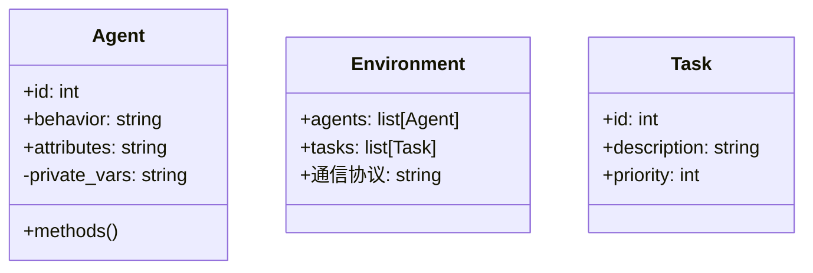
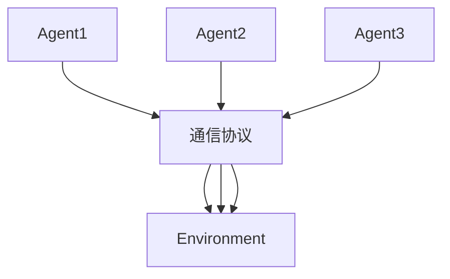

                 


# 多智能体系统如何评估公司的护城河

> **关键词**：多智能体系统，护城河，商业分析，协同决策，算法原理

> **摘要**：本文探讨了多智能体系统在评估公司护城河中的应用。通过分析多智能体系统的协同机制和算法原理，结合实际案例，展示了如何利用多智能体系统量化护城河的价值、预测其可持续性并优化其构建。文章内容包括背景介绍、核心概念、算法原理、系统架构设计和项目实战等部分。

---

## 第一部分: 多智能体系统与公司护城河的背景介绍

### 第1章: 多智能体系统概述

#### 1.1 多智能体系统的定义与特点

##### 1.1.1 多智能体系统的定义

多智能体系统（Multi-Agent System, MAS）是由多个智能体（Agent）组成的系统，这些智能体能够通过交互和协作完成复杂的任务。每个智能体都有自己的目标、知识和行为规则，能够独立决策并与其他智能体协同工作。

##### 1.1.2 多智能体系统的核心特点

- **分布式**：智能体分布在不同的位置，能够独立决策和行动。
- **协作性**：智能体之间通过通信和协作完成共同目标。
- **动态性**：系统环境和智能体状态可能动态变化，需要实时响应。
- **自主性**：智能体具备自主决策的能力，无需外部干预。

##### 1.1.3 多智能体系统与传统单智能体系统的区别

传统单智能体系统依赖中心化控制，而多智能体系统强调去中心化和分布式协作。多智能体系统能够处理复杂的任务，适用于需要多个决策单元协同工作的场景。

#### 1.2 护城河的定义与分类

##### 1.2.1 护城河的定义

护城河是公司在市场中建立的竞争优势，使其能够抵御竞争对手的侵蚀。护城河可以是技术壁垒、市场占有率、资源控制等多种形式。

##### 1.2.2 护城河的分类与特征

1. **技术壁垒**：公司拥有独特的技术优势，难以被竞争对手复制。
2. **市场壁垒**：公司占据较大的市场份额，形成规模经济。
3. **资源壁垒**：公司控制关键资源，如原材料或渠道。
4. **组织壁垒**：公司具备高效的组织结构和管理能力。

##### 1.2.3 护城河在企业中的作用与价值

护城河能够增强公司的竞争优势，降低被竞争对手取代的风险，为公司创造可持续的经济价值。

### 第2章: 多智能体系统与护城河的关系

#### 2.1 多智能体系统在商业分析中的应用

##### 2.1.1 多智能体系统如何模拟市场行为

多智能体系统可以模拟市场中的多个参与者（如消费者、供应商、竞争对手）的行为，分析市场动态和趋势。

##### 2.1.2 多智能体系统在竞争分析中的优势

通过模拟多个智能体的交互，多智能体系统能够预测市场变化和竞争格局，帮助公司制定更具前瞻性的战略。

##### 2.1.3 多智能体系统如何帮助企业识别护城河

多智能体系统可以分析公司与竞争对手之间的差异，识别公司的独特优势，并评估这些优势是否构成有效的护城河。

#### 2.2 多智能体系统与护城河评估的核心联系

##### 2.2.1 多智能体系统如何量化护城河价值

通过模拟市场环境，多智能体系统可以量化公司护城河的价值，包括技术领先性、市场占有率和资源控制能力等方面。

##### 2.2.2 多智能体系统如何预测护城河的可持续性

多智能体系统可以模拟市场变化和竞争动态，预测公司护城河的可持续性，并提出优化建议。

##### 2.2.3 多智能体系统如何优化护城河的构建

通过分析市场环境和竞争对手行为，多智能体系统能够为公司提供护城河构建的最佳实践，帮助公司建立更具竞争力的优势。

---

## 第二部分: 多智能体系统评估护城河的核心概念与联系

### 第3章: 多智能体系统的核心原理

#### 3.1 多智能体系统的协同机制

##### 3.1.1 分布式计算与协作

多智能体系统通过分布式计算实现协作，每个智能体负责特定的任务，并通过通信协议共享信息。

##### 3.1.2 通信协议与信息共享

智能体之间通过通信协议共享信息，确保协作的高效性和准确性。通信协议可以基于消息传递或服务调用。

##### 3.1.3 协同决策与任务分配

多智能体系统通过协同决策算法，分配任务并优化资源利用。任务分配可以基于智能体的能力和当前状态。

#### 3.2 多智能体系统的建模与仿真

##### 3.2.1 系统建模的基本方法

系统建模是多智能体系统设计的关键步骤，通常包括需求分析、实体建模和行为建模。

##### 3.2.2 多智能体系统的仿真框架

仿真框架包括智能体行为模型、环境模型和通信模型，确保系统能够准确模拟实际场景。

##### 3.2.3 基于仿真的护城河评估方法

通过仿真，可以分析公司护城河的动态变化，评估其在不同市场环境下的表现。

---

### 第4章: 护城河评估的核心要素

#### 4.1 护城河的构成要素

##### 4.1.1 技术壁垒

公司拥有的技术优势是护城河的重要组成部分，技术壁垒越高，竞争对手越难复制。

##### 4.1.2 市场壁垒

市场壁垒包括市场份额、品牌影响力等因素，能够帮助公司在市场竞争中占据优势。

##### 4.1.3 资源壁垒

公司控制的关键资源，如原材料、渠道等，也是护城河的重要组成部分。

##### 4.1.4 组织壁垒

高效的组织结构和管理能力是公司竞争力的重要保障，也是护城河的一部分。

#### 4.2 护城河评估的指标体系

##### 4.2.1 技术领先性评估

评估公司在技术领域的领先地位，包括专利数量、研发投入等指标。

##### 4.2.2 市场占有率分析

通过分析公司在目标市场的占有率，评估其市场影响力。

##### 4.2.3 资源整合能力评估

评估公司整合和利用资源的能力，包括供应链管理、合作伙伴关系等。

##### 4.2.4 组织效率评估

评估公司的组织结构和管理效率，确保其能够高效响应市场变化。

---

### 第5章: 多智能体系统与护城河评估的联系

#### 5.1 多智能体系统如何模拟护城河的动态变化

##### 5.1.1 市场竞争的动态模拟

通过多智能体系统，可以模拟市场竞争的动态变化，分析公司护城河在不同环境下的表现。

##### 5.1.2 技术创新的扩散模型

多智能体系统可以模拟技术创新的扩散过程，评估公司技术壁垒的可持续性。

##### 5.1.3 资源分配的优化方案

通过多智能体系统的优化算法，可以制定资源分配的最佳方案，提升公司资源利用效率。

#### 5.2 多智能体系统如何量化护城河的价值

##### 5.2.1 技术壁垒的量化方法

通过评估公司的技术领先性和创新能力，量化技术壁垒的价值。

##### 5.2.2 市场壁垒的经济价值评估

分析公司在市场中的地位和影响力，评估市场壁垒的经济价值。

##### 5.2.3 资源整合能力的综合评价

通过多智能体系统的协同机制，评估公司资源整合能力的强弱，量化其对护城河的贡献。

---

## 第三部分: 多智能体系统评估护城河的算法原理

### 第6章: 多智能体系统的核心算法

#### 6.1 协同决策算法

##### 6.1.1 分布式协同算法

分布式协同算法通过智能体之间的协作，实现任务分配和资源优化。

##### 6.1.2 博弈论模型在多智能体中的应用

博弈论模型可以帮助智能体在竞争环境中做出最优决策，确保系统的整体效益最大化。

##### 6.1.3 聚类与分类算法在护城河评估中的应用

聚类算法可以将市场参与者分成不同的类别，帮助识别公司的竞争优势。

#### 6.2 信息共享与处理

##### 6.2.1 分布式信息共享机制

通过分布式通信协议，智能体可以高效共享信息，确保协作的顺利进行。

##### 6.2.2 多智能体系统中的信息融合

信息融合算法可以将多个智能体获取的信息进行整合，提高决策的准确性。

---

### 第7章: 护城河评估的数学模型

#### 7.1 技术壁垒评估模型

技术壁垒评估模型通过专利数量、研发投入等指标，量化公司的技术优势。

#### 7.2 市场壁垒评估模型

市场壁垒评估模型通过市场份额、品牌影响力等指标，评估公司在市场中的地位。

#### 7.3 资源壁垒评估模型

资源壁垒评估模型通过资源控制能力、供应链管理等指标，评估公司的资源优势。

---

## 第四部分: 系统分析与架构设计

### 第8章: 系统功能设计

#### 8.1 系统功能模块

##### 8.1.1 智能体行为建模

通过类图（见图1）定义智能体的行为和属性。



##### 8.1.2 通信协议设计

通信协议定义了智能体之间的交互方式，确保信息高效传递。

##### 8.1.3 任务分配算法

任务分配算法基于智能体的能力和当前状态，分配最优任务。

---

### 第9章: 系统架构设计

#### 9.1 系统架构图



---

## 第五部分: 项目实战

### 第10章: 环境安装与代码实现

#### 10.1 环境安装

安装必要的开发工具和库，如Python、NumPy、Matplotlib等。

#### 10.2 核心实现源代码

以下是多智能体系统的核心代码示例：

```python
class Agent:
    def __init__(self, id):
        self.id = id
        self.behavior = None
        self.attributes = {}

    def set_behavior(self, behavior):
        self.behavior = behavior

    def get_attributes(self):
        return self.attributes

class Environment:
    def __init__(self, agents):
        self.agents = agents
        self.communication_protocol = "message_passing"

    def run(self):
        for agent in self.agents:
            print(f"Agent {agent.id} is running behavior: {agent.behavior}")

# 示例用法
agent1 = Agent(1)
agent1.set_behavior("monitor_market")
agent2 = Agent(2)
agent2.set_behavior("analyze_competition")

environment = Environment([agent1, agent2])
environment.run()
```

---

## 第六部分: 最佳实践与小结

### 第11章: 最佳实践

#### 11.1 优化建议

- 定期更新智能体的行为模型，以适应市场变化。
- 加强智能体之间的通信机制，确保信息高效传递。

#### 11.2 注意事项

- 确保系统的安全性和稳定性，防止信息泄露和系统崩溃。
- 定期进行系统测试和维护，确保系统的高效运行。

### 第12章: 小结与展望

本文详细探讨了多智能体系统在评估公司护城河中的应用，通过理论分析和实际案例，展示了多智能体系统在护城河评估中的巨大潜力。未来，随着人工智能和大数据技术的发展，多智能体系统将在商业分析中发挥更大的作用，为公司制定更具竞争力的战略提供支持。

---

## 作者信息

**作者**：AI天才研究院/AI Genius Institute & 禅与计算机程序设计艺术/Zen And The Art of Computer Programming

---

以上是完整的文章结构和内容，希望对您有所帮助！

