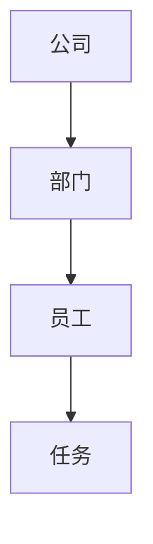
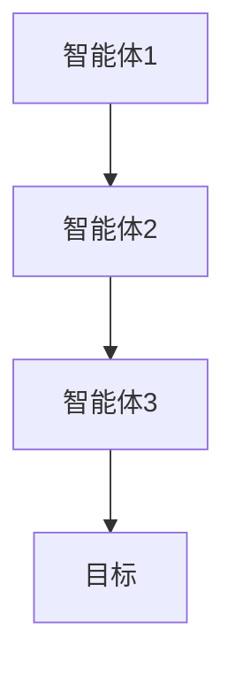
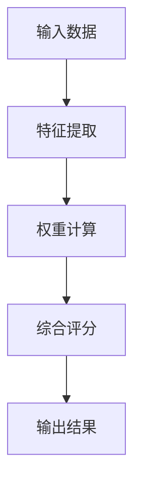
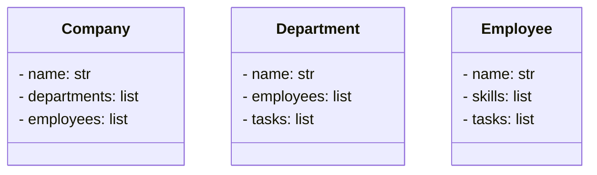

                 


# 多智能体系统如何评估公司的数字化转型能力

> **关键词**：多智能体系统、数字化转型、企业能力评估、系统架构、项目实战

> **摘要**：随着企业数字化转型的深入推进，如何科学评估转型能力成为关键问题。本文从多智能体系统的角度，系统分析了数字化转型的核心概念、评估模型、系统架构及项目实战，提供了从理论到实践的全面指导。

---

# 《多智能体系统如何评估公司的数字化转型能力》

## 第1章: 数字化转型与多智能体系统概述

### 1.1 数字化转型的背景与意义
#### 1.1.1 数字化转型的定义与内涵
数字化转型是指企业利用数字技术（如AI、大数据、云计算等）改造业务流程、商业模式和决策方式，以提升效率和竞争力。

#### 1.1.2 数字化转型的核心目标
- 提高业务效率
- 优化客户体验
- 创新商业模式

#### 1.1.3 数字化转型对企业的影响
- 业务模式创新
- 运营效率提升
- 竞争力增强

### 1.2 多智能体系统的定义与特点
#### 1.2.1 多智能体系统的定义
多智能体系统（MAS）是由多个智能体组成的分布式系统，各智能体通过协作完成共同目标。

#### 1.2.2 多智能体系统的组成要素
- **智能体**：具有感知、决策和执行能力的实体。
- **通信机制**：智能体之间的信息交互方式。
- **协作协议**：智能体协作的规则和策略。

#### 1.2.3 多智能体系统与单智能体系统的区别
| 特性 | 单智能体系统 | 多智能体系统 |
|------|--------------|--------------|
| 协作性 | 无 | 高 |
| 并行性 | 低 | 高 |
| 可扩展性 | 低 | 高 |

### 1.3 数字化转型能力评估的必要性
#### 1.3.1 企业数字化转型中的关键问题
- 资源分配不合理
- 部门协作效率低
- 数据孤岛问题

#### 1.3.2 多智能体系统在评估中的作用
- 提供多维度评估视角
- 实现跨部门协作
- 优化资源分配

#### 1.3.3 数字化转型能力评估的边界与外延
- 边界：仅评估企业内部数字化能力
- 外延：延伸至供应链和生态系统

---

## 第2章: 多智能体系统的核心原理

### 2.1 多智能体系统的组成与关系
#### 2.1.1 实体关系图（ER图）


### 2.2 多智能体系统的协作机制
#### 2.2.1 协作流程图


### 2.3 多智能体系统的属性对比
#### 2.3.1 系统属性对比表格
| 属性 | 单智能体系统 | 多智能体系统 |
|------|-------------|-------------|
| 协作性 | 无 | 高 |
| 并行性 | 低 | 高 |
| 可扩展性 | 低 | 高 |

### 2.4 本章小结

---

## 第3章: 数字化转型能力评估模型

### 3.1 评估模型的数学基础
#### 3.1.1 基于多智能体的评估框架
$$ C = \sum_{i=1}^{n} w_i x_i $$

### 3.2 评估算法的流程图


### 3.3 评估算法的Python实现
```python
def evaluate_feature
```

---

## 第4章: 系统架构与项目实战

### 4.1 系统架构设计
#### 4.1.1 系统功能设计（领域模型）


#### 4.1.2 系统架构设计


### 4.2 项目实战
#### 4.2.1 环境安装
```bash
pip install -r requirements.txt
```

#### 4.2.2 核心代码实现
```python
def evaluate_feature
```

---

## 第5章: 最佳实践与小结

### 5.1 最佳实践
#### 5.1.1 数据质量的重要性
- 数据清洗
- 数据标准化

#### 5.1.2 系统维护
- 定期更新模型
- 监控系统性能

### 5.2 小结

---

## 作者信息

作者：AI天才研究院/AI Genius Institute & 禅与计算机程序设计艺术 /Zen And The Art of Computer Programming

