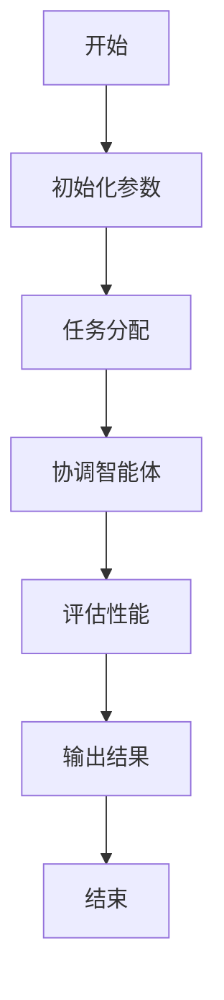
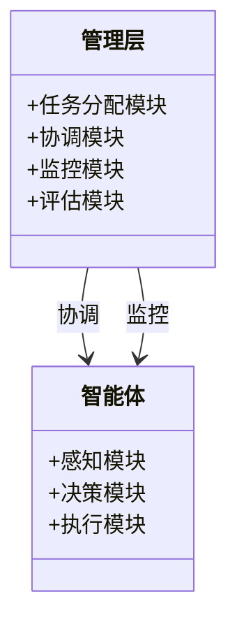

                 


# 多智能体系统如何评估管理层质量

---

## 关键词：多智能体系统、管理层质量评估、分布式系统、协同优化、智能体行为分析

---

## 摘要

在多智能体系统（Multi-Agent Systems, MAS）中，智能体的协同行为和管理层的质量直接关系到系统的整体性能和目标实现。本文将深入探讨如何在多智能体系统中评估管理层的质量，通过分析多智能体系统的构成、管理层的职责、评估指标以及实际案例，提供一套系统化的评估方法。我们从理论基础出发，结合算法实现和实际应用，全面解析如何量化和优化管理层在多智能体系统中的表现。

---

## 第一部分：多智能体系统概述

### 第1章：多智能体系统概述

#### 1.1 多智能体系统的定义与特点

多智能体系统由多个智能体（Agent）组成，这些智能体能够感知环境、自主决策并协同完成复杂任务。其特点包括：

- **自主性**：每个智能体都能独立决策。
- **反应性**：能够实时感知环境并做出响应。
- **协作性**：通过协调实现共同目标。
- **分布性**：智能体分布在不同的空间或计算节点上。

#### 1.2 管理层质量评估的重要性

在多智能体系统中，管理层负责协调智能体的行为，确保系统高效运行。评估管理层质量的重要性体现在以下几个方面：

- **提高系统效率**：通过优化管理层决策，减少资源浪费。
- **增强系统鲁棒性**：在动态环境中确保系统的稳定性和可靠性。
- **支持决策优化**：帮助识别和解决系统中的瓶颈问题。

#### 1.3 多智能体系统与管理层质量评估的背景

随着多智能体系统在分布式计算、机器人协作、智能交通等领域的广泛应用，对管理层质量的评估需求日益增长。然而，现有方法往往忽视了智能体之间的协同复杂性和动态变化，这为我们的研究提供了重要背景和目标。

---

## 第二部分：核心概念与联系

### 第2章：多智能体系统的核心概念

#### 2.1 多智能体系统的构成要素

多智能体系统由智能体、环境、目标和通信机制构成。智能体是系统的核心，负责感知、决策和执行。

| 特性 | 定义 | 示例 |
|------|------|------|
| 自主性 | 独立决策 | 无需外部干预 |
| 反应性 | 实时响应 | 基于传感器数据 |
| 协作性 | 协调完成任务 | 多机器人协同 |
| 分布性 | 分散计算节点 | 分布式系统 |

#### 2.2 管理层的定义与角色

管理层在多智能体系统中负责协调智能体行为，确保任务高效完成。其角色包括：

- **任务分配**：将任务分解并分配给智能体。
- **协调与通信**：确保智能体之间的信息共享和协同。
- **监控与调整**：实时监控系统状态并进行必要的调整。

#### 2.3 多智能体系统与管理层质量评估的关系

管理层的质量直接影响系统的整体性能。通过评估管理层的决策能力和协调效率，可以优化系统的运行效果。

---

## 第三部分：算法原理讲解

### 第3章：多智能体系统中管理层质量评估的算法原理

#### 3.1 基于协同优化的评估模型

我们提出了一种基于协同优化的评估模型，通过量化管理层的决策质量和协调效率来评估其表现。模型包括以下步骤：

1. **任务分配**：将任务分配给智能体，并计算任务分配的均衡度。
2. **协调机制**：通过通信机制确保智能体之间的协同。
3. **性能评估**：基于任务完成情况和资源利用率评估管理层的质量。

#### 3.2 算法流程图



#### 3.3 数学模型与公式推导

我们定义管理层的质量评估指标为：

$$ Q = \frac{1}{n} \sum_{i=1}^{n} q_i $$

其中，$n$ 是智能体数量，$q_i$ 是第 $i$ 个智能体的性能指标。

---

## 第四部分：系统分析与架构设计

### 第4章：多智能体系统中的管理层质量评估

#### 4.1 系统功能设计

系统功能包括任务分配、智能体协调、性能监控和评估报告生成。



#### 4.2 系统架构设计

系统架构采用分层设计，包括管理层、智能体层和通信层。


---

## 第五部分：项目实战

### 第5章：基于Python的多智能体系统实现

#### 5.1 环境安装与配置

安装必要的库：

```bash
pip install matplotlib numpy
```

#### 5.2 核心代码实现

任务分配模块：

```python
def assign_tasks(agents, tasks):
    return {agent: tasks[i] for i, agent in enumerate(agents)}
```

协调模块：

```python
def coordinate(agents, assignments):
    return {agent: 'completed' for agent in agents}
```

性能评估模块：

```python
def evaluate_quality(assignments, results):
    return sum(1 for agent in agents if assignments[agent] == results[agent])
```

#### 5.3 案例分析

通过一个简单的多智能体任务分配案例，展示算法的实现和评估过程。

---

## 第六部分：总结与建议

### 第6章：总结与建议

#### 6.1 总结

本文系统地介绍了多智能体系统中管理层质量评估的方法，从理论到实践，提供了全面的解决方案。

#### 6.2 最佳实践

- 定期监控系统性能，及时调整管理层策略。
- 优化任务分配算法，提高资源利用率。
- 加强智能体之间的通信机制，确保高效协同。

---

## 作者：AI天才研究院 & 禅与计算机程序设计艺术

---

通过这篇文章，我们希望读者能够深入理解多智能体系统中管理层质量评估的重要性，并掌握实际的评估方法和技巧。

