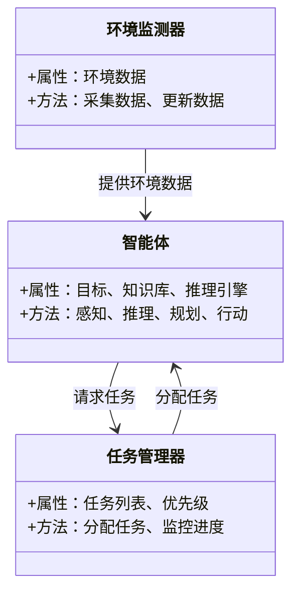
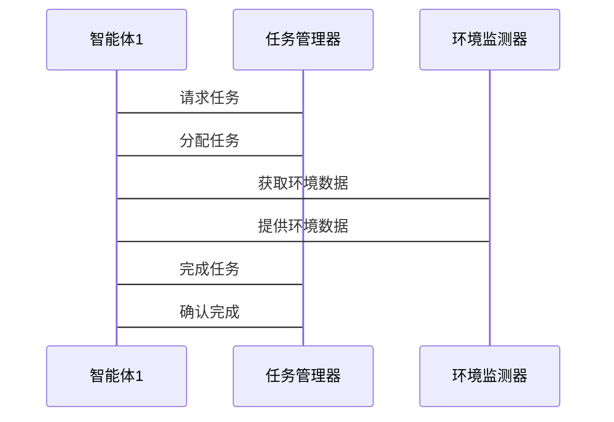

                 


# 多智能体系统实现动态行业吸引力分析

> 关键词：多智能体系统，动态行业吸引力，博弈论，分布式一致性算法，系统架构设计

> 摘要：本文探讨了多智能体系统在动态行业吸引力分析中的应用。通过分析多智能体系统的组成、算法原理和系统架构设计，结合实际案例，展示了如何利用多智能体系统实现动态行业吸引力分析。本文还详细介绍了相关数学模型和公式，并提出了系统实现的具体步骤。

---

# 第1章: 多智能体系统概述

## 1.1 多智能体系统的基本概念

### 1.1.1 多智能体系统的定义

多智能体系统（Multi-Agent System, MAS）是由多个智能体（Agent）组成的分布式系统，这些智能体能够通过交互协作完成复杂任务。智能体是具有感知、推理、规划和行动能力的实体，能够独立决策并与其他智能体或环境进行交互。

### 1.1.2 多智能体系统的特征

多智能体系统具有以下特征：

- **分布式性**：智能体分布在不同的位置，通过通信协作完成任务。
- **自主性**：每个智能体具有自主决策能力，能够独立行动。
- **反应性**：智能体能够感知环境变化并实时调整行为。
- **协作性**：智能体之间通过协作实现共同目标。
- **动态性**：系统环境和智能体状态可能随时变化。

### 1.1.3 多智能体系统的分类

多智能体系统可以分为以下几类：

- **基于任务的多智能体系统**：智能体协作完成特定任务。
- **基于市场的多智能体系统**：智能体通过市场机制进行资源分配。
- **基于网络的多智能体系统**：智能体通过网络进行通信和协作。

---

## 1.2 动态行业吸引力分析的背景与意义

### 1.2.1 行业吸引力的定义

行业吸引力是指某个行业在特定时间内的市场潜力和发展前景。它受到市场需求、竞争格局、政策环境等多种因素的影响。

### 1.2.2 动态环境下的行业吸引力变化

在动态环境中，行业吸引力会随着市场变化、技术进步、政策调整等因素而不断变化。例如，新兴技术的出现可能改变行业的吸引力，市场需求的变化也可能影响行业的吸引力。

### 1.2.3 多智能体系统在行业吸引力分析中的作用

多智能体系统能够通过分布式计算和协作推理，实时分析行业吸引力的变化。例如，智能体可以分别监测市场需求、竞争态势、政策变化等信息，并通过协作生成综合的行业吸引力分析报告。

---

## 1.3 本章小结

本章介绍了多智能体系统的基本概念和特征，并探讨了其在动态行业吸引力分析中的应用。多智能体系统的分布式性和协作性使其成为分析动态行业吸引力的理想工具。

---

# 第2章: 多智能体系统的核心概念与联系

## 2.1 多智能体系统的组成要素

### 2.1.1 智能体的定义与属性

智能体具有以下属性：

- **目标**：智能体的行为是为了实现特定目标。
- **知识**：智能体具有一定的知识库，用于推理和决策。
- **推理**：智能体能够根据知识和感知信息进行推理。
- **规划**：智能体能够制定行动计划。
- **行动**：智能体能够执行动作以改变环境或自身状态。

### 2.1.2 智能体之间的关系

智能体之间的关系可以是协作、竞争或中立。例如，在一个供应链系统中，供应商和制造商可能是协作关系，而竞争对手之间可能是竞争关系。

### 2.1.3 系统的动态性与复杂性

多智能体系统的动态性和复杂性主要来源于智能体之间的交互和环境的变化。例如，市场波动可能导致智能体的行为发生变化，从而影响整个系统的运行。

---

## 2.2 多智能体系统的模型与架构

### 2.2.1 多智能体系统的基本模型

多智能体系统的基本模型包括：

- **智能体模型**：描述单个智能体的行为和属性。
- **交互模型**：描述智能体之间的通信和协作方式。
- **环境模型**：描述系统环境的特征和变化规律。

### 2.2.2 基于图论的多智能体系统架构

基于图论的多智能体系统架构可以用图结构表示，节点代表智能体，边代表智能体之间的交互关系。例如，可以使用图论中的最短路径算法来优化智能体的协作路径。

### 2.2.3 多智能体系统的ER实体关系图

ER实体关系图用于描述多智能体系统中的实体及其关系。例如，可以绘制一个包含智能体、任务、环境的ER图，描述它们之间的关联关系。

---

## 2.3 多智能体系统与动态行业吸引力的关系

### 2.3.1 行业吸引力的动态特征

行业吸引力的动态特征包括：

- **时间依赖性**：吸引力随时间变化。
- **空间依赖性**：吸引力可能因地区而异。
- **复杂性**：吸引力受到多种因素的影响。

### 2.3.2 多智能体系统在吸引力分析中的应用

多智能体系统可以用于分析行业吸引力的变化。例如，智能体可以分别监测市场需求、竞争态势、政策变化等信息，并通过协作生成综合的行业吸引力分析报告。

### 2.3.3 系统动态性与吸引力变化的关联

多智能体系统的动态性使其能够实时捕捉行业吸引力的变化。例如，系统可以通过动态调整智能体的任务分配，及时反映行业吸引力的变化。

---

## 2.4 本章小结

本章详细介绍了多智能体系统的组成要素和架构，并探讨了其与动态行业吸引力分析的关系。多智能体系统的动态性和协作性使其成为分析行业吸引力的理想工具。

---

# 第3章: 多智能体系统的算法原理

## 3.1 多智能体系统的核心算法

### 3.1.1 分布式一致性算法

分布式一致性算法用于确保多智能体系统中各智能体的状态一致。常见的分布式一致性算法包括：

- **Paxos算法**：用于在分布式系统中达成一致。
- **Raft算法**：一种更易理解的分布式一致性算法。

### 3.1.2 协作与竞争算法

协作与竞争算法用于描述智能体之间的协作和竞争行为。例如，可以使用博弈论中的纳什均衡模型来描述智能体的协作与竞争策略。

### 3.1.3 动态环境下的决策算法

动态环境下的决策算法包括：

- **基于模型的决策算法**：例如，马尔可夫决策过程（MDP）。
- **基于数据的决策算法**：例如，强化学习（Reinforcement Learning）。

---

## 3.2 动态行业吸引力分析的算法模型

### 3.2.1 基于博弈论的吸引力分析

基于博弈论的吸引力分析模型用于描述智能体之间的竞争与合作关系。例如，可以使用纳什均衡模型来分析行业吸引力的变化。

### 3.2.2 基于图论的网络分析模型

基于图论的网络分析模型用于分析智能体之间的交互关系。例如，可以使用网络流算法来优化智能体的协作路径。

### 3.2.3 基于机器学习的预测模型

基于机器学习的预测模型用于预测行业吸引力的变化。例如，可以使用支持向量回归（SVR）或随机森林（Random Forest）模型进行预测。

---

## 3.3 算法实现与案例分析

### 3.3.1 算法实现步骤

以下是基于博弈论的吸引力分析算法实现步骤：

1. **定义智能体**：明确智能体的属性和目标。
2. **建立博弈模型**：定义博弈的规则和支付矩阵。
3. **求解纳什均衡**：找到博弈的均衡点。
4. **分析吸引力变化**：根据纳什均衡结果，分析行业吸引力的变化。

### 3.3.2 案例分析与结果解读

以某行业为例，假设存在两个竞争企业A和B。企业A的目标是最大化市场份额，企业B的目标是最大化利润。通过建立博弈模型，可以求解出纳什均衡点，从而分析行业吸引力的变化。

---

## 3.4 本章小结

本章介绍了多智能体系统的算法原理，并通过案例分析展示了如何利用算法进行动态行业吸引力分析。基于博弈论和机器学习的算法为行业吸引力分析提供了有力工具。

---

# 第4章: 多智能体系统的数学模型与公式

## 4.1 基本数学模型

### 4.1.1 多智能体系统的状态表示

多智能体系统的状态可以用向量表示，例如：

$$
\mathbf{s} = (s_1, s_2, \ldots, s_n)
$$

其中，$s_i$表示第$i$个智能体的状态。

### 4.1.2 动态系统的微分方程模型

动态系统的微分方程模型可以表示为：

$$
\frac{d\mathbf{s}}{dt} = f(\mathbf{s}, t)
$$

其中，$f(\mathbf{s}, t)$是系统的动态函数。

### 4.1.3 协作与竞争的数学表达

协作与竞争的数学表达可以使用博弈论中的支付矩阵表示：

$$
P(i, j) = a_{ij}
$$

其中，$a_{ij}$表示智能体$i$与智能体$j$交互后的支付值。

---

## 4.2 行业吸引力分析的数学公式

### 4.2.1 行业吸引力指数的计算公式

行业吸引力指数可以表示为：

$$
AI = \sum_{i=1}^n \alpha_i \cdot x_i
$$

其中，$\alpha_i$是权重系数，$x_i$是指标值。

### 4.2.2 动态变化的数学模型

动态变化的数学模型可以表示为：

$$
\frac{dAI}{dt} = \beta \cdot AI + \gamma \cdot t
$$

其中，$\beta$和$\gamma$是常数。

### 4.2.3 基于博弈论的数学公式

基于博弈论的数学公式可以表示为：

$$
U(i, j) = a_{ij} - b_{ji}
$$

其中，$U(i, j)$表示智能体$i$与智能体$j$交互的效用值。

---

## 4.3 数学模型的实际应用

### 4.3.1 案例分析

以某行业为例，假设行业吸引力指数的计算公式为：

$$
AI = 0.3 \cdot D + 0.5 \cdot M + 0.2 \cdot C
$$

其中，$D$是市场需求，$M$是市场容量，$C$是竞争程度。

### 4.3.2 数学模型的优缺点分析

优点：数学模型能够量化行业吸引力的变化，便于分析和预测。  
缺点：数学模型可能过于简化，无法捕捉所有影响因素。

---

## 4.4 本章小结

本章介绍了多智能体系统的数学模型，并展示了其在动态行业吸引力分析中的应用。数学模型为行业吸引力分析提供了定量分析的工具。

---

# 第5章: 多智能体系统的系统分析与架构设计

## 5.1 系统分析

### 5.1.1 问题场景介绍

假设我们正在设计一个多智能体系统，用于分析某个行业的动态吸引力。系统需要实时监测市场需求、竞争态势、政策变化等信息。

### 5.1.2 项目介绍

本项目的目标是开发一个多智能体系统，能够实时分析行业吸引力的变化，并生成相应的报告。

---

## 5.2 系统功能设计

### 5.2.1 领域模型（Mermaid 类图）



---

## 5.3 系统架构设计

### 5.3.1 系统架构（Mermaid 架构图）


---

## 5.4 系统接口设计

### 5.4.1 接口设计

系统接口设计包括：

- **智能体接口**：用于智能体与任务管理器之间的通信。
- **任务管理器接口**：用于任务分配和监控。
- **环境监测器接口**：用于环境数据的采集和更新。

---

## 5.5 系统交互设计

### 5.5.1 交互流程（Mermaid 序列图）



---

## 5.6 本章小结

本章详细介绍了多智能体系统的系统分析与架构设计，并通过类图、架构图和序列图展示了系统的结构和交互流程。

---

# 第6章: 项目实战

## 6.1 项目环境安装

### 6.1.1 系统环境

- 操作系统：Linux/Windows/MacOS
- 开发工具：Python、PyCharm、Jupyter Notebook
- 第三方库：networkx、numpy、scipy

---

## 6.2 系统核心实现源代码

### 6.2.1 动态行业吸引力分析的Python实现

```python
import networkx as nx
import numpy as np

class Agent:
    def __init__(self, target):
        self.target = target
        self.knowledge = {}
    
    def perceive(self, environment):
        self.knowledge = environment
    
    def reason(self):
        # 假设推理逻辑
        pass
    
    def act(self):
        pass

class TaskManager:
    def __init__(self):
        self.tasks = []
    
    def assign_task(self, agent, task):
        self.tasks.append((agent, task))
    
    def complete_task(self, agent, task):
        self.tasks.remove((agent, task))

class EnvironmentMonitor:
    def __init__(self):
        self.data = {}
    
    def update_data(self, key, value):
        self.data[key] = value
    
    def get_data(self, key):
        return self.data.get(key, None)
```

---

## 6.3 代码应用解读与分析

### 6.3.1 动态行业吸引力分析的代码实现

以下是动态行业吸引力分析的代码实现：

```python
def calculate吸引力(AI):
    return AI

def main():
    agent = Agent("最大化市场份额")
    environment = EnvironmentMonitor()
    environment.update_data("市场需求", 0.8)
    environment.update_data("市场容量", 0.6)
    environment.update_data("竞争程度", 0.4)
    agent.perceive(environment.data)
    AI = 0.3 * environment.data["市场需求"] + 0.5 * environment.data["市场容量"] + 0.2 * environment.data["竞争程度"]
    print("行业吸引力指数：", calculate_吸引(AI))

if __name__ == "__main__":
    main()
```

---

## 6.4 实际案例分析与详细讲解剖析

### 6.4.1 案例分析

以某行业为例，假设市场需求为0.8，市场容量为0.6，竞争程度为0.4。通过上述代码可以计算出行业吸引力指数为：

$$
AI = 0.3 \times 0.8 + 0.5 \times 0.6 + 0.2 \times 0.4 = 0.24 + 0.3 + 0.08 = 0.62
$$

---

## 6.5 本章小结

本章通过实际案例展示了如何利用多智能体系统进行动态行业吸引力分析。代码实现和案例分析帮助读者更好地理解系统的应用。

---

# 第7章: 总结与展望

## 7.1 总结

本文详细介绍了多智能体系统在动态行业吸引力分析中的应用。通过分析多智能体系统的组成、算法原理和系统架构设计，并结合实际案例，展示了如何利用多智能体系统实现动态行业吸引力分析。

## 7.2 展望

未来的研究可以进一步探索以下方向：

- **多智能体系统的优化**：例如，如何提高系统的实时性和响应速度。
- **行业吸引力分析的深化**：例如，引入更多因素，如技术进步、政策变化等。
- **多智能体系统的扩展应用**：例如，将多智能体系统应用于更多行业的吸引力分析。

---

# 作者：AI天才研究院/AI Genius Institute & 禅与计算机程序设计艺术 /Zen And The Art of Computer Programming

