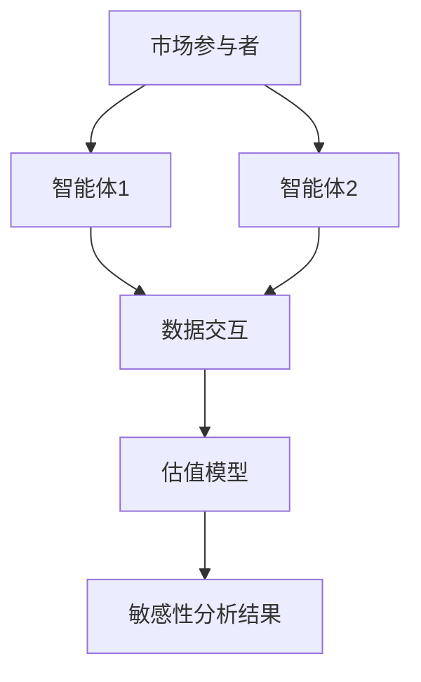
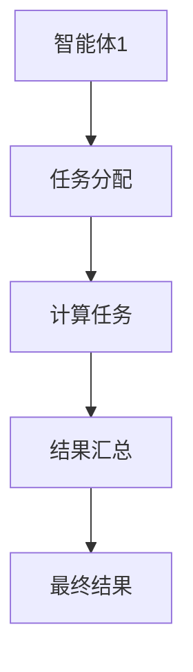
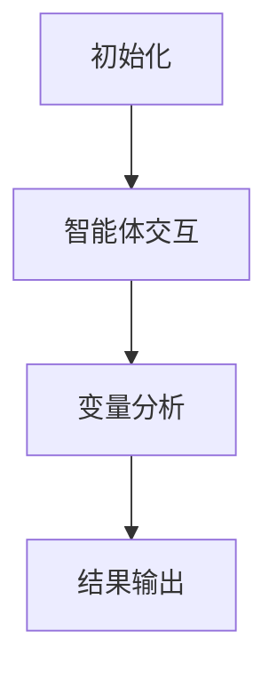
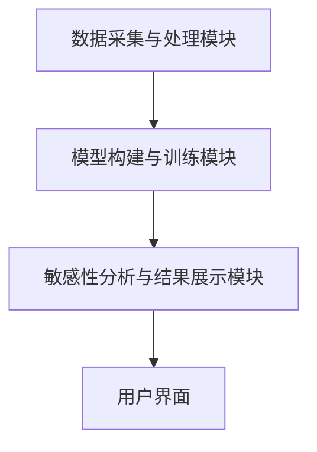
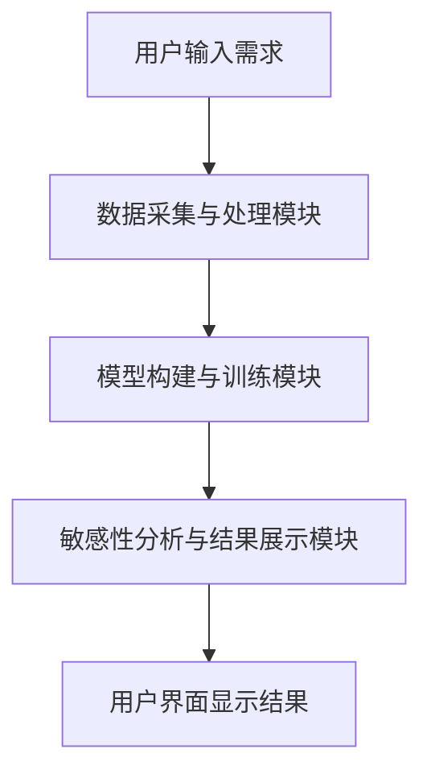

                 


# 多智能体系统实现智能化公司估值敏感性分析

> 关键词：多智能体系统，公司估值，敏感性分析，分布式计算，金融建模

> 摘要：本文探讨了多智能体系统在公司估值敏感性分析中的应用。通过分析多智能体系统的定义、原理及其在金融领域的应用，本文详细介绍了如何利用多智能体系统进行敏感性分析，从而优化公司估值模型。文章结合算法实现、系统架构设计和实际案例，全面展示了多智能体系统在智能化公司估值中的潜力和优势。

---

## 第一部分: 多智能体系统与智能化公司估值概述

### 第1章: 多智能体系统与公司估值概述

#### 1.1 多智能体系统的定义与特点

多智能体系统（Multi-Agent System, MAS）由多个具有智能特性的实体（称为智能体）组成，这些智能体通过交互协作完成特定任务。以下是多智能体系统的几个核心特点：

- **分布式智能**：多个智能体协同工作，而非单一中心化系统。
- **自主性**：每个智能体都有自主决策能力。
- **反应性**：智能体能够感知环境并实时响应。
- **协作性**：智能体之间通过通信和协作完成复杂任务。

**表 1-1 多智能体系统与单智能体系统的对比**

| 特性                | 多智能体系统                  | 单智能体系统                  |
|---------------------|-----------------------------|-----------------------------|
| 结构复杂性          | 高                          | 低                          |
| 可扩展性            | 高                          | 低                          |
| 容错性              | 高                          | 低                          |

#### 1.2 敏感性分析的定义与作用

敏感性分析是评估模型中各变量对结果影响程度的方法。在公司估值中，敏感性分析用于确定哪些因素（如收入、成本、利率）对估值的影响最大。

**敏感性分析的作用：**

- 识别关键变量。
- 量化变量变化对结果的影响。
- 优化决策模型。

#### 1.3 多智能体系统在公司估值中的应用前景

多智能体系统在金融领域的潜力巨大。通过模拟多个市场参与者的行为，多智能体系统能够提供更准确的市场预测和公司估值。

**图 1-1 多智能体系统在公司估值中的应用架构**



---

## 第二部分: 多智能体系统的核心概念与原理

### 第2章: 多智能体系统的原理与架构

#### 2.1 多智能体系统的组成与关系

多智能体系统由多个智能体组成，这些智能体通过通信协议进行交互。以下是多智能体系统的主要组成：

- **智能体**：具有自主决策和问题解决能力的实体。
- **通信机制**：智能体之间的信息传递方式。
- **协作协议**：智能体之间协同工作的规则。

**表 2-1 多智能体系统中的实体关系**

| 实体       | 描述                           |
|------------|--------------------------------|
| 智能体     | 具有自主决策能力的个体         |
| 通信机制   | 智能体间信息传递的规则         |
| 协作协议   | 智能体协同工作的规则           |

#### 2.2 敏感性分析的数学模型

敏感性分析通常使用线性回归模型来量化各变量对结果的影响。以下是常见的敏感性分析方法：

- **线性回归分析**：通过回归系数确定变量影响程度。
- **蒙特卡洛模拟**：通过随机抽样模拟变量变化对结果的影响。
- **方差分析法**：通过分解方差来确定变量的贡献度。

**公式 2-1 线性回归模型**

$$ y = \beta_0 + \beta_1 x_1 + \beta_2 x_2 + \ldots + \beta_n x_n + \epsilon $$

其中，\( y \) 是目标变量，\( x_i \) 是自变量，\( \beta_i \) 是回归系数。

#### 2.3 多智能体系统与敏感性分析的结合

多智能体系统通过模拟多个变量之间的交互，能够更全面地分析变量对结果的影响。以下是多智能体系统在敏感性分析中的优势：

- **分布式计算**：多智能体系统能够同时处理大量数据。
- **实时交互**：智能体之间的实时交互能够提高分析的准确性。
- **复杂场景模拟**：能够模拟复杂的市场环境和变量交互。

---

## 第三部分: 多智能体系统的算法与实现

### 第3章: 多智能体系统的算法原理

#### 3.1 多智能体系统的核心算法

多智能体系统的核心算法包括分布式计算算法和协作协议。以下是常见的算法：

- **分布式计算算法**：通过分布式计算提高处理效率。
- **通信协议**：定义智能体之间的信息传递规则。
- **协作算法**：定义智能体之间的协作规则。

**图 3-1 分布式计算流程**



#### 3.2 敏感性分析的算法实现

敏感性分析的算法实现通常包括数据预处理、模型训练和结果分析。以下是具体步骤：

1. **数据预处理**：清洗和归一化数据。
2. **模型训练**：使用回归模型或蒙特卡洛模拟训练模型。
3. **结果分析**：分析各变量对结果的影响程度。

**公式 3-1 蒙特卡洛模拟的基本公式**

$$ P(x) = \frac{\text{计数}(x)}{N} $$

其中，\( P(x) \) 是变量 \( x \) 的概率，\( \text{计数}(x) \) 是变量 \( x \) 出现的次数，\( N \) 是总样本数。

#### 3.3 多智能体系统与敏感性分析的结合算法

多智能体系统与敏感性分析的结合算法通过模拟多个变量之间的交互，提高分析的准确性。以下是具体步骤：

1. **初始化**：定义智能体和变量。
2. **交互**：智能体之间进行信息交互。
3. **分析**：分析变量对结果的影响程度。

**图 3-2 多智能体系统与敏感性分析的结合算法**



---

## 第四部分: 系统架构与设计

### 第4章: 系统架构设计

#### 4.1 系统功能模块划分

多智能体系统的架构设计通常包括数据采集与处理、模型构建与训练、敏感性分析与结果展示三个模块。

**表 4-1 系统功能模块划分**

| 模块名称       | 功能描述                       |
|----------------|----------------------------|
| 数据采集与处理 | 采集和处理原始数据           |
| 模型构建与训练 | 构建和训练敏感性分析模型       |
| 敏感性分析与结果展示 | 展示分析结果                 |

#### 4.2 系统架构图

**图 4-1 系统架构图**



#### 4.3 系统接口设计

系统接口设计包括数据接口、用户接口和第三方服务接口。以下是具体设计：

- **数据接口**：定义数据格式和传输协议。
- **用户接口**：定义用户操作界面。
- **第三方服务接口**：定义与第三方服务的交互接口。

#### 4.4 系统交互流程

系统交互流程包括用户操作流程、后台处理流程和实时交互流程。以下是具体流程：

1. **用户操作流程**：用户输入需求，系统接收并处理。
2. **后台处理流程**：系统后台进行数据处理和模型训练。
3. **实时交互流程**：用户实时查看分析结果。

**图 4-2 系统交互流程**



---

## 第五部分: 项目实战与案例分析

### 第5章: 项目实战

#### 5.1 环境安装与配置

项目实战需要安装以下环境和工具：

- **编程语言**：Python 3.8+
- **框架**：Django或Flask
- **库**：NumPy, Pandas, Scikit-learn

#### 5.2 核心代码实现

以下是核心代码实现：

```python
import numpy as np
import pandas as pd
from sklearn.linear_model import LinearRegression

# 数据预处理
data = pd.read_csv('data.csv')
X = data.drop('target', axis=1)
y = data['target']

# 模型训练
model = LinearRegression()
model.fit(X, y)

# 敏感性分析
coefficients = model.coef_
print(coefficients)
```

#### 5.3 案例分析

以下是一个实际案例分析：

1. **数据采集**：采集某公司的财务数据。
2. **模型训练**：使用线性回归模型训练。
3. **结果分析**：分析各变量对公司估值的影响程度。

---

## 第六部分: 总结与展望

### 6.1 总结

本文详细介绍了多智能体系统在公司估值敏感性分析中的应用。通过理论分析和实际案例，展示了多智能体系统的潜力和优势。

### 6.2 展望

未来，随着人工智能技术的发展，多智能体系统在金融领域的应用将更加广泛。可以通过优化算法和提升系统架构设计，进一步提高分析的准确性和效率。

---

## 作者信息

作者：AI天才研究院/AI Genius Institute & 禅与计算机程序设计艺术 /Zen And The Art of Computer Programming

---

以上是《多智能体系统实现智能化公司估值敏感性分析》的完整文章内容，涵盖了从理论到实践的各个方面，旨在为读者提供全面的指导和深入的分析。

