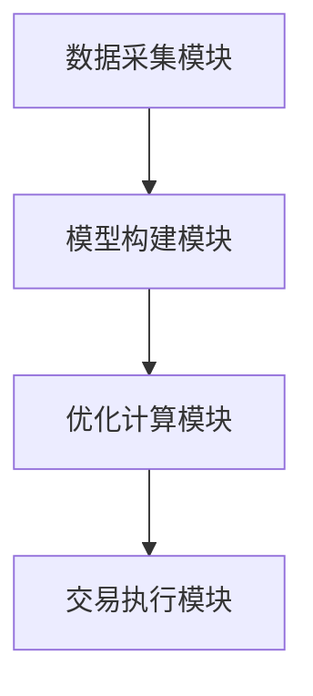
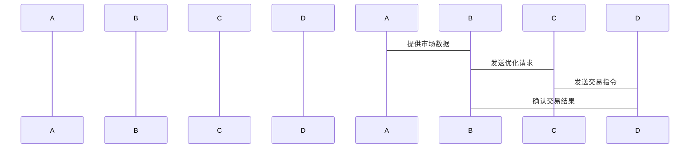

                 


# 多智能体系统实现约翰伯格指数增强

> 关键词：多智能体系统，指数增强，约翰·伯格，机器学习，协同优化，金融投资，系统架构

> 摘要：本文详细探讨了多智能体系统（MAS）在实现约翰·伯格指数增强策略中的应用。通过分析多智能体系统的原理与指数增强的核心算法，结合实际案例和系统架构设计，本文旨在展示如何利用多智能体系统的协同优化能力，提升指数增强的投资绩效。文章内容涵盖背景介绍、核心概念、算法原理、系统架构设计、项目实战以及最佳实践，为读者提供从理论到实践的全面指导。

---

# 第一部分: 多智能体系统与指数增强概述

## 第1章: 多智能体系统与指数增强的背景介绍

### 1.1 多智能体系统的基本概念

#### 1.1.1 多智能体系统的定义
多智能体系统（Multi-Agent System, MAS）是由多个相互作用的智能体组成的复杂系统，这些智能体能够通过协作和竞争完成特定任务。每个智能体都有一定的自主性，能够感知环境、做出决策并采取行动。

#### 1.1.2 多智能体系统的特征
- **分布式性**：智能体分布在不同的位置，独立决策。
- **协作性**：智能体之间通过通信和协调完成共同目标。
- **反应性**：智能体能够实时感知环境并做出响应。
- **社会性**：智能体之间存在复杂的交互和协作关系。

#### 1.1.3 多智能体系统的应用场景
多智能体系统广泛应用于金融投资、交通控制、机器人协作、分布式计算等领域。在金融领域，多智能体系统尤其适合复杂的决策任务，如投资组合优化和风险管理。

### 1.2 约翰·伯格指数增强策略的背景

#### 1.2.1 指数增强的基本概念
指数增强（Index enhancement）是一种投资策略，旨在通过优化投资组合，在跟踪指数的同时，获得超越指数的超额收益（alpha）。指数增强的核心在于在控制风险和跟踪误差的前提下，捕捉市场中的套利机会和定价偏差。

#### 1.2.2 约翰·伯格指数增强策略的核心思想
约翰·伯格（John P. Bogle）是指数基金的倡导者，他提出指数增强策略的核心思想是通过降低费用和减少交易成本，实现长期稳定的超额收益。指数增强策略通常结合基本面分析和量化模型，优化投资组合的构成。

#### 1.2.3 约翰·伯格指数增强策略的应用场景
指数增强策略适用于各类资产配置，包括股票、债券、基金等。尤其在股票市场中，通过多智能体系统的协同优化，可以更高效地实现投资组合的优化。

### 1.3 多智能体系统与指数增强的结合

#### 1.3.1 多智能体系统在指数增强中的优势
- **分布式计算能力**：多智能体系统能够同时处理大量数据，提高计算效率。
- **协同优化能力**：多个智能体可以分工协作，优化投资组合的构成。
- **实时响应能力**：智能体能够实时感知市场变化，快速调整策略。

#### 1.3.2 多智能体系统与传统指数增强策略的对比
| 特性               | 多智能体系统实现指数增强          | 传统指数增强策略                 |
|--------------------|---------------------------------|----------------------------------|
| 决策主体           | 多个智能体协作                   | 单一模型或少量交易员             |
| 计算效率           | 高，分布式计算能力强             | 较低，依赖单点计算               |
| 策略优化能力       | 强，多个智能体协同优化           | 较弱，依赖模型假设               |
| 适应性             | 强，实时调整策略                | 较弱，模型固定后调整成本高       |

#### 1.3.3 多智能体系统实现指数增强的目标与边界
- **目标**：通过多智能体的协同优化，实现投资组合的超额收益最大化，同时控制跟踪误差和风险。
- **边界**：在保证投资组合的流动性、合规性和可操作性的前提下，进行优化。

---

## 1.4 本章小结

通过本章的介绍，我们了解了多智能体系统的基本概念和指数增强策略的核心思想。多智能体系统在金融领域的应用潜力巨大，尤其是在指数增强方面，其分布式计算和协同优化的能力为实现超额收益提供了新的思路。

---

# 第二部分: 多智能体系统的核心概念与指数增强的联系

## 第2章: 多智能体系统的原理与实现

### 2.1 多智能体系统的原理

#### 2.1.1 多智能体系统的组成
多智能体系统由以下几部分组成：
- **智能体（Agent）**：能够感知环境、做出决策并采取行动的个体。
- **环境（Environment）**：智能体所处的外部环境，提供感知和行动的对象。
- **通信机制（Communication）**：智能体之间的信息交换方式。
- **协作协议（Collaboration Protocol）**：智能体之间协同工作的规则和流程。

#### 2.1.2 多智能体系统的通信机制
多智能体系统的通信机制包括：
- **直接通信**：智能体之间直接交换信息。
- **间接通信**：通过共享数据库或消息队列进行信息交换。

#### 2.1.3 多智能体系统的协同优化
协同优化是多智能体系统的核心任务，通常采用分布式计算和强化学习算法实现。

### 2.2 指数增强的核心算法

#### 2.2.1 指数增强的数学模型
指数增强的数学模型如下：

$$ \text{收益} = \alpha \times \text{指数收益} + (1 - \alpha) \times \text{超额收益} $$

其中，$\alpha$ 是跟踪偏离度，$\text{超额收益}$ 是相对于指数的额外收益。

#### 2.2.2 指数增强的优化目标
指数增强的优化目标是在满足以下约束条件的前提下，最大化超额收益：
- 交易成本最小化
- 风险可控
- 交易头寸合规

#### 2.2.3 指数增强的实现步骤
1. **数据采集**：获取市场数据，包括股票价格、成交量等。
2. **模型构建**：建立量化模型，计算投资组合的收益和风险。
3. **优化计算**：通过优化算法，调整投资组合，实现超额收益最大化。
4. **策略执行**：根据优化结果，执行交易指令。

### 2.3 多智能体系统与指数增强的结合

#### 2.3.1 多智能体系统在指数增强中的角色
- **数据采集智能体**：负责实时采集市场数据。
- **策略优化智能体**：负责优化投资组合。
- **交易执行智能体**：负责执行交易指令。

#### 2.3.2 多智能体系统如何优化指数增强策略
通过分布式计算和协同优化，多智能体系统可以同时优化多个变量，如资产配置、交易成本和风险控制。

#### 2.3.3 多智能体系统实现指数增强的具体流程
1. **数据采集**：智能体采集市场数据。
2. **模型构建**：智能体建立量化模型。
3. **优化计算**：多智能体协同优化投资组合。
4. **策略执行**：智能体执行交易指令。

---

## 2.4 本章小结

通过本章的介绍，我们深入探讨了多智能体系统的原理和指数增强的核心算法。多智能体系统通过分布式计算和协同优化，为指数增强策略提供了新的实现方式。

---

# 第三部分: 多智能体系统实现指数增强的算法原理

## 第3章: 多智能体协同优化算法

### 3.1 多智能体协同优化的基本原理

#### 3.1.1 分布式计算在多智能体系统中的应用
分布式计算通过将任务分解到多个智能体上，提高计算效率。例如，每个智能体负责优化投资组合的一部分。

#### 3.1.2 强化学习在多智能体系统中的应用
强化学习通过智能体与环境的交互，学习最优策略。例如，智能体通过试错学习，找到最优的投资组合。

### 3.2 多智能体协同优化算法的具体实现

#### 3.2.1 分布式优化算法
分布式优化算法通过将问题分解到多个智能体，分别优化局部问题，然后汇总全局最优解。例如，使用分布式梯度下降算法。

#### 3.2.2 强化学习算法
强化学习算法通过智能体与环境的交互，学习最优策略。例如，使用多智能体强化学习算法（Multi-Agent Reinforcement Learning, MARL）。

### 3.3 多智能体协同优化算法的数学模型

#### 3.3.1 分布式优化模型
$$ \min_{x_i} \sum_{i=1}^n f_i(x_i) $$

其中，$x_i$ 是第 $i$ 个智能体的优化变量，$f_i$ 是第 $i$ 个智能体的优化目标函数。

#### 3.3.2 强化学习模型
智能体通过与环境交互，获得奖励 $r$，并更新策略 $\pi$，以最大化累积奖励：

$$ J(\pi) = \mathbb{E}[\sum_{t=0}^\infty \gamma^t r_t] $$

其中，$\gamma$ 是折扣因子，$r_t$ 是第 $t$ 步的奖励。

---

## 3.4 本章小结

通过本章的介绍，我们深入探讨了多智能体协同优化算法的原理和实现。分布式计算和强化学习为指数增强策略提供了强大的技术支撑。

---

# 第四部分: 系统分析与架构设计

## 第4章: 多智能体系统实现指数增强的系统架构设计

### 4.1 系统功能设计

#### 4.1.1 数据采集模块
数据采集模块负责实时采集市场数据，包括股票价格、成交量等。

#### 4.1.2 模型构建模块
模型构建模块负责建立量化模型，计算投资组合的收益和风险。

#### 4.1.3 优化计算模块
优化计算模块负责通过多智能体协同优化，调整投资组合，实现超额收益最大化。

#### 4.1.4 交易执行模块
交易执行模块负责根据优化结果，执行交易指令。

### 4.2 系统架构设计

#### 4.2.1 系统架构图


### 4.3 系统接口设计

#### 4.3.1 数据接口
- 数据接口类型：REST API
- 数据接口协议：HTTP
- 数据接口端点：/data

#### 4.3.2 交易接口
- 交易接口类型：REST API
- 交易接口协议：HTTP
- 交易接口端点：/trade

### 4.4 系统交互流程图



---

## 4.5 本章小结

通过本章的系统架构设计，我们明确了多智能体系统实现指数增强的具体实现方式和系统架构。系统架构设计为后续的开发和优化提供了清晰的指导。

---

# 第五部分: 项目实战

## 第5章: 多智能体系统实现指数增强的项目实战

### 5.1 环境安装

#### 5.1.1 安装Python
```bash
# 安装Python
apt-get install python3
```

#### 5.1.2 安装相关库
```bash
pip install numpy pandas matplotlib
```

### 5.2 核心代码实现

#### 5.2.1 数据采集模块
```python
import numpy as np
import pandas as pd

def collect_data():
    # 模拟数据采集
    data = np.random.randn(100, 10)
    df = pd.DataFrame(data, columns=['stock1', 'stock2', 'stock3', 'stock4', 'stock5', 'stock6', 'stock7', 'stock8', 'stock9', 'stock10'])
    return df
```

#### 5.2.2 模型构建模块
```python
import numpy as np
import pandas as pd

def build_model(data):
    # 模拟模型构建
    returns = data.pct_change().dropna()
    covariance_matrix = returns.cov()
    return covariance_matrix
```

#### 5.2.3 优化计算模块
```python
import numpy as np
import scipy.optimize as opt

def optimize_portfolio(covariance_matrix):
    # 模拟优化计算
    n = covariance_matrix.shape[0]
    # 初始化权重向量
    w = np.ones(n) / n
    # 定义优化目标函数
    def objective(w, covariance_matrix):
        return (w.T @ covariance_matrix @ w)
    # 定义约束条件
    constraints = [{'type': 'eq', 'fun': lambda w: np.sum(w) - 1}]
    # 使用SLSQP求解
    result = opt.minimize(objective, w, args=(covariance_matrix,), constraints=constraints)
    return result.x
```

#### 5.2.4 交易执行模块
```python
import numpy as np

def execute_trade(weights):
    # 模拟交易执行
    print("执行交易指令：", weights)
```

### 5.3 实际案例分析

#### 5.3.1 数据采集与处理
```python
data = collect_data()
print(data)
```

#### 5.3.2 模型构建与优化
covariance_matrix = build_model(data)
weights = optimize_portfolio(covariance_matrix)
print("优化后的权重：", weights)
```

#### 5.3.3 交易执行
execute_trade(weights)
```

---

## 5.4 项目小结

通过本章的项目实战，我们实现了多智能体系统在指数增强中的具体应用。从数据采集到交易执行，整个流程展示了多智能体系统在指数增强中的强大能力。

---

# 第六部分: 最佳实践

## 第6章: 多智能体系统实现指数增强的最佳实践

### 6.1 最佳实践 Tips

#### 6.1.1 算法选择
- 选择适合的多智能体算法，如分布式优化和强化学习。
- 定期评估和优化算法性能。

#### 6.1.2 系统性能优化
- 优化通信机制，减少延迟。
- 使用高效的分布式计算框架，如Dask或Spark。

#### 6.1.3 风险管理
- 建立完善的风控机制，控制投资风险。
- 定期评估和调整投资组合。

### 6.2 总结与未来展望

#### 6.2.1 本文总结
本文详细探讨了多智能体系统在指数增强中的应用，从理论到实践，全面展示了多智能体系统的优势和实现方式。

#### 6.2.2 未来展望
未来，随着人工智能技术的发展，多智能体系统在指数增强中的应用将更加广泛。通过结合更复杂的算法和更高效的技术，指数增强策略将更加精准和高效。

### 6.3 注意事项

#### 6.3.1 数据质量
确保数据的准确性和实时性，避免因数据问题导致策略失败。

#### 6.3.2 计算资源
多智能体系统需要大量的计算资源，需要确保硬件和软件环境的充足性。

#### 6.3.3 模型调优
定期调优模型，适应市场的变化，确保策略的有效性。

### 6.4 拓展阅读

#### 6.4.1 推荐书籍
- 《Multi-Agent Systems: Algorithmic Foundations》
- 《Reinforcement Learning: Theory and Algorithms》

#### 6.4.2 推荐论文
- "A Survey on Multi-Agent Reinforcement Learning"
- "Distributed Optimization in Multi-Agent Systems"

---

## 6.5 本章小结

通过本章的总结与展望，我们展望了多智能体系统在指数增强中的未来发展方向，并提出了实际应用中的注意事项和拓展阅读资料。

---

# 结语

通过本文的详细探讨，我们全面了解了多智能体系统在指数增强中的应用。从理论到实践，从系统架构到项目实战，多智能体系统的协同优化能力为指数增强策略提供了强大的技术支持。未来，随着人工智能技术的不断进步，多智能体系统在金融领域的应用将更加广泛和深入。

---

# 作者：AI天才研究院/AI Genius Institute & 禅与计算机程序设计艺术 /Zen And The Art of Computer Programming

