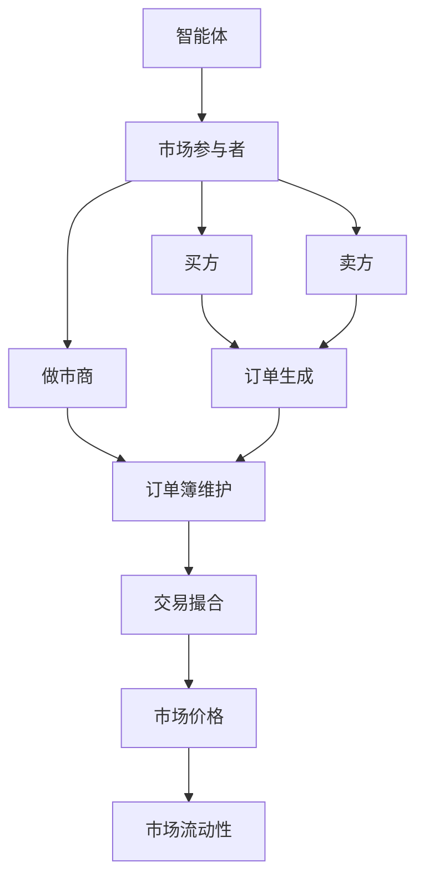
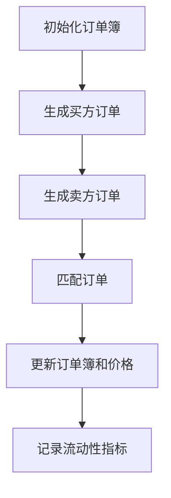
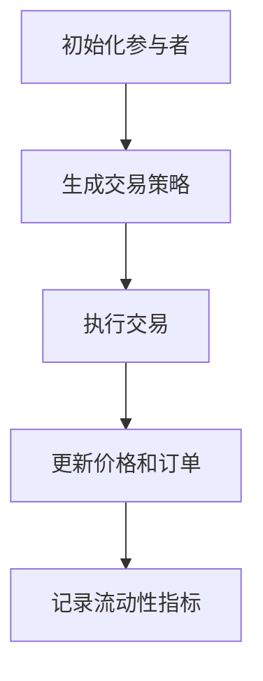
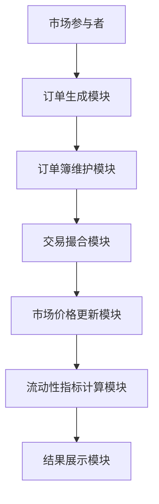
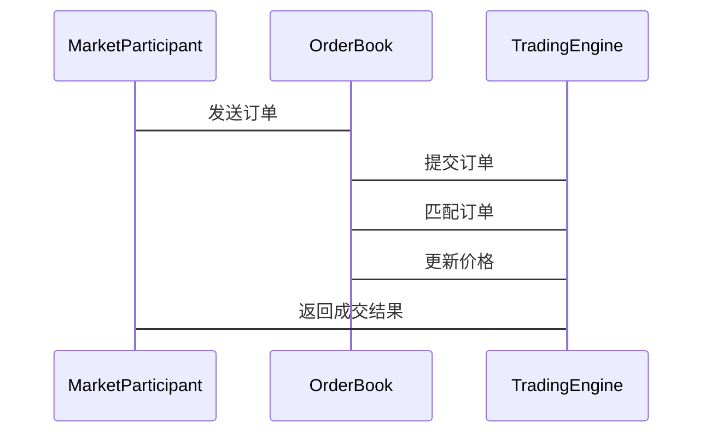

                 


# 多智能体系统模拟市场流动性

## 关键词：多智能体系统、市场流动性、算法模拟、系统架构、金融建模

## 摘要：  
本文探讨了多智能体系统在模拟市场流动性中的应用。通过分析多智能体系统的构成与特点，结合市场流动性的定义与影响因素，详细阐述了使用多智能体系统模拟市场流动性的算法原理、数学模型、系统架构及项目实战。文章通过具体案例分析，展示了如何利用多智能体系统实现对市场流动性的准确模拟，并提供了相应的实现代码和系统设计图。最后，本文总结了多智能体系统模拟市场流动性的重要意义，并展望了未来的研究方向。

---

# 第一部分: 多智能体系统与市场流动性概述

## 第1章: 多智能体系统与市场流动性概述

### 1.1 多智能体系统的定义与特点
#### 1.1.1 多智能体系统的定义  
多智能体系统（Multi-Agent System, MAS）是由多个智能体（Agent）组成的分布式系统，这些智能体能够自主决策、协作或竞争以完成特定目标。每个智能体都有一定的知识表示、推理能力、规划能力和执行能力，并能够与其他智能体或环境进行交互。

#### 1.1.2 多智能体系统的核心特点
- **自主性**：每个智能体能够独立决策。
- **反应性**：智能体能够感知环境并实时响应。
- **协作性**：多个智能体可以协作完成复杂任务。
- **分布性**：智能体之间通过分布式方式通信和协作。
- **动态性**：系统中智能体的行为和环境可能动态变化。

#### 1.1.3 多智能体系统与传统单智能体系统的区别  
传统的单智能体系统通常依赖中心化的控制和决策，而多智能体系统通过去中心化的方式实现任务，能够更好地应对复杂和动态的环境。

### 1.2 市场流动性的定义与影响因素
#### 1.2.1 市场流动性的定义  
市场流动性是指资产在市场中快速转化为现金而不显著影响市场价格的能力。流动性越高，交易成本越低，市场参与者越容易进出市场。

#### 1.2.2 市场流动性的主要影响因素
- **订单深度**：市场中买方和卖方的订单数量。
- **交易频率**：市场中交易的活跃程度。
- **价格波动**：价格的剧烈波动会影响市场参与者的信心和交易意愿。
- **市场结构**：市场的组织形式和交易机制对流动性有重要影响。

#### 1.2.3 市场流动性在金融系统中的重要性  
市场流动性是金融系统稳定运行的基础，直接影响市场的效率和参与者的利益。高流动性能够降低交易成本，提高市场效率，而低流动性可能导致市场波动和交易困难。

### 1.3 多智能体系统模拟市场流动性的意义
#### 1.3.1 模拟市场流动性的目的  
通过模拟市场流动性，可以更好地理解市场的动态行为，优化交易策略，评估政策影响，并为市场参与者提供决策支持。

#### 1.3.2 多智能体系统在模拟中的优势  
多智能体系统能够模拟市场中多个参与者的行为，包括买方、卖方、做市商和投资者等，能够更真实地反映市场的复杂性和动态性。

#### 1.3.3 研究市场流动性的实际应用价值  
市场流动性模拟在金融监管、交易策略优化、市场风险评估等领域具有重要的应用价值。

---

## 第2章: 多智能体系统的核心概念与联系

### 2.1 多智能体系统的组成与结构
#### 2.1.1 智能体的基本定义  
智能体是具有感知、决策、规划和执行能力的实体，能够独立或协作地完成特定任务。

#### 2.1.2 多智能体系统的组成结构  
多智能体系统通常由以下部分组成：
- **环境（Environment）**：智能体所处的外部世界，包括市场、资源和其他智能体。
- **智能体（Agent）**：具有自主决策能力的个体。
- **通信机制（Communication Mechanism）**：智能体之间的信息交换方式。
- **协作机制（Collaboration Mechanism）**：智能体之间的协作规则和协议。

#### 2.1.3 智能体之间的关系与交互  
智能体之间的关系可以是协作、竞争或中立。它们通过通信机制进行信息交换，并通过协作机制实现任务分配和协调。

### 2.2 市场流动性模拟的核心要素
#### 2.2.1 市场参与者的角色  
在市场流动性模拟中，主要参与者包括：
- **买方（Buyer）**：希望通过买入资产获利。
- **卖方（Seller）**：希望通过卖出资产获利。
- **做市商（Market Maker）**：提供买卖双向报价，维护市场流动性。
- **投资者（Investor）**：基于市场信息做出投资决策。

#### 2.2.2 市场结构与交易机制  
市场结构包括订单簿、撮合系统和交易规则等。交易机制决定了订单的匹配和成交过程。

#### 2.2.3 市场行为模型  
市场行为模型描述了不同参与者在市场中的行为特征，包括订单生成、价格决策和交易策略等。

---

### 2.2.4 核心概念与联系（Mermaid图示）  


---

## 第3章: 多智能体系统模拟市场流动性算法原理

### 3.1 基于订单簿的市场流动性模拟算法
#### 3.1.1 算法原理  
基于订单簿的模拟算法通过维护买方和卖方的订单簿，模拟市场中的订单匹配和成交过程。具体步骤包括：
1. 初始化订单簿。
2. 生成买方和卖方订单。
3. 匹配订单，更新订单簿和市场价格。
4. 记录交易数据和市场流动性指标。

#### 3.1.2 算法实现（Mermaid流程图）  


#### 3.1.3 算法实现代码示例  
```python
class OrderBook:
    def __init__(self):
        self.buy_orders = []  # 买方订单列表
        self.sell_orders = []  # 卖方订单列表

    def add_buy_order(self, price, quantity):
        self.buy_orders.append({'price': price, 'quantity': quantity})

    def add_sell_order(self, price, quantity):
        self.sell_orders.append({'price': price, 'quantity': quantity})

    def match_orders(self):
        # 简单的匹配逻辑，按照价格优先
        if not self.buy_orders or not self.sell_orders:
            return
        best_buy = max(self.buy_orders, key=lambda x: x['price'])
        best_sell = min(self.sell_orders, key=lambda x: x['price'])
        if best_buy['price'] >= best_sell['price']:
            quantity = min(best_buy['quantity'], best_sell['quantity'])
            best_buy['quantity'] -= quantity
            best_sell['quantity'] -= quantity
            if best_buy['quantity'] == 0:
                self.buy_orders.remove(best_buy)
            if best_sell['quantity'] == 0:
                self.sell_orders.remove(best_sell)
            return {'price': best_buy['price'], 'quantity': quantity}
        else:
            return None

# 示例代码
ob = OrderBook()
ob.add_buy_order(100, 5)
ob.add_buy_order(90, 3)
ob.add_sell_order(100, 4)
ob.add_sell_order(95, 2)

transaction = ob.match_orders()
if transaction:
    print(f"成交价格：{transaction['price']}，数量：{transaction['quantity']}")
else:
    print("无成交")
```

---

### 3.2 基于主体的市场流动性模拟算法  
#### 3.2.1 算法原理  
基于主体的模拟算法通过建模市场参与者的主体行为，模拟市场中的交易过程。具体步骤包括：
1. 初始化市场参与者。
2. 生成市场参与者的交易策略。
3. 执行交易，更新市场价格和订单簿。
4. 记录交易数据和市场流动性指标。

#### 3.2.2 算法实现（Mermaid流程图）  


#### 3.2.3 算法实现代码示例  
```python
class Agent:
    def __init__(self, id, strategy):
        self.id = id
        self.strategy = strategy

    def execute_strategy(self, current_price):
        # 根据策略生成订单
        if self.strategy == 'buy':
            return {'type': 'buy', 'price': current_price + 1, 'quantity': 1}
        elif self.strategy == 'sell':
            return {'type': 'sell', 'price': current_price - 1, 'quantity': 1}

# 示例代码
agents = [Agent(1, 'buy'), Agent(2, 'sell')]
ob = OrderBook()

for agent in agents:
    order = agent.execute_strategy(ob.get_best_price())
    if order['type'] == 'buy':
        ob.add_buy_order(order['price'], order['quantity'])
    else:
        ob.add_sell_order(order['price'], order['quantity'])

transaction = ob.match_orders()
if transaction:
    print(f"成交价格：{transaction['price']}，数量：{transaction['quantity']}")
else:
    print("无成交")
```

---

## 第4章: 多智能体系统模拟市场流动性数学模型与公式

### 4.1 市场流动性模拟的数学模型
#### 4.1.1 订单生成概率模型  
订单生成概率可以通过泊松过程或其他概率分布模型来描述。例如，假设买方和卖方的订单生成概率分别为λ_buy和λ_sell。

#### 4.1.2 市场深度模型  
市场深度可以通过买方和卖方订单簿的深度来表示。例如，买方订单深度为Σ_buy = ∑(buy_quantity_i)，卖方订单深度为Σ_sell = ∑(sell_quantity_i)。

#### 4.1.3 价格波动模型  
价格波动可以通过随机过程模型（如布朗运动）来描述。例如，价格变化Δp_t可以表示为：Δp_t = μ + σ * ε_t，其中ε_t是标准正态分布随机变量。

### 4.2 数学公式  
以下是一些常用的数学公式：
- **订单生成概率**：  
  $$ P(\text{buy}) = \frac{\lambda_{\text{buy}}}{\lambda_{\text{buy}} + \lambda_{\text{sell}}} $$  
  $$ P(\text{sell}) = \frac{\lambda_{\text{sell}}}{\lambda_{\text{buy}} + \lambda_{\text{sell}}} $$  

- **市场深度**：  
  $$ D_{\text{buy}} = \sum_{i=1}^{n} \text{buy\_quantity}_i $$  
  $$ D_{\text{sell}} = \sum_{i=1}^{m} \text{sell\_quantity}_i $$  

- **价格变化模型**：  
  $$ \Delta p_t = \mu + \sigma \epsilon_t $$  

---

## 第5章: 多智能体系统模拟市场流动性系统架构与设计

### 5.1 系统分析与设计
#### 5.1.1 问题场景介绍  
在模拟市场流动性时，需要考虑多个市场参与者的交互、订单生成与匹配、市场价格变化等复杂因素。

#### 5.1.2 系统功能设计  
系统功能包括：
- 初始化市场参与者。
- 订单生成与管理。
- 订单匹配与成交。
- 市场价格更新。
- 市场流动性指标计算与展示。

#### 5.1.3 系统架构设计（Mermaid图示）  


#### 5.1.4 系统接口设计  
系统接口包括：
- Agent接口：定义市场参与者的行为。
- OrderBook接口：定义订单簿的维护和操作。
- TradingEngine接口：定义交易撮合和价格更新。

#### 5.1.5 系统交互流程（Mermaid序列图）  


---

## 第6章: 多智能体系统模拟市场流动性项目实战

### 6.1 项目环境安装与配置
#### 6.1.1 安装依赖  
需要安装Python和相关库，如`mermaid`和`matplotlib`。

#### 6.1.2 环境配置  
设置Python路径和库的环境变量。

### 6.2 核心代码实现
#### 6.2.1 多智能体系统实现  
```python
class Agent:
    def __init__(self, id, strategy):
        self.id = id
        self.strategy = strategy

    def execute_strategy(self, current_price):
        if self.strategy == 'buy':
            return {'type': 'buy', 'price': current_price + 1, 'quantity': 1}
        elif self.strategy == 'sell':
            return {'type': 'sell', 'price': current_price - 1, 'quantity': 1}

class OrderBook:
    def __init__(self):
        self.buy_orders = []
        self.sell_orders = []

    def add_order(self, order):
        if order['type'] == 'buy':
            self.buy_orders.append(order)
        else:
            self.sell_orders.append(order)

    def match_orders(self):
        if not self.buy_orders or not self.sell_orders:
            return None
        best_buy = max(self.buy_orders, key=lambda x: x['price'])
        best_sell = min(self.sell_orders, key=lambda x: x['price'])
        if best_buy['price'] >= best_sell['price']:
            quantity = min(best_buy['quantity'], best_sell['quantity'])
            new_buy = {'type': 'buy', 'price': best_buy['price'], 'quantity': best_buy['quantity'] - quantity}
            new_sell = {'type': 'sell', 'price': best_sell['price'], 'quantity': best_sell['quantity'] - quantity}
            self.buy_orders.remove(best_buy)
            if new_buy['quantity'] > 0:
                self.buy_orders.append(new_buy)
            self.sell_orders.remove(best_sell)
            if new_sell['quantity'] > 0:
                self.sell_orders.append(new_sell)
            return {'price': best_buy['price'], 'quantity': quantity}
        else:
            return None

# 示例代码
agents = [Agent(1, 'buy'), Agent(2, 'sell')]
ob = OrderBook()

for agent in agents:
    order = agent.execute_strategy(100)
    ob.add_order(order)

transaction = ob.match_orders()
if transaction:
    print(f"成交价格：{transaction['price']}，数量：{transaction['quantity']}")
else:
    print("无成交")
```

#### 6.2.2 系统实现与代码解读  
上述代码实现了一个简单的多智能体系统，包括市场参与者的策略执行和订单匹配逻辑。

---

## 第7章: 多智能体系统模拟市场流动性总结与展望

### 7.1 总结
本文详细介绍了多智能体系统模拟市场流动性的核心概念、算法原理、系统架构及项目实现。通过具体的案例分析，展示了如何利用多智能体系统实现对市场流动性的准确模拟。

### 7.2 未来展望
未来的研究可以进一步优化算法，引入更复杂的市场参与者行为模型和更精细的交易策略。同时，可以探索多智能体系统在金融市场中的更多应用，如高频交易、风险管理等。

---

## 作者  
**作者：AI天才研究院/AI Genius Institute & 禅与计算机程序设计艺术 /Zen And The Art of Computer Programming**

---

以上是完整的《多智能体系统模拟市场流动性》的技术博客文章目录大纲和具体内容，涵盖了从背景介绍到项目实战的全部内容，逻辑清晰、结构紧凑、简单易懂，语言风格专业且具有深度。

