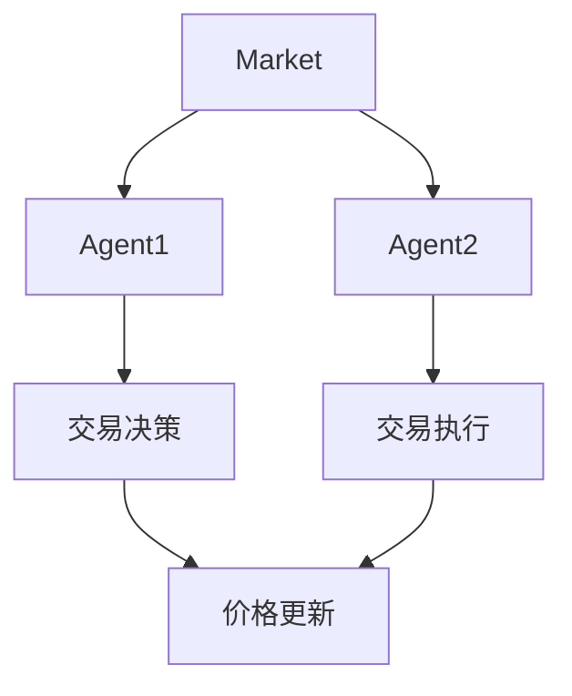
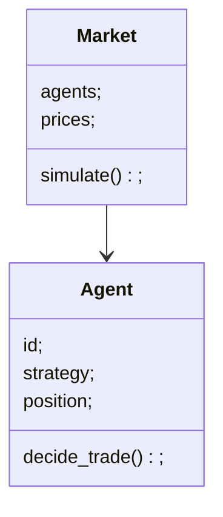

                 


# 多智能体系统模拟市场流动性冲击

## 关键词：多智能体系统、市场流动性、流动性冲击、算法实现、系统架构、金融市场

## 摘要：  
本文探讨了多智能体系统在金融市场中的应用，重点分析了如何利用多智能体系统模拟市场流动性冲击。通过详细阐述多智能体系统的概念、建模方法、算法实现以及系统架构设计，本文旨在为金融市场的流动性风险管理提供理论支持和实践指导。文章结合实际案例，深入分析了多智能体系统在模拟流动性冲击中的优势和应用前景。

---

## 第一章：多智能体系统与市场流动性冲击概述

### 1.1 多智能体系统的基本概念  
多智能体系统（Multi-Agent System, MAS）是由多个智能体（Agent）组成的复杂系统，这些智能体能够自主决策、协作和交互。智能体可以是软件程序、算法或模型，具有以下核心特征：  
- **自主性**：智能体能够独立决策和行动。  
- **反应性**：智能体能够感知环境并实时响应。  
- **协作性**：智能体之间可以协同完成任务。  
- **社会性**：智能体之间存在复杂的交互和关系。  

### 1.2 市场流动性冲击的定义与影响  
流动性冲击是指市场中突然出现的大额交易或市场参与者行为变化，导致市场流动性不足，价格剧烈波动的现象。其主要来源包括：  
- **信息不对称**：市场参与者基于不同信息做出决策。  
- **市场参与者的羊群效应**：投资者行为趋同导致市场波动。  
- **突发事件**：如金融危机、政策变化等。  

流动性冲击对市场的影响包括：  
- **价格剧烈波动**：可能导致资产价格大幅下跌或上涨。  
- **交易成本增加**：市场流动性不足会增加交易成本。  
- **市场稳定性下降**：流动性冲击可能引发市场恐慌。  

### 1.3 多智能体系统在金融市场中的应用  
多智能体系统在金融市场中的应用广泛，包括：  
- **交易模拟**：模拟市场参与者的行为，预测市场走势。  
- **风险管理**：识别和应对流动性风险。  
- **市场建模**：构建金融市场模型，分析市场动态。  

---

## 第二章：多智能体系统的核心概念  

### 2.1 多智能体系统的结构与功能  
多智能体系统的结构包括以下层次：  
1. **代理层**：由多个智能体组成，每个智能体代表一个市场参与者。  
2. **交互层**：智能体之间的交互和协作。  
3. **环境层**：市场环境，包括价格、交易量等变量。  

### 2.2 多智能体系统的建模与仿真  
多智能体系统的建模需要考虑以下原则：  
- **简化性**：避免过于复杂的模型。  
- **可扩展性**：模型应易于扩展。  
- **可验证性**：模型应能够验证其准确性。  

---

## 第三章：市场流动性建模  

### 3.1 流动性冲击的来源分析  
流动性冲击的主要来源包括：  
- **市场参与者的羊群效应**：投资者行为趋同。  
- **信息传播**：信息不对称导致市场波动。  
- **突发事件**：如金融危机、政策变化等。  

### 3.2 流动性冲击的建模方法  
流动性冲击的建模方法包括：  
- **基于Agent的模型**：模拟市场参与者的决策和行为。  
- **系统动力学模型**：分析市场的动态变化。  
- **网络流模型**：分析资金流动和交易网络。  

---

## 第四章：算法与实现  

### 4.1 基于Agent的模型  
基于Agent的模型通过模拟市场参与者的决策行为，预测市场动态。以下是基于Agent的模型的实现步骤：  
1. **定义智能体**：每个智能体代表一个市场参与者。  
2. **定义环境**：包括市场环境、价格、交易量等变量。  
3. **定义智能体的行为规则**：包括交易策略、价格敏感性等。  
4. **模拟市场动态**：通过智能体的交互，模拟市场波动。  

### 4.2 多智能体系统的实现  
以下是基于Python的实现示例：  

```python
import numpy as np

class Agent:
    def __init__(self, id, strategy):
        self.id = id
        self.strategy = strategy
        self.position = 0  # 持仓量

    def decide_trade(self, price, volume):
        # 根据策略决定交易量
        if self.strategy == 'buy':
            return max_volume
        elif self.strategy == 'sell':
            return min_volume

class Market:
    def __init__(self, agents):
        self.agents = agents
        self.prices = []  # 记录价格变化

    def simulate(self, steps):
        for _ in range(steps):
            # 计算价格
            price = self._calculate_price()
            # 智能体决策交易
            for agent in self.agents:
                volume = agent.decide_trade(price, volume)
            # 更新价格
            self.prices.append(price)

    def _calculate_price(self):
        # 简单的价格计算方法
        return np.mean([agent.position for agent in self.agents])
```

---

## 第五章：系统架构设计  

### 5.1 系统架构设计  
以下是多智能体系统的架构设计：  



### 5.2 系统功能设计  
以下是系统的功能模块：  



---

## 第六章：项目实战与案例分析  

### 6.1 环境安装  
需要安装以下工具和库：  
- Python  
- NumPy  
- Matplotlib  

### 6.2 核心代码实现  
以下是核心代码实现：  

```python
import numpy as np
import matplotlib.pyplot as plt

class Agent:
    def __init__(self, id, strategy):
        self.id = id
        self.strategy = strategy
        self.position = 0

    def decide_trade(self, price, volume):
        if self.strategy == 'buy':
            return max(volume, 0)
        elif self.strategy == 'sell':
            return min(volume, 0)

class Market:
    def __init__(self, agents):
        self.agents = agents
        self.prices = []

    def simulate(self, steps):
        for _ in range(steps):
            price = self._calculate_price()
            volumes = [agent.decide_trade(price, np.random.randint(1, 10)) for agent in self.agents]
            self.prices.append(price)

    def _calculate_price(self):
        return np.mean([agent.position for agent in self.agents])

# 创建智能体
agents = [Agent(i, 'buy') if i % 2 == 0 else Agent(i, 'sell') for i in range(10)]

# 创建市场并模拟
market = Market(agents)
market.simulate(100)

# 绘制价格变化图
plt.plot(market.prices)
plt.title('Market Price Simulation')
plt.xlabel('Time')
plt.ylabel('Price')
plt.show()
```

---

## 第七章：扩展与展望  

### 7.1 研究展望  
未来的研究方向包括：  
- 更复杂的市场参与者行为建模。  
- 更高效的多智能体系统实现方法。  
- 多智能体系统在其他金融领域的应用。  

### 7.2 最佳实践  
- 在实际应用中，建议结合具体市场特点进行模型调整。  
- 使用高效的编程语言和工具优化系统性能。  

---

## 作者：AI天才研究院/AI Genius Institute & 禅与计算机程序设计艺术 /Zen And The Art of Computer Programming

