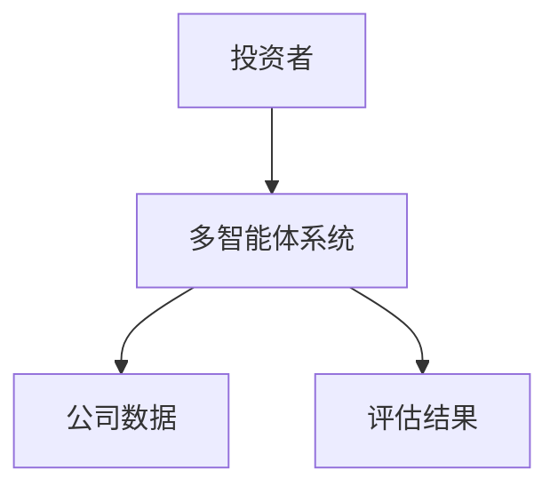

                 


# 多智能体系统评估公司创新能力：价值投资的新维度

> **关键词**：多智能体系统，公司创新能力，价值投资，系统架构，算法模型，投资策略

> **摘要**：本文探讨了多智能体系统在评估公司创新能力中的应用，提出了一种基于多智能体的评估模型，并详细介绍了其算法原理、系统架构及项目实战。通过分析多智能体系统的特性，本文展示了如何将这一技术应用于价值投资的新维度，为投资者提供了新的视角和工具。

---

# 多智能体系统评估公司创新能力：价值投资的新维度

## 第1章 多智能体系统与公司创新能力评估的背景介绍

### 1.1 多智能体系统的定义与特点

多智能体系统（Multi-Agent System, MAS）是由多个智能体组成的分布式系统，这些智能体通过协作完成特定目标。其特点包括：

- **分布式性**：智能体独立运行，通过通信协作解决问题。
- **自主性**：每个智能体都能自主决策。
- **反应性**：能实时感知环境并做出反应。
- **协作性**：通过协作完成复杂任务。

### 1.2 公司创新能力的定义与评估维度

公司创新能力是指公司在技术研发、产品创新等方面的能力。评估维度包括：

- **研发投入**：R&D支出占收入比例。
- **专利数量**：专利申请和授权数量。
- **产品创新速度**：新产品推出频率。

### 1.3 多智能体系统在价值投资中的应用前景

多智能体系统通过分析公司间的互动和市场动态，为投资者提供更精准的评估工具。其优势在于：

- **实时分析**：快速处理市场数据。
- **复杂场景模拟**：预测市场变化。
- **多维度评估**：结合财务和非财务指标。

---

## 第2章 多智能体系统的核心概念与联系

### 2.1 多智能体系统的组成与功能

多智能体系统由智能体、通信机制、环境和任务组成。各部分功能如下：

- **智能体**：执行任务。
- **通信机制**：智能体间交换信息。
- **环境**：智能体运行的背景。

### 2.2 多智能体系统与公司创新能力的关系

多智能体系统通过分析公司间的互动，评估创新能力。例如，智能体可以模拟公司间的竞争，分析创新成果。

### 2.3 多智能体系统的核心要素分析

#### 2.3.1 智能体的属性特征对比

| 属性 | 描述 |
|------|------|
| 知识 | 智能体拥有的信息 |
| 能力 | 智能体能完成的任务 |
| 目标 | 智能体追求的结果 |

#### 2.3.2 多智能体系统的ER实体关系图

```mermaid
er
actor(投资者) --> company(公司): 评估
company --> patent(专利): 拥有
company --> product(产品): 拥有
```

---

## 第3章 多智能体系统评估公司创新能力的算法原理

### 3.1 多智能体系统评估模型的构建

#### 3.1.1 特征提取与数据预处理

从公司财务数据、市场表现等中提取特征，进行归一化处理。

#### 3.1.2 智能体间的交互机制

智能体通过通信模块交换信息，更新评估结果。

### 3.2 基于多智能体的评估算法

#### 3.2.1 算法的数学模型与公式

评估公式：
$$ S = \sum_{i=1}^{n} w_i x_i $$
其中，$w_i$为权重，$x_i$为特征值。

#### 3.2.2 算法的实现步骤

1. 初始化智能体。
2. 采集数据。
3. 评估计算。
4. 更新结果。

#### 3.2.3 算法的优化与改进

使用遗传算法优化权重分配，提升评估准确性。

### 3.3 算法的实现与测试

#### 3.3.1 算法的代码实现

```python
class Agent:
    def __init__(self, id):
        self.id = id
        self.data = {}

    def collect_data(self):
        # 数据采集逻辑
        pass

    def evaluate(self):
        # 评估逻辑
        pass

# 初始化智能体
agents = [Agent(i) for i in range(5)]

# 评估过程
for agent in agents:
    agent.collect_data()
    agent.evaluate()
```

#### 3.3.2 算法的测试与结果分析

通过历史数据验证算法准确性，评估结果与实际创新表现对比。

---

## 第4章 系统分析与架构设计方案

### 4.1 系统功能设计

- **数据采集**：获取公司数据。
- **评估计算**：多智能体协作评估。
- **结果展示**：可视化展示。

### 4.2 系统架构设计



### 4.3 系统接口设计

- **输入接口**：接收公司数据。
- **输出接口**：返回评估结果。

### 4.4 系统交互设计

```mermaid
sequence
    投资者 -> 多智能体系统: 提供公司数据
    多智能体系统 -> 公司数据: 获取数据
    多智能体系统 -> 公司数据: 分析数据
    多智能体系统 -> 投资者: 返回评估结果
```

---

## 第5章 项目实战

### 5.1 环境安装

- **Python 3.8+**
- **相关库**：numpy, pandas, matplotlib

### 5.2 系统核心实现源代码

```python
import numpy as np

def evaluate_innovation_companies(data):
    weights = np.array([0.4, 0.3, 0.2, 0.1])
    scores = np.dot(data, weights)
    return scores

# 示例数据
data = np.array([[100, 20, 15, 5],
                 [80, 30, 20, 10]])

# 评估
scores = evaluate_innovation_companies(data)
print(scores)
```

### 5.3 代码应用解读与分析

代码实现了一个简单的评估模型，通过权重计算公司创新能力。实际应用中，需考虑更多因素和优化算法。

### 5.4 实际案例分析和详细讲解剖析

以科技公司为例，分析其专利数量和研发投入，评估创新潜力。

### 5.5 项目小结

项目展示了如何利用多智能体系统评估公司创新能力，为投资决策提供支持。

---

## 第6章 多智能体系统在价值投资中的应用策略

### 6.1 投资策略的制定

- **动态调整**：根据市场变化实时评估。
- **组合投资**：分散风险。

### 6.2 投资效果分析

通过历史数据验证模型的有效性，优化投资策略。

---

## 第7章 总结与展望

### 7.1 本章总结

本文提出了一种基于多智能体系统的公司创新能力评估方法，为价值投资提供了新工具。

### 7.2 注意事项与最佳实践

- 数据质量至关重要。
- 算法需不断优化。

### 7.3 未来展望

多智能体系统在金融领域的应用将更加广泛，推动价值投资的智能化发展。

---

**作者：AI天才研究院 & 禅与计算机程序设计艺术**

