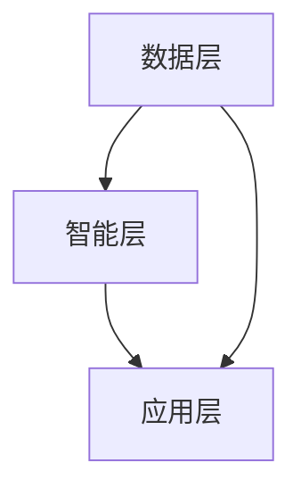

                 


# 多智能体系统辅助公司治理分析：提升价值投资质量

---

## 关键词：
多智能体系统、公司治理、价值投资、算法原理、系统架构、项目实战

---

## 摘要：
本文探讨了多智能体系统在公司治理分析中的应用，特别是在提升价值投资质量方面。通过介绍多智能体系统的基本概念、算法原理和系统架构，结合实际案例分析，展示了如何利用多智能体系统优化公司治理决策，实现更高效、精准的价值投资。文章内容涵盖背景知识、技术原理、系统设计及实战应用，为读者提供了全面的指导。

---

## 第1章：多智能体系统与公司治理基础

### 1.1 多智能体系统的定义与特点
#### 1.1.1 多智能体系统的定义
多智能体系统（Multi-Agent System, MAS）是由多个独立或协作的智能体组成的系统，每个智能体能够感知环境、做出决策并采取行动。这些智能体通过通信和协作完成复杂任务。

#### 1.1.2 多智能体系统的特征
- **分布式性**：智能体分布在不同的位置，独立决策。
- **协作性**：智能体之间通过协作完成共同目标。
- **反应性**：智能体能实时感知环境并做出反应。
- **自主性**：智能体具备自主决策能力。

#### 1.1.3 多智能体系统与单智能体系统的区别
| 特性       | 单智能体系统          | 多智能体系统          |
|------------|----------------------|----------------------|
| 决策中心    | 单一中心              | 分布式决策            |
| 信息处理    | 集中处理              | 分散处理              |
| 协作能力    | 较低                 | 较高                 |

### 1.2 公司治理的基本概念
#### 1.2.1 公司治理的定义
公司治理是指通过公司章程、董事会、管理层和股东之间的关系，确保公司有效运作和合规经营的过程。

#### 1.2.2 公司治理的主要目标
- **最大化股东价值**
- **确保公司合规性**
- **优化资源配置**
- **降低经营风险**

#### 1.2.3 公司治理的主体与客体关系
- **主体**：董事会、管理层、股东。
- **客体**：公司运营、战略制定、风险管理。

### 1.3 多智能体系统在公司治理中的作用
#### 1.3.1 提高决策效率
多智能体系统通过分布式计算和协作，快速分析数据，提高决策速度。

#### 1.3.2 优化资源配置
智能体之间协作，合理分配资源，避免浪费。

#### 1.3.3 增强风险控制能力
通过实时监控和反馈机制，及时发现并处理潜在风险。

---

## 第2章：多智能体系统与价值投资

### 2.1 价值投资的基本概念
#### 2.1.1 价值投资的定义
价值投资是一种投资策略，通过分析公司的基本面，寻找市场价格低于内在价值的股票进行投资。

#### 2.1.2 价值投资的核心理念
- **长期投资**：关注公司的长期价值。
- **安全边际**：买入价格低于内在价值。
- **基本面分析**：研究公司的财务状况、行业地位等。

#### 2.1.3 价值投资的关键要素
- **公司财务状况**
- **行业竞争格局**
- **管理团队能力**

### 2.2 多智能体系统在价值投资中的应用
#### 2.2.1 数据分析与市场预测
多智能体系统能够处理海量数据，预测市场趋势，辅助投资决策。

#### 2.2.2 风险评估与投资组合优化
通过智能体协作，评估投资风险，优化投资组合，降低风险。

#### 2.2.3 实时监控与动态调整
系统实时监控市场变化，动态调整投资策略，及时应对市场波动。

### 2.3 多智能体系统在价值投资中的优势
- **高效性**：快速处理数据，提高决策效率。
- **准确性**：通过协作和算法优化，提高分析精度。
- **适应性**：能够动态调整策略，适应市场变化。

---

## 第3章：多智能体系统的算法原理

### 3.1 多智能体系统的算法基础
#### 3.1.1 分布式计算
智能体之间通过分布式计算，各自处理部分数据，提高计算效率。

#### 3.1.2 协作与竞争机制
智能体之间通过协作和竞争，优化决策结果。

#### 3.1.3 自适应学习算法
智能体能够根据环境变化，自适应调整学习策略。

### 3.2 基于多智能体的决策算法
#### 3.2.1 分层决策算法
将决策过程分解为多个层次，每个层次负责不同的决策任务。

#### 3.2.2 联合决策算法
智能体协作，共同制定决策，考虑各方利益和目标。

#### 3.2.3 基于博弈论的决策模型
利用博弈论原理，分析智能体之间的互动，制定最优决策。

### 3.3 多智能体系统的数学模型与公式
#### 3.3.1 状态空间模型
状态空间表示系统的各种可能状态，每个状态由一组变量描述。

#### 3.3.2 行动空间模型
行动空间表示智能体可能采取的动作，每个动作对应一个状态变化。

#### 3.3.3 奖励函数模型
奖励函数定义智能体在特定状态和动作下的奖励值，用于优化决策。

---

## 第4章：系统分析与架构设计

### 4.1 问题场景介绍
#### 4.1.1 价值投资中的主要问题
- 数据量大，分析复杂。
- 市场变化快，需要实时调整策略。
- 风险评估难度大，需要多维度分析。

#### 4.1.2 多智能体系统解决这些问题的优势
- 分布式计算能力强。
- 能够实时处理大量数据。
- 具备动态调整能力。

#### 4.1.3 系统设计的目标与范围
- 提供高效的数据分析能力。
- 实现实时监控和动态调整。
- 优化投资组合，降低风险。

### 4.2 系统功能设计
#### 4.2.1 数据采集与处理模块
负责收集市场数据、公司财务数据等，进行预处理。

#### 4.2.2 智能体协作模块
智能体之间协作，共同分析数据，制定决策。

#### 4.2.3 投资决策模块
根据分析结果，制定投资策略，优化投资组合。

#### 4.2.4 结果分析与反馈模块
对投资结果进行评估，提供反馈，优化系统性能。

### 4.3 系统架构设计
#### 4.3.1 分层架构设计
- **数据层**：负责数据的采集和存储。
- **智能层**：负责智能体的协作和决策。
- **应用层**：提供用户界面和应用功能。

#### 4.3.2 系统架构图


---

## 第5章：项目实战

### 5.1 环境安装
- **Python**：安装Python 3.x及以上版本。
- **库**：安装numpy、pandas、scikit-learn等库。

### 5.2 系统核心实现源代码
```python
import numpy as np
import pandas as pd

def multi_agent_analysis(data):
    agents = [Agent1(), Agent2(), Agent3()]
    results = []
    for agent in agents:
        result = agent.analyze(data)
        results.append(result)
    return results

class Agent:
    def analyze(self, data):
        # 具体分析逻辑
        pass

class Agent1(Agent):
    def analyze(self, data):
        return data.mean()

class Agent2(Agent):
    def analyze(self, data):
        return data.max()

class Agent3(Agent):
    def analyze(self, data):
        return data.min()

# 示例数据
data = pd.DataFrame(np.random.rand(10, 3), columns=['price', 'volume', 'value'])
result = multi_agent_analysis(data)
print(result)
```

### 5.3 代码应用解读与分析
- **数据层**：数据预处理和存储。
- **智能层**：智能体协作分析数据。
- **应用层**：展示结果和提供用户交互。

### 5.4 实际案例分析
以股票市场为例，展示如何利用多智能体系统进行数据分析和投资决策。

### 5.5 项目小结
通过实际案例，验证了多智能体系统在价值投资中的有效性和优势。

---

## 第6章：最佳实践与小结

### 6.1 最佳实践
- **数据质量**：确保数据准确、全面。
- **智能体协作**：合理分配任务，提高协作效率。
- **系统维护**：定期更新算法和模型，适应市场变化。

### 6.2 小结
本文详细介绍了多智能体系统在公司治理分析中的应用，通过理论与实践相结合，展示了如何利用多智能体系统优化价值投资。

---

## 作者：AI天才研究院/AI Genius Institute & 禅与计算机程序设计艺术 /Zen And The Art of Computer Programming

--- 

# END

