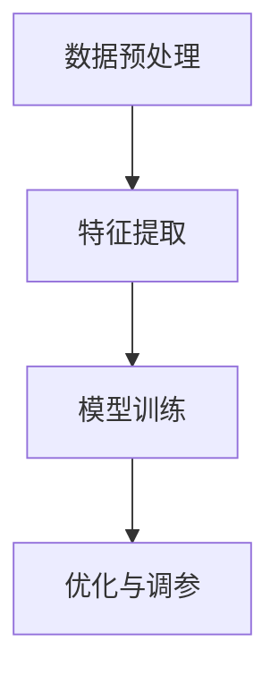
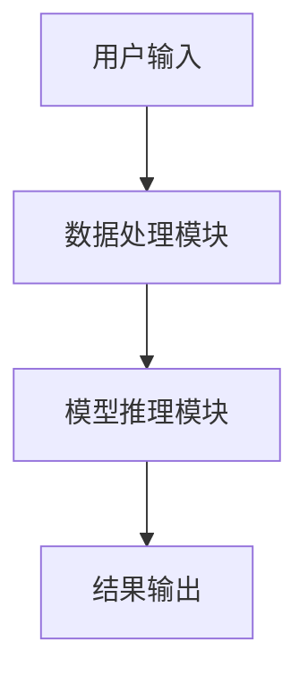

                 


# 多模态AI Agent：整合LLM与计算机视觉的最佳实践

> 关键词：多模态AI Agent, 大语言模型, 计算机视觉, 模型训练, 系统架构

> 摘要：本文系统地探讨了多模态AI Agent的整合与应用，从理论基础到实际案例，详细解析了如何将大语言模型与计算机视觉技术有机结合，构建高效实用的多模态AI系统。

---

## 第一部分: 多模态AI Agent的背景与概念

### 第1章: 多模态AI Agent的背景与概念

#### 1.1 多模态AI Agent的定义与核心概念
多模态AI Agent是一种能够同时处理多种数据类型（如文本、图像、语音等）的智能系统。它通过整合大语言模型（LLM）和计算机视觉技术，实现了跨模态的数据理解和智能决策。以下是多模态AI Agent的核心概念：

- **多模态数据**：包括文本、图像、语音等多种数据类型，这些数据在不同模态下具有独特的特征和信息。
- **跨模态理解**：通过整合不同模态的数据，系统能够从多个角度理解输入信息，从而做出更准确的判断。
- **联合推理**：多模态AI Agent能够结合不同模态的信息进行推理，提升决策的准确性和鲁棒性。

#### 1.2 问题背景与挑战
在实际应用中，单一模态的AI系统往往难以应对复杂多变的场景。例如，仅依赖文本的大语言模型在处理视觉信息时显得力不从心，而仅依赖图像的计算机视觉系统在处理文本信息时也存在局限性。因此，整合LLM与计算机视觉技术的多模态AI Agent应运而生。以下是主要挑战：

- **数据异构性**：不同模态的数据格式和特征提取方式存在差异，如何有效整合这些数据是关键问题。
- **模型融合**：需要设计合适的模型架构，使得不同模态的信息能够有效融合，同时保持模型的高效性和可解释性。
- **计算资源需求**：多模态模型的训练和推理通常需要大量的计算资源，如何优化模型以降低资源消耗是一个重要挑战。

---

### 第2章: 多模态AI Agent的核心概念与联系

#### 2.1 大语言模型（LLM）的核心原理
大语言模型（LLM）通过深度学习技术，从海量文本数据中学习语言的规律和语义信息。其核心原理包括：

- ** transformer架构**：LLM通常基于Transformer模型，通过自注意力机制捕捉文本中的长距离依赖关系。
- **预训练与微调**：LLM通过预训练任务（如Masked Language Model）学习通用语言表示，然后通过特定任务的微调进行优化。
- **生成与理解**：LLM能够进行文本生成、问答、翻译等多种任务，具备强大的语言理解能力。

#### 2.2 计算机视觉的核心原理
计算机视觉技术通过算法处理图像数据，实现对视觉信息的理解和分析。其核心原理包括：

- **卷积神经网络（CNN）**：CNN通过卷积操作提取图像的空间特征，常用于图像分类、目标检测等任务。
- **图像分割与生成**：基于深度学习的图像分割技术能够精确识别图像中的物体边界，而生成对抗网络（GAN）则用于图像生成任务。
- **目标检测与跟踪**：计算机视觉技术能够实时检测和跟踪图像中的目标物体，应用广泛。

#### 2.3 多模态整合的原理与方法
多模态整合的核心在于如何有效地融合不同模态的数据。以下是几种常见的整合方法：

- **对齐与融合**：通过将不同模态的数据对齐到同一个特征空间，然后进行融合，如通过注意力机制加权不同模态的信息。
- **联合编码**：将不同模态的数据同时输入模型，通过跨模态连接层进行联合编码，从而实现信息的相互增强。
- **多任务学习**：设计多任务损失函数，使得模型在多个模态任务上进行联合优化，提升整体性能。

---

### 第3章: 多模态AI Agent的数学模型与算法原理

#### 3.1 多模态模型的数学基础
多模态模型的数学基础主要涉及概率论、线性代数和深度学习的基本公式。以下是一些关键的数学概念：

- **概率论**：用于模型的不确定性建模，如贝叶斯推理。
- **线性代数**：用于矩阵运算和特征提取，如卷积操作。
- **深度学习公式**：如Transformer模型中的自注意力机制公式：

  $$\text{Attention}(Q, K, V) = \text{softmax}\left(\frac{QK^T}{\sqrt{d_k}}\right)V$$

其中，$Q$、$K$、$V$分别是查询、键和值向量，$d_k$是键的维度。

#### 3.2 多模态模型的训练流程
多模态模型的训练流程通常包括数据预处理、特征提取、模型训练和优化。以下是一个典型的训练流程图：



在特征提取阶段，不同模态的数据会被转换为相应的特征向量。例如，图像数据通过CNN提取空间特征，文本数据通过词嵌入生成向量表示。特征向量的维度需要对齐，以便后续的融合操作。

#### 3.3 模型优化与调参
模型优化是多模态AI Agent成功的关键。以下是一些常用的优化策略：

- **学习率调整**：使用学习率衰减策略，如Adam优化器。
- **正则化技术**：添加L2正则化项，防止模型过拟合。
- **数据增强**：通过数据增强技术扩展训练数据，提升模型的泛化能力。

---

### 第4章: 多模态AI Agent的系统架构与设计

#### 4.1 系统功能设计
多模态AI Agent的系统功能设计需要考虑以下模块：

- **数据处理模块**：负责多模态数据的加载、预处理和特征提取。
- **模型推理模块**：执行跨模态的推理任务，如图像描述生成、文本图像联合分类。
- **人机交互模块**：提供友好的用户界面，支持文本和图像的输入输出。

#### 4.2 系统架构设计
系统架构设计需要考虑模块的划分和交互方式。以下是一个可能的架构图：



数据处理模块负责接收输入数据并进行预处理，然后将特征向量传递给模型推理模块。模型推理模块通过跨模态融合技术生成最终结果，并通过人机交互模块将结果返回给用户。

#### 4.3 系统接口设计
系统接口设计需要考虑模块之间的通信方式。以下是接口设计的几个关键点：

- **数据接口**：定义数据格式和传输协议，如JSON格式。
- **模型接口**：定义模型输入和输出的格式，如TensorFlow或PyTorch的接口。
- **用户接口**：设计友好的用户界面，支持多种输入方式。

---

### 第5章: 多模态AI Agent的项目实战

#### 5.1 项目环境搭建
项目环境搭建是实际操作的第一步。以下是主要步骤：

1. **安装开发环境**：选择合适的开发环境，如Python 3.8及以上版本。
2. **安装依赖库**：安装必要的依赖库，如TensorFlow、PyTorch、OpenCV等。
3. **准备数据集**：收集多模态数据，如文本和图像数据，并进行预处理。

#### 5.2 核心代码实现
以下是核心代码实现的示例：

```python
import tensorflow as tf
from tensorflow.keras import layers

# 定义多模态融合模型
class MultiModalModel(tf.keras.Model):
    def __init__(self):
        super(MultiModalModel, self).__init__()
        self.text_encoder = layers.Dense(256)
        self.image_encoder = layers.Conv2D(256, (3,3), activation='relu')
        self.attention = layers.Attention()

    def call(self, inputs):
        text_input, image_input = inputs
        text_features = self.text_encoder(text_input)
        image_features = self.image_encoder(image_input)
        features = tf.stack([text_features, image_features], axis=1)
        attention_output = self.attention(features)
        return attention_output

model = MultiModalModel()
model.compile(optimizer='adam', loss='binary_crossentropy')
```

#### 5.3 项目案例分析
以图像描述生成为例，以下是模型的应用流程：

1. **输入图像**：用户提供一张图像，如一张猫的图片。
2. **特征提取**：图像通过CNN提取特征向量。
3. **模型推理**：模型结合图像特征和上下文信息，生成描述文本，如“这是一只黑白相间的猫，坐在沙发上”。

---

### 第6章: 最佳实践、小结与展望

#### 6.1 最佳实践
在实际应用中，建议采取以下策略：

- **数据多样性**：确保训练数据涵盖多种场景和模态，提升模型的泛化能力。
- **模型可解释性**：通过可视化技术分析模型的决策过程，提升用户的信任度。
- **计算资源优化**：采用模型压缩和量化技术，降低计算资源的需求。

#### 6.2 小结
本文详细探讨了多模态AI Agent的核心概念、算法原理和系统设计，通过实际案例展示了其应用潜力。多模态AI Agent的整合技术为智能系统的发展提供了新的方向。

#### 6.3 展望
未来，随着AI技术的不断发展，多模态AI Agent将在更多领域得到应用，如医疗影像分析、智能客服、自动驾驶等。通过持续优化模型架构和算法，多模态AI Agent有望成为实现通用人工智能的重要基石。

---

**作者：AI天才研究院/AI Genius Institute & 禅与计算机程序设计艺术 /Zen And The Art of Computer Programming**

