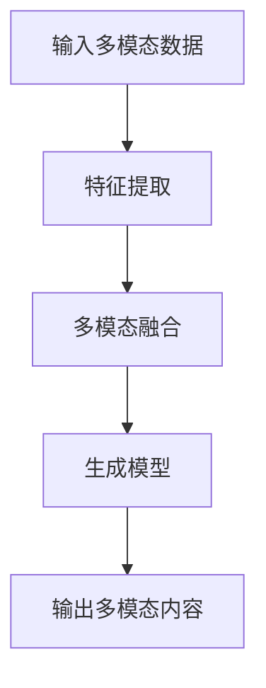
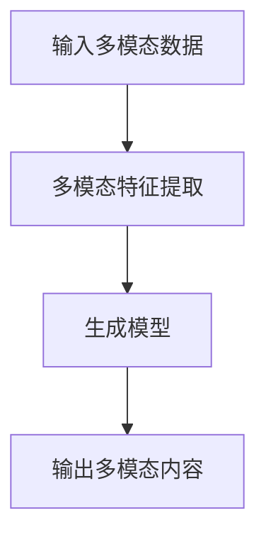
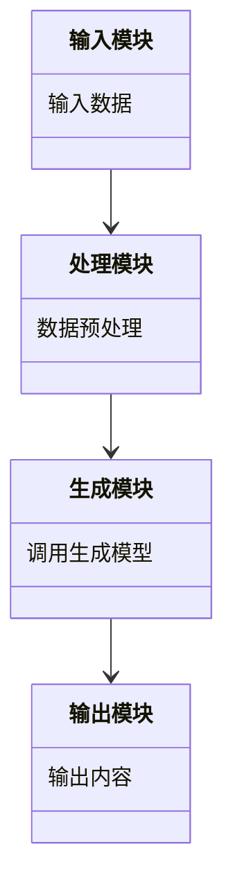
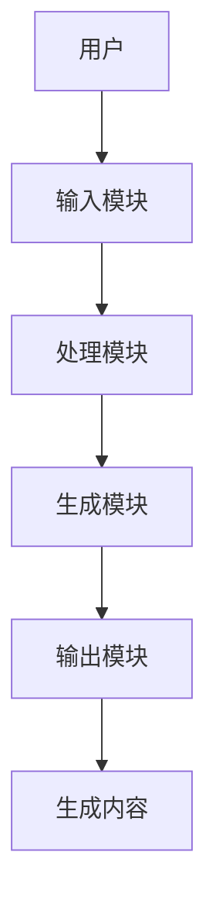

                 


# 多模态内容生成AI Agent：整合LLM与其他生成模型

> 关键词：多模态生成AI Agent, 大语言模型, LLM, 图像生成模型, 多模态整合, 内容生成

> 摘要：本文深入探讨了多模态内容生成AI Agent的整合方法，重点分析了如何将大语言模型（LLM）与其他生成模型（如图像生成模型）相结合，以实现多模态内容的生成。文章从背景介绍、核心概念、算法原理、系统架构设计、项目实战等多个方面展开，为读者提供了一个全面的技术视角。

---

## 第1章: 多模态内容生成AI Agent的背景与概念

### 1.1 多模态生成AI Agent的背景

#### 1.1.1 从单模态到多模态的演进
- 单模态生成模型的局限性：只能处理单一类型的数据（如文本、图像、音频）。
- 多模态生成的需求：现代应用场景需要AI能够同时处理多种数据类型，如文本、图像、音频等。
- 技术驱动：深度学习技术的进步使得多模态生成成为可能。

#### 1.1.2 大语言模型（LLM）的发展与应用
- LLM的崛起：从GPT到GPT-4，语言模型的能力不断提升。
- LLM的应用场景：文本生成、对话系统、内容创作等。
- LLM的挑战：如何与其他生成模型协同工作。

#### 1.1.3 多模态生成模型的兴起
- 多模态生成模型的定义：能够生成多种类型数据的模型。
- 多模态生成模型的类型：文本-图像生成、文本-音频生成、视频生成等。
- 多模态生成模型的优势：信息互补性强，生成内容更加丰富和真实。

### 1.2 多模态内容生成AI Agent的定义与特点

#### 1.2.1 多模态生成AI Agent的定义
- 多模态生成AI Agent：一种能够理解并生成多种类型数据的智能体，能够根据输入的多种模态信息生成相应的输出。

#### 1.2.2 多模态生成AI Agent的核心特点
- 多模态输入处理能力：能够接收并处理多种类型的输入数据。
- 多模态输出生成能力：能够生成多种类型的输出数据。
- 自适应性：能够根据上下文和用户需求动态调整生成内容。

#### 1.2.3 多模态生成AI Agent与传统生成模型的区别
| 特性                | 多模态生成AI Agent             | 传统生成模型             |
|---------------------|---------------------------------|--------------------------|
| 输入模态数           | 多个（如文本、图像、音频等）    | 单个或少数               |
| 输出模态数           | 多个                            | 单个                    |
| 复杂性               | 高                             | 较低                    |
| 应用场景             | 内容创作、人机交互、企业系统等 | 文本生成、图像生成等     |

### 1.3 多模态内容生成AI Agent的应用场景

#### 1.3.1 多模态生成在内容创作中的应用
- 文本与图像结合生成：生成配图的新闻标题。
- 视频与文本结合生成：自动生成视频脚本和解说词。

#### 1.3.2 多模态生成在人机交互中的应用
- 智能对话系统：结合文本和情感分析生成更自然的对话。
- 虚拟助手：结合语音识别和生成，提供更丰富的交互体验。

#### 1.3.3 多模态生成在企业级系统中的应用
- 企业报告生成：结合文本和图表生成动态报告。
- 客户画像生成：结合文本描述和图像生成客户画像。

### 1.4 本章小结
本章介绍了多模态生成AI Agent的背景、定义、特点以及应用场景，为后续章节奠定了基础。

---

## 第2章: 多模态生成模型的整合方法

### 2.1 大语言模型（LLM）的整合

#### 2.1.1 LLM的输入输出机制
- 输入：文本形式的提示或上下文。
- 输出：生成的文本内容，如回答、摘要、创意写作等。

#### 2.1.2 LLM与其他生成模型的协同工作
- LLM作为生成主模型，其他生成模型作为辅助模型。
- 通过API或中间件实现模型之间的协同。

#### 2.1.3 LLM的训练与优化
- 预训练：使用大规模多语言数据进行预训练。
- 微调：针对特定任务进行微调，提升生成效果。

#### 2.1.4 LLM与图像生成模型的整合
- 文本到图像生成：LLM生成图像描述，图像生成模型根据描述生成图像。
- 联合生成：LLM与图像生成模型共同优化生成过程。

### 2.2 图像生成模型的整合

#### 2.2.1 图像生成模型的基本原理
- 基于GAN（生成对抗网络）的图像生成模型：如StyleGAN、CycleGAN。
- 基于变分自编码器（VAE）的图像生成模型：如VAE、Beta-VAE。

#### 2.2.2 图像生成模型与LLM的接口设计
- LLM生成图像描述，图像生成模型根据描述生成图像。
- LLM直接指导图像生成模型的生成过程。

#### 2.2.3 图像生成模型的评估与优化
- 评估指标：FID（Frechet Inception Distance）、PSNR、SSIM。
- 优化策略：调整超参数、改进生成模型结构。

### 2.3 其他生成模型的整合

#### 2.3.1 音频生成模型的整合
- LLM生成音频描述，音频生成模型根据描述生成音频。
- 联合生成：LLM与音频生成模型协同生成音乐、语音等。

#### 2.3.2 视频生成模型的整合
- LLM生成视频脚本，视频生成模型根据脚本生成视频。
- 联合生成：LLM与视频生成模型协同优化生成过程。

#### 2.3.3 多模态生成模型的融合策略
- 模型级融合：将多个生成模型的输出进行融合。
- 特征级融合：在特征层面上进行融合，提升生成效果。

### 2.4 本章小结
本章详细探讨了如何将LLM与其他生成模型（如图像生成模型、音频生成模型、视频生成模型）进行整合，为多模态内容生成提供了技术基础。

---

## 第3章: 多模态内容生成的算法原理

### 3.1 多模态生成模型的算法概述

#### 3.1.1 多模态生成模型的基本算法
- 文本生成算法：基于Transformer的解码器。
- 图像生成算法：基于GAN的生成器和判别器。

#### 3.1.2 多模态生成模型的训练流程
1. 数据预处理：整合多模态数据，构建统一的数据格式。
2. 模型训练：使用多模态数据进行联合训练。
3. 模型优化：调整超参数，优化生成效果。

#### 3.1.3 多模态生成模型的评估指标
- 内容相似度：生成内容与输入内容的相似性。
- 多样性：生成内容的多样性和创新性。
- 质量评估：生成内容的质量，如文本的流畅性、图像的清晰度等。

#### 3.1.4 多模态生成模型的数学模型
- LLM的数学模型：基于Transformer的自注意力机制。
- 图像生成模型的数学模型：GAN的生成器和判别器。

#### 3.1.5 使用mermaid展示算法流程



### 3.2 多模态生成模型的数学模型

#### 3.2.1 LLM的数学模型
- Transformer模型的解码器结构：
  $$ \text{Decoder} = \text{Self-attention} + \text{Cross-attention} $$
- 生成概率：
  $$ P(y|x) = \prod_{i=1}^{n} P(y_i|x_{<i}, y_{<i}) $$

#### 3.2.2 图像生成模型的数学模型
- GAN的生成器：
  $$ G(x) = \sigma(G_{\theta}(x)) $$
- GAN的判别器：
  $$ D(x) = \text{sigmoid}(D_{\phi}(x)) $$

#### 3.2.3 联合生成模型的数学模型
- 联合生成概率：
  $$ P(y|x) = \prod_{i=1}^{n} P(y_i|x_{<i}, y_{<i}) $$

#### 3.2.4 使用mermaid展示算法流程



### 3.3 本章小结
本章详细讲解了多模态生成模型的算法原理，包括模型结构、训练流程和数学模型，并通过mermaid流程图展示了生成过程。

---

## 第4章: 多模态内容生成系统的架构设计

### 4.1 系统功能设计

#### 4.1.1 系统模块划分
- 输入模块：接收多模态输入数据。
- 处理模块：对输入数据进行预处理和特征提取。
- 生成模块：调用多种生成模型生成多模态内容。
- 输出模块：输出生成的多模态内容。

#### 4.1.2 系统功能流程
1. 输入数据：用户输入多模态数据（如文本、图像）。
2. 数据预处理：对输入数据进行清洗和格式转换。
3. 特征提取：提取输入数据的特征。
4. 生成内容：调用生成模型生成多模态内容。
5. 输出内容：将生成的内容返回给用户。

#### 4.1.3 使用mermaid展示系统类图



### 4.2 系统架构设计

#### 4.2.1 系统架构图


#### 4.2.2 系统接口设计
- 输入接口：接收多种模态的数据输入。
- 输出接口：输出生成的多模态内容。
- 调用接口：生成模块调用多种生成模型的接口。

#### 4.2.3 系统交互流程
1. 用户通过输入接口提交多模态数据。
2. 输入模块接收数据并传递给处理模块。
3. 处理模块对数据进行预处理并传递给生成模块。
4. 生成模块调用多种生成模型生成多模态内容。
5. 输出模块将生成内容返回给用户。

### 4.3 本章小结
本章详细设计了多模态内容生成系统的架构，包括模块划分、功能流程和系统交互。

---

## 第5章: 项目实战

### 5.1 环境安装

#### 5.1.1 安装Python
- 安装Python 3.8或更高版本。

#### 5.1.2 安装必要的库
- 安装深度学习框架：TensorFlow、PyTorch。
- 安装图像处理库：OpenCV、Pillow。
- 安装NLP处理库：NLTK、spaCy。

#### 5.1.3 安装生成模型库
- 安装文本生成库：Hugging Face的GPT模型。
- 安装图像生成库：Stable Diffusion、GANs库。

### 5.2 系统核心实现

#### 5.2.1 输入模块实现
```python
class InputModule:
    def __init__(self):
        self.input_types = ['text', 'image', 'audio']

    def receive_input(self, input_data):
        # 处理输入数据
        pass
```

#### 5.2.2 处理模块实现
```python
class ProcessingModule:
    def __init__(self):
        pass

    def preprocess(self, input_data):
        # 数据预处理
        pass
```

#### 5.2.3 生成模块实现
```python
class GenerationModule:
    def __init__(self):
        self.models = {
            'text': text_generator,
            'image': image_generator,
            'audio': audio_generator
        }

    def generate(self, processed_data):
        # 调用生成模型
        pass
```

#### 5.2.4 输出模块实现
```python
class OutputModule:
    def __init__(self):
        pass

    def output_result(self, generated_data):
        # 输出生成结果
        pass
```

### 5.3 项目实战案例分析

#### 5.3.1 案例1：文本与图像联合生成
- 输入：文本描述“一只蓝色的猫坐在沙发上”。
- 输出：生成相应的图像和文本描述。

#### 5.3.2 案例2：视频生成
- 输入：视频脚本。
- 输出：生成视频片段。

### 5.4 项目小结
本章通过实际项目案例，展示了如何将多模态生成模型整合到实际应用中，并提供了代码实现和案例分析。

---

## 第6章: 最佳实践、小结与注意事项

### 6.1 最佳实践
- 模型选择：根据具体任务选择合适的生成模型。
- 数据预处理：确保数据质量和多样性。
- 系统优化：优化系统架构和接口设计，提升生成效率。

### 6.2 小结
本文从背景、概念、算法、架构到实战，全面探讨了多模态内容生成AI Agent的整合方法，为读者提供了系统的知识体系。

### 6.3 注意事项
- 数据隐私：确保生成数据的隐私和安全。
- 模型泛化能力：避免生成内容过于局限。
- 系统稳定性：确保系统在高负载下的稳定性。

### 6.4 拓展阅读
- 多模态生成模型的前沿研究。
- 多模态生成模型在更多领域的应用。

---

## 作者：AI天才研究院/AI Genius Institute & 禅与计算机程序设计艺术 /Zen And The Art of Computer Programming

---

以上是《多模态内容生成AI Agent：整合LLM与其他生成模型》的技术博客文章的详细目录大纲，涵盖了从背景介绍、核心概念、算法原理、系统架构设计到项目实战的全过程，为读者提供了一个全面的技术视角。

