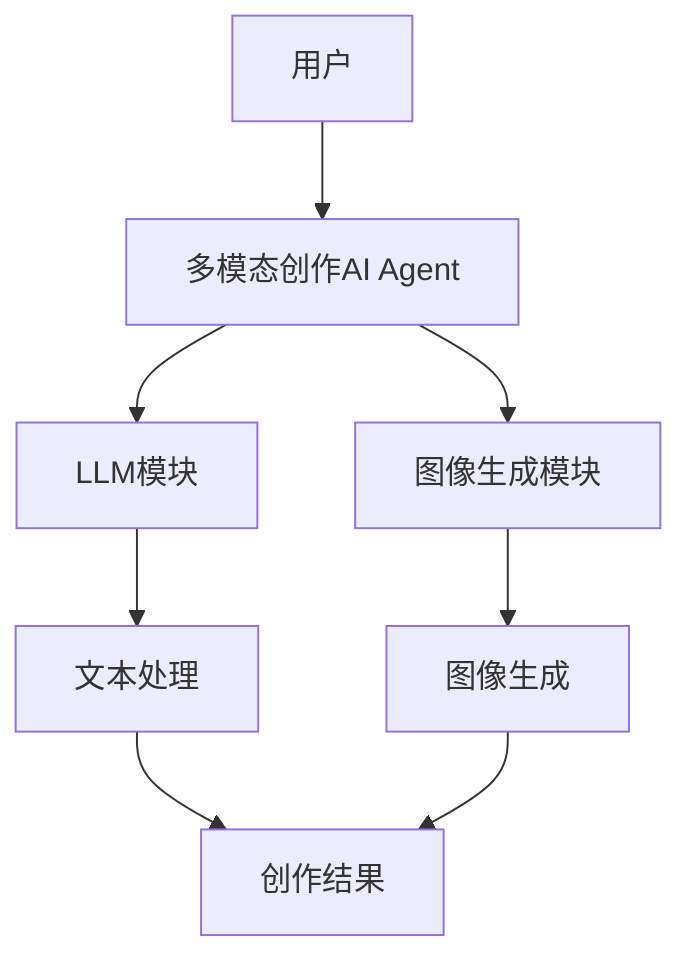
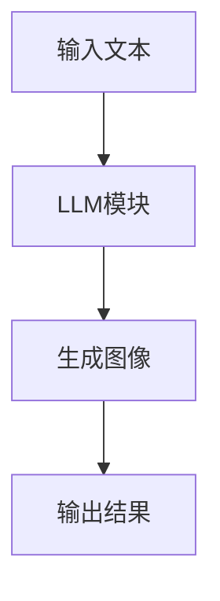
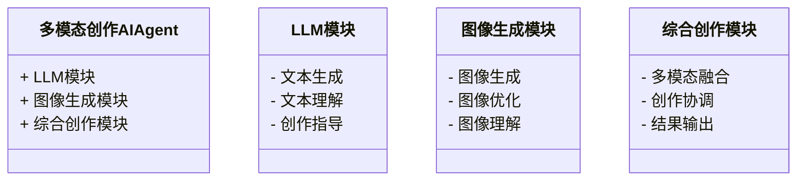

                 


# 多模态创作AI Agent：整合LLM与图像生成技术

> 关键词：多模态创作，AI Agent，LLM，图像生成，技术整合

> 摘要：本文详细探讨了多模态创作AI Agent的整合技术，包括大语言模型（LLM）与图像生成模型的结合，分析其原理、系统架构及实际应用，为读者提供从理论到实践的全面指导。

---

## 第1章：多模态创作AI Agent的背景与概念

### 1.1 多模态创作AI Agent的背景

#### 1.1.1 从单模态到多模态的演进

近年来，人工智能技术迅速发展，从最初的单模态处理（如仅处理文本或图像）逐渐转向多模态整合。多模态数据（包括文本、图像、语音等）的结合能够提供更丰富的信息，使AI系统具备更强的感知和理解能力。这种演进推动了多模态创作AI Agent的出现，使其能够同时处理多种数据类型，生成更具创意和多样性的作品。

#### 1.1.2 AI Agent技术的发展历程

AI Agent（智能体）是一种能够感知环境并采取行动以实现目标的实体。从简单的规则驱动程序到复杂的深度学习模型，AI Agent技术经历了多个阶段。如今，结合大语言模型（LLM）和图像生成模型的多模态AI Agent，能够处理复杂的创作任务，成为创作领域的重要工具。

#### 1.1.3 多模态创作的市场需求与应用场景

随着内容创作需求的激增，传统的人工创作方式效率低下，难以满足市场对多样化内容的需求。多模态创作AI Agent通过整合LLM和图像生成技术，能够快速生成文本、图像等多种形式的内容，广泛应用于创意设计、广告营销、教育培训等领域。

### 1.2 多模态创作AI Agent的定义与特点

#### 1.2.1 多模态创作的定义

多模态创作是指利用多种数据形式（如文本、图像、语音等）进行创作的过程。通过整合不同模态的数据，AI系统能够生成更丰富、更具表现力的作品。多模态创作AI Agent是一种能够自主完成从创意构思到内容生成的智能系统。

#### 1.2.2 多模态创作的核心特点

- **多模态整合**：同时处理多种数据类型，实现跨模态的信息融合。
- **自主性**：AI Agent能够自主决策创作的内容和形式。
- **高效性**：通过自动化处理提高创作效率，降低人工成本。
- **创新性**：结合不同模态的优势，生成更具创意的作品。

#### 1.2.3 多模态创作与传统创作方式的区别

传统创作主要依赖人工完成，创作效率低且受个人能力限制。而多模态创作AI Agent能够快速生成高质量内容，突破了时间和空间的限制，为创作提供了新的可能性。

### 1.3 多模态创作AI Agent的核心概念

#### 1.3.1 多模态数据的整合与处理

多模态创作AI Agent需要将文本、图像等多种数据进行整合和处理，通过模型对不同模态的数据进行联合分析，生成统一的创作结果。

#### 1.3.2 AI Agent的自主性与智能性

AI Agent具备自主决策的能力，能够在没有人工干预的情况下完成创作任务。其智能性体现在对创作需求的理解、创作过程的优化以及创作结果的评估等方面。

#### 1.3.3 多模态创作的边界与外延

多模态创作的边界在于不同模态数据的处理和融合，外延则涉及创作结果的应用和推广。通过不断扩展模态类型和提升处理能力，多模态创作AI Agent的应用场景将更加广泛。

---

## 第2章：多模态创作AI Agent的核心概念与联系

### 2.1 多模态创作AI Agent的原理

#### 2.1.1 多模态数据的处理流程

1. **输入数据**：接收多种数据形式（如文本、图像）。
2. **数据预处理**：对不同模态的数据进行清洗、标准化处理。
3. **特征提取**：提取各模态数据的特征，进行跨模态对齐。
4. **模型融合**：通过模型对不同模态的特征进行融合，生成创作结果。

#### 2.1.2 AI Agent的决策机制

1. **需求分析**：理解用户的创作需求。
2. **创作规划**：制定创作的步骤和目标。
3. **执行创作**：根据规划执行创作任务。
4. **结果评估**：对创作结果进行评估和优化。

#### 2.1.3 多模态创作的实现步骤

1. **输入创作需求**：用户输入创作的主题或目标。
2. **生成初始内容**：AI Agent根据需求生成初步的文本或图像。
3. **内容优化**：对生成的内容进行优化和调整。
4. **输出最终作品**：完成创作并输出结果。

### 2.2 多模态创作AI Agent的核心模块

#### 2.2.1 大语言模型（LLM）模块

- **文本生成**：利用LLM生成高质量的文本内容。
- **文本理解**：对输入的文本进行语义理解和分析。
- **创作指导**：为创作提供文本上的指导和建议。

#### 2.2.2 图像生成模型模块

- **图像生成**：通过图像生成模型（如扩散模型、GAN）生成图像。
- **图像优化**：对生成的图像进行质量优化和调整。
- **图像理解**：对图像内容进行分析和理解。

#### 2.2.3 综合创作模块

- **多模态融合**：将文本和图像等多种模态的数据进行融合。
- **创作协调**：协调各模块的工作，确保创作过程顺利进行。
- **结果输出**：输出最终的创作成果。

### 2.3 多模态创作AI Agent的实体关系图



---

## 第3章：多模态创作AI Agent的算法原理

### 3.1 大语言模型（LLM）的原理

#### 3.1.1 LLM的基本结构

大语言模型通常基于Transformer架构，包括编码器和解码器两个部分。编码器将输入的文本转换为向量表示，解码器根据这些向量生成输出文本。

#### 3.1.2 LLM的训练过程

1. **数据准备**：收集和整理大规模的文本数据。
2. **模型训练**：使用这些数据对模型进行监督训练。
3. **微调优化**：根据具体任务对模型进行微调优化。

#### 3.1.3 LLM的推理机制

1. **输入处理**：将输入文本转换为模型可处理的形式。
2. **生成输出**：通过解码器生成输出文本。
3. **结果优化**：对生成的文本进行优化和调整。

### 3.2 图像生成模型的原理

#### 3.2.1 图像生成模型的类型

- **生成对抗网络（GAN）**：通过生成器和判别器的对抗训练生成图像。
- **扩散模型**：通过逐步添加噪声并学习去除噪声来生成图像。
- **变分自编码器（VAE）**：通过编码器和解码器对图像进行压缩和重建。

#### 3.2.2 图像生成模型的训练过程

1. **数据准备**：收集和整理大量图像数据。
2. **模型训练**：使用这些数据对生成模型进行训练。
3. **模型优化**：通过调整超参数和优化算法提升生成效果。

#### 3.2.3 图像生成模型的生成过程

1. **输入处理**：将输入条件（如文本描述）转换为模型可处理的形式。
2. **生成图像**：模型根据输入条件生成图像。
3. **图像优化**：对生成的图像进行质量优化和调整。

### 3.3 多模态创作的算法流程



---

## 第4章：多模态创作AI Agent的系统分析与架构设计方案

### 4.1 问题场景介绍

用户需要一个能够同时处理文本和图像的创作工具，快速生成高质量的内容。传统创作工具效率低，难以满足多样化的需求。

### 4.2 项目介绍

本项目旨在开发一个多模态创作AI Agent，整合LLM和图像生成技术，为用户提供高效、智能的创作工具。

### 4.3 系统功能设计



### 4.4 系统架构设计


### 4.5 系统接口设计

1. **用户输入接口**：接收用户的创作需求。
2. **LLM接口**：与大语言模型进行交互，生成文本内容。
3. **图像生成接口**：与图像生成模型进行交互，生成图像内容。
4. **结果输出接口**：输出最终的创作成果。

### 4.6 系统交互序列图


---

## 第5章：多模态创作AI Agent的项目实战

### 5.1 环境安装

1. **安装Python**：确保安装了Python 3.8或更高版本。
2. **安装依赖库**：安装PyTorch、Hugging Face Transformers等库。

```bash
pip install torch transformers
```

### 5.2 核心代码实现

```python
from transformers import AutoTokenizer, AutoModelForCausalLM
import torch

# 初始化LLM模型
tokenizer = AutoTokenizer.from_pretrained('gpt2')
model = AutoModelForCausalLM.from_pretrained('gpt2')

# 文本生成
def generate_text(prompt):
    inputs = tokenizer.encode(prompt, return_tensors='pt')
    outputs = model.generate(inputs, max_length=50, do_sample=True)
    return tokenizer.decode(outputs[0], skip_special_tokens=True)

# 图像生成（示例代码）
def generate_image(description):
    # 这里需要实际的图像生成代码，示例中仅展示接口调用
    pass
```

### 5.3 案例分析

假设用户输入“生成一幅描绘未来城市的图像”，系统将通过LLM生成描述文本，并调用图像生成模块生成图像，最终输出结果。

---

## 第6章：最佳实践与总结

### 6.1 小结

多模态创作AI Agent通过整合LLM和图像生成技术，为创作领域带来了新的可能性。本文详细探讨了其原理、系统架构及实际应用，为读者提供了全面的指导。

### 6.2 注意事项

在实际应用中，需要注意模型的训练数据质量、生成结果的评估以及系统的可扩展性等问题。

### 6.3 拓展阅读

建议进一步学习多模态数据处理、生成对抗网络（GAN）以及扩散模型的相关知识，以深入理解多模态创作AI Agent的技术细节。

---

## 作者信息

作者：AI天才研究院/AI Genius Institute  
联系方式：[联系邮箱](mailto:contact@ai-genius.org)  
官方网站：[AI Genius Institute](https://www.ai-genius.org)

---

通过本文的详细讲解，读者可以全面了解多模态创作AI Agent的技术原理和实际应用，为后续的深入研究和实践奠定基础。

