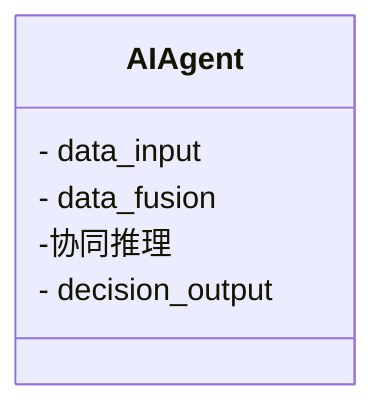
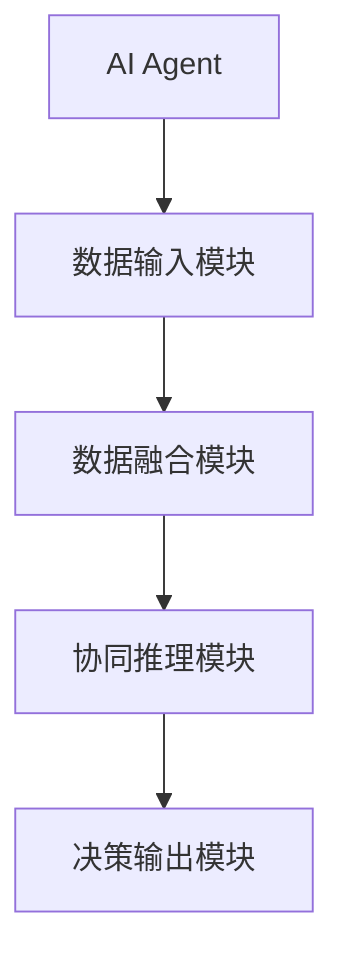
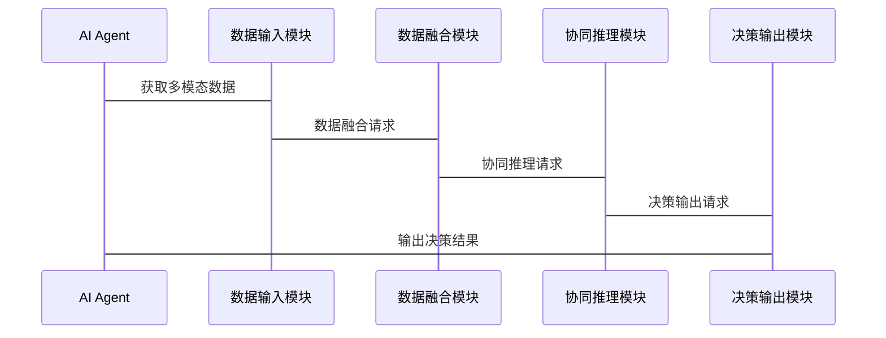

                 


# 多模态感知AI Agent：LLM与多种传感器输入的协同

> 关键词：多模态感知、AI Agent、大语言模型、传感器输入、协同推理

> 摘要：本文深入探讨了多模态感知AI Agent的定义、核心概念、算法原理、系统架构设计以及实际应用。通过结合大语言模型（LLM）与多种传感器输入，分析其协同工作的机制，并通过具体案例展示其在实际场景中的应用，最后总结了多模态感知AI Agent的优势与未来发展方向。

---

# 第一部分: 多模态感知AI Agent的背景与概念

## 第1章: 多模态感知AI Agent的背景与问题背景

### 1.1 多模态感知AI Agent的背景

#### 1.1.1 从单模态AI到多模态AI的演进
AI技术的发展经历了从单一模态到多模态的演进。早期的AI系统主要依赖单一类型的数据输入，如文本或图像，但这种单模态的感知方式在复杂场景中存在明显的局限性。随着技术的进步，多模态感知逐渐成为研究的热点，因为它能够更全面地理解和处理真实世界中的信息。

#### 1.1.2 大语言模型（LLM）的发展与应用
大语言模型（LLM）如GPT系列、BERT系列等，凭借其强大的自然语言处理能力，已经在文本生成、问答系统、机器翻译等领域取得了显著的成果。然而，LLM的核心能力主要集中在处理文本数据上，对于其他类型的数据（如图像、语音、传感器数据）的处理能力相对有限。

#### 1.1.3 多模态感知技术的兴起
多模态感知技术的兴起源于对更智能化、更接近人类感知方式的需求。通过结合多种传感器输入（如视觉、听觉、触觉等），AI系统能够更好地理解和处理复杂的现实场景。这种技术在机器人、自动驾驶、智能助手等领域展现出广阔的应用前景。

### 1.2 多模态感知AI Agent的问题背景

#### 1.2.1 单一模态感知的局限性
单一模态感知的局限性主要体现在以下几个方面：
- **信息不完整**：仅依赖单一类型的数据输入，导致信息处理不够全面。
- **鲁棒性不足**：在复杂或模糊的场景中，单一模态的数据难以提供足够的信息来支持决策。
- **适用场景受限**：无法应对需要多模态数据协同工作的复杂任务。

#### 1.2.2 多模态协同的优势与必要性
多模态协同的优势在于：
- **信息互补性**：不同模态的数据可以相互补充，提高感知的准确性和全面性。
- **鲁棒性增强**：通过多模态数据的融合，系统能够更好地应对复杂和不确定的环境。
- **任务处理能力提升**：多模态协同能够支持更复杂的任务，如智能交互、自主决策等。

#### 1.2.3 当前技术面临的挑战
当前多模态感知技术面临的主要挑战包括：
- **数据融合的复杂性**：如何有效地融合不同模态的数据是一个技术难题。
- **计算资源需求**：多模态数据的处理需要较高的计算资源。
- **模型的泛化能力**：如何训练出能够处理多种模态数据的通用模型是一个挑战。

### 1.3 问题描述与解决思路

#### 1.3.1 多模态数据输入的整合问题
多模态数据输入的整合问题主要体现在如何将不同格式和类型的数据（如文本、图像、语音）统一表示并协同工作。

#### 1.3.2 LLM与传感器协同的工作模式
LLM与传感器协同的工作模式需要解决以下问题：
- **数据输入接口的设计**：如何将传感器数据输入到LLM中。
- **协同推理机制的建立**：如何让LLM与传感器数据协同进行推理和决策。

#### 1.3.3 协同推理与决策的核心问题
协同推理与决策的核心问题包括：
- **多模态数据的融合方法**：如何将不同模态的数据进行有效的融合。
- **推理模型的设计**：如何设计能够处理多模态数据的推理模型。
- **决策策略的优化**：如何优化决策策略以提高系统的性能。

### 1.4 边界与外延

#### 1.4.1 多模态感知的边界定义
多模态感知的边界是指其能够处理的模态类型和数据范围。例如，当前多模态感知主要关注视觉、听觉和文本等模态，而对触觉、嗅觉等模态的支持相对有限。

#### 1.4.2 多模态AI Agent的应用范围
多模态AI Agent的应用范围包括但不限于：
- **智能助手**：通过多模态数据提供更智能的服务。
- **机器人控制**：通过多模态感知实现更精准的机器人控制。
- **自动驾驶**：通过多模态数据融合提高自动驾驶系统的感知能力。

#### 1.4.3 相关技术的区分与联系
相关技术包括：
- **单模态AI**：主要依赖单一类型的数据进行处理。
- **多模态学习**：通过多种模态数据进行模型训练。
- **协同推理**：多模态数据协同进行推理和决策。

---

## 第2章: 多模态感知AI Agent的核心概念与联系

### 2.1 多模态感知AI Agent的定义与特点

#### 2.1.1 多模态感知的定义
多模态感知是指通过多种传感器或数据源获取信息，并对这些信息进行处理和理解的过程。

#### 2.1.2 多模态AI Agent的核心特点
多模态AI Agent的核心特点包括：
- **多模态数据处理能力**：能够处理多种类型的数据。
- **协同推理能力**：能够将不同模态的数据协同起来进行推理和决策。
- **高鲁棒性**：能够在复杂和不确定的环境中稳定工作。

### 2.2 核心概念的原理与联系

#### 2.2.1 多模态数据融合的原理
多模态数据融合的原理是通过将不同模态的数据进行变换、对齐和融合，以获得更全面的信息。

#### 2.2.2 LLM与传感器协同的工作机制
LLM与传感器协同的工作机制包括数据输入、数据融合、协同推理和决策输出四个步骤。

#### 2.2.3 协同推理的数学模型
协同推理的数学模型可以通过概率图模型或神经网络模型来实现。例如，可以通过交叉注意力机制将不同模态的数据进行融合。

### 2.3 核心概念对比表

| 概念         | 描述                                                                 |
|--------------|----------------------------------------------------------------------|
| 单一模态AI    | 仅依赖单一类型的数据输入，如文本或图像。                              |
| 多模态AI      | 结合多种类型的数据输入，如文本、图像、语音等。                        |
| LLM          | 基于大规模语言模型的自然语言处理技术，擅长处理文本数据。              |
| 传感器输入    | 通过物理传感器获取的数据，如图像、语音、温度、湿度等。                |

### 2.4 核心概念的ER实体关系图

```mermaid
er
actor(AI Agent) -[多模态数据输入]-> sensor_data_table
sensor_data_table <--[多模态数据融合]-> fused_data_table
fused_data_table -->[协同推理]-> decision_table
decision_table -->[输出决策]-> action
```

---

## 第3章: 多模态感知AI Agent的算法原理

### 3.1 多模态数据融合算法

#### 3.1.1 基于交叉注意力机制的多模态融合
交叉注意力机制是一种有效的多模态数据融合方法。通过计算不同模态数据之间的注意力权重，实现数据的协同融合。

#### 3.1.2 基于变换模型的多模态融合
变换模型是一种通过将不同模态的数据转换到相同的表示空间，从而实现数据融合的方法。

### 3.2 协同推理算法

#### 3.2.1 基于概率图模型的协同推理
概率图模型是一种通过构建概率图来表示变量之间的关系，并通过概率推理来实现决策的方法。

#### 3.2.2 基于神经网络的协同推理
神经网络是一种常用的协同推理方法。通过设计适当的网络结构，可以实现多模态数据的协同推理。

### 3.3 算法原理的数学模型

#### 3.3.1 交叉注意力机制的公式
交叉注意力机制的公式如下：
$$
\alpha_{i,j} = \frac{\exp(s_{i,j})}{\sum_{k} \exp(s_{i,k})}
$$

其中，$\alpha_{i,j}$ 表示第 $i$ 个模态的第 $j$ 个数据点的注意力权重，$s_{i,j}$ 是该注意力的相似度得分。

---

## 第4章: 多模态感知AI Agent的系统分析与架构设计

### 4.1 问题场景介绍

#### 4.1.1 多模态感知的场景描述
多模态感知的场景描述包括智能助手、机器人控制、自动驾驶等。

#### 4.1.2 系统需求分析
系统需求分析包括数据输入接口、数据融合模块、协同推理模块和决策输出模块。

### 4.2 系统功能设计

#### 4.2.1 领域模型设计
领域模型设计包括数据输入模块、数据融合模块、协同推理模块和决策输出模块。

#### 4.2.2 领域模型的Mermaid类图


### 4.3 系统架构设计

#### 4.3.1 系统架构的Mermaid架构图


#### 4.3.2 系统接口设计
系统接口设计包括数据输入接口、数据融合接口、协同推理接口和决策输出接口。

#### 4.3.3 系统交互的Mermaid序列图


---

## 第5章: 多模态感知AI Agent的项目实战

### 5.1 环境安装

#### 5.1.1 安装Python
安装Python 3.x版本。

#### 5.1.2 安装必要的Python库
安装必要的Python库，如numpy、pandas、tensorflow、pytorch等。

### 5.2 核心代码实现

#### 5.2.1 数据输入模块的实现
实现数据输入模块，包括文本、图像、语音等数据的输入和预处理。

#### 5.2.2 数据融合模块的实现
实现数据融合模块，如基于交叉注意力机制的多模态数据融合。

#### 5.2.3 协同推理模块的实现
实现协同推理模块，如基于概率图模型或神经网络的协同推理。

#### 5.2.4 决策输出模块的实现
实现决策输出模块，如基于推理结果的决策输出。

### 5.3 代码应用解读与分析

#### 5.3.1 核心代码解读
解读核心代码，如数据融合模块和协同推理模块的代码实现。

#### 5.3.2 代码实现的分析
分析代码实现的优缺点，如计算效率、代码可读性等。

### 5.4 实际案例分析与详细讲解剖析

#### 5.4.1 案例背景介绍
介绍实际案例的背景，如智能助手的应用场景。

#### 5.4.2 数据输入与处理
描述数据输入与处理的过程，如用户输入的文本和图像数据的处理。

#### 5.4.3 协同推理与决策
描述协同推理与决策的过程，如基于多模态数据的推理和决策。

### 5.5 项目小结

#### 5.5.1 项目总结
总结项目的实现过程和主要成果。

#### 5.5.2 经验与教训
总结项目中的经验与教训，如代码实现中的难点和解决方案。

---

## 第6章: 多模态感知AI Agent的最佳实践

### 6.1 小结

#### 6.1.1 核心概念回顾
回顾多模态感知AI Agent的核心概念。

#### 6.1.2 技术优势总结
总结多模态感知AI Agent的技术优势，如信息互补性、鲁棒性增强等。

### 6.2 注意事项

#### 6.2.1 数据融合的注意事项
在数据融合过程中需要注意数据对齐、数据格式等问题。

#### 6.2.2 协同推理的注意事项
在协同推理过程中需要注意模型的泛化能力、计算效率等问题。

### 6.3 拓展阅读

#### 6.3.1 相关技术文献
推荐相关的技术文献，如多模态学习、协同推理等领域的研究论文。

#### 6.3.2 实践案例分享
分享多模态感知AI Agent的实际应用案例，如智能助手、机器人控制等。

---

## 作者：AI天才研究院/AI Genius Institute & 禅与计算机程序设计艺术 /Zen And The Art of Computer Programming

---

以上是《多模态感知AI Agent：LLM与多种传感器输入的协同》的技术博客文章的大纲和内容，涵盖了从背景介绍到项目实战的各个方面，旨在为读者提供全面而深入的技术解析。

