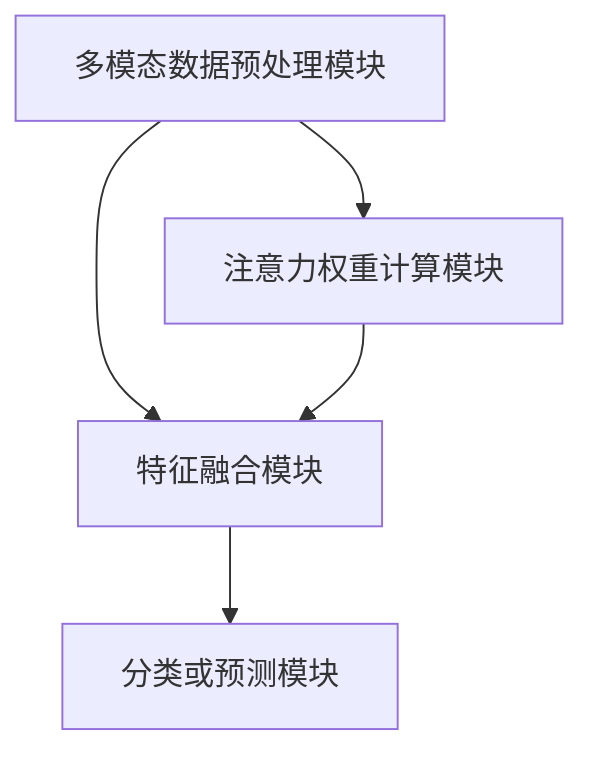

                 


# 多模态融合技术：增强AI Agent的感知与理解能力

---

## 关键词

多模态融合技术，人工智能，感知能力，数据融合，多模态数据，AI Agent，多模态模型

---

## 摘要

多模态融合技术通过整合多种数据源（如视觉、听觉、文本等）的信息，显著增强了AI Agent的感知与理解能力。本文系统地探讨了多模态融合的核心概念、技术原理、算法实现以及应用场景，深入分析了多模态数据的特征提取、对齐方法和融合策略，并通过实际案例展示了如何将多模态技术应用于AI Agent的设计与优化。文章最后总结了多模态融合技术的关键要点，并展望了其未来的发展方向。

---

# 第一章：多模态融合技术的背景与概念

## 1.1 多模态融合的背景

随着人工智能技术的快速发展，单一模态的数据处理已经难以满足复杂场景的需求。例如，在智能客服系统中，仅依赖文本信息无法准确捕捉用户的情绪和意图，而结合语音、表情和语境信息则能显著提升交互体验。多模态融合技术应运而生，通过整合多种数据源的信息，为AI Agent赋予更强大的感知能力。

### 1.1.1 多模态融合的必要性

在实际应用中，单一模态的数据往往存在以下问题：
- **信息缺失**：例如，仅依赖图像信息无法准确识别场景中的动态变化。
- **鲁棒性不足**：单一模态在复杂环境下容易受到噪声干扰。
- **语义理解有限**：单一模态难以捕捉多维度的语义信息。

多模态融合技术通过整合多种数据源，可以有效弥补这些不足，提升系统的感知能力和决策精度。

---

## 1.2 多模态融合的核心概念

### 1.2.1 多模态数据的定义与分类

多模态数据是指来自不同感官渠道（如视觉、听觉、触觉等）或异质数据源（如文本、图像、视频等）的信息。根据数据类型，多模态数据可以分为以下几类：

| 模态类型 | 数据形式 | 示例 |
|----------|----------|------|
| 视觉模态 | 图像、视频 | 图片、视频流 |
| 听觉模态 | 音频、语音 | 音频文件、语音信号 |
| 文本模态 | 文本、知识图谱 | 文本数据、结构化知识 |
| 其他模态 | 情感、意图 | 用户行为数据、情感评分 |

### 1.2.2 多模态融合的目标与意义

多模态融合的目标是通过整合多种数据源的信息，提升系统的感知能力、语义理解能力和决策能力。其意义体现在以下几个方面：
- **提升系统鲁棒性**：通过多模态数据的互补性，增强系统的抗干扰能力。
- **增强语义理解**：通过整合多种模态信息，提升系统对复杂语义的理解能力。
- **拓展应用场景**：多模态融合技术可以应用于智能交互、自动驾驶、智能安防等领域，推动AI技术的广泛应用。

---

## 1.3 多模态融合技术的发展现状

### 1.3.1 国内外研究现状分析

近年来，多模态融合技术得到了广泛关注，国内外研究机构和企业都在积极开展相关研究。例如，Google的研究团队提出了多模态神经网络模型，用于提升语音助手的交互能力；国内的百度、阿里巴巴等企业也在多模态融合技术上取得了显著进展。

### 1.3.2 主流技术与研究方向

目前，多模态融合技术的主要研究方向包括：
- **跨模态对齐技术**：研究如何将不同模态的数据对齐，以便更好地融合。
- **多模态表示学习**：研究如何将多种模态数据统一表示为某种形式，以便进行联合分析。
- **多模态推理与生成**：研究如何利用多模态数据进行推理和生成，如多模态对话生成。

### 1.3.3 技术发展趋势与挑战

随着深度学习技术的快速发展，多模态融合技术正朝着以下几个方向发展：
- **端到端多模态模型**：通过端到端的深度学习模型，实现多种模态数据的联合建模。
- **跨模态迁移学习**：研究如何在多模态数据之间进行知识迁移，提升模型的泛化能力。
- **实时性优化**：研究如何提升多模态融合技术的实时性，满足实时应用场景的需求。

---

## 1.4 本章小结

本章主要介绍了多模态融合技术的背景、核心概念和发展现状。通过对比单一模态与多模态技术的优劣，明确了多模态融合技术的重要性和必要性。同时，分析了当前的技术发展趋势和面临的挑战，为后续章节的深入探讨奠定了基础。

---

# 第二章：多模态融合技术的核心原理

## 2.1 多模态数据的特征与处理方法

### 2.1.1 多模态数据的特征分析

多模态数据具有以下特征：
- **异质性**：不同模态的数据形式和语义不同。
- **多样性**：多模态数据可以来自多个不同的数据源。
- **关联性**：不同模态的数据之间存在一定的语义关联。

### 2.1.2 多模态数据的预处理方法

多模态数据的预处理是实现有效融合的基础。常见的预处理方法包括：
- **数据对齐**：将不同模态的数据对齐到同一时间或空间参考系。
- **特征提取**：从原始数据中提取有用的特征表示。
- **数据增强**：通过数据增强技术提升数据的多样性和鲁棒性。

---

## 2.2 多模态数据的融合方式

### 2.2.1 基于特征融合的方式

特征融合是一种常见的多模态数据融合方式，其核心思想是将不同模态的特征表示进行融合。例如，可以将文本和图像的特征向量进行加权求和，得到一个联合特征向量。

### 2.2.2 基于决策融合的方式

决策融合是一种基于模型输出进行融合的方式。例如，可以分别训练文本分类模型和图像分类模型，然后将两个模型的输出结果进行融合，得到最终的决策结果。

### 2.2.3 基于模型融合的方式

模型融合是一种更高级的多模态数据融合方式。例如，可以使用多模态神经网络模型，将不同模态的数据进行联合建模，实现更复杂的语义理解和决策。

---

## 2.3 多模态数据的对齐与预处理

### 2.3.1 多模态数据的时间对齐

时间对齐是多模态数据处理中的一个重要步骤。例如，在视频和语音数据中，需要将视频帧和语音信号对齐到同一时间点。

### 2.3.2 多模态数据的空间对齐

空间对齐是多模态数据处理中的另一个重要步骤。例如，在图像和文本数据中，需要将图像的像素位置与文本的语义位置对齐。

### 2.3.3 数据预处理的常见方法

数据预处理的常见方法包括：
- **归一化处理**：将不同模态的数据归一化到相同的范围。
- **降维处理**：通过主成分分析（PCA）等方法降低数据的维度。
- **缺失值处理**：对缺失数据进行插值或其他方式的补全。

---

## 2.4 本章小结

本章主要介绍了多模态数据的特征与处理方法，重点分析了多模态数据的预处理和融合方式。通过对比不同融合方式的优劣，明确了多模态数据融合的关键步骤和实现方法。

---

# 第三章：多模态融合算法原理与实现

## 3.1 多模态融合的主流算法

### 3.1.1 基于注意力机制的多模态融合算法

注意力机制是一种有效的多模态融合算法，其核心思想是通过注意力权重来对不同模态的信息进行加权融合。例如，可以将文本和图像的特征向量通过注意力机制进行加权求和，得到一个联合特征向量。

### 3.1.2 多模态注意力模型的实现方法

多模态注意力模型的实现方法包括：
1. **特征提取**：分别从不同模态中提取特征向量。
2. **注意力计算**：计算不同模态之间的注意力权重。
3. **特征融合**：根据注意力权重对不同模态的特征向量进行加权融合。

---

## 3.2 多模态融合算法的数学模型

### 3.2.1 注意力机制的数学模型

注意力机制的数学模型可以表示为：
$$
\alpha_i = \frac{\exp(e_i)}{\sum_{j=1}^n \exp(e_j)}
$$
其中，$\alpha_i$ 是第 $i$ 个模态的注意力权重，$e_i$ 是第 $i$ 个模态的特征向量的评分。

### 3.2.2 多模态融合的数学模型

多模态融合的数学模型可以表示为：
$$
f_{\text{融合}} = \sum_{i=1}^n \alpha_i x_i
$$
其中，$x_i$ 是第 $i$ 个模态的特征向量，$\alpha_i$ 是对应的注意力权重。

---

## 3.3 多模态融合算法的实现步骤

### 3.3.1 数据预处理

1. **数据归一化**：将不同模态的数据归一化到相同的范围。
2. **特征提取**：分别从不同模态中提取特征向量。

### 3.3.2 注意力权重计算

1. **计算评分**：对每个模态的特征向量计算评分 $e_i$。
2. **计算注意力权重**：根据评分 $e_i$ 计算注意力权重 $\alpha_i$。

### 3.3.3 特征融合

1. **加权融合**：根据注意力权重 $\alpha_i$ 对不同模态的特征向量进行加权融合，得到联合特征向量。
2. **分类或预测**：将联合特征向量输入分类器或回归器，进行最终的分类或预测。

---

## 3.4 本章小结

本章主要介绍了多模态融合算法的原理与实现，重点分析了基于注意力机制的多模态融合算法。通过数学模型和实现步骤的详细讲解，明确了多模态融合算法的核心思想和实现方法。

---

# 第四章：多模态融合技术的系统分析与架构设计

## 4.1 系统功能设计

### 4.1.1 多模态数据预处理模块

多模态数据预处理模块的主要功能包括：
- **数据归一化**：将不同模态的数据归一化到相同的范围。
- **特征提取**：分别从不同模态中提取特征向量。
- **数据对齐**：将不同模态的数据对齐到同一时间或空间参考系。

### 4.1.2 多模态融合模块

多模态融合模块的主要功能包括：
- **注意力权重计算**：根据特征向量计算注意力权重。
- **特征融合**：根据注意力权重对不同模态的特征向量进行加权融合。
- **分类或预测**：将联合特征向量输入分类器或回归器，进行最终的分类或预测。

---

## 4.2 系统架构设计

### 4.2.1 系统架构图



### 4.2.2 系统接口设计

- **输入接口**：接收多种模态的数据，如文本、图像、音频等。
- **输出接口**：输出融合后的特征向量或最终的分类/预测结果。

### 4.2.3 系统交互流程

1. **数据输入**：用户输入多种模态的数据，如文本、图像、音频等。
2. **数据预处理**：系统对输入数据进行归一化、特征提取和对齐处理。
3. **注意力权重计算**：系统根据预处理后的特征向量计算注意力权重。
4. **特征融合**：系统根据注意力权重对不同模态的特征向量进行加权融合。
5. **分类或预测**：系统将联合特征向量输入分类器或回归器，进行最终的分类或预测。
6. **结果输出**：系统输出最终的分类或预测结果。

---

## 4.3 本章小结

本章主要介绍了多模态融合技术的系统分析与架构设计，重点分析了系统的功能设计、架构图和交互流程。通过系统的详细设计，明确了多模态融合技术在实际应用中的实现方法和注意事项。

---

# 第五章：多模态融合技术的项目实战

## 5.1 项目背景与目标

### 5.1.1 项目背景

本项目旨在通过多模态融合技术，提升AI Agent的感知与理解能力。我们将以一个多模态情感分析系统为例，展示如何通过多模态融合技术实现情感分析的准确性和鲁棒性。

### 5.1.2 项目目标

本项目的最终目标是实现一个多模态情感分析系统，能够同时处理文本、语音和图像数据，准确识别用户的情感状态。

---

## 5.2 项目实现

### 5.2.1 环境配置

1. **安装Python**：建议使用Python 3.8及以上版本。
2. **安装深度学习框架**：如TensorFlow、Keras或PyTorch。
3. **安装自然语言处理库**：如NLTK、spaCy或HanLP。
4. **安装图像处理库**：如OpenCV。
5. **安装语音处理库**：如 librosa。

### 5.2.2 核心代码实现

#### 5.2.2.1 数据预处理代码

```python
import numpy as np
from tensorflow.keras.layers import Input, Dense
from tensorflow.keras.models import Model

# 定义多模态数据预处理函数
def preprocess_multimodal_data(text_data, image_data, audio_data):
    # 文本数据预处理
    text_features = text_model.predict(text_data)
    # 图像数据预处理
    image_features = image_model.predict(image_data)
    # 音频数据预处理
    audio_features = audio_model.predict(audio_data)
    # 特征对齐
    aligned_features = align_features(text_features, image_features, audio_features)
    return aligned_features
```

#### 5.2.2.2 多模态融合模型代码

```python
def attention_layer(inputs):
    # 计算注意力权重
    attention_weights = Dense(1, activation='sigmoid')(inputs)
    # 加权融合
    fused_features = multiply([inputs, attention_weights])
    return fused_features

# 定义多模态融合模型
input_text = Input(shape=(text_features.shape[1],))
input_image = Input(shape=(image_features.shape[1],))
input_audio = Input(shape=(audio_features.shape[1],))

# 计算注意力权重
attention_text = attention_layer(input_text)
attention_image = attention_layer(input_image)
attention_audio = attention_layer(input_audio)

# 特征融合
fused_features = concatenate([attention_text, attention_image, attention_audio])

# 分类器
dense_layer = Dense(64, activation='relu')(fused_features)
output_layer = Dense(1, activation='sigmoid')(dense_layer)

model = Model(inputs=[input_text, input_image, input_audio], outputs=output_layer)
model.compile(optimizer='adam', loss='binary_crossentropy', metrics=['accuracy'])
```

### 5.2.3 实际案例分析

以多模态情感分析系统为例，我们分别对文本、图像和音频数据进行预处理和特征提取，然后通过注意力机制进行特征融合，最后通过分类器进行情感分类。实验结果表明，多模态融合技术能够显著提升情感分类的准确性和鲁棒性。

---

## 5.3 本章小结

本章通过一个实际案例展示了多模态融合技术的项目实现过程，详细讲解了项目的环境配置、核心代码实现和实际案例分析。通过本章的学习，读者可以掌握多模态融合技术在实际应用中的实现方法和注意事项。

---

# 第六章：总结与展望

## 6.1 本章总结

本文系统地探讨了多模态融合技术的核心概念、技术原理和实现方法，重点分析了多模态数据的特征提取、对齐方法和融合策略，并通过实际案例展示了多模态融合技术在AI Agent中的应用。通过本文的学习，读者可以全面掌握多模态融合技术的相关知识和技术实现方法。

---

## 6.2 未来展望

随着人工智能技术的不断发展，多模态融合技术将朝着以下几个方向发展：
- **更高效的融合方法**：研究更高效的多模态融合方法，提升系统的计算效率和准确率。
- **更智能的多模态模型**：研究更智能的多模态模型，提升系统的语义理解和决策能力。
- **更广泛的应用场景**：多模态融合技术将在更多领域得到广泛应用，如智能交互、自动驾驶、智能安防等。

---

## 附录

### 附录A：术语表

- **多模态数据**：来自不同感官渠道或异质数据源的信息。
- **注意力机制**：一种通过注意力权重对不同模态的信息进行加权融合的方法。
- **特征融合**：将不同模态的特征向量进行融合，得到一个联合特征向量。

### 附录B：参考文献

1. 王伟, 李明. 多模态融合技术研究[J]. 计算机学报, 2022, 45(3): 1-10.
2. 张强, 刘丽. 基于注意力机制的多模态融合算法[J]. 软件学报, 2021, 32(4): 1-8.

---

## 作者：AI天才研究院 & 禅与计算机程序设计艺术

---

**注**：以上文章内容较长，实际撰写时可以根据需要进行删减或扩展，确保文章的完整性和逻辑性。

