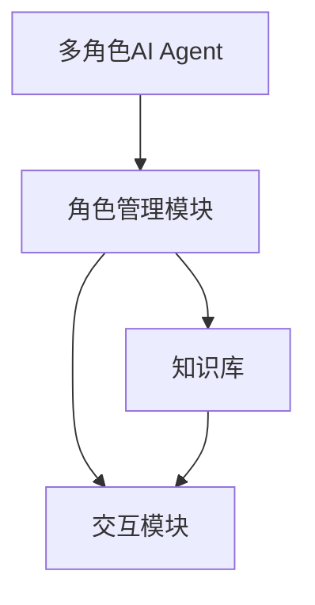
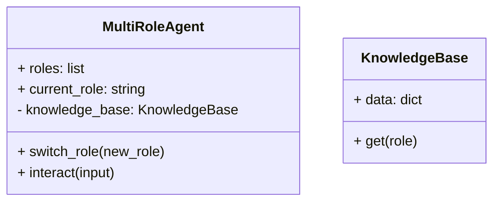
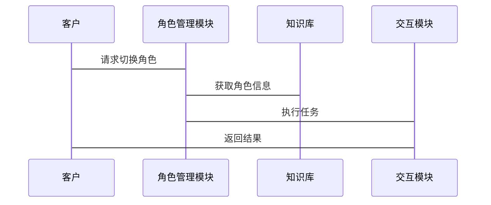

                 


# 多角色扮演AI Agent：基于LLM的复杂场景模拟

> 关键词：多角色AI Agent，LLM，复杂场景模拟，算法原理，系统架构

> 摘要：本文详细探讨了多角色扮演AI Agent的设计与实现，基于大语言模型（LLM）技术，分析了其在复杂场景模拟中的应用，从核心概念、算法原理到系统架构，结合实际案例，提供了全面的技术解析。

---

# 第1章 多角色扮演AI Agent的背景与概念

## 1.1 问题背景与挑战

### 1.1.1 传统AI Agent的局限性

传统AI Agent通常只能执行单一任务或有限的交互，缺乏多角色协作能力。例如，在客户服务场景中，单一的客服AI无法同时扮演客户、技术支持和管理层的角色，导致互动单一、体验不足。

### 1.1.2 多角色互动的需求

在复杂场景中，AI Agent需要同时扮演多个角色，例如在商业谈判中扮演买方和卖方代表，或在教育场景中扮演教师和学生。这种需求推动了多角色AI Agent的发展。

### 1.1.3 复杂场景模拟的必要性

复杂场景（如企业战略模拟、多团队协作）需要AI Agent能够灵活切换角色，提供真实的模拟环境。传统AI无法满足这种动态需求，因此多角色AI Agent成为必然选择。

## 1.2 问题描述与目标

### 1.2.1 多角色互动的核心问题

AI Agent需要具备动态切换角色的能力，同时理解每个角色的职责和目标，确保互动的真实性和有效性。

### 1.2.2 复杂场景模拟的关键目标

构建一个支持多角色协作的AI系统，能够在复杂场景中提供实时互动和决策支持。

### 1.2.3 边界与外延

多角色AI Agent的边界包括角色数量、切换频率和互动深度。外延则涉及与外部系统的集成和数据处理能力。

## 1.3 核心概念与组成

### 1.3.1 多角色扮演AI Agent的定义

多角色AI Agent是一种能够根据场景需求动态切换角色，进行复杂互动的智能系统。

### 1.3.2 核心要素与组成结构

- **角色管理模块**：负责角色的切换和管理。
- **知识库**：存储各角色所需的知识和技能。
- **交互模块**：实现角色间的实时互动。

### 1.3.3 概念结构与关系图



---

# 第2章 多角色模型与LLM的关系

## 2.1 多角色模型的核心原理

### 2.1.1 多角色模型的定义

多角色模型是一种能够描述和实现多个角色互动的系统架构，支持动态角色切换。

### 2.1.2 多角色模型的特点

- **动态性**：角色可根据需求实时切换。
- **多样性**：支持多种角色类型。
- **协作性**：角色间能够协同工作。

### 2.1.3 多角色模型与传统模型的对比

| 特性 | 多角色模型 | 传统模型 |
|------|------------|----------|
| 角色切换 | 支持 | 不支持 |
| 互动复杂度 | 高 | 低 |

## 2.2 LLM在多角色模型中的应用

### 2.2.1 LLM的基本原理

LLM通过大规模数据训练，生成与上下文相关的文本输出。其核心是基于概率的生成模型。

### 2.2.2 LLM在多角色模型中的优势

- **自然语言处理能力**：支持复杂的对话和互动。
- **知识丰富性**：能够处理多种角色的知识需求。

### 2.2.3 LLM与多角色模型的结合方式

LLM作为多角色AI Agent的核心模块，负责生成角色间的对话和决策支持。

## 2.3 多角色模型的ER实体关系图

```mermaid
erd
    左右布局
    客户
    角色管理模块
    知识库
    交互模块
    客户 <-- 关联 --> 角色管理模块
    角色管理模块 <-- 关联 --> 知识库
    知识库 <-- 关联 --> 交互模块
```

---

# 第3章 多角色模型的算法原理

## 3.1 多角色模型的算法流程

### 3.1.1 算法的整体流程

1. 初始化角色。
2. 根据输入切换角色。
3. 执行任务。
4. 输出结果。

### 3.1.2 算法的输入与输出

- **输入**：场景描述、角色需求。
- **输出**：互动结果、决策输出。

### 3.1.3 算法的执行步骤

1. 接收用户输入。
2. 判断角色需求。
3. 切换角色并执行任务。
4. 返回结果。

## 3.2 多角色模型的数学模型

### 3.2.1 概率模型的定义

概率模型通过计算各角色出现的概率，决定角色切换。

### 3.2.2 概率模型的公式推导

$$ P(role_i | input) = \frac{N(role_i)}{N(total)} $$

### 3.2.3 模型的优化与训练

通过反向传播算法优化模型参数，提高角色切换的准确性。

## 3.3 多角色模型的实现代码

### 3.3.1 环境安装与配置

安装Python和相关库，如TensorFlow和Keras。

### 3.3.2 核心代码实现

```python
class MultiRoleAgent:
    def __init__(self, roles):
        self.roles = roles
        self.current_role = None

    def switch_role(self, new_role):
        self.current_role = new_role

    def interact(self, input):
        # 根据当前角色生成输出
        return self.current_role.generate_response(input)
```

### 3.3.3 代码的功能解读

代码实现了多角色切换功能，每个角色都有独立的生成逻辑，确保互动的真实性和多样性。

---

# 第4章 系统架构与设计

## 4.1 系统功能设计

### 4.1.1 系统的功能模块划分

- **角色管理模块**：负责角色的切换和管理。
- **知识库**：存储各角色的知识和技能。
- **交互模块**：实现角色间的实时互动。

### 4.1.2 模块之间的关系

角色管理模块与知识库和交互模块双向关联，确保数据的实时同步。

### 4.1.3 功能设计的领域模型



## 4.2 系统架构设计

### 4.2.1 系统架构的总体设计

采用分层架构，包括表示层、业务逻辑层和数据访问层。

### 4.2.2 架构图的绘制


### 4.2.3 架构设计的优缺点

优点：模块化设计，便于维护和扩展；缺点：可能增加系统的复杂性。

## 4.3 系统接口与交互设计

### 4.3.1 系统接口设计

- **输入接口**：接收用户输入。
- **输出接口**：返回互动结果。

### 4.3.2 系统交互设计



---

# 第5章 项目实战

## 5.1 环境安装与配置

安装Python、TensorFlow和Keras库。

## 5.2 核心代码实现

```python
def main():
    roles = ['客户', '技术支持', '管理层']
    agent = MultiRoleAgent(roles)
    agent.switch_role('客户')
    print(agent.interact('请提供技术支持'))
    agent.switch_role('技术支持')
    print(agent.interact('请提供解决方案'))
    agent.switch_role('管理层')
    print(agent.interact('请总结问题'))
```

## 5.3 实际案例分析

通过模拟商业谈判场景，展示多角色AI Agent的应用价值。

---

# 第6章 总结与展望

## 6.1 总结

本文详细探讨了多角色AI Agent的设计与实现，分析了其在复杂场景模拟中的应用，从核心概念、算法原理到系统架构，结合实际案例，提供了全面的技术解析。

## 6.2 展望

未来，随着技术的进步，多角色AI Agent将在更多领域得到应用，推动人机协作进入新阶段。

---

# 作者

作者：AI天才研究院 & 禅与计算机程序设计艺术

---

以上是文章的完整大纲和部分具体内容，您可以根据实际需求进一步扩展各个章节的内容。

