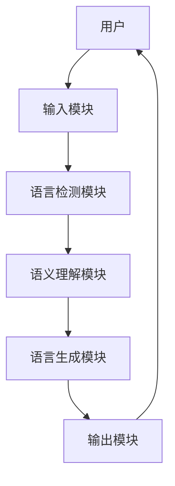

                 


# 多语言AI Agent：LLM在跨语言交流中的应用

> 关键词：多语言AI Agent，LLM，跨语言交流，自然语言处理，大语言模型

> 摘要：本文深入探讨了多语言AI Agent在跨语言交流中的应用，结合大语言模型（LLM）的技术背景、核心概念、算法原理、系统架构和项目实战，分析了多语言AI Agent在不同场景下的实现方法和实际应用案例，为读者提供了从理论到实践的全面指导。

---

## 第一部分: 多语言AI Agent概述

### 第1章: 多语言AI Agent的背景与概念

#### 1.1 多语言AI Agent的背景
人工智能（AI）技术的快速发展，尤其是在自然语言处理（NLP）领域的突破，使得大语言模型（LLM）成为实现跨语言交流的重要工具。随着全球化进程的加速，跨语言交流的需求日益增长，传统的单语言AI系统已经无法满足实际需求。多语言AI Agent的出现，为解决跨语言交流问题提供了新的可能性。

#### 1.2 多语言AI Agent的定义与特点
多语言AI Agent是一种能够理解和生成多种语言的智能体，它能够在不同语言之间无缝切换，实现跨语言对话、信息检索和文本生成。与传统AI Agent相比，多语言AI Agent的核心特点包括：
1. **多语言支持**：能够处理多种语言的输入和输出。
2. **跨语言理解**：能够理解不同语言之间的语义关系。
3. **动态切换**：能够在对话过程中根据需求动态切换语言。

#### 1.3 多语言AI Agent的应用场景
1. **跨语言对话系统**：支持用户使用不同语言进行实时对话。
2. **跨语言信息检索**：帮助用户在多种语言中查找信息。
3. **跨语言文本生成**：生成符合目标语言的文本内容。

---

### 第2章: 大语言模型（LLM）的基础

#### 2.1 大语言模型的定义与特点
大语言模型（LLM）是一种基于深度学习的自然语言处理模型，具有以下特点：
1. **大规模训练数据**：通常使用海量多语言数据进行训练。
2. **通用性**：能够处理多种NLP任务，如文本生成、问答、翻译等。
3. **多语言支持**：许多LLM模型支持多种语言的输入和输出。

#### 2.2 大语言模型的训练与优化
大语言模型的训练过程包括以下几个步骤：
1. **数据预处理**：清洗和格式化多语言数据。
2. **模型构建**：选择适合的模型架构（如Transformer）。
3. **参数优化**：通过反向传播算法优化模型参数。
4. **评估与调优**：使用验证集评估模型性能并进行调优。

#### 2.3 大语言模型的多语言支持
多语言支持的核心在于模型的训练数据和架构设计。通过多语言数据的混合训练，模型能够学会不同语言之间的语义联系，从而实现跨语言理解和生成。

---

## 第二部分: 多语言AI Agent的核心技术

### 第3章: 多语言自然语言理解

#### 3.1 多语言文本表示
多语言文本表示的核心在于将不同语言的文本映射到相同的语义空间中。常用的方法包括：
1. **语言嵌入（Language Embedding）**：为每种语言分配一个独特的向量表示。
2. **跨语言词嵌入（Cross-Language Word Embedding）**：通过对比学习或对齐技术，将不同语言的词汇映射到相同的嵌入空间。

#### 3.2 多语言语义理解
多语言语义理解的目标是理解不同语言文本的深层含义。常用技术包括：
1. **跨语言注意力机制**：在多语言文本处理中，注意力机制可以帮助模型关注不同语言之间的语义关联。
2. **多语言BERT模型**：基于BERT的多语言模型（如M-BERT）可以在多种语言上进行微调，提升跨语言理解能力。

#### 3.3 多语言句法分析
多语言句法分析的目标是解析不同语言文本的语法结构。常用方法包括：
1. **跨语言句法树构建**：通过对比学习，构建跨语言的句法树。
2. **共享参数模型**：在模型中共享不同语言的句法分析参数，减少训练数据需求。

---

### 第4章: 多语言对话生成

#### 4.1 多语言对话策略
多语言对话生成的核心在于制定合适的对话策略。常用策略包括：
1. **语言选择策略**：根据对话上下文选择合适的语言。
2. **语义保持策略**：确保生成的对话内容在不同语言中语义一致。

#### 4.2 多语言生成模型
多语言生成模型是实现跨语言对话的核心技术。常用模型包括：
1. **多语言GPT模型**：基于GPT的多语言模型可以在多种语言上生成文本。
2. **多语言T5模型**：T5模型支持多种语言的文本到文本生成任务。

#### 4.3 多语言对话系统的优化
多语言对话系统的优化需要考虑以下几个方面：
1. **语言切换的平滑性**：确保对话过程中语言切换自然。
2. **语义一致性的保证**：生成的对话内容在不同语言中保持一致。
3. **文化适应性**：考虑不同语言背后的文化差异，避免生成不合适的对话内容。

---

## 第三部分: 多语言AI Agent的系统架构与实现

### 第5章: 系统分析与架构设计

#### 5.1 跨语言对话系统的场景介绍
跨语言对话系统的场景通常包括：
1. **用户输入**：用户以一种语言输入问题或指令。
2. **语言检测**：系统检测输入语言。
3. **语义理解**：系统理解输入的语义含义。
4. **语言生成**：系统根据需求生成目标语言的回复。
5. **反馈优化**：根据用户反馈优化对话过程。

#### 5.2 系统功能设计
系统功能设计包括以下几个模块：
1. **语言检测模块**：检测输入语言并确定目标语言。
2. **语义理解模块**：理解输入文本的语义含义。
3. **语言生成模块**：生成目标语言的回复内容。
4. **反馈优化模块**：根据用户反馈优化系统性能。

#### 5.3 系统架构设计
以下是跨语言对话系统的架构设计图：



---

### 第6章: 项目实战

#### 6.1 环境安装
以下是实现多语言AI Agent所需的环境安装步骤：

```bash
pip install torch transformers
```

#### 6.2 核心代码实现
以下是实现多语言AI Agent的核心代码：

```python
from transformers import AutoTokenizer, AutoModelForSeq2SeqLM
import torch

# 加载多语言模型
model_name = "facebook/m2m-large-4m"
tokenizer = AutoTokenizer.from_pretrained(model_name)
model = AutoModelForSeq2SeqLM.from_pretrained(model_name).to("cuda")

# 定义对话生成函数
def generate_response(input_text, target_lang):
    inputs = tokenizer(input_text, return_tensors="pt").to("cuda")
    outputs = model.generate(inputs.input_ids, max_length=50)
    response = tokenizer.decode(outputs[0], skip_special_tokens=True)
    return response

# 示例对话
input_text = "How are you?"
target_lang = "zh"
response = generate_response(input_text, target_lang)
print(response)
```

---

## 第四部分: 总结与展望

### 第7章: 总结

#### 7.1 最佳实践
1. **选择合适的模型**：根据具体需求选择适合的多语言模型。
2. **处理语言切换**：确保语言切换过程自然流畅。
3. **优化语义一致性**：保证不同语言的生成内容语义一致。

#### 7.2 小结
多语言AI Agent的实现依赖于大语言模型的强大能力，通过合理设计系统架构和优化对话策略，可以实现高效的跨语言交流。

### 第8章: 注意事项

#### 8.1 注意事项
1. **模型训练成本**：多语言模型的训练需要大量计算资源。
2. **语言适配问题**：不同语言的语法和文化差异可能影响生成结果。
3. **性能优化**：需要优化模型在多语言场景下的推理速度。

---

## 第五部分: 未来展望

### 第9章: 未来趋势

#### 9.1 未来趋势
1. **更强大的多语言模型**：随着技术的进步，未来会出现更强大的多语言模型。
2. **更自然的语言切换**：语言切换的平滑性将进一步提升。
3. **更广泛的应用场景**：多语言AI Agent将应用于更多领域。

---

## 作者：AI天才研究院 & 禅与计算机程序设计艺术

