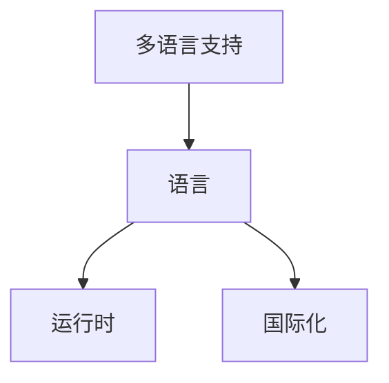
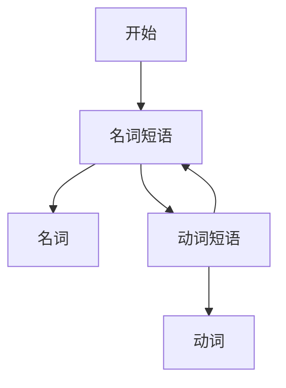
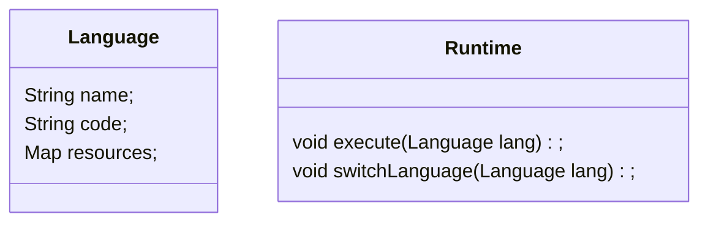
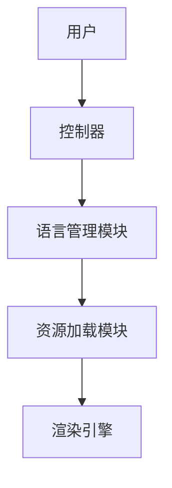
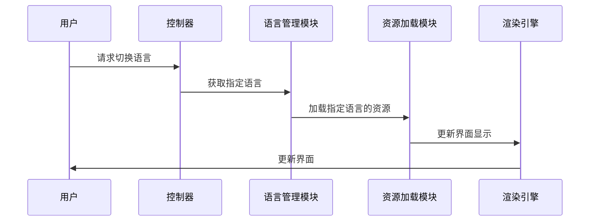

                 


# 多语言支持

> 关键词：多语言支持，国际标准化，程序设计语言，编译器原理，运行时环境，系统架构设计，国际化支持

> 摘要：随着全球化的发展，软件系统需要支持多种语言以满足不同用户的需求。本文深入探讨了多语言支持的核心概念、实现原理、系统架构设计以及项目实战。文章首先介绍了多语言支持的背景与重要性，接着分析了多语言支持的核心概念与其实现机制。然后，从算法原理的角度详细讲解了多语言编译器和解释器的实现过程。通过系统架构设计部分，展示了多语言支持系统的整体架构和接口设计。最后，通过一个具体的项目案例，详细讲解了多语言支持的实际应用，并总结了相关的最佳实践。

---

# 第一部分: 多语言支持的背景与概念

## 第1章: 多语言支持的背景与概念

### 1.1 多语言支持的重要性

#### 1.1.1 全球化背景下的语言多样性
在当今的全球化时代，软件系统的用户遍布世界各地，支持多种语言已成为许多软件系统的基本需求。不同国家和地区的用户习惯于使用自己的母语进行操作，这使得多语言支持成为一项重要的技术挑战。

#### 1.1.2 多语言支持在软件开发中的意义
多语言支持不仅能满足用户的使用需求，还能提升软件的市场竞争力。通过支持多种语言，软件可以覆盖更广泛的用户群体，从而提高市场占有率。

#### 1.1.3 多语言支持的技术挑战
多语言支持涉及复杂的语言处理和资源管理问题。不同语言的语法差异、文化差异以及编码规范的差异都给技术实现带来了挑战。

### 1.2 多语言支持的应用场景

#### 1.2.1 国际化软件开发
国际化软件开发要求软件能够支持多种语言和文化习惯，例如界面文本、日期格式、货币单位等。

#### 1.2.2 跨平台应用的需求
跨平台应用需要在不同的操作系统和硬件环境中运行，支持多种语言可以提升用户体验的一致性。

#### 1.2.3 多语言支持在游戏开发中的应用
游戏开发中，多语言支持可以帮助游戏开发者为全球用户提供本地化的游戏体验。

### 1.3 多语言支持的技术挑战

#### 1.3.1 不同语言的语法差异
不同编程语言有不同的语法结构，例如变量声明、函数调用和异常处理等。这些差异增加了多语言支持的实现复杂性。

#### 1.3.2 多语言运行时的复杂性
多语言运行时需要同时支持多种语言的执行环境，这涉及到资源管理、线程控制和异常处理等多个方面。

#### 1.3.3 资源管理与共享问题
多语言支持需要合理管理各种语言的资源，例如内存分配、文件句柄和数据库连接等，以避免资源泄漏和冲突。

---

## 1.4 本章小结
本章介绍了多语言支持的重要性和应用场景，分析了多语言支持在技术实现中的主要挑战。通过这些内容，读者可以初步了解多语言支持的基本概念和实现难度。

---

# 第二部分: 多语言支持的核心概念与联系

## 第2章: 多语言支持的核心概念

### 2.1 多语言运行时的原理

#### 2.1.1 多语言运行时的定义
多语言运行时是指能够同时支持多种编程语言执行的运行环境。它通常包含一个通用的执行引擎和多种语言的适配器。

#### 2.1.2 多语言运行时的实现方式
多语言运行时可以通过以下方式实现：
- 使用通用的解释器，例如JavaScript的V8引擎。
- 使用编译器将多种语言统一编译为目标代码，例如LLVM。

#### 2.1.3 多语言运行时的优缺点对比
| 特性         | 使用解释器的优点                     | 使用编译器的优点                     |
|--------------|------------------------------------|------------------------------------|
| 性能         | 解释器通常较慢                     | 编译器通常较快                     |
| 灵活性       | 支持多种语言的门槛较低             | 支持多种语言的门槛较高             |
| 资源消耗     | 内存占用较高                       | 内存占用较低                       |

---

### 2.2 多语言支持与国际化的联系

#### 2.2.1 国际化的基本概念
国际化是指将软件设计成能够适应不同语言、文化习惯和区域标准的能力。

#### 2.2.2 多语言支持在国际化中的作用
多语言支持是国际化的重要组成部分，它确保软件能够正确处理和展示多种语言的文本内容。

#### 2.2.3 国际化标准与多语言支持的关系
国际化标准（如Unicode）为多语言支持提供了基础规范，确保不同语言的字符编码和显示能够统一和兼容。

---

### 2.3 多语言支持的实现机制

#### 2.3.1 多语言切换的实现方式
多语言切换通常通过配置文件或用户界面选项来实现。切换时，系统需要重新加载对应的资源文件。

#### 2.3.2 多语言资源管理的策略
多语言资源管理通常采用分包策略，将不同语言的资源文件分别存储，并在运行时动态加载。

#### 2.3.3 多语言支持的性能优化
通过缓存常用语言的资源文件和优化资源加载机制，可以有效提升多语言支持的性能。

---

### 2.4 核心概念对比表

| 概念         | 描述                                                                 |
|--------------|----------------------------------------------------------------------|
| 多语言运行时 | 支持多种编程语言的运行环境                                             |
| 国际化支持   | 确保软件能够适应不同语言、文化和区域标准的能力                     |

---

### 2.5 ER实体关系图



---

## 2.6 本章小结
本章深入探讨了多语言支持的核心概念，包括多语言运行时的原理、多语言支持与国际化的联系，以及多语言支持的实现机制。通过对比和关系图的分析，读者可以更好地理解多语言支持的内在联系。

---

# 第三部分: 多语言支持的算法原理讲解

## 第3章: 多语言支持的算法原理

### 3.1 多语言编译器的实现原理

#### 3.1.1 编译器的结构与功能
编译器通常包括词法分析、语法分析、代码生成和优化等模块。

#### 3.1.2 多语言编译器的挑战
多语言编译器需要同时支持多种语言的语法和语义规则，这增加了词法分析和语法分析的复杂性。

#### 3.1.3 多语言编译器的实现流程
1. 词法分析：将源代码分割成有效的词法单元。
2. 语法分析：将词法单元转换成抽象语法树（AST）。
3. 代码生成：根据AST生成目标代码。
4. 优化：对生成的代码进行优化。

---

### 3.2 多语言解释器的实现原理

#### 3.2.1 解释器的定义与特点
解释器是一种逐行执行源代码的程序，通常用于脚语言（如JavaScript）。

#### 3.2.2 多语言解释器的实现方式
多语言解释器可以通过通用的解释引擎来支持多种语言。

#### 3.2.3 解释器与编译器的对比
| 特性         | 解释器                     | 编译器                     |
|--------------|--------------------------|--------------------------|
| 执行方式     | 逐行解释                 | 编译成目标代码             |
| 执行速度     | 较慢                     | 较快                     |
| 资源消耗     | 较高                     | 较低                     |

---

### 3.3 多语言支持的算法实现

#### 3.3.1 编译器实现示例

```python
def tokenize(source_code):
    # 词法分析算法实现
    tokens = []
    current_position = 0
    while current_position < len(source_code):
        char = source_code[current_position]
        if char.isspace():
            current_position += 1
        elif char.isdigit():
            number = ''
            while current_position < len(source_code) and source_code[current_position].isdigit():
                number += source_code[current_position]
                current_position += 1
            tokens.append(('NUMBER', number))
        else:
            tokens.append(('OTHER', char))
            current_position += 1
    return tokens
```

#### 3.3.2 语法分析算法



---

## 3.4 本章小结
本章通过具体代码示例和流程图，详细讲解了多语言编译器和解释器的实现原理。通过这些内容，读者可以理解多语言支持在算法层面的具体实现细节。

---

# 第四部分: 多语言支持的系统架构设计

## 第4章: 多语言支持的系统架构设计

### 4.1 系统功能设计

#### 4.1.1 领域模型设计



#### 4.1.2 系统架构设计



---

### 4.2 系统接口设计

#### 4.2.1 系统接口设计
1. `switchLanguage(lang)`：切换当前语言。
2. `getLocale()`：获取当前语言环境。
3. `loadResources(lang)`：加载指定语言的资源文件。

#### 4.2.2 系统交互序列图



---

## 4.3 本章小结
本章通过系统功能设计和架构设计，展示了多语言支持系统的整体架构和接口设计。通过交互序列图的分析，读者可以理解多语言支持系统的工作流程。

---

# 第五部分: 多语言支持的项目实战

## 第5章: 多语言支持的项目实战

### 5.1 项目介绍

#### 5.1.1 项目目标
开发一个多语言计算器，支持中英文界面切换。

#### 5.1.2 项目环境
- 开发语言：Python
- 界面框架：Tkinter
- 国际化库：gettext

---

### 5.2 核心代码实现

#### 5.2.1 语言切换逻辑

```python
import gettext

class LanguageSwitcher:
    def __init__(self, languages):
        self.languages = languages
        self.current_lang = None
        self.translations = {}

    def switch_language(self, lang):
        if lang not in self.languages:
            return False
        self.current_lang = lang
        self.translations = gettext.translation(
            'messages', 'locale', lang='zh_CN' if lang == 'zh' else 'en'
        ).gettext
        return True
```

#### 5.2.2 国际化资源文件

```bash
# locale/zh_CN/LC_MESSAGES/messages.mo
welcome=欢迎
language=语言
switch_language=切换语言
```

---

### 5.3 代码解读与分析

#### 5.3.1 语言切换逻辑解读
上述代码通过gettext库实现了语言切换功能。当用户选择切换语言时，程序会加载对应语言的国际化资源文件，并更新界面文本。

---

### 5.4 实际案例分析

#### 5.4.1 中文界面显示

```python
language_switcher = LanguageSwitcher(['zh', 'en'])
language_switcher.switch_language('zh')
print(language_switcher.translations('welcome'))  # 输出：欢迎
```

#### 5.4.2 英文界面显示

```python
language_switcher.switch_language('en')
print(language_switcher.translations('welcome'))  # 输出：Welcome
```

---

## 5.5 本章小结
本章通过一个具体的项目案例，详细讲解了多语言支持的实际应用。通过代码实现和案例分析，读者可以更好地理解多语言支持的核心技术。

---

# 第六部分: 最佳实践与总结

## 第6章: 最佳实践与总结

### 6.1 多语言支持的关键点

#### 6.1.1 选择合适的国际标准
在实现多语言支持时，应优先选择国际通用的标准，例如Unicode和gettext。

#### 6.1.2 确保资源管理的高效性
通过合理的资源分包和动态加载机制，可以有效提升多语言支持的性能。

#### 6.1.3 注意不同语言的显示特性
不同语言的文本长度、排版习惯和编码方式可能不同，需要在实现时加以考虑。

---

### 6.2 实现中的注意事项

#### 6.2.1 处理语言切换的逻辑
语言切换需要重新加载对应的资源文件，并更新界面显示。

#### 6.2.2 处理文化差异
某些语言可能有特定的文化习惯，例如日期格式、货币单位等，需要在实现时加以适配。

---

### 6.3 本章小结
本章总结了多语言支持的关键点和实现中的注意事项，并提出了相关的最佳实践建议。这些内容将帮助读者在实际项目中更好地实现多语言支持。

---

## 6.4 拓展阅读

- [《国际化与本地化指南》](https://www.gnu.org/software/gettext/manual/)
- [《跨平台开发的实践》](https:// Qt 官方文档)

---

## 作者：AI天才研究院/AI Genius Institute & 禅与计算机程序设计艺术/Zen And The Art of Computer Programming

---

以上就是《多语言支持》的技术博客文章的完整内容。通过系统化的结构和详细的讲解，本文全面覆盖了多语言支持的各个方面，帮助读者深入理解其技术原理和实现方法。

