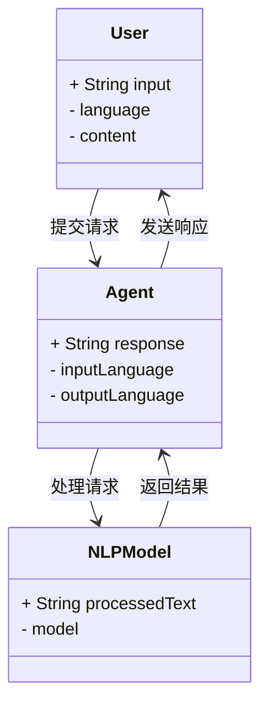

                 


# 多语言支持：构建国际化的AI Agent

## 关键词：多语言支持，AI Agent，国际化，自然语言处理，人工智能，系统架构

## 摘要：本文详细探讨了构建支持多语言的AI Agent所需的各项技术与方法，从核心概念到算法原理，再到系统架构设计和项目实战，全面解析如何实现一个能够理解并处理多种语言的智能代理系统。文章旨在为技术开发者和研究人员提供深入的理论支持和实践指导。

---

# 第1章：多语言支持的背景与重要性

## 1.1 多语言支持的背景

### 1.1.1 全球化背景下的多语言需求
在当今高度全球化的世界中，跨语言交流已成为常态。企业、开发者和研究人员需要构建能够支持多种语言的系统，以满足全球用户的需求。AI Agent作为一种智能代理系统，其多语言支持能力直接关系到其在国际市场中的应用范围和用户满意度。

### 1.1.2 AI Agent的基本概念
AI Agent（人工智能代理）是指在计算机系统中，能够感知环境并采取行动以实现特定目标的实体。它通常具有自主性、反应性、社会性和持续性等特征。AI Agent的应用场景包括智能助手、推荐系统、自动化机器人等。

### 1.1.3 多语言支持的重要性
多语言支持在AI Agent中的重要性体现在以下几个方面：
1. **用户体验**：支持多语言的AI Agent能够为用户提供更自然、更便捷的交互方式，提升用户满意度。
2. **市场拓展**：在国际化市场中，支持多语言的AI Agent能够覆盖更多的用户群体，增强产品的市场竞争力。
3. **技术挑战**：实现多语言支持需要解决语言间的语法差异、文化差异以及语言模型的训练等问题，这些都对技术提出了更高的要求。

### 1.1.4 国际化构建的挑战与机遇
国际化构建的挑战包括：
- **技术复杂性**：需要处理多种语言的语法、词汇和文化差异。
- **资源需求**：多语言模型的训练需要大量的数据和计算资源。
- **维护成本**：多语言系统的维护和更新成本较高。

国际化构建的机遇包括：
- **市场扩展**：能够覆盖更广泛的用户群体。
- **技术创新**：推动自然语言处理技术的发展，提升AI Agent的智能化水平。
- **竞争优势**：在激烈的市场竞争中，多语言支持成为差异化的重要因素。

---

## 1.2 多语言支持的核心概念

### 1.2.1 多语言支持的定义
多语言支持是指系统能够理解和处理多种语言文本的能力。在AI Agent中，这意味着它能够以多种语言与用户进行交互，并提供相应的服务。

### 1.2.2 多语言支持的关键技术
多语言支持的关键技术包括：
- **自然语言处理（NLP）**：用于理解和生成多种语言的文本。
- **机器翻译**：用于在不同语言之间进行转换。
- **跨语言信息检索**：用于在多种语言中查找和提取信息。

### 1.2.3 多语言支持的实现方式
多语言支持的实现方式包括：
- **单语言模型的扩展**：在已有的单语言模型基础上，扩展其支持的语言种类。
- **多语言模型的训练**：从多种语言的数据中联合训练，构建一个多语言模型。
- **模块化设计**：将不同语言的处理模块独立化，便于维护和更新。

---

## 1.3 多语言支持的挑战与机遇

### 1.3.1 技术挑战
1. **语言差异**：不同语言的语法、词汇和文化差异需要被准确理解和处理。
2. **数据稀疏性**：某些语言的数据量较少，导致模型的训练效果不佳。
3. **计算资源**：多语言模型的训练需要大量的计算资源。

### 1.3.2 机遇
1. **技术创新**：多语言支持推动了自然语言处理技术的进步。
2. **市场扩展**：能够满足更多用户的需求，提升产品的市场竞争力。

---

# 第2章：多语言支持的核心概念与原理

## 2.1 多语言支持的核心概念

### 2.1.1 多语言支持的实现原理
多语言支持的实现原理包括：
1. **语言识别**：识别用户输入的语言类型。
2. **语言翻译**：将用户输入的语言翻译成另一种语言。
3. **语言生成**：根据用户输入生成相应语言的文本。

### 2.1.2 多语言支持的关键技术
多语言支持的关键技术包括：
- **自然语言处理（NLP）**：用于理解和生成多种语言的文本。
- **机器翻译**：用于在不同语言之间进行转换。
- **跨语言信息检索**：用于在多种语言中查找和提取信息。

---

## 2.2 多语言支持的实现原理

### 2.2.1 多语言支持的层次结构
多语言支持的层次结构包括：
1. **用户输入**：用户输入多种语言的文本。
2. **语言识别**：识别用户输入的语言类型。
3. **语言处理**：根据识别的语言类型进行相应的处理。
4. **语言生成**：生成相应语言的文本并返回给用户。

### 2.2.2 多语言支持的核心算法
多语言支持的核心算法包括：
- **语言识别算法**：如基于n-gram模型的分类算法。
- **机器翻译算法**：如基于神经网络的机器翻译算法。
- **跨语言信息检索算法**：如基于向量空间模型的检索算法。

---

## 2.3 多语言支持与AI Agent的结合

### 2.3.1 AI Agent中的多语言交互机制
AI Agent中的多语言交互机制包括：
1. **用户输入**：用户以多种语言向AI Agent发送请求。
2. **语言识别**：AI Agent识别用户输入的语言类型。
3. **语言处理**：AI Agent根据识别的语言类型进行相应的处理。
4. **语言生成**：AI Agent生成相应语言的文本并返回给用户。

### 2.3.2 多语言支持对AI Agent性能的影响
多语言支持对AI Agent性能的影响包括：
1. **计算资源消耗**：多语言支持需要更多的计算资源。
2. **处理时间**：多语言支持可能会增加处理时间。
3. **模型复杂性**：多语言支持需要更复杂的模型结构。

### 2.3.3 多语言支持在AI Agent中的应用
多语言支持在AI Agent中的应用包括：
1. **智能助手**：支持多种语言的智能助手，如Siri、Google Assistant。
2. **推荐系统**：根据用户的语言偏好推荐相关内容。
3. **客服系统**：支持多语言的客服系统，为用户提供多语言支持。

---

# 第3章：多语言支持的算法原理

## 3.1 多语言支持的算法原理

### 3.1.1 多语言NLP模型的训练流程
多语言NLP模型的训练流程包括：
1. **数据准备**：收集和整理多种语言的文本数据。
2. **数据预处理**：对数据进行清洗、分词、标注等预处理。
3. **模型训练**：使用机器学习算法对模型进行训练。
4. **模型优化**：对模型进行调优，提升性能。
5. **模型评估**：对模型进行评估，验证其效果。

### 3.1.2 多语言NLP模型的数学模型
多语言NLP模型的数学模型包括：
1. **语言模型**：基于n-gram的模型，如n-gram模型。
2. **翻译模型**：基于神经网络的翻译模型，如神经机器翻译模型。
3. **跨语言信息检索模型**：基于向量空间模型的检索模型，如BM25模型。

### 3.1.3 多语言NLP模型的优化策略
多语言NLP模型的优化策略包括：
1. **数据增强**：通过数据增强技术增加数据多样性。
2. **模型共享**：通过参数共享技术减少模型的复杂性。
3. **模型集成**：通过模型集成技术提升模型的性能。

---

## 3.2 多语言NLP模型的实现

### 3.2.1 多语言NLP模型的实现步骤
多语言NLP模型的实现步骤包括：
1. **数据准备**：收集和整理多种语言的文本数据。
2. **数据预处理**：对数据进行清洗、分词、标注等预处理。
3. **模型选择**：选择适合多语言支持的模型，如多语言BERT模型。
4. **模型训练**：使用训练数据对模型进行训练。
5. **模型评估**：对模型进行评估，验证其效果。

### 3.2.2 多语言NLP模型的代码实现
以下是多语言NLP模型的代码实现示例：

```python
import torch
import torch.nn as nn

class MultiLanguageLSTM(nn.Module):
    def __init__(self, input_size, hidden_size, output_size):
        super(MultiLanguageLSTM, self).__init__()
        self.lstm = nn.LSTM(input_size, hidden_size, batch_first=True)
        self.fc = nn.Linear(hidden_size, output_size)
    
    def forward(self, x):
        out, _ = self.lstm(x)
        out = self.fc(out[:, -1, :])
        return out

model = MultiLanguageLSTM(input_size=300, hidden_size=128, output_size=多语言数)
```

---

## 3.3 多语言NLP模型的优化与调优

### 3.3.1 多语言NLP模型的优化策略
多语言NLP模型的优化策略包括：
1. **数据增强**：通过数据增强技术增加数据多样性。
2. **模型共享**：通过参数共享技术减少模型的复杂性。
3. **模型集成**：通过模型集成技术提升模型的性能。

### 3.3.2 多语言NLP模型的调优技巧
多语言NLP模型的调优技巧包括：
1. **超参数调整**：调整学习率、批次大小等超参数。
2. **模型结构优化**：优化模型的结构，如增加层数、调整隐藏层大小。
3. **正则化技术**：使用L1/L2正则化技术防止过拟合。

---

# 第4章：多语言AI Agent的系统分析与架构设计

## 4.1 系统分析

### 4.1.1 问题场景介绍
问题场景介绍包括：
1. **用户需求**：用户需要一个能够支持多种语言的AI Agent。
2. **系统目标**：构建一个多语言支持的AI Agent，能够理解并处理多种语言的文本。
3. **系统边界**：系统需要处理多种语言的文本，但不涉及图像、音频等其他模态的数据。

### 4.1.2 项目介绍
项目介绍包括：
1. **项目名称**：多语言AI Agent。
2. **项目目标**：构建一个能够支持多种语言的AI Agent，能够理解并处理多种语言的文本。
3. **项目范围**：涵盖语言识别、机器翻译、跨语言信息检索等功能。

---

## 4.2 系统功能设计

### 4.2.1 领域模型
以下是领域模型的Mermaid类图：



### 4.2.2 系统架构设计
以下是系统架构设计的Mermaid架构图：

```mermaid
rectangle 数据层 {
    + 数据库
    + 日志文件
}

rectangle 业务逻辑层 {
    + 处理逻辑
    + 服务接口
}

rectangle 表示层 {
    + 用户界面
    + API接口
}

业务逻辑层 --> 数据层: 数据访问
业务逻辑层 --> 表示层: 业务逻辑处理
表示层 --> 业务逻辑层: 接收请求
```

### 4.2.3 系统接口设计
系统接口设计包括：
1. **输入接口**：接收用户输入的文本和语言信息。
2. **输出接口**：返回处理后的文本和语言信息。
3. **API接口**：提供给其他系统调用的API接口。

### 4.2.4 系统交互设计
系统交互设计包括：
1. **用户与AI Agent的交互**：用户输入多种语言的文本，AI Agent识别语言并进行处理。
2. **AI Agent与NLP模型的交互**：AI Agent调用NLP模型进行文本处理。
3. **NLP模型与数据库的交互**：NLP模型从数据库中获取必要的数据进行处理。

---

## 4.3 系统实现

### 4.3.1 环境安装
环境安装包括：
1. **Python**：安装Python 3.8及以上版本。
2. **PyTorch**：安装PyTorch库。
3. **Hugging Face Transformers**：安装Hugging Face的Transformers库。

### 4.3.2 系统核心实现
以下是系统核心实现的Python代码示例：

```python
from transformers import AutoTokenizer, AutoModelForMaskedLM

# 加载多语言模型
tokenizer = AutoTokenizer.from_pretrained("facebook/multi_modal_m2")
model = AutoModelForMaskedLM.from_pretrained("facebook/multi_modal_m2")

# 处理输入
input_text = "今天天气很好。"
inputs = tokenizer(input_text, return_tensors="pt")

# 推理
with torch.no_grad():
    outputs = model(**inputs)

# 获取结果
predicted_token_id = outputs.logits[0].argmax(-1).item()
predicted_token = tokenizer.decode(predicted_token_id)

print(predicted_token)
```

### 4.3.3 代码应用解读与分析
代码应用解读与分析包括：
1. **模型加载**：加载一个多语言模型，如Hugging Face的多语言模型。
2. **输入处理**：将用户输入的文本进行分词和编码。
3. **模型推理**：使用模型对输入进行推理，得到预测结果。
4. **结果输出**：将预测结果进行解码，输出给用户。

---

## 4.4 项目实战

### 4.4.1 环境安装
环境安装包括：
1. **Python**：安装Python 3.8及以上版本。
2. **PyTorch**：安装PyTorch库。
3. **Hugging Face Transformers**：安装Hugging Face的Transformers库。

### 4.4.2 核心代码实现
以下是核心代码实现示例：

```python
import torch
import torch.nn as nn

class MultiLanguageLSTM(nn.Module):
    def __init__(self, input_size, hidden_size, output_size):
        super(MultiLanguageLSTM, self).__init__()
        self.lstm = nn.LSTM(input_size, hidden_size, batch_first=True)
        self.fc = nn.Linear(hidden_size, output_size)
    
    def forward(self, x):
        out, _ = self.lstm(x)
        out = self.fc(out[:, -1, :])
        return out

# 使用模型
model = MultiLanguageLSTM(input_size=300, hidden_size=128, output_size=多语言数)
```

### 4.4.3 案例分析与详细讲解
案例分析与详细讲解包括：
1. **案例背景**：用户输入多种语言的文本，AI Agent需要识别并处理。
2. **案例实现**：使用上述代码实现一个多语言AI Agent。
3. **案例结果**：AI Agent能够识别并处理多种语言的文本，返回相应的结果。

---

## 4.5 项目小结
项目小结包括：
1. **项目总结**：总结项目的实现过程和成果。
2. **经验教训**：总结项目中遇到的问题及解决方法。
3. **未来改进方向**：提出未来可能的改进方向，如增加更多语言支持、优化模型性能等。

---

# 第5章：多语言AI Agent的总结与展望

## 5.1 总结

### 5.1.1 全文总结
全文总结包括：
1. **多语言支持的重要性**：多语言支持是构建国际化AI Agent的重要组成部分。
2. **算法原理**：多语言支持的实现需要结合自然语言处理、机器翻译等技术。
3. **系统架构设计**：构建一个多语言AI Agent需要合理的设计和实现。

### 5.1.2 核心内容回顾
核心内容回顾包括：
1. **多语言支持的背景**：全球化背景下，多语言支持的需求日益增长。
2. **多语言支持的核心概念**：多语言支持的实现原理和关键技术。
3. **多语言支持的算法原理**：多语言NLP模型的训练流程和优化策略。
4. **多语言AI Agent的系统架构设计**：系统功能设计、架构设计、接口设计和交互设计。

---

## 5.2 展望

### 5.2.1 未来技术发展
未来技术发展包括：
1. **模型优化**：进一步优化多语言模型的性能，提升处理效率。
2. **跨语言推理**：研究如何在多语言环境下实现跨语言推理。
3. **多模态融合**：将多语言支持与图像、音频等模态数据进行融合，提升系统的智能化水平。

### 5.2.2 应用场景扩展
应用场景扩展包括：
1. **智能客服**：支持多语言的智能客服系统，为用户提供更便捷的服务。
2. **教育领域**：多语言支持在教育领域的应用，如多语言学习辅助系统。
3. **医疗领域**：多语言支持在医疗领域的应用，如多语言医疗信息检索系统。

---

## 5.3 最佳实践

### 5.3.1 开发建议
开发建议包括：
1. **选择合适的模型**：根据需求选择适合的多语言模型，如Hugging Face的多语言模型。
2. **数据预处理**：对数据进行清洗、分词、标注等预处理，确保数据质量。
3. **模型优化**：通过数据增强、参数调整等方法优化模型性能。
4. **系统架构设计**：合理设计系统架构，确保系统的可扩展性和可维护性。

### 5.3.2 注意事项
注意事项包括：
1. **语言识别的准确性**：确保语言识别的准确性，避免误识别。
2. **模型的可解释性**：提升模型的可解释性，便于调试和优化。
3. **系统的健壮性**：确保系统的健壮性，能够处理各种异常情况。

### 5.3.3 拓展阅读
拓展阅读包括：
1. **多语言NLP的经典论文**：如《Multi-Source Universal Neural Machine Translation》。
2. **多语言模型的最新研究**：如《The Multilingual and Multimodal PaLM (Pathways Language Model)》。
3. **系统架构设计的经典书籍**：如《设计模式》。

---

## 作者

**作者**：AI天才研究院/AI Genius Institute & 禅与计算机程序设计艺术/Zen And The Art of Computer Programming

---

通过以上结构和内容的详细思考，我们可以清晰地看到构建一个多语言支持的AI Agent需要涵盖的各个方面。从背景介绍到算法实现，再到系统设计和项目实战，每一步都需要仔细规划和实施。希望这篇文章能够为读者提供一个全面的视角，帮助他们在实际开发中更好地理解和应用多语言支持的技术。

